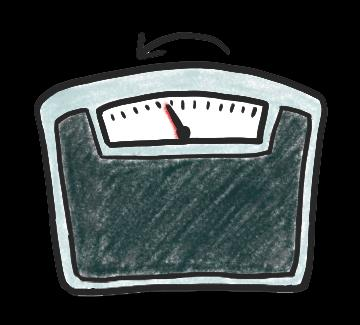

## Page 1

# **ข้อแนะน ำเพื่อให้ สุขภำพคุณดีขึ้น** 

## **เบำหวำนคืออะไร?** 

**เป็นภำวะทำงกำรแพทย์เรื้อรังที่ส่งผลต่อ ควำมสำมำรถในกำรย่อยสลำยน ้ำตำลของ ร่ำงกำย** ซึ่งหมายความว่าน ้าตาลจ านวนมากที่ เหลืออยู่ในเลือดของคุณ 

หากไม่ได้รับการรักษา โรคเบาหวานจะท าให้ หลอดเลือดเสียหาย ซึ่งอาจน าไปสู่อาการหัวใจ วาย โรคหลอดเลือดสมอง และปัญหาเกี่ยวกับ ไต ดวงตา เท้า และเส้นประสาท

## Page 2

**ข้อแนะน ำเพื่อให้ สุขภำพคุณดีขึ้น** 

**จะรู้ได้อย่ำงไรว่ำเป็นเบำหวำน?** อาการทั่วไปของโรคเบาหวาน ได้แก่ : 

**ปัสสำวะมำกเกินไป** 

**อ่อนเพลีย** 

**ควำมกระหำยน ้ำ** 

**อำกำรวิงเวียนศีรษะ** 

**น ้ำหนักลดโดยไม่ ทรำบสำเหตุ** 

**ควำมหิวมำกเกินไป** 

หากคุณเป็นเบาหวานหรือสงสัยว่าเป็นเบาหวาน โปรด ไปพบแพทย์ ไปที่คลินิกการแพทย์ โดยเฉพาะอย่างยิ่ง หากนายจ้างได้ท าแผนประกันการดูแลเบื้องต้นให้คุณ หาศูนย์การแพทย์ที่ใกล้ที่สุดและที่ตั้งของมัน **<u>ทนี่</u>**

## Page 3

# **ข้อแนะน ำเพื่อให้ สุขภำพคุณดีขึ้น** 

**ป้องกันเบำหวำน!** 

ท าตามขั้นตอนง่าย ๆ เหล่านี้เพื่อลดความเสี่ยงในการเป็นโรคเบาหวาน! 

เลือกอาหารที่ดีต่อสุขภาพ 

ดื่มน ้าเปล่าแทนเครื่องดื่มที่ มีน ้าตาล 

เลิกหรือลดแอลกอฮอล์และ การสูบบุหรี่ 

ออกก าลังกาย เช่น เดิน วิ่ง เหยาะๆ ปีนบันได 

กินอาหารที่มีเส้นใยสูง เช่น ข้าว โอ๊ตหรือถั่ว อัลมอนด์บิสกิตข้าว สาลีหรือโยเกิร์ตธรรมดา 

1. “มาเอาชนะเบาหวานกันเถอะ” HealthHub 

แหล่งความรู้

