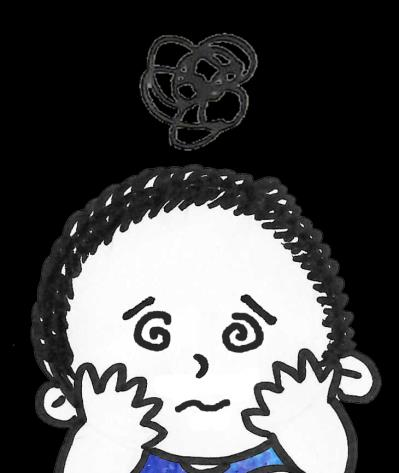

## Page 1

# Mẹo giúp b **ạ** n kh **ỏ** e m **ạ** nh h **ơ** n 

## **Bệnh tiểu đường là gì?** 

Đây là một tình trạng bệnh mãn tính ảnh hưởng đến khảnăng phân hủy đường của cơ thểbạn. Điều này có nghĩa là có rất nhiều đường đọng lại trong máu của bạn. 

Nếu không được điều trị, bệnh tiểu đường gây tổn thương các mạch máu, có thểdẫn đến đau tim, đột quỵvà các vấn đềvềthận, mắt, bàn chân và dây thần kinh.

## Page 2

# Mẹo giúp b **ạ** n kh **ỏ** e m **ạ** nh h **ơ** n 

**Làm thếnào đểbiết tôi có bịbệnh tiểu đường hay không?** Các triệu chứng phổbiến của bệnh tiểu đường bao gồm: 

**đi tiểu nhiều** 

**khát nước** 

**giảm cân không giải thích được** 

<!-- Start of picture text -->
kiệt sức <!-- End of picture text -->

**chóng mặt** 

<!-- Start of picture text -->
đói quá mức <!-- End of picture text -->

Nếu bạn mắc bệnh tiểu đường hoặc nghi ngờ mình mắc bệnh, hãy đến gặp bác sĩ. Hãy đến phòng khám y tế, đặc biệt nếu chủ lao động của bạn đã ghi danh cho bạn với Kế hoạch Chăm sóc Ban đầu. Tìm các trung tâm y tế gần . nhất của bạn và địa điểm của họ **<u>tại đây</u>**

## Page 3

# Mẹo giúp b **ạ** n kh **ỏ** e m **ạ** nh h **ơ** n 

**Ngăn ngừa bệnh tiểu đường!** 

Hãy làm theo các bước đơn giản sau đểgiảm nguy cơ mắc bệnh tiểu đường! 

Lựa chọn thực phẩm lành mạnh hơn. 

Uống nước thay vì đồ uống có đường. 

Bỏhoặc cắt giảm rượu và thuốc lá. 

Thực hiện các bài tập thể dục như đi bộ, chạy bộhoặc leo cầu thang. 

Ăn thực phẩm giàu chất xơ như yến mạch moong dal hoặc đậu, hạnh nhân, bánh quy lúa mì hoặc sữa chua nguyên chất. 

Nguồn: 

1. “Hãy đánh bại bệnh tiểu đường”.  HealthHub.

