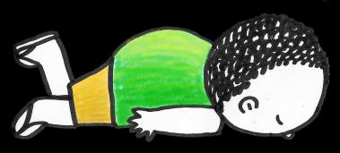

## Page 1

# **让您活得更 加健康的小贴士** 

**什么是高血压？** 

当您的心脏由于血管阻塞而强行泵 出更多血液时，就会发生高血压。 若不及时治疗，这将可能会导致心 脏病发作或中风。

## Page 2

# **让您活得更 加健康的小贴士** 

## **高血压的体征和症状** 

## **关注这些数字！** 

<!-- Start of picture text -->
昏厥 <!-- End of picture text -->

<!-- Start of picture text -->
头晕 <!-- End of picture text -->

<!-- Start of picture text -->
心律不齐 疲劳 呕吐 恶心 <!-- End of picture text -->

<!-- Start of picture text -->
心律不齐 疲劳 <!-- End of picture text -->

**120** ➞ **收缩压** 120 80 **80** ➞ **舒张压** < 120 < 80 120–129 < 80 130–139 or 80–89 140 + 90 + 180 + &/or 120 + 

## **保持血压健康的3种方法** 

1. 检查血压水平 

2. 改变生活方式，更加注意健康 

3. 去看医生，定期检查身体 

资料来源： 

- 1.《高血压》。保健中心。2021 年6 月。 

- 2.《高血压：健康饮食指南》。2021年12月。 

- 3.《了解血压读数》。2018年12月。

## Page 3

# **让您活得更 加健康的小贴士** 

## **预防高血压！** 

请按照这些简单的步骤来降低患高血压的风险！ 

锻炼身体！健康的体重可 以降低高血压风险。 

戒烟或减少饮酒和吸烟。 

良好的睡眠习惯。 

按照健康的饮食。尽量限制动物 脂肪、红肉和椰奶的摄入量。 

管理压力。您可以与他人谈谈您面对的 问题，参与放松活动，并进行呼吸练习。

