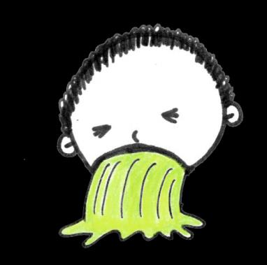

## Page 1

# Mẹo giúp b **ạ** n kh **ỏ** e m **ạ** nh h **ơ** n 

**Cao huyết áp là gì?** 

Cao huyết áp xảy ra khi tim bạn phải bơm nhiều máu hơn do tắc nghẽn mạch máu. 

Nếu không được điều trị, nó có thểgây đau tim hoặc đột quỵ.

## Page 2

# Mẹo giúp b **ạ** n kh **ỏ** e m **ạ** nh h **ơ** n 

## **Dấu hiệu và Triệu chứng Cao huyết áp** 

<!-- Start of picture text -->
Ngất xỉu <!-- End of picture text -->

<!-- Start of picture text -->
Chóng mặt <!-- End of picture text -->

<!-- Start of picture text -->
Nhịp tim không đều Mệt mỏi <!-- End of picture text -->

<!-- Start of picture text -->
Nôn mửa Buồn nôn <!-- End of picture text -->

## **Biết các con sốcủa bạn!** 

**120** ➞ **Huyết áp** 120 **tâm thu** 80 **80** ➞ **Huyết áp tâm trương** < 120 < 80 120–129 < 80 130–139 or 80–89 140 + 90 + 180 + &/or 120 + 

## **3 cách đểgiữhuyết áp khỏe mạnh** 

1. Kiểm tra mức huyết áp của bạn 

2. Thay đổi lối sống lành mạnh hơn 

3. “C” (Gặp) bác sĩ của bạn đểkiểm tra sức khỏe thường xuyên 

Nguồn: 

1. "Cao huyết áp" HealthHub. Tháng 6 năm 2021. 

2. “Huyết áp cao: Hướng dẫn Ăn uống Lành mạnh”.  Tháng 12 năm 2021. 

3. “Hiểu các ChỉsốvềHuyết áp”.  Tháng 12 năm 2018.

## Page 3

# Mẹo giúp b **ạ** n kh **ỏ** e m **ạ** nh h **ơ** n 

**Ngăn ngừa cao huyết áp!** 

Hãy làm theo các bước đơn giản sau đểgiảm nguy cơ mắc bệnh cao huyết áp! 

Tập thểdục!  Trọng lượng cơ thểkhỏe mạnh làm giảm nguy cơ mắc bệnh. 

Bỏhoặc cắt giảm rượu và thuốc lá. 

Ngủngon. 

Quản lý sựcăng thẳng.  Bạn có thểnói chuyện với người khác vềvấn đềcủa mình, tham gia vào các hoạt động thư giãn và thực hiện các bài tập hít thở. 

Hãy tuân theo một chếđộăn uống lành mạnh.  Cốgắng hạn chếăn mỡđộng vật, thịt đỏvà nước cốt dừa.

