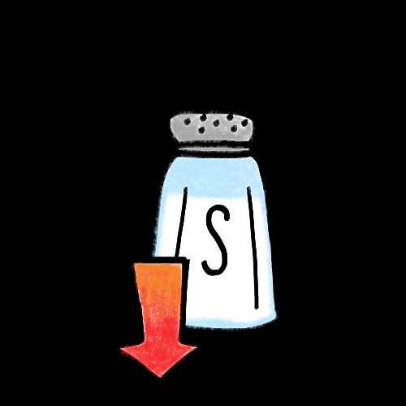

## Page 1

Tips untuk membuat  Anda yang Lebih Sehat 

**Apa itu kolesterol tinggi?** 

Kolesterol adalah zat seperti lemak dalam darah Anda. Terlalu banyak kolesterol dapat meningkatkan risiko serangan jantung atau stroke.

## Page 2

# Tips untuk membuat  Anda yang Lebih Sehat 

**Bagaimana saya tahu jika saya memiliki kolesterol tinggi?** 

Tidak ada gejala. 

Kebanyakan orang mengetahuinya dari tes darah. 

Adalah penting agar Anda memeriksakan kadar kolesterol Anda dengan dokter Anda. Kunjungi klinik medis, terutama jika majikan Anda telah mendaftarkan Anda dengan Rencana Perawatan Primer. Temukan pusat kesehatan terdekat dan lokasinya **<u>di sini</u>** .

## Page 3

# Tips untuk membuat  Anda yang Lebih Sehat 

## **Mencegah Kolesterol Tinggi!** 

Ikuti langkah-langkah sederhana ini untuk mengurangi risiko terkena kolesterol tinggi! 

Tetap aktif! Berolahraga seperti sepak bola, bulu tangkis, atau kriket. 

Lakukan diet seimbang. 

Mengurangi makanan asin. 

Gunakan yoghurt rendah lemak/susu rendah lemak dalam memasak dan hindari santan. 

Makan lebih sedikit daging berlemak (daging kambing) dan singkirkan lemak yang terlihat dari daging sebelum dimasak atau dimakan. 

Sumber: 

1. “Healthy Eating for Lowering Cholesterol”. HealthHub. Desember 2021. 

2. “Hyperlipidemia”. HealthHub. Februari 2022.

