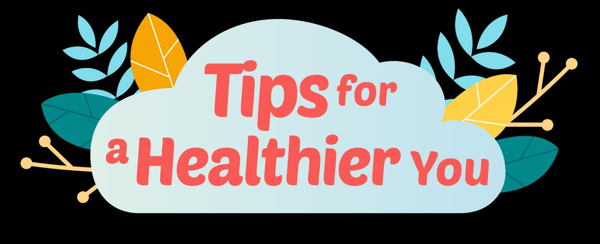

## Page 1

# Tobacco smoking 

**What is tobacco smoking?** 

- Cigarette smoking 

- Roll-your-own Cigarettes 

### **Why is smoking bad?** 

Smoking **increases your risk** of: 

- Cancer 

- Heart disease 

- Stroke 

- Diabetes 

- Kidney failure 

### **The GOOD when you QUIT** 

- **After 72 hours:** You can breathe easier and feel an increase in energy 

- **After 3 months** : Blood circulation improves and better lung functions 

- **After 9 months:** Lesser coughing and lesser difficulty in breathing 

- **After 1 year:** Risk of heart disease and stroke reduces by 50%

## Page 2

## **How to quit** 

- Write down **reasons for quitting** to motivate yourself. 

- Choose a quitting method such as **reducing the quantity over time** or **ask a friend to stop you** when you light up. 

- **Set a quit day to start** and stay smoke-free. 

- **Set small goals** and **reward yourself when you achieve your goal** s of staying smoke-free (i.e. 1 week/1 month/ 3 months/ 6 months etc of being smoke-free). 

- **Tell your loved ones** so they can encourage you along the way. 

**How to cope The 4 ‘Ds’: D** elay lighting up **D** istract yourself **D** eep breathing exercises **D** rink water 

Proudly presented by: 

_Sources:_ 

_1. “The Harms of Smoking and Benefits of Quitting”. HealthHub. December 2021._ 

_2. “Say Hello to 4Ds and Bye to Nicotine Withdrawal Symptoms”. HealthHub. March 2022._

