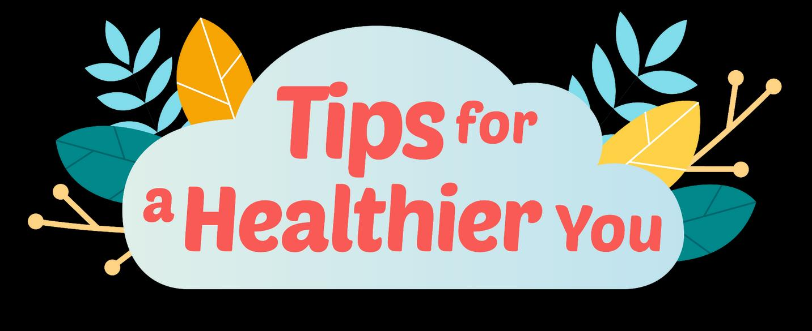

## Page 1

**ข้อแนะน าเพื่อให้ น สุขภาพคุณดีขึ้** 

# **การสูบยาเส้น** 

**การสูบยาเส้นคือ เช่น** 

- การสูบบุหรี่ 

- บุหรี่ม้วนเอง 

**ท าไมการสูบบุหรี่ถึงไม่ดี** 

การสูบบุหรี่เพิ่มความเสี่ยงเป็นโรค ดังต่อไปนี้ 

- มะเร็ง 

- โรคหัวใจ 

- โรคหลอดเลือดสมอง 

- โรคเบาหวาน 

- ไตล้มเหลว 

**มีผลดีเมื่อคุณเลิกบุหรี่ เช่น** 

หลังจาก 72 ชั่วโมง คุณจะหายใจได้ง่ายขึ้นและรู้สึกมีแรงเพิ่มขึ้น หลังจาก 3 เดือน การไหลเวียนโลหิตดีขึ้น การท างานของปอดดีขึ้น หลังจาก 9 เดือน อาการไอน้อยลง หายใจล าบากน้อยลง หลังจาก 1 ปี ความเสี่ยงของโรคหัวใจและหลอดเลือดลดลง 50%

## Page 2

## **วิธีการเลิก คือ** 

- จดบันทึกเหตุผลในการเลิกเพื่อกระตุ้นตัวเอง 

- หาวิธีการเลิกบุหรี่ที่เหมาะ เช่น ลดปริมาณลงตามช่วงเวลา หรือขอเพื่อน เตือนให้หยุดเมื่อคุณหยิบไฟแช็กขึ้นมา 

- ก าหนดวันเลิกบุหรี่เพื่อการเริ่มต้นและงดสูบบุหรี่ 

- ตั้งเป้าหมายระยะสั้นและให้รางวัลตัวเองเมื่อได้บรรลุตามเป้าในการอยู่ อย่างไร้ควัน (เช่น 1 สัปดาห์/1 เดือน/3 เดือน /6 เดือน ฯลฯ เป็นเขต ปลอดบุหรี่) 

- บอกให้คนที่สนิทเพื่อให้พวกเขาช่วยชูก าลังใจให้คุณในตลอดทาง 

## **วิธีทนสู้เอา** 

**4 ข้อ ของ 4 Ds** 

**ถ่วง** เวลาในการหยิบไฟแช็ก **ตั้ง** สมาธิกับเรื่องอื่น **การฝึก** หายใจเข้าลึกๆ **ดื่ม** น ้า. 

Proudly presented by: 

แหล่งความรู้ _1._ “โทษจากการสูบบุหรี่กับประโยชน์ของการเลิกบุหรี่“ HealthHub _._ ศ.คมคาวนัธ บับฉ _2021. 2._ **“** กล่าวสวัสดีกับ 4 _Ds_ และลาอาการลงแดงนิโคติน” **.** _HealthHub._ ฉบับ มีนาคมค.ศ _2022._

