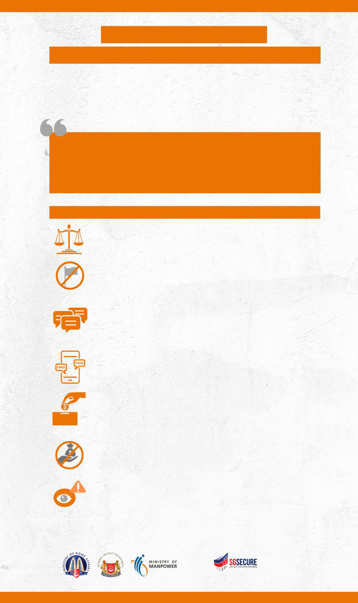

## Page 1

# **ইসরাত়েল-হামাস সংঘাতের ব্যাপাতর পরামর্শ** 

**মধ্যপ্রাতযযযলমানসংঘােঅতনকবব্সামররকরনত্শাষনাগররতকরজীব্নহানীকতরতে এব্ংরব্শ্বযাপীআতব্তগরজন্মর্ত়েতে। এটাগুরুত্বপূর্শবেআমরার্ান্তথারকএব্ং ব্ারহতরর উতেজনাকর পরররিরে দ্বারারসঙ্গাপুতররজারেগেএব্ংধ্মী়ে সম্প্রীরেএব্ং র্ারন্তকপ্রভারব্েকরতেনাব্ই।** 

আমাদেরদে(সিঙ্গাপুরদে) আমাদেরঅবস্থানিম্পদেে পসরষ্কারহওযােরোর– আমরা িমস্তিন্ত্রািবােএবংঅমানসবেিসহংিতারসনন্দােসর।…. যেযেউচরমপন্থাও িসহংিতারপ্রচারবািমর্েনেদরতাদেরসবরুদেআমরাবযবস্থা গ্রহন েসর। 

সমিঃ যে শানমুগাম স্বরাষ্ট্রমন্ত্রী 

12 অদটাবর 2023 

সিঙ্গাপুদরসবদেশীেমীদেরদেসনম্নসিসিতসবষদযপরামশেযেওযাহদে: 

- **রসঙ্গাপুতরবেতকাতনাধ্রতনরযরমপন্থা, সরহংসোএব্ংসন্ত্রাসব্াত্র** এই ধরদনর োদে যেউ 

- **জনযর্ূনযসহনর্ীলোরত়েতে।** েস়িত তা আইদনর অধীদন েদ ারভাদব যমাোদবিা েরা 

- র্ােদি সিঙ্গাপুর হদব। 

- **রসঙ্গাপুতর রব্ত্র্ী রাজনীরেতক সমথশন ব্া আম্ারন করতব্ন না।** এই সনদষধাজ্ঞারমদধয অন্তভুেক্ত রদযদে বযানার, পতাো এবং যপাস্টাদরর মদতা িামগ্রীর েনিাধারদের মদধয প্রেশেন। 

- **ব্যরিগেভাতব্ব্াঅনলাইতনএমনবকাতনােথযরলখতব্ননা , বপাস্ট করতব্ননাব্াবর়্োরকরতব্ননাোআতব্গতকজারগত়ে েুলতেপাতর োসরহংসোব্ারব্রভন্নজারেব্াধ্তমশরমতধ্যঘৃর্াসৃরিকরতেপাতর** । এটি েরা এেটি অপরাধ এবং সিঙ্গাপুদরর আইদন শাসস্তদোগয। অপরাধীদেরসিঙ্গাপুদরোেেরদতবাধাযেওযাহদতপাদর। 

- **ইসরাত়েল-হামাসসংঘােসম্পতকশঅনুমানব্াোযাইনাকরােথয ের়িত়ে ব্তব্ননা** োঅনযদেরঅস্বসস্তরোরেহদতপাদর। 

- **আপরনের্ সংঘাতেক্ষরেগ্রস্ত্ রসাহােযকরারজনয্ ানকরতে যান** , তাহদি Singapore Red Cross Society বা Rahmatan Lil Alamin ( Blessing to All ) ফাউদেশদনর মদতা **অরিরস়োল যযাতনতলর মাধ্যতমোকরুন** । এটি সনসিত েরার েনয যে অনুোন প্রেৃত উদেদশযবযবহারেরা হবে । 

- **বকাতনাসন্ত্রাসীবগাষ্ঠীতকঅথশপাঠাতব্ননাব্াসমথশনকরতব্ননা** , োরেএটিিন্ত্রািবাে(Suppression of Financing অর্োযনেমন) আইদনরঅধীদনএেটিঅপরাধ।যোষীিাবযস্তহদি, আপনারযেি হদতপাদরএবং/অর্বােসরমানােরাহদতপাদর। 

- **সজাগথাকুন , এব্ংঅরব্লতে** 1800-255-0000 নম্বদর পুসিশ বা অভযন্তরীে সনরাপত্তা সবভাদগ 1800-2626-473 নম্বদর **বে বকানও সতেহজনককােশকলাপব্াব্যরিোরাবমৌলব্া্ীহও়োরলক্ষর্ ব্খাতেপাতরোত্রব্যাপাতরররতপাটশকরুন৷** 

এই বাতো আপনার োদে সনদয এদিদেিঃ 

িহদোসগতাযিঃ

