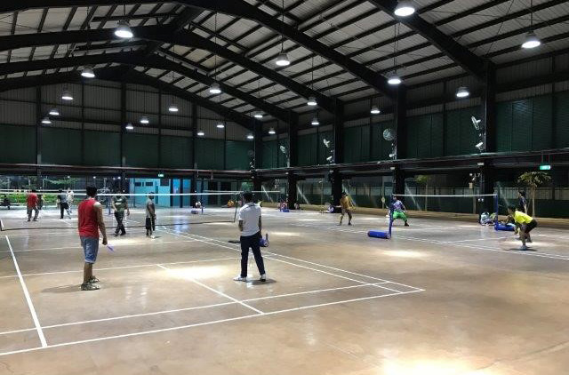
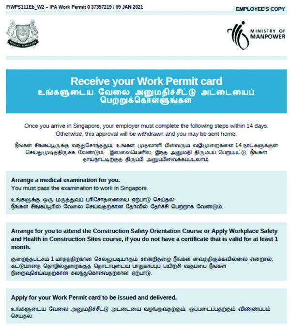
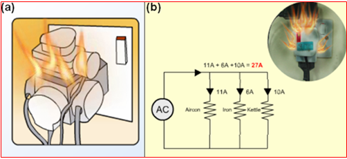

## Page 1

# PANDUAN UNTUK **_PEKERJA MIGRAN_** 

**1**

## Page 2

## DAFTAR ISI 

||HALAMAN|
|---|---|
|**Selamat datang di Singapura**|**01**|
|**Tinggal di Singapura**|**02**|
|**Bepergian di Singapura**|**06**|
|**Bekerja di Singapura**|**08**|
|**Hak-hak Kerja**|**12**|
|**Hukum Tenagakerja**|**20**|
|**Kewajiban Majikan**|**24**|
|**Penipuan Kerja**|**27**|
|**Keselamatan**|**27**|
|**Mencari Perawatan Medis**|**30**|
|**Hukum Singapura**|**34**|
|**Masalah Keuangan**|**38**|
|**Nomor-nomor Telepon Penting**|**42**|
|**Informasi mengenai COVID-19**|**44**|

Informasi yang tertera dalam panduan ini adalah benar pada saat dicetak. Silakan kunjungi **www.mom.gov.sg** untuk informasi lebih lanjut

## Page 3

#### SELAMAT DATANG DI SINGAPURA 

Selamat datang di Singapura! Dalam buku panduan ini, Anda akan menemukan informasi-informasi untuk membantu Anda beradaptasi dengan lingkungan kerja dan kehidupan Anda yang baru. Anda dianjurkan untuk mengetahui hak dan tanggung jawab Anda sebagai seorang pekerja serta mematuhi hukum di Singapura. 

Jika Anda mengalami masalah dalam pekerjaan, silakan menghubungi nomor-nomor berikut untuk mendapatkan pertolongan: 

<!-- Start of picture text -->
MINISTRY OF  MIGRANT WORKERS’ MANPOWER (MOM) CENTRE (MWC) TEL: 6438 5122 TEL: 6536 2692 Ministry of Manpower   579 Serangoon Road Services Centre Singapore 218193 1500 Bendemeer Road Singapore 339946 51 Soon Lee Road Singapore 628088 Anda juga dapat menghampiri petugas FAST yang berada di asrama jika memerlukan bantuan. <!-- End of picture text -->

Gunakan tautan atau kode QR berikut untuk memberitahukan nomor ponsel Anda di Singapura kepada MOM. Hal ini akan memudahkan MOM untuk memberikan Anda segala informasi terkait dengan pekerjaan Anda selama berada di Singapura. 

Silakan bagikan nomor ponsel Anda di: **www.mom.gov.sg/update_contact_details** 

**1**

## Page 4

#### TINGGAL DI SINGAPURA 

###### MENGENAI SINGAPURA 

Singapura adalah sebuah negara multiras dan multibudaya, yang terdiri dari berbagai suku bangsa, agama serta bahasa. Perbedaan yang ada sangat penting untuk dipahami dan dihargai agar setiap orang dapat hidup dan bekerja secara harmonis. 

###### **Agama di Singapura** 

Ada beberapa agama yang dianut di Singapura, contoh: Budha, Kristen, Islam, Hindu dan Taoisme. Setiap orang bebas untuk menganut agama dan kepercayaan mereka selama mereka juga menghargai  kebiasaan agama orang lain. Anda dapat beribadah di tempat-tempat ibadah yang ditetapkan seperti kuil, gereja, dan masjid. 

###### KEBIASAAN SOSIAL SETEMPAT 

Selama berada di Singapura, Anda harus mengetahui kebiasaan dan adat istiadat setempat. Apa yang lazim di negara asal Anda mungkin tidak dapat diterima di Singapura. 

###### **Berikut adalah beberapa tip sebagai panduan:** 

###### **Perilaku Yang Baik di Tempat Umum** 

- Jangan berkelahi. 

- Jangan tidur di tempat-tempat umum seperti halte bis, di bawah blok, bangku umum, taman atau jembatan penyeberangan. 

- Jangan berbicara atau mendengarkan musik dengan nyaring di malam hari. 

- Janganberkumpul dalam jumlah besar di di bawah blok dan mengonsumsi minuman keras. 

- Jangan meludah atau membuang sampah sembarangan. 

- Jangan berjalan-jalan tanpa berpakaian pada atas tubuh di tempat umum. 

###### **Kebersihan Diri** 

Sangat penting bagi Anda untuk menjaga kebersihan diri demi mengurangi risiko terkena penyakit dan agar kesehatan Anda semakin baik. 

- Mandi dan mencuci rambut. 

- Menyikat gigi. 

- Mencuci pakaian. 

- Cuci tangan dengan sabun secara teratur. 

**2**

## Page 5

###### **8 Langkah Mencuci Tangan** 

<!-- Start of picture text -->
1 2 3 4 Cuci telapak tangan Gosok setiap jari dan  Gosok punggung  Gosok bagian bawah sela-sela jari tangan dan sela-sela jari ibu jari 5 6 7 8 Bagian punggung jari Gosok kuku dan  Cuci pergelangan  Keringkan kedua telapak tangan Anda tangan Anda tangan dengan kain <!-- End of picture text -->

Keringkan kedua tangan dengan kain atau tisu kering 

###### **Memantau Status Kesehatan** 

Silakan unduh aplikasi ponsel gratis, **FWMOMCare** , untuk memantau kesehatan Anda. Dengan aplikasi ini, jika Anda merasa tidak sehat, Anda juga dapat mendapatkan layanan kesehatan secepatnya melalui layanan berobat jarak jauh 24/7. 

Gunakan fungsi ‘Safe@Home’ untuk memindai kode QR yang ada di asrama dan melaporkan lokasi Anda sebelum Anda berangkat kerja dan kembali dari kerja setiap hari. 

Periksa bagian ‘My Profile’ untuk memastikan nomor ponsel Anda adalah benar. 

**3**

## Page 6

###### **Hemat Air** 

Jangan membiarkan keran air menyala saat Anda menyikat gigi, gunakan gelas. 

Jangan mencuci piring dan pakaian dengan keran air tetap menyala. gunakan ember yang diisi dengan air. 

Jangan membuangbuang air. 

Jangan membiarkan keran air menyala saat mandi; usahakan Anda selesai mandi dalam waktu 5 menit. 

Matikan keran air saat tidak digunakan dan segera laporkan bila terjadi kebocoran. 

Jangan biarkan atau mencoba memperbaiki keran air yang rusak. 

###### KEMANA PADA HARI ISTIRAHAT 

Anda dapat mengunjungi pusat rekreasi pada waktu senggang Anda. Ada banyak fasilitas dan kegiatan yang yang tersedia bagi Anda. 

**Pusat Rekreasi** 

Ada delapan pusat rekreasi di seluruh Singapura. Mereka menyediakan fasilitasfasilitas olahraga gratis seperti lapangan bulutangkis/basket, sepak bola, dan kricket. Anda dapat mengirimkan uang, mengunjungi tukang cukur rambut, berbelanja di supermarket, atau juga makan di pusat tersebut. 

**4**

## Page 7

Rincian pusat rekreasi tersebut adalah sebagai berikut: 

Fasilitas Rekreasi Alamat **Cochrane RC 100 Sembawang Drive, Singapore 756998 Kaki Bukit RC 7 Kaki Bukit Avenue 3, Singapore 415814 Kranji RC 11 Kranji Road, Singapore 737673 Penjuru RC 27 Penjuru Walk, Singapore 608538 Soon Lee RC 51 Soon Lee Road, Singapore 628088 Terusan RC 1 Jln Papan, Singapore 619392 Tuas South RC 10 Tuas South Street 13, Singapore 636937 Woodlands RC 200 Woodlands Industrial Park E7, Singapore 757177** 

###### UNDANG-UNDANG TENTANG MINUMAN KERAS DI SINGAPURA 

Jika Anda meminum minuman keras, Anda harus mengetahui undang-undang tentang minuman keras yang mengatur dimana dan kapan Anda diizinkan untuk minum serta dimana Anda dapat membeli minuman alkohol tersebut. 

Ada beberapa zona penertiban minuman keras seperti Geylang dan Little India yang memiliki keterbatasan yang berbeda. Di tempat ini Anda hanya dapat membeli dan minum minuman keras dalam outlet-oulet yang memiliki izin seperti warung-warung kopi di Geylang dan Little India. Minum minuman keras di luar tempat-tempat tersebut melanggar hukum. 

Anda akan ditindak keras jika Anda ditemukan minum minuman keras di tempat umum pada jam-jam yang dilarang, dan izin kerja Anda akan dicabut. 

Untuk informasi lebih lanjut mengenai undang-undang minuman keras, silakan kunjungi www.mha.gov.sg. 

**5**

## Page 8

#### BEPERGIAN DI SINGAPURA 

Berpergian di Singapura itu mudah. Ada berbagai jenis transportasi di Singapura, seperti: 

- Bis 

- Mass Rapid Transit (MRT) 

- Light Rail Transit (LRT) 

- Taksi 

- Kenderaan pribadi yang disewakan 

###### **Kartu EZ-Link** 

Untuk menaiki bis, MRT atau LRT, Anda memerlukan kartu ez-link yang dapat dibeli di berbagai stasiun MRT dan terminal bis. Kartu ez-link memiliki nilai di dalamnya. Anda dapat mengisi ulang kartu Anda di mesin-mesin tiket yang ada di stasiun MRT dan terminal bis. Isi ulang dapat dilakukan dengan kartu ATM bank Anda. Anda dapat mendekati staf di loket informasi stasiun MRT atau terminal bis jika memerlukan bantuan. 

_Rincian rute bis dan MRT serta ongkos-ongkosnya ditampilkan di halte bis dan stasiun MRT/LRT._ 

**Perilaku Yang Baik di Kendaran Umum** 

Bertimbang rasa terhadap para penumpang yang lain saat Anda menaiki kendaran umum seperti bis dan MRT/LRT. 

- Untuk menaiki bis atau MRT. 

- Memberikan tempat duduk Anda orang yang lebih membutuhkan seperti 

- penumpang lansia. 

- Bergerak ke bagian dalam saat berdiri, dan tidak menghalangi pintu agar orang lain dapat masuk atau keluar. 

- Memberi jalan bagi penumpang yang akan turun sebelum Anda naik 

- Meletakkan tas di bawah agar orang lain memiliki ruang untuk bergerak. 

**6**

## Page 9

###### KESELAMATAN DI JALAN RAYA 

###### **Bersepeda dengan Aman** 

Jika Anda bersepeda, bersepedalah dengan aman. 

- Selalu menunggang sepeda pada lajur sepeda dan berhati-hati terhadap pengendara sepeda lain atau pejalan kaki. 

- Berhati-hatilah dengan pejalan kaki dan perlambat kecepatan. Bunyikan bel dari jauh agar pejalan kaki mengetahui keberadaan Anda, khususnya pada trotoar bersama. 

- Mematuhi rambu-rambu lalu lintas dan tetap berada di tepi pinggir jalan. Jangan bersepeda di tengah jalan atau melawan arus lalu lintas. 

- Saat bersepeda, letakkan sepeda di tempat parkir yang tersedia. Jangan tinggalkan sepeda Anda di tengah jalan atau trotoar supaya tidak menghalangi pengemudi serta pejalan kaki. 

###### **Keselamatan di Jalan Raya** 

Keselamatan di jalan raya adalah hal penting. 

- Mematuhi peraturan lalu lintas. Jangan menyeberang sembarangan. Selalu menyeberang jalan di lampu lalu lintas. 

- Menyeberang jalan pada saat lampu lalu lintas menjadi hijau. 

- Menggunakan penyeberangan pejalan kaki, jembatan penyeberangan atau jembatan bawah tanah untuk menyeberang jalan dengan selamat. 

- Apabila mengemudikan kendaraan, beri jalan kepada pejalan kaki dan kurangi kecepatan saat mendekati simpang  jalan, persimpangan atau penyeberangan pejalan kaki. 

###### **Menaiki Mobil Pick-up** 

Majikan Anda dapat saja menyediakan sarana transportasi dari tempat kerja Anda ke asrama Anda. Jika Anda ditempatkan dalam situasi yang membahayakan seperti mobil pick-up yang padat penumpangnya, harap beritahukan majikan Anda. Keselamatan Anda itu penting. Jika majikan Anda tidak mau membantu Anda, laporkan ke **Land Transport Authority (LTA)** di nomor telepon **1800-2255-582** . 

**7**

## Page 10

#### BEKERJA DI SINGAPURA 

Untuk dapat bekerja di Singapura, Anda harus memiliki izin kerja yang sah dan mematuhi semua ketentuan izin kerja tersebut. 

###### **Surat Persetujuan secara Prinsip** 

Sebelum meninggalkan negara asal, seharusnya Anda telah menerima Surat Persetujuan secara Prinsip atau IPA (5 halaman) yang tertulis dalam bahasa asli Anda dari majikan atau agen tenaga kerja di negara asal Anda. Surat IPA ini dikeluarkan oleh MOM yang mengandung informasi mengenai pekerjaan Anda di Singapura. Majikan Anda harus memenuhi ketentuan yang tertera pada surat IPA Anda dan majikan tidak dapat mengubah ketentuan-ketentuan tersebut tanpa seizin Anda. Harap perhatikan hal-hal berikut ini di IPA: 

**1** Nama dan nomor izin kerja Anda 

**8**

## Page 11

- **2** Nama majikan Anda **3** Pekerjaan Anda **4** Agen tenaga kerja (EA) Anda di Singapura  dan biaya agensi yang akan dibayar kepada EA di Singapura 

- **5** Masa berlaku izin kerja **6** Gaji pokok Anda per bulan, gaji tetap per bulan, tunjangan tetap per bulan, dan potongan per bulan 

- **7** Tunjangan tempat tinggal 

- **8** Anda hanya dapat melakukan pekerjaan yang tertera di IPA 

**9**

## Page 12

**9** Anda harus mematuhi ketentuan-ketentuan izin kerja selama berada di Singapura 

<!-- Start of picture text -->
10 Hak Hari Istirahat Anda <!-- End of picture text -->

Anda harus menerima gaji seperti yang tertera pada surat IPA. Jika majikan Anda memotong gaji Anda tanpa persetujuan anda secara tertulis, silakan meminta bantuan di MOM. 

Anda harus menyimpan salinan surat IPA selama Anda bekerja di Singapura. 

<!-- Start of picture text -->
11 Langkah-langkah yang harus dilakukan majikan Anda dalam waktu 14 hari <!-- End of picture text -->

**10**

## Page 13

###### **Izin Kerja** 

Anda diwajibkan untuk menyimpan kartu izin kerja bersama Anda setiap saat. Jika Anda belum menerima kartu izin kerja, silakan simpan surat IPA Anda. 

Anda diperlukan untuk menunjukkan kartu izin kerja Anda saat pemeriksaan oleh MOM atau pegawai instansi lainnya. 

###### **Paspor** 

Paspor adalah milik pribadi Anda. Paspor tidak boleh disimpan oleh majikan Anda sebagai suatu syarat bekerja. Jika majikan menyimpan paspor untuk Anda, paspor tersebut harus langsung dikembalikan saat Anda memintanya. 

<!-- Start of picture text -->
PASSPORT PASSPORT <!-- End of picture text -->

###### **Mencari Bantuan** 

Jika majikan Anda memotong gaji tanpa persetujuan Anda, tidak mengembalikan paspor, atau izin kerja saat Anda memintanya, segera laporkan ke **MOM** dengan menghubungi nomor telepon **6438 5122** , atau mendatangi Pusat Layanan MOM di 1500 Bendemeer Road, Singapore 339946. 

**11**

## Page 14

#### HAK-HAK KERJA 

###### **Bekerja dan Tinggal di Singapura** 

Majikan Anda harus memberikan Anda satu set Ketentuan-Ketentuan Pokok Bekerja atau Key Employment Terms (KETs) secara tertulis. KET harus mengandung informasi tentang ketentuan-ketentuan dan syarat-syarat pekerjaan yang telah disepakati, termasuk: 

- Gaji, tanggal pembayaran gaji, dan hak atas gaji lembur. 

- Aturan kerja seperti jam kerja dan hari istirahat. 

- Hak cuti dibayar (termasuk cuti tahunan, cuti sakit, dan hari libur) serta tunjangan kesehatan. 

Jika Anda memiliki masalah dalam bidang berikut, harap laporkan ke **MOM** atau **Tripartite Alliance for Dispute Management (TADM)** sedini mungkin. TADM berlokasi di Pusat Layanan MOM. 

###### **(a)   Pembayaran Gaji/Gaji Lembur** 

- **1** Anda harus membuka rekening bank pribadi di Singapura dan meminta majikan Anda untuk menyetor gaji Anda langsung ke rekening bank tersebut. Hal ini akan mengurangi adanya perselisihan tentang pembayaran gaji dengan majikan Anda. Majikan Anda harus membayar gaji Anda dengan mentransfer langsung ke rekening bank Anda jika Anda meminta mereka berbuat demikian. 

- **2** Majikan Anda harus membayar gaji Anda setidaknya satu kali dalam sebulan dan dalam waktu 7 hari setelah akhir periode pembayaran gaji. Periode pembayaran gaji yang disetujui antara Anda dan majikan Anda tidak dapat melebihi dari satu bulan. 

- **3** Jika Anda bekerja lembur dalam bulan tersebut, majikan Anda harus membayar kerja lembur tersebut setidaknya satu kali dalam sebulan dan dalam waktu 14 hari dari akhir periode pembayaran gaji. 

**12**

## Page 15

<!-- Start of picture text -->
4 <!-- End of picture text -->

   - Majikan tidak dapat memotong gaji pokok Anda, tunjangan tetap, atau menaikkan potongan yang tetap dari jumlah yang tertera dalam surat IPA tanpa persetujuan Anda secara tertulis. 

- **5** Gaji Anda dapat dirubah jika Anda setuju dan majikan Anda melakukan hal-hal  sebagai berikut: **<u>Meminta persetujuan Anda secara tertulis.</u>** Memberitahukan MOM. 

   - Memberi Anda slip gaji yang dirinci dengan gaji yang telah disesuaikan. 

- Majikan Anda harus memberi slip gaji setidaknya sebulan sekali dan dalam waktu 3 hari kerja setelah pembayaran gaji. Slip gaji tersebut harus mencantumkan rincian pembayaran gaji, seperti gaji pokok, tunjangan, potongan, jumlah jam lembur, dan gaji lembur. 

**6** 

Anda harus menyimpan catatan slip gaji tersebut dan time sheet Anda. 

- **7** Jangan menandatangani dokumen kosong atau dokumen yang tidak dimengerti atau tidak disetujui. Anda harus menghubungi MOM jika majikan Anda meminta Anda untuk menandatangani dokumen kosong seperti voucher pembayaran atau slip gaji. Umumnya, karyawan yang tidak segera maju lebih awal mungkin mengalami kesulitan untuk membuktikan validitas klaim mereka. 

**13**

## Page 16

###### **(b)   Potongan Gaji** 

- Majikan Anda tidak dapat memotong gaji Anda. Mereka hanya dapat melakukannya jika: 

Anda tidak masuk kerja Majikan Anda telah Majikan Anda telah tanpa izin majikan membayar tunjangan membayar tempat makanan yang Anda tinggal/akomodasi, minta fasilitas, dan layanan lain yang telah Anda terima 

Barang atau uang yang Anda memberikan persetujuan dititipkan kepada Anda tertulis Anda terhadap pemotongan telah hilang atau rusak tersebut (Anda dapat membatalkan (pemotongan satu kali saja) persetujuan tersebut sebelum pemotongan dilakukan) •    Jika ada pemotongan gaji dilakukan, majikan tidak dapat memotong lebih dari 50% dari seluruh gaji Anda pada satu periode pembayaran. Hal ini tidak termasuk pemotongan yang dilakukan untuk: -    Tidak masuk kerja. 

- Pembayaran uang muka gaji, pinjaman, atau kelebihan pembayaran gaji. 

- Pembayaran koperasi dimana Anda telah menyetujui secara tertulis. 

**14**

## Page 17

###### **(c)   Jam Kerja dan Jam Lembur** 

- Jam kerja Anda tidak boleh melebihi dari 8 jam per hari atau 44 jam per minggu kecuali Anda bekerja shift. Jam kerja tidak termasuk jeda yang dijinkan untuk beristirahat, jeda teh dan makan. Setiap pekerjaan yang dilakukan di luar jam kerja dianggap sebagai lembur. Anda dapat mengklaim gaji lembur sebesar 1,5 kali gaji pokok Anda per jam. 

- Jika Anda kerja shift, jam kerja tidak boleh melebihi rata-rata 44 jam per minggu selama 3 minggu. Jam kerja maksimal setiap hari adalah 12 jam, dan jumlah waktu lembur maksimal dalam satu bulan adalah 72 jam. 

- Majikan Anda harus mencatat waktu lembur Anda telah bekerja. Anda harus memastikan catatan majikan Anda dan menandatanganinya jika catatan tersebut akurat. Jika Anda tidak setuju dengan catatan tersebut, Anda harus meminta penjelasan dari majikan  dari awal dan jangan menandatanganinya. 

Langkah-langkah untuk menghitung gaji lembur: 

LANGKAH KE 1 Hitung gaji pokok Anda per jam: **12 x Gaji Pokok Per Bulan = HOURLY BASIC RATE OF PAY 52 x 44** LANGKAH KE 2 Hitung gaji lembur Anda per jam: 

**[Gaji pokok per jam] X [1,5] = HOURLY RATE OF OVERTIME PAY** 

LANGKAH KE 3 Hitung gaji lembur: 

**[Upah lembur per jam] X [jumlah jam lembur] = OVERTIME PAY** 

**15**

## Page 18

###### **(d)   Cuti Sakit** 

- Anda berhak atas cuti sakit berobat jalan dan opname jika Anda telah bekerja setidaknya selama 3 bulan untuk majikan Anda. Jumlah cuti sakit yang Anda peroleh tergantung pada berapa lama Anda bekerja, sebagai berikut: 

|**Jangka kerja**|**Cuti Sakit Berobat**|**Cuti Sakit Opname**|
|---|---|---|
|**Hingga Saat Ini**|**Jalan per tahun (hari)**|**per tahun (hari)**|
|**3 bulan**|5|15|
|**4 bulan**|8|30|
|**5 bulan**|11|45|
|**6 bulan** **atau lebih**|14|60|

- Anda harus memberitahukan majikan Anda dalam waktu 48 jam setelah tidak masuk kerja agar memenuhi syarat untuk cuti sakit. 

- Majikan Anda harus membayar gaji Anda selama cuti sakit yang diambil pada hari kerja biasa jika Anda: 

- memiliki surat izin sakit selama masa cuti sakit dari dokter yang terdaftar dibawah UU Registrasi Medis dan 

- tidak melebihi hak cuti sakit Anda untuk tahun itu. 

###### **(e)   Hari Istirahat dan Hari Libur Nasional** 

- Anda berhak atas satu hari istirahat dalam seminggu, tanpa bayaran. 

- Majikan Anda tidak dapat memaksa Anda bekerja pada hari istirahat, kecuali dalam keadaan tertentu dan mereka harus menanyakan persetujuan Anda untuk bekerja pada hari tersebut. 

**16**

## Page 19

###### **Upah pada hari istirahat dihitung sebagai berikut:** 

|**Jika bekerja**|**Sampai** **setengah dari** **jam kerja biasa**|**Lebih dari** **setengah jam** **kerja biasa**|**Jauh melebihi** **jam kerja biasa**|
|---|---|---|---|
|Atas permintaan majikan|1 hari gaji|2 hari gaji|2 hari kerja + upah lembur|
|Atas permintaan karyawan|Setengah hari gaji|1 hari gaji|1 hari kerja + upah lembur|

- Anda berhak atas  11 hari libur nasional per tahun. 

- Majikan Anda harus membayar gaji kotor Anda untuk hari libur nasional meskipun Anda tidak bekerja pada hari itu. 

- Jika Anda bekerja pada hari libur nasional, majikan harus memberikan Anda upah tambahan sebesar gaji pokok per hari, atau memberikan Anda hari libur sebagai pengganti, atau time-off (hanya untuk bukan pekerja yang berpenghasilan di atas 2.600 SGD) 

###### **(f)   Cuti Tahunan** 

- Jika Anda telah bekerja dengan majikan Anda selama setidaknya 3 bulan, maka Anda berhak atas cuti tahunan yang dibayar. 

- Hak cuti tahunan Anda tergantung pada masa kerja Anda dengan majikan seperti yang ditunjukkan di bawah ini. 

|**Tahun Anda bekerja** **Jumlah hari cuti per tahun**|
|---|
|1 7|
|2 8|
|3 9|
|4 10|
|5 11|
|6 12|
|7 13|
|8 atau lebih 14|

- Jika Anda belum bekerja selama 12 bulan, hak cuti tahunan Anda akan diberikan secara pro rata sesuai dengan jumlah bulan Anda telah bekerja dalam tahun tersebut. 

**17**

## Page 20

###### **Klaim Gaji dan Tunjangan Kerja** 

Jika Anda memiliki klaim gaji dan/atau perselisihan pekerjaan yang lain dengan majikan Anda, Anda harus menghubungi di MOM atau TADM sedini mungkin. Dengan segera melapor, kesempatan Anda untuk mendapatkan gaji secara penuh akan lebih tinggi, dan Anda memiliki lebih banyak waktu untuk mencari majikan baru. Jika perlu, Anda juga akan memperoleh bantuan dalam bentuk makanan dan tempat tinggal. 

###### **CATATAN PENTING** 

Majikan Anda tidak dapat mengirim Anda kembali ke negara asal Anda secara paksa jika dia berutang gaji atau berhutang pembayaran lain kepada Anda. 

Jika Anda memiliki gaji atau klaim yang belum dibayar, dan Anda telah diantar ke bandara tanpa ada acara untuk pergi, Anda harus menghubungi otoritas bandara di konter Imigrasi Singapura. Anda akan dirujuk ke MOM untuk mendapatkan bantuan 

###### **Agen Tenaga Kerja Anda di Singapura** 

###### **Batas Biaya Agen Tenaga Kerja** 

Anda harus membayar tidak lebih dari 1 bulan gaji tetap bulanan Anda untuk setiap tahun masa berlaku izin kerja atau durasi kontrak kerja Anda, yang mana yang lebih pendek, kepada agen tenaga kerja Singapura. Biaya agen dibatasi pada gaji 2 bulan. Agen tenaga kerja harus memberi Anda tanda terima terperinci untuk setiap biaya yang Anda bayarkan, menyatakan layanan yang diberikan dan jumlah pembayaran. 

**Gaji Tetap Per Bulan** = Gaji Pokok per Bulan + Tunjangan Tetap per Bulan 

**18**

## Page 21

##### CONTOH 

##### 1 

##### CONTOH 

##### 2 

##### CONTOH 

##### 3 

Jika izin kerja dan kontrak kerja Anda berlaku selama 2 tahun, biaya agen maksimum yang dibayarkan ke agen tenaga kerja Singapura adalah **2 bulan** dari gaji tetap bulanan Anda. 

Jika izin kerja Anda berlaku selama 2 tahun, tetapi kontrak kerja Anda hanya berlaku selama satu tahun, biaya agen maksimum yang dibayarkan ke agen tenaga kerja Singapura adalah **1 bulan** dari gaji tetap bulanan Anda. 

Jika izin kerja dan kontrak kerja Anda berlaku lebih dari 2 tahun, biaya agen maksimum yang dibayarkan ke agen tenaga kerja Singapura adalah **2 bulan** dari gaji tetap bulanan. 

Jika agen tenagakerja Singapura Anda telah memungut biaya agen yang melebihi batas biaya, atau tidak memberikan kwitansi terperinci kepada Anda untuk biaya yang dibayarkan, atau gagal mengembalikan uang Anda jika terjadi pemutusan hubungan kerja sebelum waktunya, harap segera laporkan ke **MOM** dengan menghubungi **6438 5122** atau hubungi Pusat Layanan MOM di 1500 Bendemeer Road, Singapura 339946. 

###### **Pengembalian Biaya** 

Jika majikan Anda memutuskan hubungan kerja Anda dalam waktu 6 bulan, Anda harus dikembalikan setidaknya 50% dari biaya agen yang Anda bayar ke agen tenaga kerja Singapura. Namun, Anda tidak bisa mendapat pengembalian uang jika itu adalah keputusan Anda untuk memutuskan hubungan kerja. 

Hal di atas hanya berlaku untuk agen tenaga kerja yang beroperasi di Singapura. 

MOM tidak dapat membantu Anda dalam perselisihan dengan agen tenaga kerja di negara asal Anda, atau mendapatkan kembali biaya yang telah dibayar kepada agen tenaga kerja di negara asal Anda. 

**19**

## Page 22

#### HUKUM TENAGAKERJA 

Sebagai pemegang izin kerja, Anda wajib mematuhi semua ketentuan izin kerja Anda. Melanggar salah satu dari ketentuan izin kerja dapat menghadapai sanksi sebagai berikut: 

Anda dikenakan hukuman denda atau penjara. 

Izin kerja Anda akan dicabut. 

Anda akan dilarang untuk bekerja di Singapura dimasa mendatang. 

###### **(1)   Memeriksa Validitas Izin Kerja** 

Jika majikan Anda menbatalkan iizin kerja Anda sebelum masa berlakunya berakhir, Anda tidak diizinkan untuk tetap bekerja di Singapura. Anda dapat memeriksa masa berlaku izin kerja Anda dengan mengunduh aplikasi SGWorkPass atau me-login kesitus MOM. 

###### **a)   SGWorkPass** 

_Aplikasi seluler gratis untuk memeriksa apakah izin kerja Anda berlaku._ 

_Unduh aplikasi SGWorkPass untuk memindai kode QR pada kartu izin kerja Anda untuk memverifikasi validitasnya secara instan. Jika kartu izin kerja Anda tidak dilengkapi dengan kode QR, Anda dapat menggunakan Nomor Seri Kartu unik yang tercantum pada bagian depan kartu Anda._ 

**20**

## Page 23

###### **b)   Situs web MOM** 

Anda dapat mengunjungi situs MOM di www.mom.gov.sg/check-wp dan mengikuti langkah-langkah berikut. 

- 1)   Pilih: _Enquire._ 

- 2)   Pilih: _Work Permit Validity / Application Status._ 

- 3)   Ketik nomor izin kerja dan nama Anda, kemudian klik _Next._ 

###### **(2)   Pekerjaan** 

- Anda hanya diperbolehkan untuk melakukan <u>pekerjaan dan pada majikan yang</u> tertera pada kartu izin kerja. 

- Anda tidak diizinkan untuk melakukan pekerjaan lain meskipun diperintah oleh majikan Anda. 

- Anda tidak diizinkan untuk terlibat dalam usaha atau membuka usaha lain untuk mendapatkan uang tambahan. 

- Anda harus selalu membawa kartu izin kerja asli Anda dan menunjukkannya untuk diperiksa oleh pegawai negeri mana pun. 

**21**

## Page 24

Jika Anda disuruh untuk melakukan pekerjaan lain atau bekerja untuk majikan lain, Anda harus segera melaporkan ke **MOM** dengan menghubungi nomor **6438 5122** , atau mendatangi Pusat Layanan MOM di 1500 Bendemeer Road, Singapore 339946. 

###### **(3)   Perilaku** 

- Anda harus mendapatkan persetujuan dari Controller of Work Passes untuk menikah dengan warga Singapura atau penduduk tetap (baik menikah di Singapura atau di luar Singapura). Hal ini juga berlaku bahkan setelah izin kerja Anda tidak berlaku lagi. 

- Anda tidak diizinkan untuk hamil atau melahirkan di Singapura kecuali Anda menikah dengan warga Singapura atau penduduk tetap dan telah mendapatkan persetujuan dari Controller of Work Passes. Hal ini juga berlaku bahkan setelah izin kerja Anda tidak berlaku lagi. 

###### **4) Dilarang Bertindak sebagai Agen Tenaga Kerja Tanpa Berlisensi** 

- Melakukan segala kegiatan agensi tenaga kerja tanpa lisensi dari MOM adalah hal yang illegal sebagai contoh: 

- (i) mengumpulkan dokumen pribadi atau resume/CV dari pelamar pekerjaan mana pun dengan tujuan membantu mereka mendapatkan pekerjaan 

- (ii) mengajukan permohonan izin kerja atas nama majikan atau pelamar kerja, dan/ atau 

(iii) membantu menempatkan pelamar kerja dengan seorang majikan. 

Hukuman untuk pelanggaran ini adalah denda maksimum sebesar 80.000 SGD dan/atau hukuman penjara hingga dua tahun. Izin kerja Anda juga akan dicabut, Anda dikembalikan ke negara asal dan tidak diperbolehkan untuk kembali bekerja di Singapura. 

**22**

## Page 25

###### **5) Jangan Terlibat Dengan Agen atau Agensi Tenaga Kerja Yang Tidak Berlisensi** 

- Menggunakan jasa agen tenaga kerja yang tidak berlisensi merupakan hal yang ilegal. 

- Jika Anda menggunakan jasa agen tenaga kerja yang tidak berlisensi, Anda mungkin tidak dapat mencari pekerjaan dan biaya agensi yang telah Anda bayar juga akan hilang. Anda dapat dikenakan denda hingga sebesar 5.000 SGD untuk setiap kali Anda menggunakan jasa agen tenaga kerja yang tidak berlisensi. 

**Selalu pastikan bahwa agen atau agensi tenaga kerja Anda terdaftar di MOM.** 

- Meminta untuk ditunjukkan kartu regstrasi karyawan agensi tenaga kerja (lihat contoh di bawah). Perhatikan nama dan nomor registrasi pada kartu. 

- Periksa nama agen Anda pada daftar Agensi Tenaga Kerja MOM di www.mom.gov.sg/eadirectory untuk memastikan bahwa agensi Anda adalah terdaftar secara resmi. 

_Contoh tanda pengenal agen tenaga kerja yang berlisensi_ 

Anda harus melaporkan siapa pun yang melakukan aktivitas agen tenaga kerja yang tidak berlisensi. Identitas Anda akan dirahasiakan. 

###### **Hukuman Karena Melanggar Ketentuan Izin Kerja** 

Jika Anda melanggar salah satu ketentuan izin kerja di atas, izin kerja Anda akan dicabut dan Anda tidak diizinkan untuk kembali bekerja di Singapura. 

**23**

## Page 26

#### KEWAJIBAN MAJIKAN 

Majikan Anda bertanggung jawab memenuhi kewajibannya selama masa kerja Anda. Majikan Anda tidak diperbolehkan untuk menagih atau menerima uang dari Anda sebagai syarat untuk mempekerjakan Anda. Dia tidak dapat membayar atau memotong gaji Anda untuk biaya-biaya sebagai berikut: 

<!-- Start of picture text -->
1 2 3 4 Perpanjangan  Uang jaminan Asuransi  Biaya kembali ke izin kerja kesehatan negara asal <!-- End of picture text -->

<!-- Start of picture text -->
5 6 7 Pelatihan wajib Biaya pengobatan Pembayaran iuran <!-- End of picture text -->

Sebagai contoh, jika izin kerja Anda akan berakhir masa berlakunya, majikan Anda harus membayar untuk memperpanjangnya. Majikan tidak dapat meminta Anda untuk membayar atau memotong biaya perpanjangan dari gaji Anda. 

Jika majikan Anda melakukan pemotongan dari gaji Anda, tanyakan kepada majikan Anda untuk apa pemotongan tersebut. Jika pemotongan adalah untuk salah satu biaya yang tercantum di atas, segera laporkan ke **MOM** dengan menelepon **6438 5122** , atau hubungi Pusat Layanan MOM di 1500 Bendemeer Road, Singapura 339946. 

**24**

## Page 27

###### **Akomodasi** 

Majikan Anda harus memastikan bahwa akomodasi Anda memenuhi standar yang diperlukan dan tidak terlalu sesak. Jika Anda mendapati akomodasi Anda berada dalam kondisi yang buruk atau tidak aman, segera laporkan ke **MOM** dengan menelepon **6438 5122** , atau hubungi Pusat Layanan MOM di 1500 Bendemeer Road, Singapura 339946. 

Contoh keadaan buruk dan tidak aman meliputi: 

Terlalu padat 

Kurangnya fasilitas sanitasi atau ventilasi yang layak 

Serangan hama 

(contoh: tikus, nyamuk, kecoa) 

Fasilitas yang rusak atau belum diperbaiki di lingkungan asrama Anda 

Anda dapat tinggal di tempat tinggal pribadi seperti kondominium, ruko, dan rumah teras. Maksimal 6 pekerja diizinkan untuk tinggal di tempat tinggal pribadi. Jika ada lebih dari 6 pekerja yang tinggal di akomodasi yang sama dengan Anda, aturlah dengan majikan Anda untuk pindah. 

**25**

## Page 28

**Meng-update alamat Anda** 

Anda harus tinggal di alamat yang diberikan oleh majikan Anda kepada MOM.  Jika Anda harus mencari akomadasi Anda sendiri atau ganti akomodasi kapan saja, Anda harus segera memberitahukan  majikan Anda tentang alamat baru tersebut agar majikan Anda dapat memberitahukan MOM. Izin kerja Anda dapat dicabut jika Anda tidak berbuat demikian. 

###### **Praktikkan Kebersihan Komunal/ Umum** 

Jaga kebersihan dan kerapian tempat tinggal agar tetap sehat dan tidak jatuh sakit. 

- Jaga kebersihan tempat tidur untuk mencegah kutu busuk. 

- Jaga kebersihan lingkungan tempat tinggal Anda untuk mencegah hama seperti kecoa dan tikus. 

- Singkirkan genangan air untuk mencegah nyamuk berkembang biak. 

**Melaporkan Masalah Tempat Tinggal kepada Operator Asrama** Aplikasi DormWatch 

_Aplikasi ponsel gratis untuk melaporkan masalah tempat tinggal_ 

Jika Anda tinggal di asrama, aplikasi DormWatch memungkinkan Anda untuk melaporkan kerusakan, fasilitas atau peralatan yang rusak langsung ke operator asrama. MOM juga akan terus diinformasikan tentang kemajuan masalah tersebut dan turun tangan untuk memeriksa tempat tersebut jika perlu. Anda dapat mengunduh aplikasi dengan memindai kode QR di bawah ini. 

**26**

## Page 29

#### PENIPUAN KERJA 

Harap berhati-hati terhadap penipuan kerja sebagai berikut: 

- **Perusahaan palsu/pekerja lepas/pekerjaan ilegal** –  Anda mendapati diri tidak 

- ada pekerjaan sesampainya di Singapura karena majikan atau pekerjaan yang dijanjikan kepada Anda sebenarnya tidak ada, atau Anda disuruh untuk mencari pekerjaan sendiri secara ilegal. 

- **Pernyataan palsu** – majikan Anda mengajukan permohonan izin kerja dengan ijazah 

- palsu dari sekolah yang tidak pernah Anda hadiri. 

- **Kickback** – Anda membayar uang ke majikan Anda untuk bekerja di Singapura atau 

- untuk memperpanjang izin kerja Anda. 

- **Pernyataan Gaji Palsu** –majikan Anda menyatakan gaji yang lebih tinggi dalam 

- In-Principle Approval (IPA) kepada MOM daripada yang sebenarnya mereka bayarkan kepada Anda. 

Jika Anda menjadi korban penipuan, segera laporkan ke **MOM** dengan menelepon **6438 5122** , atau hubungi Pusat Layanan MOM di 1500 Bendemeer Road, Singapura 339946. 

#### KESELAMATAN 

###### KESELAMATAN SAAT BEKERJA 

Jika Anda bekerja di bidang Konstruksi, Anda harus menyelesaikan Kursus Orientasi Keselamatan Konstruksi. Saat bekerja, Anda harus mengikuti apa yang telah Anda pelajari selama kursus dan instruksi keselamatan yang diberikan oleh majikan atau mandor Anda. 

- Selalu mengenakan Alat Pelindung Diri (APD) (misalnya: helm, kacamata pelindung, pelindung telinga, sarung tangan, dan sepatu boot) saat bekerja dan simpan APD selalu dalam kondisi baik. 

- Mengenakan sabuk keselamatan dan menguncinya dengan kuat pada kaitan. 

- Jangan mengambil risiko atau jalan pintas atau mengabaikan peraturan keselamatan. 

**27**

## Page 30

###### **Waspadai bahaya-bahaya umum berikut dan menjaga diri tetap selamat:** 

###### BEKERJA DI KETINGGIAN 

- Gunakan platform yang tepat saat bekerja di ketinggian. 

- Selalu pertahankan kontak tiga titik saat menggunakan tangga. 

###### BERHATI-HATI TERHADAP BENDA YANG JATUH 

- Jauhi dari beban yang tergantung. 

- Jangan meletakkan atau menyimpan peralatan dan bahan yang lain dekat lubang. 

- Kenakan helm pengaman dan sepatu bot berlapis baja 

###### PENCEGAHAN JATUH 

- Jaga agar tempat kerja tetap kering, bersih dan bebas dari tumpahan dan benda yang tersandung seperti kabel. 

- Pegang pegangan tangan saat menggunakan tangga. 

- Kenakan sepatu bot anti selip. 

###### BAHAYA LISTRIK 

- Jangan menggunakan alat-alat listrik atau stopkontak yang rusak. 

- Menjaga agar area tempat kerja tetap bersih dan kering. 

- Melakukan pekerjaan eletrikal hanya dalam kondisi kering. 

- Mengenakan sarung tangan karet dan sepatu bot. 

**28**

## Page 31

- Saat menggunakan kabel ekstensi dan alatalat eletrikal, pastikan ada logo ‘safety mark’ ( _lihat logo berikut_ ). 

###### RUANGAN TERTUTUP 

- Selalu memeriksa gas sebelum memasuki ruangan tertutup. 

- Mengenakan alat-alat pelindung (misalnya: respirator, sabuk harness yang lengkap, dan retrieval line) sebelum memasuki ruangan tertutup. 

###### BAHAYA KEBAKARAN 

- Waspadai bahan yang mudah terbakar seperti pelarut, tangki bertekanan dan serbuk gergaji sebelum melakukan pekerjaan panas. 

- Simpan bahan yang mudah terbakar dalam wadah tertutup dan simpan di tempat yang ada ventilasi yang cukup. 

###### MENGEMUDI SAAT BEKERJA 

- Berhati-hati terhadap kendaraan lain dan selalu berjalan di jalan setapak saat berjalan di sekitar tempat kerja. 

- Jangan mengemudi jika Anda sedang minum obat yang menyebabkan kantuk. 

- Berhenti sebentar untuk meregangkan otot-otot tubuh dan beristirahat yang cukup jika Anda mengemudi dengan waktu lama. 

- Periksa blind spot  sebelum atret. 

- Gunakan kerucut lalu lintas di area tempat kerja Anda untuk menjauhkan kendaraan. 

**29**

## Page 32

#### MENCARI PEROBATAN MEDIS 

Beritahu majikan Anda saat Anda sakit dan Anda perlu ke dokter. Anda dapat menemui dokter di: 

**Pusat Kesehatan** yang diakui oleh MOM terdekat dengan tempat tinggal atau tempat kerja Anda. 

**OR** 

**Klinik Dokter Umum** yang ditunjuk oleh MOM 

**Dokter jarak jauh** (konsultasi online) melalui aplikasi **FWMOMCare** 

Majikan Anda harus mengizinkan Anda berobat ke dokter dan bertanggung jawab membayar tagihan perobatan Anda. Jika klinik memerlukan surat keterangan dari majikan sebelum memberi pengobatan kepada Anda, majikan wajib menyediakan surat tersebut. Ingatlah untuk meminta surat keterangan sakit dan tanda terima pembayaran dari klinik untuk diserahkan kepada majikan Anda. Anda harus mengambil foto surat keterangan sakit dan tanda terima tersebut sebagai  catatan Anda sendiri. 

Jika majikan Anda menolak untuk menyediakan atau membayar pengobatan Anda, segera laporkan ke **MOM** dengan menghubungi nomor **6438 5122** , atau mendatangi MOM Services Centre di 1500 Bendemeer Road, Singapore 339946. Semua informasi akan dijaga kerahasiaannya. 

**30**

## Page 33

###### CEDERA SAAT BEKERJA 

Majikan Anda bertanggung jawab atas keselamatan, kesehatan, dan kesejahteraan semua karyawannya. 

**Apa yang harus dilakukan jika Anda cedera saat bekerja?** 

- **1** Laporkan cedera Anda kepada supervisor / majikan Anda dan segera dapatkan perawatan. Jika Anda menerima cuti rawat inap / cuti sakit atau tugas ringan dari dokter / dokter gigi, beri tahu atasan / majikan Anda untuk menyerahkan laporan insiden ke MOM. 

<!-- Start of picture text -->
MC MOM <!-- End of picture text -->

**2** Jika majikan Anda tidak menyerahkan laporan insiden saat Anda terluka di tempat kerja, harap memberitahukan MOM. Anda dapat memberi tahu MOM dengan menelepon 6438 5122, atau datang ke Pusat Layanan MOM (1500 Bendemeer Road, Singapura 339946) untuk berbicara dengan petugas MOM. Anda hanya perlu memberikan rincian kontak Anda, nama majikan Anda dan tanggal kecelakaan kepada MOM. MOM dapat membantu Anda meskipun Anda tidak dapat berbicara bahasa Inggris. 

<!-- Start of picture text -->
$$$ BILL <!-- End of picture text -->

<!-- Start of picture text -->
$ $$ <!-- End of picture text -->

<!-- Start of picture text -->
3 <!-- End of picture text -->

   - Simpan catatan pesan Anda (misalnya pesan WhatsApp dan SMS Anda, dll) dengan atasan / majikan Anda tentang detail kecelakaan kerja. 

- **4** Minta teman untuk mengambil foto tempat Anda terluka, dan alat atau mesin yang menyebabkan cedera Anda. Tunjukkan fotonya ke dokter. 

- **5** Jika Anda memiliki jadwal janji temu medis, harap hadir dan jangan pergi ke dokter lain. Kegagalan untuk menghadiri janji temu medis yang dijadwalkan akan mengakibatkan penangguhan klaim kompensasi cedera kerja Anda. 

- **6** Simpan salinan dokumen yang relevan dengan cedera Anda (misalnya surat keterangan sakit, tagihan medis) dan serahkan yang asli kepada majikan Anda. 

<!-- Start of picture text -->
7 <!-- End of picture text -->

- Perusahaan asuransi atau MOM akan menghitung jumlah kompensasi dan mengeluarkan surat pemberitahuan kepada Anda serta majikan Anda. Jika tidak keberatan dengan jumlah tersebut, majikan/perusahaan asuransi harus membayar kepada Anda semua biaya pengobatan dalam waktu 21 hari dari tanggal diberikannya Surat Pemberitahuan tersebut. Majikan Anda akan menangani semua klaim kompensasi dan memberitahu MOM. 

_*Mulai dari tanggal 1 September 2020, majikan Anda harus melaporkan cedera Anda jika Anda diberikan cuti sakit (berobat jalan atau diberikan tugas ringan) atau diopname lebih dari 24 jam._ 

**31**

## Page 34

###### **Mengajukan klaim** 

- Anda tidak perlu mengajukan klaim sebab kasus Anda akan segera diproses secara otomatis saat majikan Anda menyerahkan laporan kecelakaan ke MOM. 

- Saat klaim sedang diproses, Anda harus tetap bersama majikan Anda karena dia harus tetap memberikan Anda makanan dan tempat tinggal. Jika majikan memaksa Anda untuk kembali ke negara asal dan tidak melaporkan kecelakaan tersebut, segera menghubungi MOM di nomor 6438 5122. 

- Jika majikan Anda mengantar Anda ke bandara dan memaksa Anda untuk meninggalkan Singapura, Anda dapat meminta bantuan dari petugas di konter imigrasi bandara. 

### TAHUKAH ANDA? 

Anda tidak memerlukan pengacara untuk membantu Anda dengan klaim Anda. Jumlah kompensasi berdasarkan formula tetap. Lebih dari 75% klaim WICA selesai diproses dalam waktu delapan bulan dari tanggal kecelakaan. 

###### **Apa yang bisa saya klaim, dan berapa jumlahnya?** 

Di bawah WICA, Anda dapat mengklaim jenis kompensasi sebagai berikut, hanya jika Anda mengunjungi dokter atau dokter gigi yang terdaftar di Singapura. 

- **Jenis Kompensasi Apa saja? Biaya** Biaya pengobatan dan tagihan lain terkait dengan cedera karena **Pengobatan** kecelakaan kerja Contoh: biaya laporan penilaian luka kecelakaan kerja. 

- **Gaji Selama** • Jika Anda diberikan izin opname/cuti sakit (berobat jalan **Cuti Sakit** atau hanya melakukan pekerjaan ringan), opname selama setidaknya 24 jam karena kecelakan kerja. 

- • Untuk hari yang mana semestinya Anda dapat bekerja seperti biasa (hari kerja), bukan hari libur atau hari libur nasional. 

- • Cacat permanen – jika kecelakaan atau kondisi kesehatan 

- **Ganti Rugi** tersebut memiliki dampak seumur hidup yang memengaruhi kemampuan bekerja. 

- • Kematian – jika kecelakaan tersebut mengakibatkan kematian. 

**32**

## Page 35

Jika Anda membutuhkan bantuan dalam klaim kompensasi kecelakaan kerja, silakan menghubungi nomor **6438 5122** atau mendatangi **MOM** di 1500 Bendemeer Road, Singapore 339946. 

###### **Dilarang mengajukan klaim palsu** 

Jangan membuat klaim palsu atau memberikan informasi palsu bahwa Anda terluka di tempat kerja untuk mendapatkan kompensasi kecelakaan kerja. Pekerja yang melakukannya akan didenda dan / atau dipenjara, dan tidak akan bisa kembali ke Singapura untuk bekerja. 

###### **WICA vs Hukum Common Law** 

Sebagian besar pekerja yang terluka menerima kompensasi yang adil dan tepat waktu di bawah WICA. Anda berhak untuk mencabut klaim WICA Anda dari MOM, dan sebaliknya memanggil pengacara untuk membuat klaim dibawah hukum Common Law. Namun, harap diingat bahwa klaim common law seringkali membutuhkan waktu lebih lama untuk diselesaikan, dan Anda harus membuktikan di pengadilan bahwa cedera tersebut disebabkan oleh kelalaian dari majikan  Anda. Kami telah menerima laporan bahwa beberapa orang menyesatkan pekerja agar mencabut klaim WICA mereka, untuk mendapatkan komisi dari pengacara. Karena itu, harap pertimbangkan dengan hati-hati pilihan Anda. 

**33**

## Page 36

#### HUKUM SINGAPURA 

**Saat bekerja di Singapura, Anda harus mematuhi semua hukum yang berlaku di Singapura. Jika tidak, Anda akan dikenakan sanksi. Izin kerja Anda akan dicabut dan Anda tidak diizinkan untuk kembali ke Singapura.** 

|**Pelanggaran**|**Sanksi**|
|---|---|
|**Buang Sampah** **Sembarangan**|• Denda hingga $ 2.000, dengan peningkatan denda bagi pelanggar berulang.|
|**Pemborosan air**|• Kurungan penjara hingga 3 tahun atau denda hingga $ 50.000, atau keduanya. • $ 1.000 untuk setiap hari atau sebagian hari jika pelanggaran berlanjut.|
|**Buang air kecil** **di tempat umum**|• Denda hingga $ 1.000, dengan peningkatan denda bagi pelanggar berulang.|
|**Menyeberang** **sembarangan**|• Kurungan penjara hingga 3 bulan atau denda hingga 1.000 SGD atau keduanya, dengan peningkatan denda bagi pelanggar berulang.|
|**Mabuk di** **tempat umum**|• Kurungan penjara hingga 1 bulan atau denda hingga 1.000 SGD. • Untuk pelanggar yang terdeteksi dalam Zona Kontrol Minuman Keras, hukuman yang ditingkatkan tidak lebih dari 1,5 kali lipat akan berlaku.|
|**Konsumsi minuman** **keras yang melanggar** **hukum di tempat umum**|• Denda hingga 1.000 SGD. • Untuk pelanggar yang terdeteksi dalam Zona Kontrol Minuman Keras, hukuman yang ditingkatkan tidak lebih dari 1,5 kali lipat akan berlaku.|
|**Memberikan laporan** **palsu kepada polisi**|• Kurungan penjara hingga 6 bulan atau denda hingga 5.000 SGD atau keduanya.|
|**Pencurian** **(mencuri atau mengutil)**|• Kurungan penjara hingga 3 tahun atau denda, atau keduanya untuk pencurian sederhana.|

**34**

## Page 37

|**Membobol rumah** |• Kurungan penjara hingga 10 tahun atau denda, atau keduanya. • Hukuman penjara hingga 14 tahun atau denda, atau keduanya jika pembobolan rumah dilakukan di malam hari.|
|---|---|
|**Membeli atau** **menjual rokok** **selundupan**|• Denda hingga 40 kali lipat dari jumlah kewajiban yang dihindari, dan / atau penjara hingga 6 tahun • Denda pengadilan untuk pelanggar pertama dan berulang kali adalah masing-masing 2.000 SGD dan 4.000 SGD.|
| **Tinggal** **melewati batas** **yang ditentukan** |• Kurungan penjara hingga 6 bulan, atau denda hingga 4.000 SGD, atau keduanya untuk tinggal melewati batas dibawah 90 hari. • Hukuman dirotan setidaknya 3 kali (atau denda 6.000 SGD jika tidak memenuhi syarat dirotan) dan/atau hukuman penjara hingga 6 bulan untuk tinggal melewati batas lebih dari 90 hari.|
|   **Intimidasi** **kriminal**|• Kurungan penjara hingga 2 tahun atau denda, atau keduanya. • Kurungan penjara hingga 7 tahun atau lebih, atau denda, atau keduanya, jika ancaman tersebut menyebabkan kematian atau luka yang parah, atau merusak property dengan api.|
|**Mengakibatkan** **cedera**|• Kurungan penjara hingga 2 tahun atau denda hingga 5.000 SGD, atau keduanya. •    Kurungan penjara hingga 10 tahun dan denda, atau dirotan, jika cedera parah.|
|**Permufakatan** **atau prosesi yang** **melanggar hukum**|• Kurungan penjara hingga 2 tahun, atau denda, atau keduanya.|
| **Membuat** **kerusuhan**|• Dirotan dan kurungan penjara hingga 7 tahun bagi yang membuat kerusuhan huru-hara. • Dirotan dan kurungan penjara hingga 10 tahun jika menggunakan senjata.|

**35**

## Page 38

|**Pelecehan**|• Kurungan penjara hingga 2 tahun, denda, dirotan atau salah satu kombinasinya. • Dirotan, denda dan / atau penjara hingga 5 tahun jika pelanggaran dilakukan terhadap korban di bawah usia 14 tahun.|
|---|---|
|**Perampokan**|• Kurungan penjara antara 2 hingga 10 tahun dan dirotan setidaknya 6 kali. • Kurungan penjara antara 3 hingga 14 tahun dan dirotan setidaknya 12 kali jika perampokan dilakuan di malam hari.|
|**Pengedaran** **dan** **konsumsi** **narkoba**|• Kurungan penjara hingga 30 tahun dan dirotan 15 kali, atau bahkan hukuman mati untuk pengedaran narkoba. • Kurungan penjara hingga 10 tahun atau denda 20.000 SGD, atau keduanya untuk konsumsi narkoba atau memiliki narkoba.|
|**Pembunuhan**|• Hukuman mati (untuk pembunuhan dengan maksud untuk mengakibatkan kematian). • Hukuman mati atau penjara seumur hidup (untuk jenis pembunuhan yang lain).|

###### **Tata Tertib Umum di Singapura** 

Merupakan pelanggaran untuk melakukan atau berpartisipasi dalam permufakatan atau prosesi  secara ilegal. Ini berarti Anda tidak boleh berkumpul dalam kelompok besar di tempat umum untuk menunjukkan dukungan atau penolakan terhadap pandangan atau tindakan siapa pun, sekelompok orang, atau pemerintah mana pun. Jika Anda tertangkap, izin kerja Anda akan dicabut. 

###### **Penyogokan** 

Singapura mengadopsi pendekatan tanpa toleransi terhadap penyogokan. Sogok dengan imbalan bantuan merupakan pelanggaran serius, dan Biro Investigasi Praktik Korupsi (CPIB) tidak sungkan untuk mengambil tindakan terhadap pihak mana pun yang terlibat dalam tindakan tersebut. Sogok bisa datangnya dalam berbagai bentuk seperti: 

Uang 

Pinjaman 

Hadiah 

Janji 

Seks 

Mencoba memberi atau menerima suap adalah pelanggaran. 

**36**

## Page 39

###### **Sanksi untuk Penyogokan** 

Kurungan penjara hingga 5 tahun atau denda hingga 100.000 SGD atau keduanya. Izin kerja Anda dapat dicabut dan Anda tidak diizinkan untuk kembali ke Singapura di masa mendatang. 

###### **Melaporkan penyogokan** 

Jika Anda didekati seseorang untuk memberi atau menerima sogok, Anda dapat melaporkan perkara ini ke CPIB melalui cara-cara berikut: 

- 1) Mendatangi kantor CPIB di 2 Lengkok Bahru, Singapore 159047 atau Corruption Reporting and Heritage Centre di 247 Whitley Road, Singapore 297830 

- 2) Menghubungi nomor telepon layanan 24 jam di nomor 1800-376-0000 3) Mengirimkan email ke report@cpib.gov.sg. 

**SGSecure: Tetap Waspada. Tetap bersatu. Tetap kuat.** Pemerintah tidak akan mengampuni segala jenis dukungan terhadap terorisme. Kami akan mengambil tindakan keras dan pasti terhadap siapa pun, apa pun kewarganegaraanya yang terlibat dalam tindakan terorisme. 

Hubungi polisi di **1800-255-0000** jika Anda melihat adanya seseorang yang menunjukkan dukungan untuk, atau berpartisipasi dalam kegiatan terkait terorisme. 

Tetap waspada terhadap perilaku yang mencurigakan, dan barang-barang yang tidak dijaga atau ditinggalkan yang tampaknya tidak pada tempatnya di asrama dan tempat kerja Anda. 

Pindai kode QR berikut untuk mengunduh **SGSecure aplikasi** untuk menerima peringatan penting saat terjadi krisis. Aplikasi ini juga membantu Anda melaporkan inisden serta mengunduh informasi bermanfaat dari pihak berwajib. 

**37**

## Page 40

#### MASALAH KEUANGAN 

###### **Kebiasaan Keuangan yang Baik** 

Ingatlah mengapa Anda datang ke Singapura untuk bekerja. Mencari uang untuk dikirim kepada keluarga Anda. Oleh karena itu, pengelolaan uang yang baik adalah hal yang penting agar Anda memiliki uang yang cukup untuk dibelanjakan dan ditabung. 

1. **Belajar mengatur anggaran** 

   - Mengatur anggaran berarti merencanakan apa yang harus dilakukan dengan uang Anda. Pahami apa kebutuhan Anda, misalnya. membayar biaya kesehatan atau pendidikan keluarga Anda, lalu rencanakan berapa banyak yang harus ditabung. Anda harus menyisihkan uang untuk kebutuhan-kebutuhan Anda. 

2. **Meningkatkan tabungan Anda** 

Sisakan sejumlah uang setiap bulan dan setorkan ke rekening bank Anda. Rencanakan apa yang akan Anda lakukan di negara asal dengan uang tersebut, misalnya membangun rumah baru, membuka usaha. 

3. **Kurangi pengeluaran yang tidak perlu** 

Sebelum membeli suatu barang, tanyakan pada diri Anda apakah Anda benar-benar membutuhkannya 

###### **Mengirim Uang dengan Aman** 

- **Kios Pengiriman Uang Otomatis** 

   - Gunakan kios pengiriman uang resmi yang terdapat di asrama atau di pusat rekreasi. Agen pengiriman uang tanpa izin seperti calo, hawala atau hundi dapat kabur dengan membawa uang Anda. 

- **Situs dan Apliksi Ponsel untuk Pengiriman Uang** 

   - Gunakan hanya layanan pengiriman uang online berlisensi dan aplikasi seluler. Jangan pernah mengirim uang ke rumah melalui WhatsApp atau platform pesanan instan apa pun. Periksa apakah perusahaan pengiriman uang tersebut berlisensi dengan menelusuri namanya di situs web Otoritas Moneter Singapura di https://eservices.mas.gov.sg/fid. 

**38**

## Page 41

- **Meminta Bantuan Majikan Anda** 

Jika Anda tidak dapat mengirim uang ke rumah sendiri, mintalah majikan Anda untuk membantu Anda. Majikan Anda harus menunjukkan bukti transaksi pengiriman uang yang berhasil. 

Tidaklah aman membawa uang tunai dalam jumlah besar di tempat umum yang ramai. 

Jangan menggunakan jasa agen pengiriman uang yang tidak berlisensi seperti calo hawala atau hundi karena mereka dapat kabur dengan membawa uang Anda. 

Mengoperasikan usaha pengiriman uang yang tidak berlisensi atau melakukan kegiatan serupa adalah hal yang illegal. Jika Anda tertangkap melakukan pelanggaran tersebut, Anda dapat didenda hingga 100.000 SGD atau dipenjara hingga 2 tahun, atau keduanya. Izin kerja Anda juga akan dicabut. 

###### **Mencari Bantuan** 

Jika Anda menghadapi kesulitan keuangan, hubungi majikan Anda untuk membahas apa yang bisa dilakukan. Anda juga dapat menghubungi **Migrant Workers’ Centre (MWC)** di **6536 2692** untuk mendapatkan nasihat mereka. 

###### **<u>Rentenir</u>** 

Jangan meminjam uang dari rentenir dan jangan mau dipekerjakan sebagai pekerja atau broker/ calo untuk rentenir. Jangan membantu rentenir untuk memberikan pinjaman kepada teman dengan imbalan keuntungan apapun. Jika Anda melakukannya, izin kerja Anda akan dicabut dan Anda tidak akan diizinkan untuk bekerja di Singapura lagi. 

_Belajar Mengenal Rentenir_ 

- Mereka tidak memiliki etalase toko. 

- Mereka mengirimi Anda pesan melalui SMS / Facebook atau menelepon Anda untuk mengambil pinjaman dari mereka 

###### _Jangan Pedulikan Rentenir_ 

- Jangan percaya dengan tawaran ‘uang gratis’ atau ‘pinjaman tanpa bunga’. Abaikan pesan-pesan ini dan segera hapus teks apa pun. 

**39**

## Page 42

- Jangan menanggapi pesan-pesan itu. Jika Anda menanggapi dengan cara apa pun (mengasih nama, nomor, alamat, rekening bank, dll.), Rentenir tersebut dapat mengatakan bahwa Anda telah mengambil pinjaman. 

- Jika mereka menghubungi Anda lagi, harap hubungi Polisi di ‘999’ atau 1800 255 0000 atau beri tahu majikan Anda. 

- Jangan meminjamkan izin kerja Anda kepada teman Anda untuk meminjam uang. 

###### **Sanksi** 

Sanksi yang dikenakan untuk membantu usaha rentenir: 

- Denda antara 30.000 SGD dan 300.000  SGD 

- Kurungan penjara hingga 4 tahun 

- Dirotan hingga 6 kali 

Jika Anda diketahui telah meminjam uang dari rentenir, MOM akan memberi tahu majikan Anda dan izin kerja Anda dicabut. Anda kemudian akan dipulangkan ke negara asal dan tidak diizinkan untuk bekerja lagi di Singapura. 

###### **Peminjam Uang Yang Berlisensi** 

Jika Anda memutuskan untuk meminjam dari peminjam uang yang berlisensi, waspadalah terhadap hal-hal berikut: 

- Jumlah pembayaran kembali mungkin 

- bertambah jauh lebih besar daripada jumlah yang Anda pinjam karena suku bunga yang tinggi. Misalnya, jika Anda meminjam $ 500, Anda harus membayar kembali $ 1.000 kepada 

- peminjam uang. 

- Anda mungkin perlu membayar biaya administrasi di muka 

- dan biaya keterlambatan jika pembayaran Anda terlambat. 

- Pastikan biaya dan bunga yang harus dibayar dijelaskan kepada Anda secara jelas. 

###### **Batas Pinjaman** 

Di Singapura, ada hukum yang melindungi peminjam uang. Batas pinjaman berarti, berdasarkan penghasilan, Anda hanya dapat meminjam uang jumlah totalnya sekian dari seluruh gabungan peminjam uang yang berlisensi. 

**40**

## Page 43

|**Jika Anda berpenghasilan**|**Jumlah pinjaman**|
|---|---|
|Dibawah 10.000 SGD per tahun|Hingga 500 SGD|
|10.000 SGD atau kurang dari 20.000 SGD per tahun|Hingga 3.000 SGD|

###### **Pengecualian Diri** 

Anda dapat mengajukan permohonan pengecualian diri secara online, supaya peminjam uang yang berlisensi tidak diizinkan untuk meminjamkan uang kepada Anda. Ini akan mencegah Anda meminjam uang dan berhutang. 

Pengecualian diri bersifat sukarela dan merupakan komitmen untuk tidak meminjam setidaknya selama 2 tahun. 

Anda dapat meminta majikan atau agensi tenaga kerja Anda untuk mengajukan permohonan atas nama Anda di www.mlcb.com.sg 

###### **Jangan Bertindak Sebagai Penjamin** 

Jika teman Anda meminjam uang dari peminjam uang yang berlisensi, Anda tidak diizinkan bertindak sebagai penjamin teman Anda. 

**41**

## Page 44

#### NOMOR-NOMOR TELEPON PENTING 

**Jika Anda memerlukan bantuan kapan saja, Anda dapat menghubungi nomor di bawah ini untuk mendapatkan bantuan:** 

|**Nomor-nomor Telepon Penting** **Polisi**|999|
|---|---|
|**Pemadam Kebakaran/Ambulans**|995|
|**Ministry of Manpower**||
|**Hal-hal yang berkaitan dengan pekerjaan,** **gaji, dan kesejahteraan pekerja migran**|6438 5122|
|**Workplace Safety and Health Council**||
|**Hal-hal yang berkaitan dengan keselamatan kerja**|6317 1111|
|**Organisasi Nirlaba**||
|**MWC (Migrant Workers’ Centre)** -  Hal-hal yang berkaitan dengan pekerjaan atau saat Anda membutuhkan bantuan|6536 2692 (24 jam)|
|**SOS (Samaritans of Singapore)** -  Bantuan untuk masalah pribadi, konseling untuk depresi, dll|1800 2214 444 (24 jam)|
|**HealthServe** - Bantuan atas perawatan kesehatan, konseling, bantuan sosial|3138 4443 (24 jam)|
|**Kedutaan Besar / Komisariat Tinggi**||
|**Kedutaan Besar Republik Rakyat Bangladesh**|6255 0075|
|**Kedutaan Besar Republik Rakyat Tiongkok**|6412 1900|
|**Kedutaan Besar India**|6238 2537|
|**Kedutaan Besar Republik Indonesia**|6737 7422|
|**Kedutaan Besar Malaysia**|6235 0111|
|**Kedutaan Besar Republik Persatuan Myanmar**|6735 1672|
|**Kedutaan Besar Republik Islam Pakistan**|6737 6988|
|**Kedutaan Besar Republik Filipina**|6737 3977|
|**Kedutaan Besar Republik Sosialis Demokratik Sri Lanka**|6254 6773|
|**Kedutaan Besar Kerajaan Thailand**|6224 1797|

**42**

## Page 45

Jangan ragu untuk mencari bantuan saat Anda merasa stres atau tertekan. Jika Anda merasa sedih atau mengalami masalah di rumah, bicaralah dengan seseorang. Jika Anda tidak tahu harus bertanya kepada siapa, bantuan tersedia saat Anda menghubungi nomor telepon di atas. Ingatlah bahwa selalu ada seseorang yang tersedia untuk menyelesaikan masalah Anda. 

###### **Hubungi MOM atau TADM Untuk Bantuan** 

Jika Anda mengalami masalah dalam pekerjaan, silakan hubungi **MOM** di nomor **6438 5122** . 

Jika Anda ada masalah gaji, Anda dapat menghubungi **TADM** untuk mendapatkan bantuan. TADM berlokasi di MOM Services Centre Level 3, 1500 Bendemeer Road, Singapura 339946. 

Jika majikan Anda mencoba memulangkan Anda secara paksa tanpa menyelesaikan gaji, klaim, atau kasus apa pun, Anda harus menghubungi petugas di konter imigrasi bandara untuk mendapatkan bantuan. MOM akan membantu Anda. 

**43**

## Page 46

#### INFORMASI COVID-19 

###### **Tindakan Menjaga Jarak Aman** 

Turuti langkah-langkah menjaga jarak aman di asrama Anda dan di tempat kerja Anda untuk mencegah diri Anda terinfeksi penyakit menular. 

- Kenakan masker. 

- Jaga jarak aman 1 meter dengan yang lain. 

- Hindari keramaian. 

###### **Pengujian Rutin Yang Dijadwalkan** 

Pengujian Rutin Yang Dijadwalkan (Rostered Routine Testing – RRT) terdiri dari swab test yang dilakukan setiap 14 hari. Anda harus mengikuti RRT jika: 

- Anda bekerja pada sektor konstruksi, maritim dan proses; 

- Atau sektor lain tetapi Anda bekerja di lokasi konstruksi, maritim dan proses; 

- Atau tinggal di asrama. 

Jika Anda harus mengikuti RRT, Anda harus memberitahu majikan Anda untuk menjadwalkan pengujian RRT. RRT itu penting untuk menjaga keselamatan dan kesehatan Anda maupun orang lain di sekitar Anda. Jika Anda tidak menghadiri RRT, AccessCode akan berubah menjadi merah dan Anda tidak diizinkan untuk bekerja. 

###### **Izin Keluar** 

Jika Anda tinggal di asrama, Anda perlu mengajukan permohonan Dormitory Exit Pass 7 hari sebelum hari istirahat Anda melalui aplikasi SGWorkPass (lihat halaman 20) untuk tujuan rekreasi atau pribadi. Anda juga perlu menginstal aplikasi **TraceTogether app** . 

Dengan Exit Pass Anda yang disetujui, Anda dapat menggunakan transportasi yang diatur oleh perusahaan Anda ke pusat rekreasi yang ditentukan di asrama Anda pada hari istirahat Anda dalam slot waktu yang dialokasikan. 

Saat Anda mencapai pusat rekreasi, check in melalui SafeEntry. Ingatlah untuk selalu memakai masker, jaga jarak 1 meter dari yang lain, dan jangan berkumpul di keramaian orang. 

Untuk informasi lebih lanjut, silakan kunjungi pass.gowhere.gov.sg. 

**44**

## Page 47

Ini tidak berlaku untuk pekerja yang tinggal di flat HDB atau properti perumahan pribadi. Anda juga harus memakai Token Pelacakan Kontak Anda (yaitu aplikasi BluePass atau TraceTogether Token / Mobile) setiap saat untuk tujuan pelacakan kontak. 

###### **AccessCode** 

AccessCode pada aplikasi ponsel SGWorkPass akan menunjukkan apakah Anda diizinkan untuk meninggalkan tempat tinggal untuk bekerja. 

Anda hanya dapat meninggalkan tempat tinggal untuk bekerja jika AccessCode berwarna **hijau** . 

Jangan pernah meninggalkan tempat tinggal atau pergi bekerja jika AccessCode berwarna **merah** . 

<!-- Start of picture text -->
PENTING Jangan pergi bekerja jika AccessCode berwarna  merah <!-- End of picture text -->

<!-- Start of picture text -->
AccessCode Hijau: AccessCode Merah: Anda dapat meninggalkan tempat  Tidak Dapat meninggalkan tempat tinggal untuk bekerja tinggal untuk bekerja <!-- End of picture text -->

Tindakan akan diambil terhadap pekerja yang ditemukan telah keluar dari tempat tinggal mereka dengan Kode Akses Merah. 

###### **FWMOMCare** 

Anda dapat juga menggunakan aplikasi FWMOMCare untuk mengetahui informasi lain seperti hasil swab test dan janji temu tes swab. Kunjungi https://mom.gov.sg/ eservices/fwmomcare untuk panduan langkah demi langkah tentang cara menggunakan aplikasi ini. 

**45**

## Page 48
