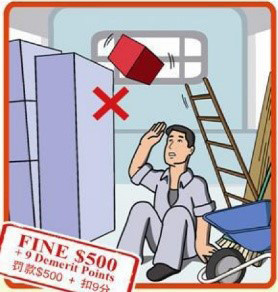
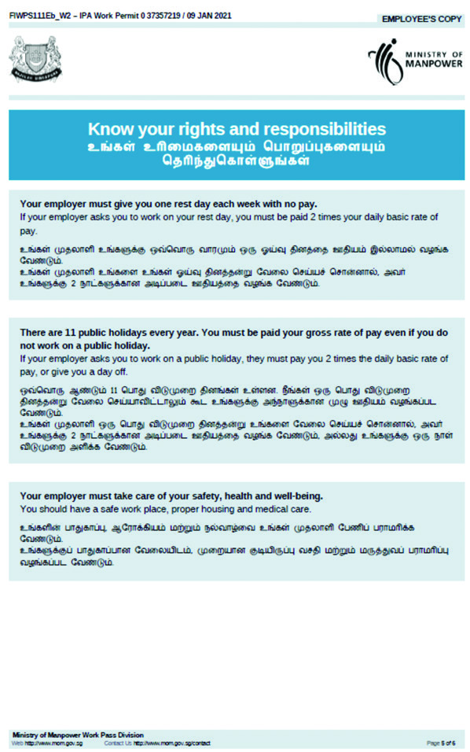

## Page 1

**অিভবাসী কম�ীেদর** জন� িনেদ�িশকা 

**1**

## Page 2

# **সবষ়বস্তু** 

||**পৃষ্গা**|
|---|---|
|**সিঙ্গাপুরে স্গাগতম**|**01**|
|**সিঙ্গাপুরে বিবগাি**|**02**|
|**সিঙ্গাপুরে বিবগাি ও চলগারেেগা**|**06**|
|**সিঙ্গাপুরে কগাজ কেগা**|**08**|
|**চগাকুেী িংক্গান্ত অসিকগােিমূহ**|**12**|
|**চগাকুেী িংক্গান্ত আইনকগানুন**|**20**|
|**আইনগতভগারব একজন সনর়গাগকগােীে বগাি্যবগািকতগািমূহ**|**24**|
|**চগাকসে িংক্গান্ত প্রতগােণগা**|**27**|
|**সনেগাপত্গা**|**27**|
|**মমসিরকল সচসকৎিগাে িন্গান কেগা**|**30**|
|**সিঙ্গাপুরেে আইন**|**34**|
|**আস্** **থিক সবষ়গাসি**|**38**|
|**গুরুত্বপূণথি মেসলরেগান নম্বেিমূহ**|**42**|
|**COVID-19 িম্পসকথিত ত্্য**|**44**|

এই সহজ নির্দেনিকায় থাকা তথ্ান্ মুদ্রণকারে সঠিক নিে। আরও তরথ্র জি্ **www.mom.gov.sg** দ্খুি।

## Page 3

## **সিঙ্গাপুরে স্গাগতম** 

নসঙ্াপুরর স্াগতম! এই নির্দেনিকা দথরক এমিসব তথ্ান্ পারবি যা আপিারক আপিার িতুি কমদেস্থে ও বসবারসর পনররবরির সারথ খাপ খাইরয় নিরত সহায়তা কররব। এটা গুরুত্বপূণে য **দ** আপনি আপিার চাকুরীর অনিকার ও ্ায়্ানয়ত্ব সম্পরকদে জারিি এবং নসঙ্াপুররর আইি দমরি চরেি। 

আপনি যন্ চাকনর সংক্ান্ত দকারিা সমস্ার সম্ুখীি হি তাহরে, নিম্ **ন** েনখত প্রনতষ্ািগুরোর কাি দথরক আপিার অনবেরবে সহায়তা চাওয়া উনচত: 

<!-- Start of picture text -->
সমসনস্রি  অে ম্যগানপগাও়গাে  মগাইররেন্ট ও়গাকথিগােি মিন্টগাে (MOM) (MWC) মেসলরেগান:  6438 5122 মেসলরেগান:  6536 2692 জনশক্তি মন্ত্রণালয়  579 Serangoon Road পরিষেবা কেন্দ্র Singapore 218193 1500 Bendemeer Road Singapore 339946 51 Soon Lee Road Singapore 628088 সহায়তার জি্ আপনি আপিার ডনমদেটনররত  FAST ঠটরমর অনিসারর্র সারথও দযাগারযাগ কররত পাররি। <!-- End of picture text -->

আপিার নসঙ্াপুররর দমাবাইে িবের সম্পরকদে MOM - দক জািারিার জি্ িীরচর নেঙ্ক বা QR দকাডঠট ব্বহার করুি। এঠট আপিার নসঙ্াপুরর অবস্থািকারে MOM- দক আপিার কমদেসংস্থাি সম্পনকদেত নবষরয় আপরডট কররত সক্ষম কররব। 

আপিার দমাবাইে িবেরঠট আমার্র সারথ দিয়ার করুি: **www.mom.gov.sg/update_contact_details** 

**1**

## Page 4

## **সিঙ্গাপুরে বিবগাি** 

**সিঙ্গাপুে িম্পরকথি** 

নসঙ্াপুর নবনভন্ন জানত, িমদে এবং ভাষা নিরয় গঠিত একঠট বহুজানতক ও বহু-সংস্কৃনতর দ্ি। পরস্পররর নভন্নতা দবাঝা ও দসঠটরক সম্াি করা এবং একসারথ নমরেনমরি বসবাস করা ও কাজ করা গুরুত্বপূণদে। 

#### **সিঙ্গাপুরেে িমথিিমূহ** 

নসঙ্াপুরর দবৌদ্ধ, নরিস্টাি, ইসোম, নহন্ু িমদে এবং তাও িরমদের মরতা দবি করয়কঠট িমদে প্রচনেত ররয়রি। অরি্র িমমীয় অিুিীেরির প্রনত সম্াি বজায় দররখ প্ **র** ত্রকই স্ািীিভারব তার্র িমদে পােি কররত পারর। আপনি নিিদোনরত উপাসিােয় দযমি মজন্র, গীজদো এবং মসজজর্ প্রাথদেিা কররত পাররি। 

#### **স্গানী় িগামগাজজক েীসতনীসত** 

নসঙ্াপুরর থাকাকােীি আপিার উনচত স্থািীয় সামাজজক রীনতিীনতর সারথ পনরনচত হওয়া। আপিার দ্রি যা গ্রহণরযাগ্ নসঙ্াপুরর তা গ্রহণরযাগ্ িা-ও হরত পারর। 

#### **আপনগারক প্সনরিথিশ কেরত সনরচ সকছু পেগামশথি মিও়গা হরলগা:** 

**জনিগািগােরণে মগারে ভগাল আচেণ** 

- মারামানর কররবি িা। 

- বাস স্টপ, ব্লরকর িীরচর তোয়, পাবনেক দবঞ্চ, পাকদে বা ওভাররহড নরিরজর মরতা জিসমাগরমর স্থারি ঘুমারবি িা। 

- রারতর দবোয় উচ্চস্রর কথা বেরবি িা বা দজারর গাি বাজারবি িা। 

- পািীয় গ্রহণ করার জি্ হাউজজং ব্লরকর িীরচর তোয় বড় ্ে আকারর নভড় কররবি িা। 

- থুতু বা জঞ্াে দিেরবি িা। 

- উন্মুতি স্থািগুরোরত জামা িাড়া অবস্থায় চোরিরা কররবি িা। 

#### **ব্যজতিগত পসেষ্গাে-পসেচ্ছন্নতগা** 

অসুস্থতা এবং সংক্মরণর ঝুঁনক হ্াস কররত এবং আপিার সামনগ্রক স্ারস **্** থর উন্ **ন** ত ঘটারত নিরজরক পনরষ্ার রাখা গুরুত্বপূণদে। 

- দগাসে করুি এবং আপিার চুে দিৌত করুি 

- ্ াঁত রিাি করুি 

- আপিার কাপড় িুরয় নিি 

- সাবাি ন্রয় নিয়নমতভারব আপিার হাত দিৌত করুি। 

**2**

## Page 5

**হগাত মিগা়গাে 8টে িগাপ** 

**1 2 3 4** আপিার হারতর তােু প্রনতঠট আঙ্ুে ও হারতর দপিরির অংি বকৃদ্ধাঙ্ুনের দগাঁড়া ঘষুি দিৌত করুি আঙ্ুরের মি্বতমী ও আঙ্ুরের মি্বতমী স্থািগুরো দমরজ নিি স্থািগুরো ঘষুি **5 6 7 8** আঙ্ুরের দপিরি আপিার িখগুরো হারতর আপিার কনজি দিৌত শুকরিা দতায়ারে বা তােুরত দমরজ নিি করুি ঠটসু্ ন্রয় হাত শুনকরয় 

**7 8** আপিার কনজি দিৌত শুকরিা দতায়ারে বা করুি ঠটসু্ ন্রয় হাত শুনকরয় নিি 

#### **স্গারস্ে অবস্গা পরথিরবক্ষণ** 

আপিার স্ারস **্** থর অবস্থা পযদেরবক্ষণ করার জি্ নবিামূরে্ **FWMOMCare,** দমাবাইে অ্াপঠট ডাউিরোড করুি। যারা অসুস্থ তারা 24/7 দটনেরমনডনসি পনররষবার মাি্রম দ্রুত নচনকৎসারসবাও পারবি। 

আপিার ডনমদেটনররত প **্** রনিদেত নকউআর দকাডঠট স **্** াি কররত ‘Safe@Home’ িাংিিঠট ব্বহার করুি এবং আপনি প্রনতন্ি কারজর জি্ দবর হওয়ার সময় ও কাজ দথরক নিরর আসার পর আপিার অবস্থাি নররপাটদে করুি। 

আপিার দমাবাইে িবেরঠট হােিাগা্ রাখা নিজচিত কররত ‘My Profile ’ পরখ করুি। 

**3**

## Page 6

**পগাসন বগাঁচগান** 

াঁত রিাি করার সময় ট্াপ দিরড় রাখরবি িা, একঠট মগ ব্বহার করুি। 

দখাো ট্ারপর িীরচ থাোবাসি এবং কাপড় দিারবি িা; একঠট পানি ভরা পাত্র ব্বহার করুি। 

পানি অপচয় কররবি িা। 

দগাসে করার সময় ট্াপ দিরড় রাখরবি িা; দগাসরের সময় 5 নমনিরটর নিরচ রাখুি। 

ব্বহার িা করাকােীি সময় ট্াপ বন্ধ করুি এবং দকারিা নেক হরে জািাি। 

পানির দকারিা নিঠটংরয়র ক্ষনতসািি বা পনরবতদেি কররবি িা। 

#### **আপনগাে সবশ্গারমে সিরন মকগা্গা় রগারবন** 

আপিার অবসর সমরয় নবরিা্ি দকন্দ্রগুনেরত দযরত পাররি।  দসখারি আপিার জি্ নবনভন্ন সুরযাগসুনবিা ও জক্য়াকোরপর ব্বস্থা রাখা আরি। 

#### **সবরনগািন মকন্দ্র** 

নসঙ্াপুরজুরড় আটঠট নবরিা্ি দকন্দ্র ররয়রি। এগুরোরত ব্াডনমন্টি/বারস্টবে দকাটদে, সকার এবং জক্রকট মারির মরতা নবিামূরে্র ক্ীড়া সুনবিা প **্** রাি করা হয়। সুপারমারকদেটগুরোরত নগরয় আপনি অথদে দপ্ **র** ণ কররত পাররি, িানপত দপরত পাররি, মুন্ দ্রব্ান্ নকিরত পাররি, অথবা দসন্টারর খাবার দখরত পাররি। 

**4**

## Page 7

নিরচ নবরিা্ি দকন্দ্রগুনের নববরণ দ্ওয়া হরো: 

#### **সবরনগািন মকন্দ্র** (RC) 

**টিকগানগা** 

**মকগাকরেন RC 100 Sembawang Drive, Singapore 756998 কগাসক বুসকে RC 7 Kaki Bukit Avenue 3, Singapore 415814 ক্গাজজি RC 11 Kranji Road, Singapore 737673 মপনজুরু RC 27 Penjuru Walk, Singapore 608538 িুন সল RC 51 Soon Lee Road, Singapore 628088 মেরুিগান RC 1 Jln Papan, Singapore 619392 তু়গাি িগাউ্ RC 10 Tuas South Street 13, Singapore 636937 উিল্যগান্ড RC 200 Woodlands Industrial Park E7, Singapore 757177** 

#### **সিঙ্গাপুরেে পগানী় মগািক আইন** 

আপনি যন্ অ্ােরকাহে পাি কররি তাহরে আপিারক অবি্ই মা্ক আইি সম্পরকদে জািরত হরব দযখারি বো আরি আপনি দকাথায় এবং দকাি সময় পাি কররত পাররবি এবং দকাথায় অ্ােরকাহে নকিরত পাররবি। 

দগোং এবং নেটে ইজডিয়ার মরতা মা্ক নিয়ন্ত্রণ অঞ্চে ররয়রি দযখারি নভন্ন নবনিনিরষি ররয়রি। আপনি দগোং এবং নেটে ইজডিয়ারত দকবে কনি িরপর মরতা োইরসন্সপ্রাপ্ত আউটরেটগুরোর <u>মরি্ অ্ােরকাহে নকিরত ও পাি কররত পাররবি। এই স্থািগুরোর বাইরর অ্ােরকাহে পাি</u> করা আইিনবরুদ্ধ। 

আপিারক যন্ নিনষদ্ধ সমরয় উন্মুতি স্থারি ম্্ পািরত অবস্থায় পাওয়া যায় তাহরে ব্বস্থা দিওয়া হরব এবং আপিার ওয়াকদে পারনমট বানতে করা হরব। 

মা্ক আইি সম্পনকদেত তরথ্র জি্, ্য়া করর www.mha.gov.sg -এ যাি 

**5**

## Page 8

## **সিঙ্গাপুরে বিবগাি ও চলগারেেগা** 

নসঙ্াপুরর চোরিরা করা সহজ। নবনভন্ন িররির পনরবহিগুরো নিম্নরূপ: 

- বাস 

- ট্ািনসট (MRT) 

- োইট দরে ট্ািনসট (LRT) 

- ট্াজসি 

- ভাড়ায় চানেত ব্জতিগত গানড় 

**EZ- সলংক কগািথি** 

বাস, MRT বা LRT ন্রয় যাতায়াত কররত আপিার একঠট ez- নেংক কারডদের প্ **র** য়াজি হরব যা MRT দস্টিি ও বাস ইন্টাররচঞ্গুরোরত দকিা যায়।  আপিার ez- নেংক কাডদে এরত মূে্ সজঞ্চত কররব। আপনি MRT দস্টিি ও বাস ইন্টাররচঞ্গুরোরত অবনস্থত ঠটনকট দমনিিগুরোর মাি্রম আপিার কাডদে টপ েিষে আপিার ব্ারঙ্কর ATM কারডদের সাহারয্ টপ আপ কররত পাররবি।  সহায়তার জি্ আপনি MRT দস্টিি বা বাস টানমদেিারের তথ্ কাউন্টাররর কমমীর্র সারথ দযাগারযাগ কররত পাররি। 

বাস স্টপ, MRT এবং LRT দস্টিিগুরোরত বাস ও দট্ি রুরটর নবি্ ও ভাড়ার নববরণ প **্** রনিদেত হয়। 

**গণ পসেবহরন ভগাল আচেণ** 

বাস ও দট্রি ভ্রমরণর সময় সহযাত্রীর্র প্রনত সুনবরবচক দহাি। 

- বারস বা দট্রি চড়ার জি্ োইরি ্ানড়রয় অরপক্ষা কররত থাকুি 

- আপিার আসিঠট এমি কাউরক দিরড় ন্ি যার জি্ এঠট দবনি প্ **র** য়াজি, দযমি বয়স্ যাত্রী। 

- ্ াঁড়ারিা অবস্থায় প্ **র** য়াজিমানিক সরর যাি, প্ **র** বিদ্ারঠট আটকারবি িা যারত অি্রা উিরত ও িামরত পারর। 

- আপনি ওিার আরগ অি্র্ররক িামার জায়গা করর ন্ি। 

- আপিার ব্াগঠট িীরচ রাখুি যারত অি্রা চোচরের জি্ আরও জায়গা পায়। 

**6**

## Page 9

#### **িড়ক সনেগাপত্গা** 

নিরাপ্ সাইন্ল ং 

আপনি যন্ সাইরকে চাোি তাহরে নিরাপর্ চাোি। 

- সবদে্া বাইসাইরকরের পরথ চেুি এবং অি্াি্ সাইরকে আররাহী বা পথচারীর্র ন্রক দখয়াে রাখুি। 

- পথচারীর্র ব্াপারর সতকদে দহাি এবং িীরর চাোি। পথচারীর্ররক সতকদে কররত, নবরিষত দিয়ার করা িুটপাথগুনেরত আপিার সাইরকরের দবেঠট ্ূর দথরকই বাজাি। 

- ট্ানিক নিয়ম দমরি চেুি এবং রাস্ার পারির ন্রক থাকুি। রাস্ার মাঝখাি ন্রয় অথবা সামরির ন্ক দথরক আসা যািবাহরির নবপরীরত সাইরকে চাোরবি িা। 

- সাইরকে চাোরিার সময়, অিুরমান্ত পানকদেং দব-দত আপিার বাইসাইরকে পাকদে করুি। রাস্া বা িুটপারথর মাঝখারি আপিার সাইরকেঠট দররখ যারবি িা, কারণ এরত যািবাহি চােক ও পথচারীরা বািাপ্রাপ্ত হরব। 

#### সড়ক নিরাপত্া 

রাস্ায় চোকােীি সমরয় নিরাপ্ থাকা জরুরী। 

- ট্ানিক আইি দমরি চেুি। দবপররায়াভারব রাস্ায় পার হরবি িা। সবদে্া ট্ানিক োইট দ্রখ রাস্া পার দহাি। 

- ট্ানিক োইট সবুজ হরে রাস্া পার দহাি। 

- রাস্ার অপর পারি নিরাপর্ যাওয়ার জি্ পথচারী ক্নসং, ওভাররহড নরিজ বা আডিারপাস ব্বহার করুি। 

- গানড় চাোরিার সময়, পথচারীর্ররক দযরত ন্ি এবং 

- রাস্ার মুরখ, দমারড় বা পথচারী ক্নসংরয়র কারি যাওয়ার সময় গনত কমাি। 

#### েনররত ভ্রমরণর সময় 

আপিার নিরয়াগকতদো আপিার ডররমটনর দথরক আপিার কারজর জায়গায় যাতায়ারতর জি্ পনরবহি সরবরাহ কররত পারর। তরব, আপিারক দকারিা নবপজ্জিক পনরনস্থনতরত দযমি একঠট জিাকীণদে েনররত ওিারিা হয়, তাহরে ্ য়া করর আপিার নিরয়াগকতদোরক জািাি। আপিার সুরক্ষা গুরুত্বপূণদে। আপিার নিরয়াগকতদো যন্ আপিারক সহায়তা কররত রাজজ িা হি তাহরে **1800-2255-582** িবেরর দিাি করর ে্াডি ট্ান্সরপাটদে অথনরঠট **(LTA)-** দক জািাি। 

**7**

## Page 10

## **সিঙ্গাপুরে কগাজ কেগা** 

নসঙ্াপুরর কাজ কররত, আপিার অবি্ই একঠট ববি ওয়াকদে পারনমট থাকরত হরব এবং ওয়াকদে পারনমরটর িতদোবেী দমরি চেরত হরব। 

**নীসতগত অনুরমগািরনে (IPA) সচটি** 

আপিার নিজ দ্ি দিরড় আসার আরগ, আপিার নিরয়াগকতদো বা নিজ দ্রির এরজরন্টর কাি দথরক আপিার স্থািীয় ভাষায় একঠট িীনতগত অিুরমা্রির (IPA) নচঠি (5 পকৃষ্ার ) পারবি। IPA নচঠিঠট MOM কতকৃদেক জানরককৃত এবং এরত নসঙ্াপুরর আপিার কমদেসংস্থাি সম্পনকদেত তথ্ থাকরব। আপিার নিরয়াগকতদোরক আপিার IPA নচঠিরত বনণদেত িতদেগুনে পূরণ কররত হরব এবং নতনি আপিার অিুমনত ব্তীত িতদেগুনে পনরবতদেি কররত পাররবি িা। আপিার IPA- দত নিরচর নবষয়গুরো টুরক রাখুি। 

**1** আপিার িাম ও ওয়াকদে পানমদেট িবের 

**8**

## Page 11

<!-- Start of picture text -->
2 আপিার নিরয়াগকতদোর িাম 3 আপিার দপিা 4 আপিার নসঙ্াপুররর এমপ্লয়রমন্ট এরজজন্স  (EA)  এবং আপিার নসঙ্াপুর EA- দক প্ র য় এরজজন্স নি 5 ওয়াকদে পানমদেরটর সময়কাে 6 আপিার মানসক মূে দবতি, মানসক নিিদোনরত দবতি, মানসক নিিদোনরত ভাতা এবং মানসক কতদেি 7 আবাসরির নবিাি <!-- End of picture text -->

<!-- Start of picture text -->
8 আপিার  IPA- দত উনলিনখত দপিায় শুিুমাত্র কাজ কররত পাররবি <!-- End of picture text -->

**9**

## Page 12

<!-- Start of picture text -->
9 নসঙ্াপুরর থাকাকােীি আপিারক অবি্ই ওয়াকদে পানমদেরটর িতদোবেী দমরি চেরত হরব <!-- End of picture text -->

<!-- Start of picture text -->
10 আপিার প্রাপ্ নবশ্ারমর ন্ি <!-- End of picture text -->

আপিার IPA নচঠিরত প **্** রনিদেত দবতি পাওয়ার কথা। যন্ আপিার নিরয়াগকারী আপিার নেনখত অিুমনত িাড়া আপিার দবতি কনমরয় দ্য় তাহরে সাহারয্র জি্ MOM এর সারথ দযাগারযাগ করুি। 

নসঙ্াপুরর আপিার চাকনরর সমগ্র সময়কারে আপিার IPA নচঠির একঠট কনপ আপিার সারথ রাখা উনচত। 

<!-- Start of picture text -->
11 আপিার নিরয়াগকতদোরক  14 ন্রির মরি্ দয িাপগুরো অবি্ই সম্পন্ন কররত হরব <!-- End of picture text -->

**10**

## Page 13

#### **ও়গাকথি পগােসমে** 

আপিারক সবসময় আপিার ওয়াকদে পারনমটঠট কাডদেঠট সারথ রাখরত হরব। আপনি যন্ নিরজর ওয়াকদে পারনমট কাডদে িা দপরয় থারকি তাহরে আপিার IPA নচঠিঠট আপিার কারি রাখুি। 

আপিারক সবসময় আপিার ওয়াকদে পারনমটঠট কাডদেঠট সারথ রাখরত হরব। আপনি যন্ নিরজর 

MOM বা দকারিা পাবনেক এরজজন্স দ্ারা পনর্িদেিকারে আপিারক আপিার ওয়াকদে পারনমটঠট দ্খারত হরব। 

#### **পগািরপগােথি** 

আপিার পাসরপাটদে আপিার ব্জতিগত সম্পরতি আপিার নিরয়ারগর িতদে নহসারব আপিার নিরয়াগকতদো দকারিাভারবই এঠট তার কারি দররখ ন্রত পাররবি িা। আপিার নিরয়াগকতদো যন্ আপিার পক্ষ দথরক আপিার পাসরপাটদে রারখি তাহরে আপনি অিুররাি জািারিার সারথসারথ তা অবি্ই আপিারক নিনররয় ন্রত হরব। 

<!-- Start of picture text -->
PASSPORT PASSPORT <!-- End of picture text -->

#### **িহগা়তগা সনন** 

যন্ আপিার নিরয়াগকতদো আপিার অিুমনত ব্তীত আপিার দবতি হ্াস কররি, আপিার অিুররাি সষ্বেও আপিার পাসরপাটদে বা ওয়াকদে পারনমট আপিার কারি দিরত িা দ্ি, তাহরে যত দ্রুত সম্ভব **6438 5122** িবেরর কে করর **MOM-** দক জািাি, অথবা, 1500 Bendemeer Road, Singapore 339946- এ অবনস্থত MOM পনররষবা দকরন্দ্র যাি। 

**11**

## Page 14

## **চগাকুেী িংক্গান্ত অসিকগােিমূহ** 

**সিঙ্গাপুরে বিবগাি ও কগাজ কেগা** 

আপিার নিরয়াগকতদো আপিারক নেনখতভারব চাকনরর একগুচ্ছ মূে িতদোন্ (KET) প **্** রাি কররবি। KET-গুরোরত অবি্ই আপিার সম্ত হওয়া চাকনরর িতদোন্ এবং িতদোন্ সম্পনকদেত তথ্ থাকরত হরব: 

- দবতি, দবতি প **্** রারির তানরখ এবং ওভারটাইম দবতি প্রানপ্তর অনিকার ● কারজর বরন্াবস্ দযমি কারজর সময় এবং নবশ্ারমর ন্ি 

- দবতি সহ িুঠটর অনিকার (বানষদেক িুঠট, অসুস্থতাজনিত িুঠট এবং সরকারী িুঠটর ন্ি সহ) এবং নচনকত্সা সুনবিান্ 

নিম্ **ন** েনখত দক্ষত্রগুনেরত আপিার যন্ দকারিা উরদ্গ থারক তাহরে ্য়া করর **MOM** বা নববা্ রনষ্পরতি জত্রপক্ষীয় দজাট **(TADM)-** দক যত তাড়াতানড় সম্ভব জািাি। **TADM MOM** সানভদেরসস দসন্টারর অবনস্থত। 

#### **(a) মবতন পসেরশগাি/ওভগােেগাইম মবতন** 

- **1** নসঙ্াপুরর আপিারক একঠট ব্জতিগত ব্াংক অ্াকাউন্ট খুেরত হরব এবং আপিার নিরয়াগকতদোরক আপিার দবতি ব্াংক অ্াকাউরন্ট জমা করর দ্ওয়ার জি্ অিুররাি জািারত হরব। এঠট আপিার নিরয়াগকতদোর সারথ আপিার দযরকারিা অথদে পনররিাি সংক্ান্ত নবররািরক হ্াস কররব। আপিার অিুররাি সারপরক্ষ আপিার নিরয়াগকতদো আপিার ব্াংক অ্াকাউরন্ট সরাসনর স্থািান্তররর মাি্রম আপিার দবতি প **্** রাি কররবি। 

- **2** আপিার নিরয়াগ্াতা মারস কমপরক্ষ একবার আপিারক দবতি ন্রবি এবং তা দবতরির সময়কাে দিষ হওয়ার 7 ন্রির মরি্। আপিার এবং আপিার নিরয়াগকতদোর মরি্ সম্ত হওয়া দযরকারিা দবতি সময়কাে এক মারসর দবনি হওয়া চেরব িা। 

- **3** মাসজুরড় আপনি যন্ ওভারটাইম করর থারকি তাহরে আপিার নিরয়াগকতদোরক মারস কমপরক্ষ একবার দযরকারিা ওভারটাইরমর জি্ দবতি ন্রত হরব এবং তা দবতরির সময়কাে দিষ হওয়ার 14 ন্রির মরি্। 

**12**

## Page 15

<!-- Start of picture text -->
4 <!-- End of picture text -->

আপিার নিরয়াগকতদো আপিার নেনখত সম্নত ব্নতরররক আপিার IPA নচঠিরত বনণদেত পনরমাণ দথরক আপিার মূে দবতি, নিিদোনরত ভাতা হ্াস কররত অথবা বনণদেত কতদেি বকৃজদ্ধ কররত পাররবি িা। 

- **5** দকবেমাত্র আপিার সম্নত সারপরক্ষ এবং আপিার নিরয়াগকতদো কতকৃদেক নিরচর কাজগুনে করা সারপরক্ষ আপিার দবতি পনরবতদেি করা দযরত পারর: <u>নেনখতভারব আপিার সম্নত গ্রহণ</u> 

MOM দক অবনহত করি 

- সমনবিত দবতিসহ আপিারক আইরটমাইজড দবতি নলিপ প **্** রাি করা 

**6** 

আপিার নিরয়াগকতদোরক অবি্ই আপিার দবতি নলিপ প্রনতমারস কমপরক্ষ একবার এবং দবতি প **্** রারির পরর 3 কাযদেন্বরসর মরি্ ন্রত হরব। দবতি নলিরপ অবি্ই দবতি(সমূহ) পনররিাি নবস্ানরত নববরণ, দযমি মূে দবতি, ভাতা, কতদেি, সম্পান্ত ওভারটাইম ঘন্টা এবং ওভারটাইম দবতি অন্তভুদেতি থাকরত হরব। 

- আপিারক আইরটম অিুযায়ী দবতি নলিপ এবং টাইম নিরটর দরকডদে রাখরত হরব। 

###### **7** 

- এমি দকারিা িাঁকা িনথ বা ্ নেরে স্াক্ষর কররবি িা যা আপনি দবারঝি নি বা দযঠটরত সম্নত প **্** রাি কররিনি। আপিার নিরয়াগকতদো যন্ আপিারক দকারিা িাঁকা ্ নেে, দযমি দপরমন্ট ভাউচার বা দপ-নলিরপ স্াক্ষর কররত বরেি, তাহরে আপিার উনচত MOM- এর সারথ দযাগারযাগ করা। সািারণভারব, দযসব কমদেচারী যথািীঘ্র দযাগারযাগ কররি িা তার্র ্ানবগুরো ববি বরে প্রমাণ কররত অসুনবিা হরত পারর। 

**13**

## Page 16

#### **(b) মবতন কতথিন** 

- আপিার নিরয়াগকারী আপিার দবতি দথরক কতদেি কররত পাররবি িা। তারা দকবে তখিই তা কররত পাররবি যন্: 

আপনি আপিার নিরয়াগকতদোর সম্নত ব্তীত কাজ দথরক অিুপনস্থত দথরক থারকি 

আপিার নিরয়াগকতদো আপিার অিুররািককৃত খাবাররর জি্ অথদে প **্** রাি করর থারকি 

আপিার নিরয়াগকতদো আপনি কতকৃদেক গকৃহীত আবাসি/থাকার ব্বস্থা, সুরযাগসুনবিা এবং পনররষবার জি্ অথদে প **্** রাি করর থারকি 

আপিার হারত অনপদেত আপনি কতদেরির জি্ নেনখত জজনিস বা অথদে হানররয় নগরয় সম্নত প **্** রাি করররিি (কতদেি থারক বা ক্ষনতগ্রস্ হরয় থারক করার আরগ আপনি দযরকারিা (শুিুমাত্র এককােীি কতদেি সময় আপিার সম্নত বানতে প্ **র** যাজ্) করার অনিকার রারখি) 

- যন্ দবতি কতদেি করা হয়, আপিার নিরয়াগকতদো দকারিা একক দবতি সময়কারে আপিার দমাট দবতরির 50% এর দবনি কতদেি কররত পাররবি িা। এর মরি্ নিরচর নবষয়গুরোর জি্ করা কতদেিগুরো অন্তভুদেতি িয়: 

- আপিার কারজ অিুপনস্থনত 

- আপিার দবতরির অনগ্রম, ঋণ অথবা অনতনরতি পনররিাি আ্ায় করা 

- আপিার নেনখত সম্নত প **্** রত্ দকারিা সমবায় সনমনতরক অথদে প **্** রাি করা 

**14**

## Page 17

#### **(c) কমথিঘণ্গা ও ওভগােেগাইম** 

- আপিার চুজতিবদ্ধ কমদেঘণ্া ব্নিক 8 ঘণ্া বা সপ্তারহ 44 ঘণ্ার দবনি হরত পাররব িা, যন্ িা আপনি নিিরট কাজ করর থারকি। নবশ্াম, চা ও খাবার জি্ অিুরমান্ত নবরনত কমদেঘণ্ার মরি্ অন্তভুদেতি দিই। আপিার চুজতিবদ্ধ কমদেঘণ্ার অনতনরতি সকে কাজই ওভারটাইম কাজ নহরসরব নবরবচিা করা হরব। ওভারটাইরমর জি্ আপনি আপিার ঘণ্াপ্রনত মূে দবতরির কমপরক্ষ 1.5 গুণ দবতি ্ানব কররত পাররবি। ● আপনি যন্ নিিরট কাজ সম্পা্ি করর থারকি তাহরে দসই সম্নতযুতি কারজর সময় 3 সপ্তাহজুরড় প্রনত সপ্তারহ গরড় 44 ঘন্টার দবনি হরত পাররব িা। প্রনতন্রির সরবদোচ্চ কাযদেন্বস 12 ঘন্টা, এবং প্রনত মারস সবদোনিক ওভারটাইম 72 ঘন্টা হরব। ● আপিার নিরয়াগকতদোরক অবি্ই ওভারটাইম করা কারজর সমরয়র নহসাব রাখরত হরব। আপিারক আপিার নিরয়াগকতদোর দরকডদেঠট যাচাই করা উনচত এবং দকবেমাত্র সঠিক হরেই তারত স্াক্ষর করা উনচত। আপনি যন্ দরকডদেঠটর সারথ একমত িা হি, তাহরে আপিার নিরয়াগকতদোর কাি দথরক যথািীঘ্র সম্ভব তা স্পষ্ট দজরি নিরবি এবং তারত স্াক্ষর কররবি িা। **আপনগাে ওভগােেগাইম মবতন সহরিব কেগাে িগাপিমূহ:** 

- **িগাপ** 1 আপিার ঘণ্াপ্রনত প্ **র** য় মূে দবতি নহরসব করুি: 

- **12 x মগাসিক মূল মবতন = ঘণ্গাপ্রসত প্রি় মূল মবতন** 

- **52 x 44** 

- **িগাপ** 2 আপিার ওভারটাইরমর ঘণ্াপ্রনত প্ **র** য় দবতি নহরসব করুি: 

- **[ ঘণ্গাপ্রসত প্রি় মূল মবতন ] x [1.5] = আপনগাে ওভগােেগাইরমে ঘণ্গাপ্রসত হগাে িগাপ** 3 আপিার ওভারটাইম দবতি নহরসব করুি: 

- **[ ওভগােেগাইরমে ঘণ্গাপ্রসত প্রি় মূল মবতন ] x [ রত ঘণ্গা ওভগােেগাইম কেগা হর়রছ ] = ওভগােেগাইরমে জন্য** 

**15**

## Page 18

#### **(d) অিুস্তগাজসনত ছুটে** 

● বনহনবদেভারগর দরাগী নহরসরব অসুস্থতাজনিত িুঠট এবং হাসপাতারে ভনতদের জি্ িুঠট পাওয়ার জি্ আপিার অনিকার ররয়রি, যন্ আপনি আপিার নিরয়াগ্াতার জি্ কমপরক্ষ 3 মাস কাজ করর থারকি। আপিার অনিকারর প্রাপ্ অসুস্থতাজনিত িুঠটর ন্িগুনের সংখ্া আপিার চাকনরর বয়রসর উপর নিভদেরিীে, দযমি: **আজ পরথিন্ত মমগাে বসহসবথিভগারগে মেগাগী সহরিরব হগািপগাতগারল ভসতথি মেগাগী সহরিরব রত মগাি চগাকুেী িরবতন অিুস্তগাজসনত িরবতন অিুস্তগাজসনত ছুটে কেগা হর়রছ ছুটে (কগারথিসবি) (কগারথিসবি)** 5 15 **3 মগাি 4 মগাি** 8 30 **5 মগাি** 11 45 **6 মগাি** 14 60 **এবং তগাে মবসশ** 

- অসুস্থতাজনিত িুঠটর দযাগ্ হওয়ার জি্ আপিারক অবি্ই আপিার অিুপনস্থনতর 48 ঘন্টার মরি্ আপিার নিরয়াগকতদোরক অবনহত কররত হরব। 

- আপিার নিরয়াগকতদোরক অবি্ই আপিার স্াভানবক কাযদেন্বরস গকৃহীত অসুস্থতাজনিত িুঠটর সময়কারের জি্ আপিারক দবতি প **্** রাি কররত হরব, যন্ আপনি: - দমনডরকে দরজজর্রে িি আইরির অিীরি নিবনন্ধত দকারিা ডাতিার নিকট দথরক অসুস্থতাজনিত িুঠটর সময়কারের জি্ একঠট দমনডরকে সাঠটদেনিরকট প **্** রাি কররি এবং - দসই বিররর জি্ আপিার অসুস্থতাজনিত িুঠট দভারগর পনরমাণ িানড়রয় িা যায়। 

#### **(e) সবশ্গারমে সিন এবং িেকগাসে ছুটেে সিনিমূহ** 

- প্রনত সপ্তারহ আপনি নবশ্ারমর জি্ একন্ি সময় পারবি, দকারিা দবতি িাড়া। 

- ব্নতক্মী পনরনস্থনতর উদ্ভব িা হরে নবশ্ারমর ন্রি আপিার নিরয়াগকারী আপিারক কাজ করার জি্ দজার কররত পাররবি িা, এবং দসসব ন্রি কাজ করারত চাইরে তার্ররক অবি্ই আপিার সম্নত গ্রহণ কররত হরব। 

**16**

## Page 19

#### **সবশ্গারমে সিরন কগারজে জন্য মবতন সনম্নসলসিতভগারব গণনগা কেগা হ়** 

#### **:** 

|**কগাজ হর় মগরল**|**আপনগাে প্রসতসিরনে** **স্গাভগাসবক কমথিঘণ্গাে** **অরিথিক িম় পরথিন্ত**|**আপসন রসি দিসনক** **চুজতিবদ্ধ কমথিঘণ্গাে** **অরিথিরকে মবসশ** **কগাজ করেন**|**আপনগাে প্রসতসিরনে** **কমথিঘণ্গাে িমর়ে** **মবসশ**|
|---|---|---|---|
|নিরয়াগকতদোর অিুররারি|1ন্রির দবতি|2ন্রির দবতি|2ন্রির দবতি + ওভারটাইম দবতি|
|কমদেচারীর অিুররারি|অিদে ন্রির দবতি|1ন্রির দবতি|1ন্রির দবতি + ওভারটাইম দবতি|

- আপনি 11 ন্রির সরবতি সরকানর িুঠটর ন্ি পাওয়ার অনিকারী হরবি। - আপিার নিরয়াগকতদোরক অবি্ই আপিার সরকারী িুঠটর ন্রির জি্ আপিার দমাট দবতি প **্** রাি কররত হরব, এমিনক যন্ আপনি সরকারী িুঠটর ন্রি কাজ িা-ও কররি। 

- আপনি যন্ সরকারী িুঠটর ন্রি কাজ কররি তাহরে আপিার নিরয়াগকতদোরক অবি্ই ব্নিক কারজর অনতনরতি নহরসরব ব্নিক মূে দবতি প **্** রাি কররত হরব, বা তার পনরবরতদে আপিারক একন্ি িুঠট প **্** রাি কররত হরব, অথবা সময় অবকাি ন্রত হরব (দকবেমাত্র $2,600 ডোররর দবনি আয়কারী িি-ওয়াকদেম্াির্র দক্ষরত্র) 

#### **(f) বগাৎিসেক ছুটে** 

- যন্ আপনি কমপরক্ষ 3 মাস িরর আপিার নিরয়াগকতদোর জি্ কাজ কররি, তাহরে আপনি দবতি সহ বানষদেক িুঠট দভারগর অনিকারী হরবি। 

- আপিার বানষদেক িুঠটর অনিকার িীরচ দ্খারিা অিুসারর নিরয়াগকতদোর কারি আপিার চাকনরর বয়রসর উপর নিভদের করর। 

|**চগাকসেে সনেবজচ্ছন্ন িম়কগাল**|**প্রসত বছে ছুটেে সিন**|
|---|---|
|১ম|7|
|২য়|8|
|৩য়|9|
|৪থদে|10|
|৫ম|11|
|৬ষ্|12|
|৭ম|13|
|৮ম এবং তারপরর|14|

- আপনি যন্ নিরবজচ্ছন্নভারব 12 মাস পযদেন্ত চাকনর িা করর থারকি, তাহরে আপিার বানষদেক িুঠটর অনিকার দসই বিররর জি্ চাকনরর মারসর সম্পূণদে সংখ্ার হাররর রিরতিষে হরব। 

**17**

## Page 20

**মবতরনে িগাসব ও চগাকসেে মবসনসেে** নিরয়াগকতদোর নবরুরদ্ধ আপিার যন্ দকারিা দবতি এবং/অথবা চাকনর সংক্ান্ত নবররাি থারক তাহরে আপিারক যত শীঘ্ সম্ভব MOM বা TADM- এর সারথ দযাগারযাগ কররত হরব। যত িীঘ্র অগ্রসর হরবি, আপিার পাওিা দবতি পুররাপুনর আ্ারয়র সম্ভাবিা ততই দবনি হরব এবং আপিারক িতুি নিরয়াগকারীর সন্ধারির জি্ সময় দ্ওয়া হরব। প্ **র** য়াজরি আপনি খা্্ এবং আবাসরির ব্াপারর সহায়তা পারবি। 

#### **গুরুত্বপূণথি েীকগা** 

আপিার নিরয়াগকারীর কারি যন্ আপিার দবতি বা অি্ দযরকারিা বরকয়া পাওিা থারক তাহরে নতনি দজারপূবদেক আপিারক নিজ দ্রি দিরত পািারত পাররবি িা। 

যন্ আপিার দবতি বা ্ানব অপনররিানিত থারক, এবং আপিারক যন্ এমিভারব নবমািবন্রর পাঠিরয় দ্ওয়া হয় দযখারি দবর হরয় আসার উপায় থারক িা, তাহরে আপিারক নবমািবন্র কতকৃদেপরক্ষর সারথ দযাগারযাগ কররত হরব। সহায়তার জি্ আপিারক MOM- এর নিকট পািারিা হরব। 

#### **আপনগাে সিঙ্গাপুেস্ কমথিিংস্গান এরজজসি** 

#### **কমথিিংস্গান এরজজসি সে ক্যগাপ বগা িীমগা** 

নসঙ্াপুর এমপ্লয়রমন্ট এজজন্সরক আপিার ওয়াকদে পারনমরটর দময়া্ বা চাকনরর চুজতির সময়কারের ব্াপারর প্রনত বিররর জি্ আপিার নিিদোনরত মানসক দবতরির 1 মারসর দচরয় দবনি পনরমারণ ন্রত হরব িা। এরজজন্স নি 2 মারসর দবতরি সীমাবদ্ধ। এমপ্লয়রমন্ট এরজজন্স আপিারক প্ **র** য় পনররষবান্ এবং সংগকৃহীত নি’র পনরমাণ উরলিখপূবদেক দযরকারিা নি প **্** রারির জি্ আইরটমযুতি রনি্ প **্** রাি কররব। 

**সনিথিগাসেত মগাসিক মবতন** =  মূে মানসক দবতি + নিিদোনরত মানসক ভাতা 

**18**

## Page 21

### **উিগাহেণ** 

### 1 

ওয়াকদে 

যন্ আপিার ওয়াকদে পানরমট ও চাকনরর চুজতি 2 বিররর জি্ ববি হয় তরব নসঙ্াপুর এমপ্লয়রমন্ট এরজজন্সরক প্ **র** য় সবদোনিক এরজজন্স নি হরব আপিার নিিদোনরত মানসক দবতরির **2 মগারিে** সমপনরমাণ। 

### **উিগাহেণ** 

### 2 

যন্ আপিার ওয়াকদে পারনমট 2 বিররর জি্ ববি হয় রেন্তু আপিার চাকনরর চুজতিঠট দকবে এক বিররর জি্ ববি হয়, তাহরে নসঙ্াপুর এমপ্লয়রমন্ট এরজজন্সরক প্ **র** য় সবদোনিক এরজজন্স নি হরব আপিার নিিদোনরত মানসক দবতরির **1 মগারিে** সমপনরমাণ। 

### **উিগাহেণ** 

### 3 

যন্ আপিার ওয়াকদে পারনমট এবং চাকনরর চুজতি 2 বিরররও দবনি সমরয়র জি্ ববি হয় তরব নসঙ্াপুর এমপ্লয়রমন্ট এরজজন্সরক প্ **র** য় সবদোনিক এরজজন্স নি হরব আপিার নিিদোনরত মানসক দবতরির **2 মগারিে** সমপনরমাণ। 

যন্ আপিার নসঙ্াপুর এমপ্লয়রমন্ট এরজজন্স নি সীমার দচরয় দবনি সংগকৃহীত হয়, বা প্ **র** য় নি’র জি্ আইরটমযুতি রনি্ িা দ্ওয়া হয় বা আপিার চাকনরর পূণদে সময়কারের আরগই অবসাি ঘটারিার সময় আপিারক দিরত ন্রত ব্থদে হয়, তাহরে ্য়া করর অনবেরবে **6438 5122** িবেরর কে করর **MOM-** দক জািাি অথবা 1500 Bendemeer Road, Singapore 339946 ঠিকািায় MOM পনররষবা দকরন্দ্র যাি। 

#### **সে মেেত প্রিগান** 

যন্ আপিার নিরয়াগকারী 6 মারসর মরি্ই আপিার চুজতিঠট বানতে করর, তাহরে আপিারক নসঙ্াপুর এমপ্লয়রমন্ট এরজজন্সরক আপিার প **্** রত্ নিরয়র কমপরক্ষ 50% অবি্ই দিরত প **্** রাি করা হরব। তরব, যন্ আপনি নিরজর নসদ্ধারন্তর চাকনররত ইস্িা দ্ি, তাহরে আপনি দকারিা অথে িরত পারবি িা। **দ** 

উপষিি নবষয়গুরো শুিুমাত্র নসঙ্াপুরর পনরচানেত এমপ্লয়রমন্ট এরজজন্সগুরোর জি্ প্ **র** যাজ্। MOM আপিার নিরজর দ্রি আপিার কমদেসংস্থাি সংস্থার সারথ দকারিা নবররারির দক্ষরত্র বা আপিার দ্রি কমদেসংস্থাি সংস্থাগুনেরক প **্** রত্ নি পুিরুদ্ধার করার দক্ষরত্র সহায়তা কররত সক্ষম হরব িা। 

**19**

## Page 22

## **চগাকুেী িংক্গান্ত আইনকগানুন** 

ওয়াকদে পারনমট দহাল্ার নহরসরব আপিারক সবসময় আপিার ওয়াকদে পারনমরটর িতদোবেী পােি কররত হরব। দয দকারিা ওয়াকদে পারনমরটর িতদে েঙ্ঘি করা একঠট অপরাি এবং এর িরে নিরচর িাজস্গুরো দভাগ কররত হরব: 

আপিারক জনরমািা করা আপিার ওয়াকদে পারনমট হরব বা দজরে পািারিা হরব। বানতে হরয় যারব। 

ভনবষ্রত আপিারক আর নসঙ্াপুরর কাজ কররত দ্ওয়া হরব িা। 

#### **(1) ও়গাকথি পগােসমরেে দবিতগা রগাচগাই** 

আপিার নিরয়াগকতদো যন্ আপিার ওয়াকদে পারনমরটর দময়া্ দিষ হওয়ার আরগই তা বানতে করর দ্ি, তাহরে আপিারক নসঙ্াপুরর কাজ চানেরয় যাওয়ার অিুমনত দ্ওয়া হরব িা। আপনি _SGWorkPass_ অ্াপঠট ডাউিরোড করর অথবা MOM ওরয়বসাইরট েগ ইি করর আপিার ওয়াকদে পারনমরটর ববিতা যাচাই কররত পাররি। 

#### **a)   SGWorkPass** 

আপিার ওয়াকদে পাস ববি নকিা তা যাচাই করার জি্ একঠট নবিামূরে্র দমাবাইে অ্ানপ্লরকিি 

তাত্ক্ষনণকভারব ববিতা যাচাই কররত আপিার ওয়াকদে পারনমট কারডদের নকউআর দকাডঠট স **্** াি কররত _SGWorkPass_ অ্াপঠট ডাউিরোড করুি। যন্ আপিার ওয়াকদে পারনমট কারডদে নকউআর দকাড িা থারক তরব আপনি নিরজর কারডদের সামরির অংরি মুনদ্রত অিি্ কাডদে নসনরয়াে িবেরঠট ব্বহার কররত পাররি। 

**20**

## Page 23

#### **b)   MOM ওর়বিগাইে** 

আপনি এখাি দথরক MOM ওরয়বসাইরট www.mom.gov.sg/check-wp -এ েগ ইি কররত পাররি এবং িীরচর িাপগুরো অিুসরণ কররত পাররি। 

- 1) নিবদোচি করুি: জজজ্াসা। 

- 2) নিবদোচি করুি: ওয়াকদে পারনমট ববিতা /আরব্রির নস্থনত । 3) আপিার ওয়াকদে পাস িবের এবং আপিার িাম নেখুি, তারপর ন্ল ক করুি। 

#### **(2) চগাকসে** 

- আপিারক অবি্ই দকবেমাত্র দপিা এবং আপিার ওয়াকদে পারনমট কারডদে উনলিনখত নিরয়াগকারীর জি্ কাজ কররত হরব। 

- আপিার নিরয়াগকতদো অিুমনত ন্রেও আপিার পরক্ষ অি্ দপিায় কাজ করার অিুমনত দিই। 

- অনতনরতি অথদে উপাজদেরির জি্ আপনি অি্ দকারিা ব্বসায় অংি নিরত বা আপিার নিরজর ব্বসা শুরু কররত পাররবি িা। 

- আপিারক অবি্ই আপিার আসে ওয়াকদে পারনমট কাডদেঠট সবদে্া সারথ রাখরত হরব এবং দকারিা সরকারী কমদেকতদোর দ্ারা এঠট পনর্িদেরির জি্ চাওয়ামাত্র উপস্থাপি কররত হরব। 

**21**

## Page 24

আপিারক যন্ নভন্ন দকারিা কাজ বা নভন্ন দকারিা নিরয়াগ্াতার জি্ কাজ কররত বো হয় তাহরে **6438 5122** িবেরর কে করর অনবেরবে **MOM-** দক নবষয়ঠট জািাি, অথবা 1500 Bendemeer Road, Singapore 339946 ঠিকািায় MOM পনররষবা দকরন্দ্র দযাগারযাগ করুি। 

#### **(3) আচেণ** 

- নসঙ্াপুররর দকারিা িাগনরক বা স্থায়ী বানসন্ারক (নসঙ্াপুরর অথবা নসঙ্াপুররর বাইরর) নবরয় কররত আপিার পরক্ষ করট্াোর অব ওয়াকদে পারসস-এর অিুরমা্ি প্ **র** য়াজি হরব। আপিার ওয়াকদে পারনমট অকাযদেকর হওয়ার পরর এঠট প্ **র** যাজ্ হরব। 

- আপনি নসঙ্াপুররর দকারিা িাগনরক বা স্থায়ী বানসন্ার সারথ নববাহ বন্ধরি আবদ্ধ িা হরয় এবং করট্াোর অব ওয়াকদে পারসস-এর অিুরমা্ি িা নিরয় গভদেিারণ বা সন্তাি জন **্** মাি কররত পাররবি িা। দকবেমাত্র ওয়াকদে পারনমট অকাযদেকর হওয়ার পররই এঠট প্ **র** যাজ্ হরব। 

- **4) লগাইরিসিসবহীন কমথিিংস্গান এরজন্ট হও়গা ম্রক সবেত ্গাকুন।** 

- MOM- এর োইরসন্স ব্তীত দযরকারিা িররির কমদেসংস্থাি সংস্থার কাযদেক্ম পনরচােিা করা অববি, দযমি: 

- (i) পনরবাররর স্স্ বা বন্মুষেি কাি দথরক তার্র চাকুরীর সন্ধারি সহায়তা করার উরদেরি্ 

   - অথদে বা সুরযাগ-সুনবিা োভ করা, 

- (ii) দকারিা চাকুরীর আরব্িকারীর কাি দথরক চাকুরীর সন্ধারি সহায়তা করার উরদেরি্ দযরকারিা ব্জতিগত কাগজপত্র বা জীবিবকৃত্ান্ত/ CV সংগ্রহ করা, 

- (iii) দকারিা নিরয়াগকারী বা চাকুরীর আরব্িকারীর পক্ষ দথরক ওয়াকদে পারির আরব্িপত্র জমা দ্ওয়া, এবং/অথবা 

- (iv) দকারিা চাকুরীর সন্ধািকারীর সারথ দকারিা নিরয়াগকারীর পনরচয় কনররয় দ্ওয়ায় সহায়তা করা। 

এই অপরািগুরোর দযরকারিাঠটর িাজস্ হরো সরবদোচ্চ $80,000 জনরমািা এবং/অথবা সরবদোচ্চ ্ু ই বিররর দজে। আপিার ওয়াকদে পারনমট বানতে করা হরব, আপিারক দ্রি পািারিা হরব এবং আপিারক নসঙ্াপুরর কাজ কররত দ্ওয়া হরব িা। 

**22**

## Page 25

- **5) লগাইরিসিসবহীন কমথিিংস্গান এরজন্ট বগা িংস্গা ম্রক িূরে ্গাকুন।** 

- দকারিা োইরসন্সনবহীি কমদেসংস্থাি এরজরন্টর পনররষবার সারথ সম্পকৃতি হওয়া দবআইনি। 

- আপনি যন্ দকারিা োইরসন্সনবহীি কমদেসংস্থাি এরজরন্টর সারথ সম্পকৃতি হি, তরব আপনি দকারিা কাজ িা-ও দপরত পাররি এবং আপিার পনররিানিত এরজন্সী নি হারারত পাররি। প্রনতবার দকারিা োইরসন্সনবহীি কমদেসংস্থাি এরজরন্টর সারথ সম্পকৃতি হওয়ার জি্ আপিারক $5,000 পযদেন্ত জনরমািা করা হরব। 

- **আপনগাে কমথিিংস্গান এরজন্ট বগা এরজসিী** MOM **লগাইরিসিগােী সক নগা তগা িবথিিগা মচক করুন।** 

- কমদেসংস্থাি এরজন্সীর কমমীর্র নিবন্ধি কাডদেঠট দ্খারত বেুি (নিরচ িমুিা দ্খুি)। কারডদে উনলিনখত িাম ও নিবন্ধি িবের নেরখ রাখুি। 

- আপনি দয একঠট োইরসন্সিারী এরজন্সীর সারথ কাজ কররিি তা নিজচিত কররত www. mom.gov.sg/eadirectory -এ MOM -এর এমপ্লয়রমন্ট এরজন্সী নডররক্টনররত আপিার এরজরন্টর িাম দচক করর দ্খুি। 

োইরসন্সিারী কমদেসংস্থাি এরজরন্টর নিবন্ধি কারডদের িমুিা 

োইরসন্সনবহীি কমদেসংস্থাি সংস্থার কাযদেক্ম পনরচােিাকারী দয কাররা সম্পরকদে আপিার নররপাটদে করা উনচত। আপিার পনরচয় দগাপি রাখা হরব। 

**ও়গাকথি পগােসমরেে শতথি ভঙ্ কেগাে শগাজতি** 

আপনি যন্ উপররর ওয়াকদে পারনমরটর িতদেগুরোর দকারিাঠট ভঙ্ কররি, তরব আপিার ওয়াকদে পারনমট বানতে হরয় যারব এবং ভনবষ্রত আপিারক নসঙ্াপুরর কাজ কররত দ্ওয়া হরব িা। 

**23**

## Page 26

## **আইনগতভগারব একজন সনর়গাগকগােীে বগাি্যবগািকতগািমূহ** 

আপিার চাকুরীর দময়া্কারে আপিার নিরয়াগকারীর নকিু ্ানয়ত্ব ররয়রি। আপিারক নিরয়াগ করার িতদে নহরসরব আপিার নিরয়াগকারী আপিার কাি দথরক অথদে চাইরত বা নিরত পাররব িা। নিরম্নাতি ব্য়গুরোর জি্ নতনি আপিার কাি দথরক টাকা নিরত পাররবি িা বা আপিার দবতি দথরক দকরট নিরত পাররবি িা: 

<!-- Start of picture text -->
1 2 ওয়াকদে পাি িবায়ি নসনকউনরঠট বডি <!-- End of picture text -->

<!-- Start of picture text -->
3 4 স্াস ্ থ বীমা প্রত্াবাসরির বা দ্রি পািারিার খরচ <!-- End of picture text -->

<!-- Start of picture text -->
5 6 7 বাি্তামূেক  নচনকৎসা নি শুল্ক প ্ রাি প্রনিক্ষণ <!-- End of picture text -->

উ্াহরণ স্রূপ, যন্ আপিার ওয়াকদে পারসর দময়া্ দিরষর পরথ থারক, তরব আপিার নিরয়াগকতদো িবায়রির খরচ বহি  কররত বাি্। নতনি আপিারক িবায়রির নি পনররিাি কররত বেরত পাররবি িা বা আপিার দবতি দথরক তা দকরট নিরত পাররবি িা। 

আপিার নিরয়াগকারী যন্ আপিার দবতি দথরক দকরট দিি, তাহরে দকরিা কতদেি করর দিওয়া হরয়রি তা আপিার নিরয়াগকারীরক জজরজ্স করুি। যন্ উপরর তানেকাভুতি দকারিা ব্রয়র জি্ কতদেি করা হরয় থারক, তরব অনবেরবে **6438 5122** িবেরর কে করর **MOM** -এর কারি নররপাটদে করুি অথবা 1500 Bendemeer Road, Singapore 339946 ঠিকািায় MOM সানভদেরসস দসন্টারর দযাগারযাগ করুি। 

**24**

## Page 27

#### **বগািস্গান** 

আপনাি রনষয়াগোিীষে অবশ্যই রনক্চিে েিষে হষব কে আপনাি বাসস্ান েথােথ মানসম্পন্ন এবং জিাকীণদে িয়। যন্ আপনি দ্রখি আপিার বাসস্থািঠটরত থাকার পনররবি নিম্নমারির বা অনিরাপ্, তরব অনবেরবে **6438 5122** িবেরর কে করর **MOM** -এর কারি নররপাটদে করুি অথবা 1500 Bendemeer Road, Singapore 339946 ঠিকািায় MOM সানভদেরসস দসন্টারর দযাগারযাগ করুি। 

#### নিম্নমারির বা অনিরাপ্ থাকার পনররবরির উ্াহররণর মরি্ পরড়: 

জিাকীণদেতা বা অনতনরতি ভীর 

যথাযথ স্ানিরটিি / টয়রেট সুনবিা বা বায়ু চোচরের অভাব 

আপিার ডনমদেটনরর মরি্ ক্ষনতগ্রস্থ বা দমরামত করা হয়নি এমি সুরযাগ-সুনবিা 

কীটপতরঙ্র উপদ্রব (দযমি ইঁ্ুর, মিা, দতোরপাকা) 

আপনি ব্জতিগত আবানসক ভবি দযমি কিরডানমনিয়াম, িপ হাউস এবং দটররস হাউসগুরোরত থাকরত পাররি। সরবদোচ্চ 6 জি শ্নমকরক ব্জতিগত আবানসক ভবরি থাকরত দ্ওয়া হয়। যন্ আপিার বাসস্থারি 6 জরির দবনি কমমী থারক, তরব ওখাি দথরক দবনররয় আসার জি্ আপিার নিরয়াগকতদোর সারথ নমরে ব্বস্থা নিি। 

**25**

## Page 28

#### **আপনগাে টিকগানগাে হগালনগাগগাি** 

আপিারক অবি্ই আপিার নিরয়াগকতদো কতকৃদেক MOM- এর নিকট প **্** রত্ ঠিকািায় থাকরত হরব। আপনি যন্ নিরজর বাসস্থাি নিরজ খুঁরজি বা দযরকারিা সময় আপিার বাসস্থাি পনরবতদেি কররি, তরব আপিারক অবি্ই আপিার নিরয়াগকতদোরক আপিার সবদেরিষ আবানসক ঠিকািা সম্পরকদে অবনহত কররত হরব যারত তারা MOM- দক জািারত পারর। আপনি যন্ তা কররত ব্থদে হি, তরব আপিার ওয়াকদে পাসঠট বানতে করা হরব। 

#### **িগামগাজজক স্গাস্সবসি পগালন করুন** 

আপনি দযখারি থারকি দসই স্থািঠট পনরষ্ার এবং পনরচ্ছন্ন রাখুি যারত আপনি সুস্থ থাকরত পাররি এবং অসুস্থ িা হরয় পরড়ি। 

- িাররপাকা প্রনতররাি কররত আপিার নবিািা পনরষ্ার রাখুি। 

- দতোরপাকা এবং ইঁ্ুররর মরতা কীটপতঙ্ প্রনতররাি কররত আপিার থাকার পনররবি পনরষ্ার রাখুি। 

- মিার প্রজিি দরাি কররত বদ্ধ পানি সরাি। 

**আপনগাে িসমথিেসেে অপগারেেরেে সনকে আবগািন-িংক্গান্ত িমি্যগাগুরলগাে সেরপগােথি কেগা** ডমদেওয়াচ অ্াপ আবাসি-সংক্ান্ত সমস্াগুরো নররপাটদে করার জি্ নবিামূরে্ একঠট দমাবাইে অ্াপ 

আপনি যন্ দকারিা ডনমদেটনররত থারকি, তরব ডমদেওয়াচ অ্ানপ্লরকিরির মাি্রম আপনি ডনমদেটনর অপাররটররর নিকট  দকারিা সমস্া, িষ্ট সরঞ্াম বা সুনবিা সম্পরকদে সরাসনর নররপাটদে কররত পাররবি। MOM -দকও সমস্াঠটর অগ্রগনত সম্পরকদে অবনহত রাখা হরব এবং প্ **র** য়াজি হরে পনর্িদেরির প্রক্ষপ দিওয়া হরব। আপনি QR দকাডঠট স **্** াি করর অ্াপঠট ডাউিরোড কররত পাররি। 

**26**

## Page 29

## **চগাকসে িংক্গান্ত প্রতগােণগা** 

কমদেসংস্থাি প্রতারণার নিকার হওয়ার নবষরয় সাবিাি থাকুি: 

- **মশল মকগাম্পগাসন / অব্যগাহসতপ্রগাপ্ত কমমী / অববি কমথিিংস্গান** - নসঙ্াপুরর আসার পরর 

- আপনি দকারিা কাজ খুঁরজ পারচ্ছি িা কারণ আপিারক প্ **র** েশ্ **র** ুে দ্ওয়া নিরয়াগকতদো বা আপিারক চাকরীর প্ **র** েশ্ **র** ুে দ্ওয়া হরয়নিে দসঠটর দকারিা অজস্ত্ব দিই অথবা 

- **র র** 

- আপিারক অববিভারব নিরজর জি্ কাজ খুঁজরত বো হরয়রি। 

- **সম্্য গা মঘগাষণগা** - আপনি পড়ারিািা কররিনি এমি দকারিা স্ুরের জাে নিক্ষাগত সি্পত্র 

- সহকারর আপিার নিরয়াগকারী আপিার ওয়াকদে পারনমরটর জি্ আরব্ি কররি। 

- **ঘুষ** - নসঙ্াপুরর কাজ করার জি্ অথবা আপিার ওয়াকদে পারনমট িবায়ি করার জি্ 

- আপনি আপিার নিরয়াগকারীরক অথদে প **্** রাি কররি। 

- **ভু়গা মবতরনে মঘগাষণগা** - আপিার নিরয়াগকতদো আসরে আপিারক দয দবতি ন্রচ্ছ, MOM -এর নিকট ইি-নপ্রজন্সপাে অ্যাপ্রুিাষল (IPA) তার দচরয় দবনি দবতি দঘাষণা করর। 

আপনি যন্ প্রতারণাগুরোর দকারিাঠটর নিকার হি, তরব অনবেরবে **6438 5122** িবেরর কে করর **MOM** -এর কারি নররপাটদে করুি অথবা 1500 Bendemeer Road, Singapore 339946 ঠিকািায় MOM সানভদেরসস দসন্টারর দযাগারযাগ করুি। 

- **সনেগাপত্গা কমথিরক্ষররে সনেগাপত্গা** 

আপনি যন্ কি্রে াকিরি কাজ কররি তরব আপিারক অবি্ই নিমদোণ সুরক্ষা ওনররয়রন্টিি দকাসদেঠট দিষ কররত হরব। কমদেরক্ষরত্র থাকাকােীি সমরয় আপিারক অবি্ই দকারসদের সময় আপনি যা নিরখনিরেি এবং আপিার নিরয়াগকতদো বা সুপারভাইজাররর দ্ওয়া সুরক্ষা নির্দেিাবেী অিুসরণ কররত হরব। 

- সবদে্া আপনি দয কাজঠট কররিি তার জি্ সঠিক ব্জতিগত সুরক্ষামূেক সরঞ্াম (PPE) (দযমি দহেরমট, দসিঠট গগেস, নহয়ানরং প্ **র** টক্টর, গ্াভস এবং দসিঠট বুট) পনরিাি করুি 

- এবং ভারো কারজর অবস্থার জি্ PPE রাখুি। 

- আপিার দসিঠট হাররিসঠট পরুি এবং একঠট নস্থনতিীে অ্াঙ্কর পরয়রন্টর সারথ আটরক রাখুি। 

- ঝুঁনক বা িটদেকাট গ্রহণ কররবি িা অথবা সুরক্ষা নবনি উরপক্ষা কররবি িা। 

**27**

## Page 30

#### **এই িগািগােণ েুঁসক বগা বিপবতিগুল�োর সবষর় মি়গাল েগািুন এবং সনরজরক িুেসক্ষত েগািুন:** 

###### 

#### **উঁচু স্গারন কগাজ কেগা** 

- উঁচু স্থারি কাজ করার সময় যথাযথ প **্** লাটিমদে ব্বহার করুি। 

- মই ব্বহার করার সময় সবদে্া নতিপরয়ন্ট সংরযাগ বজায় রাখুি। 

#### **পড়ন্ত বস্তু ম্রক িগাবিগান ্গাকুন** 

- ঝুেন্ত দবাঝা দথরক নিরাপ্ থাকুি। 

- দখাোমুরখর কারি সরঞ্াম এবং উপকরণ রাখরবি িা বা সংরক্ষণ কররবি িা। 

- আপিার দসিঠট দহেরমট এবং ইস্পারতর ক্াপযুতি বুট পরুি। 

**পতন প্রসতরেগাি** 

- কমদেরক্ষত্র শুকরিা, পনরষ্ার এবং নিটরক পড়া এবং দহাঁচট খাওয়ার মত বস্তু দযমি তার মুতি রাখুি। 

- নসঁনড় ব্বহার করার সময় হ্াডিররইে িরর রাখুি। 

- অ্ানন্ট-নলিপ দসিঠট বুট পরুি। 

#### **দবিু্যসতক েুঁসক** 

- সমস্া যুতি বব্ু্ নতক সরঞ্াম বা সমস্া যুতি পাওয়ার সরকট ব্বহার কররবি িা। 

- ● কমদেরক্ষত্র পনরষ্ার এবং শুকরিা রাখুি। 

- শুিুমাত্র শুকরিা পনরনস্থনতরত বব্ু্ নতক কাজ সম্পা্ি করুি। 

- রবাররর গ্াভস এবং বুট পরুি। 

**28**

## Page 31

- এসিরটিিি কডদে এবং বব্ু্ নতক সরঞ্াম ব্বহার করার সময় শুিুমাত্র ‘সুরক্ষা নচহ্ন’-যুতিগুরো ব্বহার করুি 

- (নিরচ দোরগা দ্খুি)। 

#### **আবদ্ধ স্গান** 

- দকারিা আবদ্ধ স্থারি প্ **র** বরির পূরবদে সবদে্া গ্াস দচক সম্পা্ি করর নিি। 

- দকারিা আবদ্ধ স্থারি প্ **র** বরির আরগ সুরক্ষামূেক সরঞ্াম (দযমি দরস্স্পররটর, িুে বনড হাররিস এবং নরঠট্ভাে োইি) ব্বহার করুি। 

#### **আগুরনে েুঁসক** 

- গরম কাজগুরো সম্পা্রির আরগ সেরভন্ট, চাপযুতি ট্াঙ্ক এবং কারির গুঁরড়ার মত ্াহ্ উপকরণগুরোর ন্রক দখয়াে রাখুি। 

- ্ াহ্ উপকরণগুরো বদ্ধ পারত্র রাখুি এবং এগুরো ভাে বায়ু-চোচে ররয়রি এমি জায়গায় সংরক্ষণ করুি। 

#### **কমথিরক্ষররে গগাসড় চগালগারনগা** 

- কমদেরক্ষরত্র হাঁটাচো করার সময় যািবাহিগুরোর ন্রক িজর রাখুি এবং হাঁটার পথ অিুসরণ করুি। 

- তন্দ্রাচ্ছন্নতার বা ঘুম সকৃঠষ্ট করর এমি ওষুি দখরয় থাকরে গানড় চাোরিা দথরক নবরত থাকুি। 

- ্ ীঘদে সময় িরর গানড় চাোরত থাকরে প্রসারণ ও নবশ্ারমর জি্ স্ল্প নবরনত নিি। 

- গানড় নরভারসে ্ **দ** ওয়ার আরগ আপিার ব্লাইডি স্পটগুরো দচক করর নিি। 

- যািবাহি ্ূরর রাখরত আপিার কমদেরক্ষরত্ **র** চারপারি ট **্** ানিক দকাি বসাি। 

**29**

## Page 32

## **মমসিরকল সচসকৎিগা চগাও়গা** 

অসুস্থ হরে এবং ডাতিার দ্খারিার প্ **র** য়াজি পড়রে আপিার নিরয়াগকতদোরক অবনহত করুি। আপনি এখারি ডাতিার দ্খারত পাররি: 

আপিার কমদেরক্ষত্র বা বাসস্থারির নিকটবতমী MOM অিুরমান্ত **মমসিক্যগাল মিন্টগারে** 

**OR** 

MOM অিুরমান্ত দজিাররে **মপ্রসটিশনগাে (GP) সলিসনক** 

**FWMOMCare** app -এর মাি্রম **মেসলরমসিসিন িটিে** (শুিু অিোইি পরামিদে) 

আপিার নিরয়াগকতদো আপিারক অবি্ই একজি নচনকৎসরকর সারথ দ্খা করার অিুমনত দ্রবি এবং নতনি  আপিার নচনকৎসার নবে ন্রত ্ায়বদ্ধ থাকরবি। আপিার নিরয়াগকতদোরক দ্ওয়ার জি্ দমনডরকে ন্ল নিক দথরক একঠট দমনডরকে সাঠটদেনিরকট এবং টাকা পনররিারির রনস্ দিওয়ার কথা অিুগ্রহ করর মরি রাখরবি। আপিার নিরজর দরকরডদের জি্ দমনডরকে সাঠটদেনিরকট এবং রনসর্র একঠট িনব দতাো উনচত। 

যন্ আপিার নিরয়াগকতদো আপিার নচনকৎসা প **্** রাি কররত বা তার ব্য় বহি কররত অস্ীকার কররি, তরব অনবেরবে **6438 5122** িবেরর কে করর **MOM** -এর কারি নররপাটদে করুি অথবা 1500 Bendemeer Road, Singapore 339946 ঠিকািায় MOM সানভদেরসস দসন্টারর দযাগারযাগ করুি। সকে তথ্ সম্পূণে গাপি রাখা হরব। **দ** 

**30**

## Page 33

**কমথিরক্ষররে আহত হও়গা** সকে কমদেচারীর নিরাপত্া, স্াস **্** থ ও কে্ারণর ্ায় আপিার নিরয়াগকারীর। 

**্** 

**? কমথিরক্ষররে আপসন আহত হরল কী কেণী়** 

<!-- Start of picture text -->
MC MOM <!-- End of picture text -->

- **1** আপিার আহত হওয়ার কথা আপিার সুপারভাইজর/নিরয়াগকারীরক জািাি এবং দ্রুত নচনকৎসা গ্রহণ করুি।  আপনি যন্ আপিার ডাতিাররর / ্াঁরতর ডাতিাররর কাি দথরক হাসপাতারে ভনতদে হওয়ার/দমনডক্াে িুঠট বা হােকা কারজর পরামিদে পাি, তরব 

   - আপিার সুপারভাইজার/নিরয়াগকতদোরক MOM -এর নিকট 

   - একঠট ইিনসরডন্ট নররপাটদে জমা দ্ওয়ার কথা বেুি। 

<!-- Start of picture text -->
2 <!-- End of picture text -->

আপনি কমদেরক্ষরত্র আহত হরে আপিার নিরয়াগকতদো যন্ ্ুঘদেটিার দকারিা নররপাটদে জমা িা দ্ি, তরব অিুগ্রহ করর MOM- দক অবনহত করুি। আপনি 6438 5122 িবেরর কে করর MOM –দক অবনহত কররত পাররি, অথবা MOM অনিসাররর সারথ কথা বেরত MOM সানভদেস দসন্টারর (1500 Bendemeer Road, Singapore 339946) আসরত পাররি। আপিারক শুিু MOM -এর কারি আপিার দযাগারযারগর তথ্, আপিার নিরয়াগকতদোর িাম এবং ্ু ঘদেটিার তানরখ ন্রত হরব। আপনি ইংররজজরত কথা বেরত িা পাররেও MOM আপিারক সহায়তা কররত পাররব। 

**3** কমদেরক্ষরত্র ্ু ঘদেটিার নবস্ানরত নবষরয় আপিার সুপারভাইজর/নিরয়াগকতদোর সারথ আপিার পত্রনবনিমরয়র দরকডদে (দযমি: আপিার দহায়াটসঅ্াপ এবং SMS বাতদো ইত্ান্) রাখুি। **4** আপনি দয জায়গায় আহত হরয়নিরেি এবং দয সকে সরঞ্াম বা যন্ত্রপানত আপিার আহত হওয়ার কারণ, একজি বন্মুষে বেুি দসগুরোর িনব তুেরত। িনবগুরো ডাতিাররক দ্খাি। 

<!-- Start of picture text -->
5 <!-- End of picture text -->

- আপিার যন্ দকারিা দমনডরকে অ্াপরয়ন্টরমন্ট থারক, তরব অিুগ্রহ করর দসই অ্াপরয়ন্টরমরন্ট হাজজর হি এবং এর পনরবরতদে অি্ দকারিা ডাতিাররর কারি যারবি িা। নিিদোনরত দমনডক্াে অ্াপরয়ন্টরমরন্ট উপনস্থত হরত ব্থদে হরে আপিার কমদেরক্ষরত্র আঘাতজনিত ক্ষনতপূররণর ্ানব স্থনগত করা হরব। 

<!-- Start of picture text -->
6 7 $$$ BILL $ $$ <!-- End of picture text -->

- আপিার আঘারতর সারথ সংনলিষ্ট িনথপরত্ **র** (দযমি: দমনডরকে সাঠটদেনিরকট, দমনডরকে নবে) একঠট কনপ সংরক্ষণ করুি এবং মূে কনপগুরো আপিার নিরয়াগকারীর হারত ন্ি। 

- বীমাকারী বা MOM ক্ষনতপূররণর পনরমাণ নহরসব কররব এবং আপিারক ও আপিার নিরয়াগকতদোরক একঠট দিাঠটি জানর কররব। যন্ পনরমাণঠট নিরয় দকারিা আপরতি িা থারক, তরব আপিার নিরয়াগকতদো / বীমাকারী দক দিাঠটি জানরর তানররখর 21 ন্রির মরি্ আপিারক টাকা পনররিাি কররত হরব। আপিার নিরয়াগকারী আপিার ক্ষনতপূররণর ্ানবর নবষয়ঠট সামোরব এবং MOM -দক অবনহত কররব। 

**31**

## Page 34

##### **িগাসব িগার়ে কেগা** 

- আপিারক দকারিা ্ানব কররত হরব িা, কারণ আপিার নিরয়াগকতদো যখিই MOM-এর কারি ্ুঘদেটিার নররপাটদে জমা দ্ওয়ার পর আপিার মামোঠট স্য়ংজক্য়ভারব প্রজক্য়া শুরু কররব। 

- যখি ্ানবঠট প্রজক্য়া করা হরব তখি আপিার নিরয়াগকতদোর সারথ থাকা উনচত কারণ নতনি আপিার খাবার এবং আবাসি প **্** রাি করা বজায় রাখরত বাি্। যন্ আপিার নিরয়াগকতদো আপিারক আপিার নিরজর দ্রি নিরর দযরত বাি্ করর এবং ্ুঘদেটিার খবর নররপাটদে িা করর, তরব অনবেরবে 6438 5122 িবেরর MOM-দক দিাি করুি। 

● যন্ আপিার নিরয়াগকতদো আপিারক নবমািবন্রর দপ্ **র** ণ করর এবং আপিারক নসঙ্াপুর িাড়রত বাি্ করর, তরব আপনি নবমািবন্ররর ইনমরগ্রিি কাউন্টারগুরোর কমদেকতদোর্র কাি দথরক সহায়তা চাইরত পাররি। WICA ্ানবর ব্াপারর সহায়তা করার জি্ আপিার দকারিা **আপসন সক** আইিজীবীর প্ **র** য়াজি দিই। ক্ষনতপূররণর পনরমাণ একঠট নিন্দেষ্ট **জগারনন?** সূরত্ **র** মাি্রম নহরসব করা হয়। ্ুঘদেটিার তানরখ দথরক আট মারসর মরি্ WICA ্ানবর 75%- এর দবনি রনষ্পরতি করা হয়। 

**আসম কী িগাসব কেরত পগাসে এবং পসেমগাণটে কত?** 

WICA- এর অিীরি, আপনি নিম্ **ন** েনখত িররির ক্ষনতপূরণ ্ানব কররত পাররি, আপনি নসঙ্াপুর-নিবনন্ধত দকারিা ডাতিার বা দডনন্টরস্টর কারি যাি। 

**ন** 

#### **ক্ষসতপূেরণে িেন এই সবষ়টে কী?** 

নচনকৎসা ব্য় 

কমদেরক্ষরত্র প্রাপ্ত আঘারতর কাররণ আপিার দমনডরকে নবে এবং অি্াি্ চাজদে উ্াহরণস্রূপ কমদেরক্ষরত্র প্রাপ্ত আঘারতর মূে্ায়ি প্রনতরব্রির <u>জি্ নি।</u> 

- অসুস্থতাজনিত িুঠটর মজুনর 

- কমদেরক্ষরত্র দকারিা ্ুঘদেটিার জি্ আপিারক যন্ হাসপাতারে ভনতদে হওয়ার জি্/দমনডরকে িুঠট (বা হােকা নডউঠট দ্ওয়া হয়। ● দয ন্িগুরোরত আপনি সািারণত কমদেরক্ষরত্র (কাযদে ন্বস) থাকরতি, তরব নবশ্ারমর ন্ি বা সরকারী িুঠটর ন্রির জি্ িয়। 

একক বা দথাক ক্ষনতপূরণ 

- স্থায়ী অক্ষমতা - যখি দকারিা আঘাত বা নচনকৎসািীি অবস্থা আপিার কারজর ক্ষমতারক স্থায়ীভারব প্রভানবত করর। 

- মকৃতু্ - যখি দকারিা আঘারতর কাররণ মকৃতু্ ঘরট। 

**32**

## Page 35

যন্ আপিার কমদেরক্ষরত্র আঘাতজনিত ক্ষনতপূররণর ্ ানবরত সহায়তার প্ **র** য়াজি হয়, তরব আপনি 6438 5122 িবেরর কে কররত পাররি অথবা 1500 Bendemeer Road, Singapore 339946 ঠিকািায় **MOM** -এর সারথ দযাগারযাগ কররত পাররি। 

**সম্্য গা িগাসব কেরবন নগা** 

কমদেরক্ষরত্র আঘাতজনিত ক্ষনতপূরণ পাওয়ার জি্ দকারিা নমথ্া ্ানব কররবি িা বা কমদেরক্ষরত্র আপনি আহত হরয়রিি এমি নমথ্া তথ্ দ্রবি িা। দযসব কমমী তা কররব তার্র জনরমািা এবং/অথবা দজে হরব এবং তারা কাজ করার জি্ নসঙ্াপুরর নিররত পাররব িা। 

#### **WICA বনগাম কমন ল’** 

দযসকে কমমী আহত হি তার্র অনিকাংিই WICA -এর অিীরি ি্ায্ ও সময়মত ক্ষনতপূরণ দপরয় থারকি। MOM দথরক আপিার WICA ্ানব প্রত্াহার করার অনিকার আপিার ররয়রি এবং এর পনরবরতদে, কমি ে’-এর ্ানব করার জি্ একজি আইিজীবী সম্পকৃতি কররত পাররবি। তরব, মরি রাখরবি, কমি ে-এর ্ানবগুরো রনষ্পরতি হরত স্াভানবরকর দচরয় দবনি সময় োরগ এবং আপিারক আ্ােরত প্রমাণ কররত হরব দয এই আঘাতঠট আপিার নিরয়াগকতদোর অবরহোর কাররণ হরয়রি। আমরা নররপাটদে দপরয়নি দয, নকিু নকিু দোক আইিজীবীর্র কাি দথরক কনমিি আয় কররত কমমীর্ররক তার্র WICA ্ানব প্রত্াহার করার জি্ ভুে পরথ পনরচানেত কররি। এই কাররণ, অিুগ্রহ করর আপিার নবকল্পগুরো সাবিারি নবরবচিা করুি। 

**33**

## Page 36

## **সিঙ্গাপুরেে আইন** 

**এিগারন কগাজ কেগাে িম় আপনগারক অবশ্যই সিঙ্গাপুরেে আইন মগানরত হরব। অন্য্ গা় , আপসন শগাজতি মভগাগ কেরবন। আপনগাে ও়গাকথি পগােসমে বগাসতল কেগা হরব এবং আপনগারক ভসবষ্যরত সিঙ্গাপুরে প্রবশ কেরত মিও়গা হরব নগা।** 

|**অপেগািিমূহ**|**জসেমগানগা**|
|---|---|
|দযখারি দসখারি ময়ো আবজদেিা দিো|$2,000পযদেন্ত জনরমািা এবংপমুনিাবৃরতিঘটারিা অপরািীর্র জি্ বনিদেত জনরমািা।|
|পানির অপব্য়|-3বির পযদেন্ত কারা্ণ্ড অথবা$50,000পযদেন্ত জনরমািা অথবা উভয়ই। - ক্মাগত অপরারির দক্ষরত্র প্রনত ন্ি বা অংরির জি্  $1,000ডোর|
|পাবনেক দপ্লরস মূত্রত্াগ|$1,000পযদেন্ত জনরমািা এবংপমুনিাবৃরতিঘটারিা অপরািীর্র জি্ বনিদেত জনরমািা।|
|নিিদোনরত স্থাি িাড়া রাস্া পারাপার|3মাস পযদেন্ত কারা্ণ্ড অথবা$1,000পযদেন্ত জনরমািা অথবা উভয়ই এবংপমুনিাবৃরতিঘটারিা অপরািীর্র জি্ বনিদেত জনরমািা।|
|জিসম্ুরখ মাতাে হওয়া|-1মাস পযদেন্ত কারা্ণ্ড অথবা$1,000পযদেন্ত জনরমািা। - ম্্ পািীয় নিয়ন্ত্রণ দজারির মরি্ সিাতি হওয়া অপরািীর্র জি্ অিনিক1.5গুণ একঠট বনিদেত জনরমািা প্**র**যাজ্ হরব।|
|পাবনেক দপ্লরস দবআইিীভারব ম্ খাওয়া|- অিনিক$1,000জনরমািা। - ম্্ পািীয় নিয়ন্ত্রণ দজারির মরি্ সিাতি হওয়া অপরািীর্র জি্ অিনিক1.5গুণ একঠট বনিদেত জনরমািা প্**র**যাজ্ হরব।|
|নমথ্া পুনেি নররপাটদে করা|6মাস পযদেন্ত কারা্ণ্ড অথবা$5,000পযদেন্ত জনরমািা অথবা উভয়ই।|
|ক�ৌে্যবৃরতি(চুনর বা িপনেিঠটং করা)|সািারণ চুনরর জি্3বির পযদেন্ত কারা্ণ্ড অথবা জনরমািা অথবা উভয়ই।|

**34**

## Page 37

|দবআইনিভারব অরি্র ঘরর প্**র**বি করা|-10বির পযদেন্ত কারা্ণ্ড অথবা জনরমািা অথবা উভয়ই। - রারতর দবো দবআইনিভারব অরি্র ঘরর প্**র**বি করর থাকরে14বির পযদেন্ত কারা্ণ্ড অথবা জনরমািা অথবা উভয়ই ।|
|---|---|
|দবআইনি নসগাররট ক্য় বা নবক্য় করা|়্ - িাঁনক দ্ওয়া শুরল্কর পনরমারণর দচরয়40গুণ পযদেন্ত জনরমািা এবং/অথবা6বির পযদেন্ত কারা্ণ্ড। - প্রথমবার এবংপমুনিাবৃরতিঘটারিা অপরািীর্র জি্ িূ্িতম আ্ােত জনরমািা যথাক্রম$2,000এবং  $4,000ডোর।|
|অনতনরতি সময় থাকা্|- অনতনরতি90ন্ি বা তার কম থাকার জি্ 6 মাস পযদেন্ত কারা্ণ্ড অথবা$4,000পযদেন্ত জনরমািা অথবা উভয়ই। -90ন্রির দবনি অনতনরতি থাকার জি্ দবত ন্রয় কমপরক্ষ  3ঠট আঘাত (বা দবত ন্রয় প্রহাররর জি্ দযাগ্ িা হরে  $6,000জনরমািা) এবং/অথবা6মাস পযদেন্ত কারা্ণ্ড।|
|ণ্ডিীয় ভীনত-প**্**রিদেি|-2বির পযদেন্ত কারা্ণ্ড অথবা জনরমািা অথবা উভয়ই। - যন্ মকৃতু্ বা গুরুতর আঘাত ঘটারিা অথবা আগুি োনগরয় সম**্**প নবিষ্ট করার হুমনক দ্ওয়া হরয় থারক, তরব7বির বা তারও দবনি সমরয়র জি্ কারা্ণ্ড অথবা জনরমািা, অথবা উভয়ই।|
|আঘাত করা |-2বির পযদেন্ত কারা্ণ্ড অথবা$5,000পযদেন্ত জনরমািা অথবা উভয়ই। - যন্ আঘাত গুরুতর হরয় থারক, তরব10বির পযদেন্ত কারা্ণ্ড এবং জনরমািা অথবা দবত ন্রয় প্রহার।|
|দবআইনি সমারবি বা নমনিে্|2বির পযদেন্ত কারা্ণ্ড অথবা জনরমািা অথবা উভয়ই।|
|াঙ্া-হাঙ্ামা|- ্াঙ্া-হাঙ্ামার জি্ দবত ন্রয় প্রহার এবং7বির পযদেন্ত কারা্ণ্ড। - যন্ অস্ত্র ব্বহার করা হরয় থারক, তাহরে দবত ন্রয় প্রহার এবং সরবদোচ্চ10বিররর দজে।|
|িােীিতার চূড়ান্ত অবমািিা|-2বির পযদেন্ত কারা্ণ্ড, জনরমািা, দবত ন্রয় প্রহার অথবা দযরকারিা সংনমশ্ণ। - অপরারির নিকার ব্জতির বয়স যন্14বিররর কম হয়, তাহরে দবত ন্রয় প্রহার, জনরমািা এবং/অথবা 5 বির পযদেন্ত কারা্ণ্ড।|

**35**

## Page 38

|ডাকানত|- 2 দথরক 10 বিররর দজে এবং দবত ন্রয় কমপরক্ষ 6 ঠট আঘাত। - যন্ রারতর দবো ডাকানত করা হয়, তাহরে 3 দথরক 14 বিররর দজে এবং দবত ন্রয় কমপরক্ষ 12ঠট আঘাত।|
|---|---|
|মা্ক দচারাচাোি এবং গ্রহণ|- 30 বির পযদেন্ত কারা্ণ্ড এবং দবত ন্রয় 15ঠট আঘাত অথবা মা্ক দচারাচাোরির জি্ এমিনক মকৃতু্্ ণ্ডও হরত পারর। - মা্ক গ্রহণ বা রাখার জি্ 10 বির পযদেন্ত কারা্ণ্ড অথবা $20,000 পযদেন্ত জনরমািা অথবা উভয়ই।|
|খুি|- বাি্তামূেক মকৃতু্্ ণ্ড (মকৃতু্ ঘটারিার উরদেরি্ সংঘঠটত খুরির জি্)। - মকৃতু্্ ণ্ড বা যাবজ্জীবি কারা্ণ্ড (অি্াি্ িররির খুরির জি্)।|

#### **সিঙ্গাপুরে গণ আরিশ** 

অববি সমারবি বা নমনিে পনরচােিা করা বা তারত অংি দিওয়া একঠট অপরাি। অথদোৎ দকারিা ব্জতি, দগাষ্ঠী বা দকারিা সরকাররর মতামত বা জক্য়াকোরপর প্রনত সমথদেি বা নবররানিতা প **্** রিদেি করার উরদেরি্ পাবনেক দপ্লরস আপিার্র ্ে দবঁরি জরড়া হওয়া উনচত হরব িা। আপনি যন্ িরা পরড়ি, তরব আপিার ওয়াকদে পারনমট বানতে হরয় যারব। 

#### **ঘুষ মিও়গা মনও়গা** 

নসঙ্াপুর ঘুরষর প্রনত জজররা-টোররন্স ্কৃঠষ্টভনঙ্ দপাষণ করর। উপকাররর নবনিমরয় ঘুষ একঠট গুরুতর অপরাি এবং ্ু িমীনতগ্রস্ চচদো ত্ন্ত বু্ররা (CPIB) এই জাতীয় কাযদেকোরপ জনড়ত দকারিা পরক্ষর নবরুরদ্ধ ব্বস্থা নিরত নদ্িা কররব িা। ঘুষ নবনভন্ন রূপ িারণ কররত পারর, দযমি: 

<!-- Start of picture text -->
অথদে ঋণ উপহার <!-- End of picture text -->

প্ **র** েশ্ **র** ুে 

দযৌি সুনবিা 

ঘুষ দ্ওয়া বা দিওয়ার দচষ্টা করা একঠট অপরাি। 

**36**

## Page 39

#### **ঘুরষে শগাজতি** 

5 বির পযদেন্ত কারা্ণ্ড অথবা $100,000 পযদেন্ত জনরমািা অথবা উভয়ই। আপিার ওয়াকদে পারনমট বানতে করা হরত পারর এবং আপিারক ভনবষ্রত নসঙ্াপুরর প্ **র** বি কররত দ্ওয়া হরব িা। 

#### **ঘুষ সেরপগােথি কেগা** 

ঘুষ দ্ওয়া বা দিওয়ার উরদেরি্ যন্ আপিার সারথ দযাগারযাগ করা হয়, তরব আপনি নিম্ **ন** েনখত চ্ারিেগুরোর মাি্রম নবষয়ঠট CPIB-দত নররপাটদে কররত পাররি: 

- 1) 2 Lengkok Bahru, Singapore 159047 ঠিকািায় অবনস্থত CPIB -দত অথবা 247 Whitley Road, Singapore 297830 ঠিকািায় অবনস্থত করাপিি নররপাঠটদেং অ্াডি দহনররটজ দসন্টারর সিরীরর উপনস্থত হি 

- 2) 1800-376-0000 এ 24 -ঘন্টা ব্াপী হটোইরি দিাি করুি 

- 3) ই দমইে report@cpib.gov.sg 

**SGSecure: িতকথি ্গাকুন। ঐক্যবদ্ধ ্গাকুন। শতি ্গাকুন।** 

সন্ত্রাসবার্র প্রনত দকারিা প্রকার সমথদেি সরকার সহ্ কররব িা। সন্ত্রাসবার্র সমথদেরি দয দকারিা তৎপরতায় নেপ্ত জাতীয়তা নিনবদেরিরষ দয দকারিা ব্জতির নবরুরদ্ধ আমরা ্কৃঢ় ও রনষ্পরতিমূলে ব্বস্থা দিব। 

যন্ আপনি এমি দকারিা ব্জতি দ্রখি দয সন্ত্রাসবা্-সংনলিষ্ট তৎপরতার পরক্ষ সমথদেি দ্খায় বা তারত অংিগ্রহণ করর, তরব **1800-255-0000** িবেরর পুনেিরক অবনহত করুি। 

সরন্হজিক আচরণ এবং আপিার ডরমদেটনর ও কমদেরক্ষত্রগুরোরত বজজদেত বা পনরত্তি দ্রব্ যা স্থািচু্ত বরে মরি হয় দস সম্পরকদে সজাগ থাকুি। 

সংকটকােীি সমরয় গুরুত্বপূণদে সতকদেবাতদো দপরত QR দকাডঠট স **্** াি করর **SGSecure অ্যগাপটে** ডাউিরোড করর নিি। এর মাি্রম আপনি দকারিা ঘটিা নররপাটদে কররত এবং কতকৃদেপরক্ষর কাি দথরক ্রকারী তথ্ও ডাউিরোড কররত পাররবি। 

**37**

## Page 40

## **আস্ থিক সবষ়গাসি** 

**ভগারলগা আস্ থিক অভ্যগাি** 

মরি রাখরবি আপনি দকি কাজ কররত নসঙ্াপুরর এরসরিি। বানড়রত আপিার পনরবাররক পািারিার জি্ অথদে উপাজদেি কররত। আপিার অথদে ব্বস্থাপিা করা গুরুত্বপূণদে যারত আপিার ব্য় ও সঞ্চয় করার মত যরথষ্ট পনরমাণ থারক। 

1. **কীভগারব বগারজে কেরবন তগা সশিুন** - বারজট করার অথদে আপিার অথদে ন্রয় কী কররবি তা পনরকল্পিা করা। আপিার প্ **র** য়াজিীয়তাগুরো কী তা বুঝুি, দযমি: আপিার পনরবাররর স্াস **্** থরসবা বা নিক্ষার খরচ, তারপরর কতটা সঞ্চয় কররবি তার পনরকল্পিা করুি।  আপিার অপনরহাযদে জজনিসগুরোর জি্ টাকা আো্া করর রাখা উনচত। 

2. **আপনগাে িঞ্চ় বগাড়গান** - প্রনত মারস নকিু টাকা আো্া করর রাখুি এবং আপিার ব্াংক অ্াকাউরন্ট জমা করুি। এই টাকা ন্রয় আপনি দ্রি কী কররত পাররবি তার পনরকল্পিা করুি, দযমি: িতুি একঠট বানড় বতনর, একঠট ব্বসা শুরু করা। 

3. **অপ্র় গাজনী় ব্য় কমগান** - দকারিা পণ্ দকিার আরগ নিরজরক জজজ্াসা করুি আপিার আসরেই এঠট প্ **র** য়াজি নকিা। 

- **সনেগাপরি মিরশ অ্ থি মপ্রেণ করুন** 

- **স়্ংজক়্ মেসমরেসি সক়স্ক** আপিার ডরমদেটনর বা নবরিা্ি দকরন্দ্র অবনস্থত অিুরমান্ত দরনমট্ান্স নকয়স্ ব্বহার করুি। হাওয়াো বা হুজডি ্াোের্র মরতা োইরসন্সনবহীি দরনমট্ান্স এরজন্টরা আপিার অথদে নিরয় পাোরত পারর। 

- **অনলগাইন মেসমে্যগাসি ওর়বিগাইে এবং মমগাবগাইল অ্যগাপ** শুিুমাত্র োইরসন্সিারী অিোইি দরনমট্ান্স পনররষবা ও দমাবাইে অ্াপ ব্বহার করুি। কখরিা দহায়াটসঅ্াপ বা দকারিা ইিস **্** টান্ট দমরসজজং প **্** লাটিমদে ব্বহার করর অথদে পািারবি িা। দরনমট্ান্স দকাম্পানির োইরসন্স আরি নক িা তা মরিটানর অরথানরঠট অব নসঙ্াপুররর ওরয়বসাইট https://eservices.mas.gov.sg/fid -এ অিুসন্ধাি করর দ্খুি। 

**38**

## Page 41

- **িহগা়তগাে জন্য আপনগাে সনর়গাগকতথিগাে কগারছ িগাহগার্য চগান** আপনি যন্ নিরজ দ্রি টাকা পািারত িা পাররি, তরব আপিার নিরয়াগকতদোরক সহায়তার জি্ বেুি। আপিার নিরয়াগকতদো অবি্ই আপিারক দরনমরটরন্সর সিে দেির্রির প্রমাণ দ্খারবি। 

জিসমাগমস্থরে দবনি পনরমাণ িগ্ অথদে বহি করা নিরাপ্ িয়। 

োইরসন্সনবহীি দরনমরটন্স এরজন্টর্র সারথ সম্পকৃতি হরবি িা, দযমি হাওয়াো বা হুজডি দরিাকার, কারণ তারা আপিার টাকা নিরয় পানেরয় দযরত পারর। 

োইরসন্সনবহীি দরনমট্ান্স ব্বসা পনরচােিা করা বা তার সারথ যুতি থাকা অববি। এরত অংি নিরত নগরয় িরা পড়রে আপিারক $100,000 পযদেন্ত জনরমািা করা হরব বা 2 বির পযদেন্ত কারা্ণ্ড দ্ওয়া হরব বা উভয় ্রণ্ড ্জণ্ডত করা হরব। আপিার ওয়াকদে পারনমট বানতে হরয় যারব। 

**িহগা়তগা সনন** আপনি যন্ আনথদেক সমস্ার মুরখামুনখ হি, তরব কী করা যায় তা নিরয় আরোচিা করার জি্ আপিার নিরয়াগকতদোর কারি যাি। পরামরিদের জি্ আপনি **6536 2692** িবেরর অনভবাসী শ্নমক দকরন্দ্র **(MWC)** দযাগারযাগ কররত পাররি। 

**লগাইরিসিসবহীন মগাসনরলন্ডগাে** 

োইরসন্সনবহীি মানিরেডিারর্র কাি দথরক িার দিরবি িা এবং মানিরেডিারর্র রািার বা ্ াোে নহরসরব কাজ কররবি িা। আপিার বন্মুষেি ঋণ দ্ওয়ার কারজ দকারিা সুরযাগ-সুনবিার নবনিমরয় দকারিা মানিরেডিাররক সাহায্ কররবি িা। যন্ কররি, তরব আপিার ওয়াকদে পারনমট বানতে করা হরব এবং আপিারক আর নসঙ্াপুরর কাজ কররত দ্ওয়া হরব িা। 

োইরসন্সনবহীি মানিরেডিারর্র িিাতি কররত নিখুি 

- তার্র দকারিা দ্াকাি দিই। 

- তার্র কাি দথরক ঋণ দিওয়ার জি্ তারা আপিারক SMS/দিসবুরকর মাি্রম বাতদো দপ্ **র** ণ করর বা দিাি করর 

োইরসন্সনবহীি মানিরেডিারর্র উরপক্ষা করুি 

● ‘নরি মানি’ বা ‘নবিাসুর্ ঋণ’-এর অিার নবশ্াস কররবি িা।  এই বাতদোগুরো উরপক্ষা করুি এবং অনবেরবে সকে বাতদো মুরি দিেুি। 

**39**

## Page 42

- এই বাতদোগুরোর জবাব ন্রবি িা।  আপনি দকারিাভারব সাড়া ন্রেই (আপিার িাম, দিাি িবের, ঠিকািা, ব্াংক অ্াকাউন্ট ইত্ান্ ন্রে) োইরসন্সনবহীি মানিরেডিাররা বেরত পারর দয আপনি ঋণ নিরয়রিি। 

- যন্ তারা আবার আপিার সারথ দযাগারযাগ করর, তরব অিুগ্রহ করর ‘999’ বা 1800 255 0000 িবেরর পুনেিরক দিাি করুি বা আপিার নিরয়াগকতদোরক বেুি। 

- ঋণ দিওয়ার জি্ আপিার ওয়াকদে পারনমট আপিার বন্মুষেি কারি িার দ্রবি িা। 

#### **জসেমগানগা** 

োইরসন্সনবহীি মানিরেডিারর্র ব্বসায় সহায়তা করার জি্: 

- $30,000 দথরক $300,000 -এর মরি্ জনরমািা 

- 4 বির পযদেন্ত কারা্ণ্ড 

- দবত ন্রয় সরবদোচ্চ 6ঠট আঘাত 

যন্ জািা যায় দয আপনি োইরসন্সনবহীি মানিরেডিারর্র কাি দথরক ঋণ নিরয়রিি, তরব MOM আপিার নিরয়াগকতদোরক অবনহত কররব এবং আপিার ওয়াকদে পারনমট বানতে করা হরব। আপিারক দ্রি দিরত পািারিা হরব এবং আপিারক আর নসঙ্াপুরর কাজ কররত দ্ওয়া হরব িা। **লগাইরিসিপ্রগাপ্ত মগাসনরলন্ডগাে** আপনি যন্ দকারিা োইরসন্সিারী মানিরেডিাররর কাি দথরক ঋণ দিওয়ার নসদ্ধান্ত দিি, তরব নিম্ **ন** েনখত নবষয়গুরোর দখয়াে রাখরবি: 

- আপনি দয পনরমাণ িার নিরয়নিরেি, উচ্চ সুর্র 

- কাররণ পনররিািরযাগ্ ঋরণর পনরমাণ তার দচরয় 

- অরিক দবনি দবরড় দযরত পারর।  উ্াহরণস্রূপ, যন্ 

- আপনি $500 িার দিি, তরব আপিার মানিরেডিাররক 

- $1,000 দিরত ন্রত হরব। 

- ঋণ পনররিাি কররত দ্নর হরে আপিারক একঠট অনগ্রম প্রিাসনিক নি এবং দেট নি প **্** রাি কররত হরত পারর। 

- নিজচিত হরয় নিি দয প্ **র** য় নি এবং সু্ আপিার নিকট সুস্পষ্টভারব ব্াখ্া করা হরয়রি। 

#### **ঋরণে িীমগা** 

নসঙ্াপুরর ঋণগ্রহীতার্র সুরক্ষার জি্ আইি ররয়রি। ঋরণর সীমার অথদে হে আপনি কত উপাজদেি কররি তার উপর রিরতি করর সকে োইরসন্সিারী মানিরেডিারর্র কাি দথরক সব নমনেরয় আপনি শুিুমাত্র দসই পনরমাণঠটই িার নিরত পাররবি। 

**40**

## Page 43

|**আপসন রসি উপগাজথিন করেন**|**আপসন িগাে কেরত পগারেন**|
|---|---|
|বিরর$10,000-এর কম|$500পযদেন্ত|
|বিরর$10,000ও তার উপরররেন্তু $20,000-এর নিরচ|$3,000পযদেন্ত|

#### **স্-বজথিন কগািগারমগা** 

আপনি অিোইরি আরব্ি জমা ন্রয় স্-বজদেরির জি্ আরব্ি কররত পাররি, যারত োইরসন্সিারী মানিরেডিারর্র আপিারক ঋণ দ্ওয়ার অিুমনত িা দ্ওয়া হয়। এর িরে আপনি টাকা িার নিরয় ঋরণ পড়রবি িা। 

স্-বজদেি স্তঃপ্রবকৃত্ এবং কমপরক্ষ 2 বিররর জি্ ঋণ িা দিওয়ার প্ **র** েশ্ **র** ুে 

আপিার পক্ষ দথরক www.mlcb.com.sg -দত আরব্ি করার জি্ আপিার নিরয়াগকতদো বা কমদেসংস্থাি সংস্থারক অিুররাি কররত পাররি 

**জগাসমনিগারেে ভূসমকগা সনরত রগারবন নগা** 

যন্ আপিার বন্মু দকারিা োইরসন্সিারী মানিরেডিার দথরক ঋণ দিয়, তরব আপিারক আপিার বন্মুি জানমি্াররর ভূনমকা নিরত দ্ওয়া হরব িা। 

**41**

## Page 44

## **গুরুত্বপূণথি মেসলরেগান নম্বেিমূহ** 

**আপনগাে রসি মররকগারনগা িম় িগাহগারর্যে প্র় গাজন হ় , তরব িহগা়তগাে জন্য নীরচে নম্বেগুরলগারত মেগান কেরত পগারেন:** 

|**গুরুত্বপূণথি মেসলরেগান নম্বেিমূহ**||
|---|---|
|**পুসলশ** **া্যা্বুি া**|999|
|**িমকল বগাসহনী/অ্যগাম্বুরলসি পসেরষবগা** **্রি** **্যাা়া**|995|
|**সমসনস্রি** **অে ম্যগানপগাও়গাে** **া ী থি্া   ্যা**||
|**অসভবগািী কমমীরিে কমথিিংস্গান, মবতন এবং কল্যগাণ** **িম্পসকথিত সবষ়িমূহ** **থি্ষে া্া্া্ **|6438 5122|
|**কমথিরক্ষরে সনেগাপত্গা এবংস্গাস্ পসেষি** **থি্ষে ু্ষা া্ ্পথি ়ূ**||
|**কমথিরক্ষররে িুেক্ষগাে িগার্ িম্পসকথিত সবষ়িমূহ** **া্া**|6317 1111|
|**মবিেকগােী িংস্গা** **া ্ ্দ্র**||
|**MWC(অসভবগািী শ্সমক মকন্দ্র)** **- কমথিিংস্গান বগা রিন আপনগাে িহগা়তগাে প্র়** **গাজন** **হ় তগাে িগার্ িম্পসকথিত সবষ়িমূহ**|6536 2692 (24-ঘন্টা ব্াপী দহল্পোইি)|
|**SOS(িগামগাসেেগানি অে সিঙ্গাপুে)** **- ব্যজতিগত িমি্যগাগুরলগাে জন্য িহগা়তগা, সবষণ্নতগাে** **জন্য পেগামশথি ইত্যগাসি।**|1800 2214 444 (24-ঘন্টা ব্াপী দহল্পোইি)|
|**HealthServe** **- সচসকৎিগা মিবগা, কগাউরসিসলং, িগামগাজজক িহগা়তগাে** **জন্য িগাহগার্য**|3138 4443 (24-ঘন্টা ব্াপী দহল্পোইি)|
|**িূতগাবগাি / হগাই কসমশন**||
|**গণপ্রজগাতন্তী বগাংলগারিরশে হগাই কসমশন**|6255 0075|
|**গণপ্রজগাতন্তী চীরনে িূতগাবগাি**|6412 1900|
|**ভগােরতে হগাই কসমশন**|6238 2537|
|**ইর্** **গারনসশ়গা প্রজগাতরন্তে িূতগাবগাি**|6737 7422|
|**মগারলসশ়গাে হগাই কসমশন**|6235 0111|
|**সম়গানমগাে ইউসন়রনে িূতগাবগাি**|6735 1672|
|**ইিলগামী প্রজগাতন্ত পগাসকতিগারনে হগাই কসমশন**|6737 6988|

**42**

## Page 45

|**সেসলপগাইন প্রজগাতরন্তে িূতগাবগাি**|6737 3977|
|---|---|
|**গণতগাসন্তক িমগাজতগাসন্তক প্রজগাতন্ত শ্ীলঙ্গাে হগাই** **কসমশন**|6254 6773|
|**ের়ল ্গাই িূতগাবগাি**|6224 1797|

আপনি যখি চাপ অিুভব কররবি তখি সাহায্ চাইরত নদ্িা কররবি িা। আপিার মািনসক অবস্থা যন্ ভারো িা হয় বা বাসায় দকারিা সমস্া থারক, তরব কাররা সারথ কথা বেুি। কার সারথ দযাগারযাগ কররত হরব তা যন্ আপনি িা জারিি, তরব আপনি যখি উপররর দটনেরিাি িবেরগুরোরত কে কররি তখি সহায়তা চাইরত পাররি। মরি রাখরবি, আপিার সমস্াগুরো সমািাি কররত সবসময়ই দকউ িা দকউ থাকরবি। 

**িগাহগারর্যে জন্য MOM অ্বগা TADM -এে িগার্ মরগাগগাররগাগ করুন** 

আপনি যন্ কমদেসংস্থাি সমস্ার মুরখামুনখ হি, তরব সহায়তার জি্ **6438 5122** িবেরর **MOM** - এর সারথ দযাগারযাগ কররত পাররি। 

আপিার দবতি-সংক্ান্ত সমস্া থাকরে সহায়তার জি্ TADM-এর সারথ দযাগারযাগ কররত পাররি। **TADM** -এর অবস্থাি MOM Services Centre Level 3, 1500 Bendemeer Road, Singapore 339946 ঠিকািায় 

আপিার নিরয়াগকতদো যন্ আপিার দকারিা দবতি, ্ ানব বা ঘটিাগুরো রনষ্পরতি িা কররই দজারপূবদেক আপিারক দ্রি পািারিার দচষ্টা কররি, তরব সহায়তার জি্ আপনি নবমািবন্ররর অনভবাসি কাউন্টারগুরোরত দযাগারযাগ কররত পাররি। MOM আপিারক সহায়তা কররব। 

**43**

## Page 46

## COVID-19 **এে ত্্য** 

**সনেগাপি িূেত্ব বজগা় েগািগাে ব্যবস্গা রেহণ** আপিারক সংক্ামক দরারগর সংক্মণ দথরক সুরনক্ষত রাখরত আপিার ডরনমটনররত ও কমদেরক্ষরত্র 

- নিরাপ্ ্ূরত্ব বজায় রাখার ব্বস্থা গ্রহণ করুি। 

- মাস্ পনরিাি করুি। 

- অি্ দোকজরির কাি দথরক 1 নমটার ্ূরত্ব বজায় রাখুি 

- নভড় এনড়রয় চেুি। 

**পরথিগা়ক্সমকভগারব সন়সমত পেীক্ষগা কেগা** 

পযদোয়ক্নমকভারব নিয়নমত পরীক্ষায় (RRT) প্রনত 14 ন্রি দসায়াব পরীক্ষা কররত হরব। আপিারক 

- RRT- দত উপনস্থত হরত হরব, যন্ আপনি: 

- নিমদোণ, জাহাজ ও প্রজক্য়াকরণ খাতগুরোরত কাজ কররি; 

- অথবা অি্ দকারিা খারত কাজ কররি, রেন্তু নিমদোণ, সমুদ্র ও প্রজক্য়াকরণ কমদেরক্ষরত্র কাজ কররি; 

- অথবা দকারিা ডনমদেটনররত বাস কররি। 

আপিারক যন্ উপনস্থত হরত হয়, তরব আপিার জি্ একঠট RRT অ্াপরয়ন্টরমরন্টর জি্ সাক্ষাৎসূচী দপরত আপিারক অবি্ই আপিার নিরয়াগকতদোর সারথ কাজ কররত হরব। আপিার ও আরিপারির দোকজরির নিরাপত্া ও স্াস **্** থ নিজচিত করার জি্ RRT গুরুত্বপূণদে। আপনি যন্ RRT- দত উপনস্থত িা হি, তরব AccessCode োে হরয় যারব এবং কাজ কররত যাওয়ার অিুমনত দ্ওয়া হরব িা। 

##### **সনগথিমরনে পগাি** 

আপনি যন্ ডনমদেটনররত থারকি, তরব নবশ্াম বা ব্জতিগত উরদেরি্, আপিারক SGWorkPass অ্ারপর (পকৃষ্া 20 দ্খুি) মাি্রম নবশ্ারমর ন্ি শুরু হওয়ার 7 ন্ি পূরবদে ডরনমটনর নিগদেমি পারসর জি্ আরব্ি কররত হরব। আপিারক **TraceTogether** অ্াপঠটও ইিস্টে কররত হরব। 

আপিার অিুরমান্ত নিগদেমি পাস দ্ারা, আপনি নিিদোনরত সমরয় আপিার নবশ্ারমর ন্রি আপিার ডরনমটনরর জি্ নিিদোনরত নবরিা্ি দকরন্দ্র নিরয়াগকতদো কতকৃদেক বরন্াবস্ করা যাতায়াত ব্বস্থা ব্বহার কররত পাররি। 

আপনি যখি নবরিা্ি দকরন্দ্র দপৌঁরি যারবি, তখি SafeEntry -এর মাি্রম দচক ইি করুি। সবদে্া মাস্ পনরিাি কররত ভুেরবি িা। অি্র্র কাি দথরক 1 নমটার ্ূরত্ব বজায় রাখুি এবং নভরড়র মরি্ যারবি িা। 

আরও তরথ্র জি্, অিুগ্রহ করর pass.gowhere.gov.sg- এ যাি। 

**44**

## Page 47

HDB ফ **্** াট বা ব্জতিগত আবানসক স্থাপিায় বাস করা দোকজরির জি্ এঠট প্ **র** যাজ্ িয়। 

কন্টাক্ট দট্নসং-এর উরদেরি্ আপিারক সবদে্া আপিার কন্টাক্ট দট্নসং দটারকিও পনরিাি কররত হরব (অথদোৎ BluePass বা TraceTogether দটারকি / দমাবাইে অ্াপ)। 

#### **অ্যগারসেিরকগাি** 

কাজ কররত বাইরর যাওয়ার জি্ আপিার অিুমনত আরি নক িা তা SGWorkPass দমাবাইে পাস অ্ারপ আপিার AccessCode দ্খারব। 

আপিার AccessCode যন্ িীে ররের হয়, শুিুমাত্র তখিই আপনি আপিার বাসস্থাি দিরড় দযরত পাররবি। 

আপিার AccessCode োে ররের হরে আপিার বাসস্থাি দিরড় যারবি িা বা কারজ যারবি িা। 

**গুরুত্বপূণথি** আপিার AccessCode োে ররের হরে কারজ যারবি িা 

<!-- Start of picture text -->
নীল  AccessCode: কগাজ কেরত বগাইরে মররত পগােরবন <!-- End of picture text -->

<!-- Start of picture text -->
লগাল  AccessCode: কগাজ কেরত বগাইরে মররত পগােরবন নগা <!-- End of picture text -->

োে AccessCode থাকার পরও দকারিা কমমী তার্র বাসস্থারির বাইরর দগরে তার্র নবরুরদ্ধ ব্বস্থা গ্রহণ করা হরব। 

#### **FWMOMCare** 

নবস্ানরত পরীক্ষা কররত আপনি FWMOMCare অ্াপঠটও ব্বহার কররত পাররি, দযমি দসায়াব পরীক্ষার িোিে, দসায়াব পরীক্ষার অ্াপরয়ন্টরমন্ট। নকভারব অ্াপঠট ব্বহার কররত হরব দস নবষয়ক একঠট িারাবানহক ব্বহারকারী নির্দেনিকার জি্ https://mom.gov.sg/eservices/ fwmomcare নভজজট করুি। 

**45**

## Page 48
