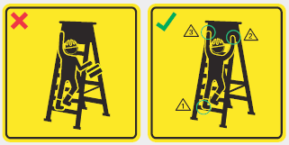
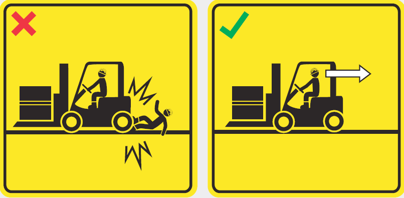

## Page 1

**ေရႊ့ေျပာင္းအ လုပ္သမား** မ်ားအတြက္လမ္းညႊန္ 

**1**

## Page 2

# **မာတိကာ** 

||**စာမ်က္ႏွာ**|
|---|---|
|**စကၤာပူႏိုင္ငံမွႀကိဳဆုိပါသည္**|**01**|
|**စကၤာပူႏိုင္ငံတြင္ေနထုိင္ျခင္း**|**02**|
|**စကၤာပူႏိုင္ငံတြင္လႈပ္ရွားသြားလာျခင္း**|**06**|
|**စကၤာပူႏိုင္ငံတြင္အလုပ္လုပ္ျခင္း**|**08**|
|**အလုပ္၊လုပ္ကုိင္ေနသူမ်ား၏ရသင့္ေသာအခြင့္အေရးမ်ား**|**12**|
|**အလုပ္အကုိင္ခန္႔ထားမႈဥပေဒမ်ား**|**20**|
|**အလုပ္ရွင္၏တာဝန္ဝတၲရားမ်ား**|**24**|
|**အလုပ္အကုိင္ခန္႔ထားျခင္းလိမ္လည္မႈမ်ား**|**27**|
|**ေဘးအႏၲရာယ္ကင္းရွင္းမႈ**|**27**|
|**ေဆးကုသမႈခံယူျခင္း**|**30**|
|**စကၤာပူဥပေဒမ်ား**|**34**|
|**ေငြေၾကးေရးရာမ်ား**|**38**|
|**အသုံးဝင္ေသာတယ္လီဖုန္းနံပါတ္မ်ား**|**42**|
|**ကိုဗစ္-၁၉  သတင္းအခ်က္အလက္မ်ား**|**44**|

ဤလက္စဲြလမ္းညႊန္တြင္ပါဝင္သည့္အခ်က္အလက္မ်ားသည္ပုံႏွိပ္သည့္အခ်ိန္အထိ၊ တိက်မွန္ကန္သည္။ ပုိမုိသိရွိလုိပါက **www.mom.gov.sg** တြင္ဝင္ေရာက္ ၾကည့္ရႈပါ။

## Page 3

## **စကၤာပူႏိုင္ငံမွႀကိဳဆုိပါသည္** 

စကၤာပူႏိုင္ငံမွႀကိဳဆုိပါသည္။သင္ေနထုိင္အလုပ္၊လုပ္မည့္ပတ္ဝန္းက်င္သစ္ႏွင့္သင္လုိက္ေလ်ာညီေထြျဖ စ္ေစရန ္အေထာက္အကူျပဳ မည့္အခ်က္အလက္မ်ားကုိဤလမ္းညႊန္ကသင့္အားသိေစအပ္ပါလိမ့္မည္။သ င္အလုပ္အလုပ္ကုိင္ေနစဥ္ရသင့္ေသာအခြင့္အေရးမ်ား ႏွင့္၊တာဝန္ဝတၲရားမ်ားကုိသင္သိၿပီး၊စကၤာပူဥပေဒ မ်ားကုိလုိက္နာရန္လည္းအေရးႀကီးပါသည္။ 

အကယ္၍ အလုပ္ကုိင္ေနစဥ္ရသင့္ေသာအခြင့္အေရးမ်ားႏွင့္ ဆက္ႏႊယ္ေနေသာ မည္သည့္ ျပႆ နာမ်ား ကုိမဆုိ သင္ ႀကံဳေတြ႔ရပါက ေအာက္ပါ ဌာနမ်ားမွ အကူအညီ ခ်က္ခ်င္း ရယူသင့္သည္ - 

<!-- Start of picture text -->
လူ႔စြမ္းအားဝန္ၾကီးဌာန ေရႊ႕ေျပာင္းအလုပ္သမားမ်ားစ (MOM) င္တာ  (MWC) TEL: 6438 5122 TEL: 6536 2692 Ministry of Manpower   579 Serangoon Road Services Centre Singapore 218193 1500 Bendemeer Road Singapore 339946 51 Soon Lee Road Singapore 628088 သင့္အဆာင္ရွိ  FAST  အဖြဲ႕အရာရွိ မ်ားကိုအကူအညီရယူရန္ ခ်ဥ္းက ပ္ပါ။ <!-- End of picture text -->

သင္၏စကၤာပူလက္ကုိင္ဖုန္းနံပါတ္ကုိ MOM သုိ႔အေၾကာင္းၾကားရန္ေ အာက္ပါလင့္ခ္သုိ႔မဟုတ္ QR ကုတ္ကုိအသုံးျပဳပါ။ ဤသုိ႔လုပ္ေဆာင္ျခ င္းသည္ သင္စကၤာပူႏိုင္ငံတြင္ေနထုိင္စဥ္အတြင္းအလုပ္အကုိင္ခန္႔ထား မႈႏွင့္ဆက္ႏႊယ္ေနေသာကိစၥရပ္မ်ာ း ႏွင့္ပတ္သက္၍ MOM ကသင့္ကုိ အသိေပးႏိုင္ေစပါလိမ့္မည္။ 

သင့္ စကၤာပူ လက္ကုိင္ဖုန္းနံပါတ္ကုိ ကၽြႏ္ုပ္တုိ႔အား ေျပာျပပါ - **www.mom.gov.sg/update_contact_details** . 

**1**

## Page 4

## **စကၤာပူႏိုင္ငံတြင္ ေနထုိင္ျခင ္း** 

**စကၤာပူႏိုင္ငံအေၾကာင ္း** 

စကၤာပူႏိုင္ငံသည္ လူမ်ိဳး၊ ဘာသာႏွင့္ ဘာသာစကားအမ်ိဳးမ်ိဳးျဖင့္ ေပါင္းစပ္ဖြဲ႕စည္းထားသည့္ လူမ်ိဳးေပါင္း စုံ၊ ယဥ္ေက်းမႈ ေပါင္းစုံ ႏိုင္ငံတစ္ခုျဖစ္သည္။ တစ္ဦးစီ၏ ကဲြျပားျခားနားမႈမ်ားကုိ သိရွိနားလည္ၿပီး ေလး စားကာ သဟဇာတျဖစ္စြာ ေနထုိင္ အလုပ္လုပ္ရန္ အေရးႀကီးသည္။ 

**စကၤာပူႏိုင္ငံရွိ ဘာသာမ်ာ း** 

ဗုဒၶဘာသာ၊ ခရစ္ယာန္ဘာသာ၊ အစၥလမ္ဘာသာ၊ ဟိႏၵဴဝါဒႏွင့္ တာအုိဝါဒတုိ႔ကဲ့သုိ႔ေသာ စကၤာပူႏိုင္ငံတြင္ က်င့္သုံးသည့္ ဘာသာ မ်ားစြာရွိသည္။ အျခားသူမ်ား၏ ဘာသာေရးဆုိင္ရာ အစဥ္အလာမ်ားကုိ ေလး စားေနသေရြ႕လူတုိင္းသည္ ၎တုိ႔၏ ဘာသာကုိ လြတ္လပ္စြာ က်င့္သုံးႏိုင္သည္။ ဘုရားေက်ာင္းမ်ား၊ ဘု ရားရွိခုိးေက်ာင္းမ်ားႏွင့္ ဗလီမ်ားကဲ့သုိ႔ေသာ ဝတ္ျပဳဆုေတာင္းရန္ သတ္မွတ္ထားေသာ ေနရာမ်ားတြင္၊ သင္ သြား၍ရွိခိုးဆုေတာင္းႏိုင္သည္။ 

**ႏိုင္ငံတြင္းလူမႈေရးစံႏႈန္းမ်ာ း** 

စကၤာပူႏိုင္ငံတြင္ရွိေနစဥ္သင့္အေနျဖင့္ႏိုင္ငံတြင္းလူမႈေရးစံႏႈန္းမ်ားႏွင့္ရင္းႏွီးကၽြမ္းဝင္ေအာင္ျပဳလုပ္သင့္ သည္။မိမိဇာတိတုိင္းျပည ္ တြင္လက္ခံႏိုင္ေသာအရာကုိစကၤာပူႏိုင္ငံတြင္လက္ခံခ်င္မွ၊လက္ခံႏိုင္လိမ့္မည္။ 

### **ေအာက္ပါအၾကဳ** ံ **ျပဳခ်က္မ်ားျဖင့္သင့္အားလမ္းညႊန္ပါရေစ။** 

**အမ်ားျပည္သူၾကားတြင္ေကာင္းမြန္ေသာအျပဳအ မူ** 

- ခုိက္ရန္မျဖစ္ပြားပါႏွင့္။ 

- ဘတ္စကားမွတ္တုိင္၊ေျမညီထပ္ဟင္းလင္းဖြင့္ေနရာမ်ား၊လူထိုင္ခုံတန္းရွည္မ်ား၊ပန္းၿခံမ်ားသုိ႔မဟုတ္ 

- ဂံုးေက်ာ္တံတားမ်ား၊ ကဲ့သုိ႔ေသာအမ်ားျပည္သူတုိ႕၊သြားလာလႈပ္ရွားရာအရပ္မ်ားတြင္မအိပ္ပါႏွင့္။ 

- • ညအခ်ိန္တြင္စကားက်ယ္ေလာင္စြာမေျပာပါႏွင့္သုိ႔မဟုတ္သီခ်င္းက်ယ္ေလာင္စြာမဖြင့္ပါႏွင့္။ 

- အိမ္ယာအေဆာက္အဦးမ်ား၏ ေျမညီထပ္ဟင္းလင္းဖြင့္ေနရာမ်ားတြင္လူစုျပီးအရက္မေသာက္ပါႏွင့္။ 

- တံေတြးမေတြးပါႏွင့္သုိ႔မဟုတ္အမိႈက္မပစ္ပါႏွင့္။ 

- အမ်ားျပည္သူဆုိင္ရာဧရိယာမ်ားတြင္အေပၚပုိင္းအကၤ်ီမပါဘဲေလွ်ာက္မသြားပါႏွင့္။ 

### **တစ္ကုိယ္ရည္ သန္႔ရွင္း မႈ** 

မိမိကုိယ္ကုိ သန္႔ရွင္းေအာင္ထားၿပီး နာမက်န္းမႈႏွင့္ ေရာဂါကူးစက္မႈ အႏၲရာယ္ကုိ အနည္းဆုံးျပဳလုပ္ကာ သင့္ အလံုးစံု က်န္းမာေရးကို ပုိမုိတုိးတက္ေကာင္းမြန္ေအာင္ ျပဳလုပ္ရန္ အေရးႀကီးသည္။ 

- ေရခ်ိဳးၿပီး ေခါင္းလည္းေလွ်ာ္ပါ 

- သင့္သြားကုိ တုိက္ပါ 

- သင့္အဝတ္အစားမ်ားကုိ ေလွ်ာ္ဖြတ္ပါ 

- သင့္လက္ကိုဆပ္ျပာျဖင့္ ပုံမွန္ေဆးေၾကာပါ 

**2**

## Page 5

<!-- Start of picture text -->
လက္ေဆးနည္းအဆင့္၈ဆင့္ <!-- End of picture text -->

<!-- Start of picture text -->
1 2 3 4 သင့္လက္ဖဝါးမ်ား ကိုေ လက္ေခ်ာင္းတစ္ေခ်ာင္းခ်င္း  လက္ဖမိုးႏွင့္ လက္ေခ်ာင္း လက္မရင္းကိုပြတ္တို ဆးေၾကာပါ  စီႏွင့္ လက္ေခ်ာင္းမ်ားၾက ား  မ်ားၾကားကိုပ ြတ တိုက္ပါ  က္ပ ါ ကိုပြတ္တိုက္ပ ါ 5 6 7 8 လက္ေခ်ာင္းမ်ားအ  လက္ဖဝါးေပၚတြင္လက ္ သ လက္ေကာက္ဝတ္ကိုေဆ  သန္႔ရွင္းေသာအဝတ္စသို႔မဟု ေနာက္  ည္းမ်ား ကိုပြတ္တိုက္ပ ါ း ေၾကာပါ  တ္ တစ္ရွဴးႏွင့္ လက္ကိုေျခာ <!-- End of picture text -->

သန္႔ရွင္းေသာအဝတ္စသို႔မဟု တ္ တစ္ရွဴးႏွင့္ လက္ကိုေျခာ က္ေအာင္ သုတ္ပါ 

**က်န္းမာေရးအေျခအေနေစာင့္ၾကည့္စစ္ေဆးျခ င္း** 

သင့္က်န္းမာေရးအေျခအေနကိုေစာင့္ၾကည့္စစ္ေဆးရန **FWMOMCare** အခမဲ့မိုဘိုင္းအက္ပ္ ကိုေဒါင္းလု တ္ရယူပါ။ ဤ App အက္ပ္သည္ ေနမေကာင္းျဖစ္သူမ်ားက 24/7 တယ္လီမက္ဒီဆင္ Telemedicine ဝ န္ေဆာင္မႈျဖင့္ လက္ငင္းက်န္းမာေရးအၾကံေပးမႈမ်ားရယူႏိုင္ရန္ စီစဥ္ေပးထားပါသည္။ 

အေဆာင္တြင္ျပထားေသာ QR Code ကို scan ဖတ္ရန္ႏွင့္ ေန႔စဥ္အလုပ္မသြားမီႏွင့္ အလုပ္အျပန္တြင္ သင ္ရႇိရာ ေနရာအားသတင္းပို႔ရန  ္ ‘Safe@Home’ လုပ္ေဆာင္ခ်က္ကိုအသုံးျပဳပါ ။ 

သင့္ဖုန္းနံပါတ္သည္ သင္လက္ရွိကိုင္ေဆာင္ေနေသာဖုန္းနံပါတ္ျဖစ္ေၾကာင္း ‘My Profile’ တြင္အတည္ျပဳ စစ္ေဆးပ ါ။ 

**3**

## Page 6

### **ေရကုိ ေခၽြတာပ ါ** 

သြားတုိက္ေနစဥ္ ေရပုိက္ေခါင္းကုိ ဖြင့္မ ထားပါႏွင့္။ မတ္ခြက္တစ္ခြက္တြင္ေရ ထၫ့္အသုံးျပဳပါ။ 

ေရပုိက္ေခါင္းေအာက္တြင္ ပန္းကန္ေဆး၊ အဝတ္ေလွ်ာ္ေနစဥ္၊ေရပုိက္ေခါင္းကိုဖြင့္မ ထားပါႏွင့္၊ ေရျဖည့္ထားေသာ ဇလားတစ္ ခုကုိ အသုံးျပဳပါ။ 

ေရကုိ မျဖဳန္းတီးပါႏွင့္ 

ေရခ်ိဳးေနစဥ္  ေရပုိက္ေခါင္းကုိ ဖြင့္မထား ပါႏွင့္၊ ေရခ်ိဳးခ်ိန္ကုိလည္း ၅ မိနစ္ထက္မပို ပါေစႏွင့္။ 

အသုံးမျပဳေသာအခါ  ေရပုိက္ေ ခါင္းကုိ ပိတ္ထားၿပီး မည္သည့္ ယိုစိမ့္မႈကိုမဆုိ သတင္းပုိ **႔** ပါ။ 

မည္သည့္ ေရပုိက္တပ္ဆင္ထား မႈကုိမဆုိ မပ်က္စီးေစပါႏွင့္ သုိ **႔** မ ဟုတ္မေျပာင္းလဲပါႏွင့္။ 

### **သင့္နားရက္တြင္ သြားရမည့္ေနရာ** 

သင့္အားလပ္ခ်ိန္မ်ားတြင္  အပန္းေျဖ စင္တာမ်ားကုိ သင္ သြားလည္ႏိုင္ပါသည္။သင့္အတြက္သာယာဖြယ္ ရာမ်ားနွင့္ အပန္းေျဖလႈပ္ရွားဖြယ္ရာမ်ားစီစဥ္ေပးထား ပါသည္။ 

### **အပန္းေျဖ စင္တာမ်ာ း** 

စကၤာပူႏိုင္ငံအႏွံ႔တြင္အပန္းေျဖစင္တာရွစ္ခုရွိသည္၊ထုိစ င္တာမ်ားတြင္ၾကက္ေတာင/္ဘတ္စကတ္ေဘာကြင္း မ်ား၊ေဘာလုံးႏွင့္ခရစ္ ကက္ကြင္းမ်ားကဲ့သုိ႔ေသာ၊အခမဲ့ အားကစားအေဆာက္အဦးမ်ားရွိပါသည္သည္။စူပါမား ကက္တြင္သင္ေငြပုိ႔ႏိုင္သည္၊ဆံပင္ညွပ္ႏိုင္ သည္၊ကု န္ေျခာက္မ်ားဝယ္ယူႏိုင္သည္သုိ႔မဟုတ္ထုိစင္တာတြင္ ထမင္းဝယ္စားႏိုင္သည္။ 

**4**

## Page 7

အပန္းေျဖစင္တာမ်ား၏အေသးစိတ္အခ်က္အလက္မ်ားမွာေအာက္ပါအတုိင္းျဖစ္သည္။ 

**အပန္းေျဖစင္တ ာ** (RC) **လိပ္စာ** 

**Cochrane RC 100 Sembawang Drive, Singapore 756998 Kaki Bukit RC 7 Kaki Bukit Avenue 3, Singapore 415814 Kranji RC 11 Kranji Road, Singapore 737673 Penjuru RC 27 Penjuru Walk, Singapore 608538 Soon Lee RC 51 Soon Lee Road, Singapore 628088 Terusan RC 1 Jln Papan, Singapore 619392 Tuas South RC 10 Tuas South Street 13, Singapore 636937 Woodlands RC 200 Woodlands Industrial Park E7, Singapore 757177** 

**စကၤာပူႏိုင္ငံမွအရက္ဥပေဒမ် ား** 

အကယ္၍သင္အရက္ေသာက္တတ္ပါက၊မည္သည့္ေနရာႏွင့္မည္သည့္အခ်ိန္တြင္သင္အရက္ေသာက္ႏိုင္ သည ္၊မည္သည့္ေနရာ တြင္သင္အရက္ဝယ္ႏိုင္သည့္အေၾကာင္းနွင့္ထိန္းခ်ဳပ္ထားသည့္အရက္ဥပေဒမ်ား ကုိသင္သိရမည္။ 

ကဲြျပားျခားနားေသာကန္႔သတ္ခ်က္မ်ားရွိသည့္Geylangႏွင့္ Little India ကဲ့သုိ႔ေသာအရက္ထိန္းခ်ဳပ္ေရးဇုံ မ်ားရွိသည္။ Geylang ႏွင့္ Little India ရွိေကာ္ဖီဆုိင္မ်ားကဲ့သုိ႔ေသာလုိင္စင္ရ၊ဆုိင္မ်ားအတြင္းတြင္သာသ င္အရက္ကုိေသာက္ႏိုင္၊ဝယ္ႏိုင္သည္။ဤေနရာမ်ား၏အျပင္ဘက္ တြင္အရက္ေသာက္ျခင္းသည္ဥပေဒႏွင့္ ဆန္႔က်င္သည္။ 

တားျမစ္ထားသည့္အခ်ိန္မ်ားအတြင္းလူၾကားသူၾကားတြင္သင္အရက္ေသာက္ေနသည္ကုိေတြ႔ရွိပါကအေ ရးယူလိမ့္မည္ျဖစ္ၿပီးသင့္အ လုပ္လုပ္ခြင့္ပါမစ္ကုိပယ္ဖ်က္လိမ့္မည္။ 

အရက္ ဥပေဒမ်ား၏ အခ်က္အလက္အတြက္ <u>www.mha.gov.sg</u> တြင္ ေက်းဇူးျပဳ၍ဖတ္ပါ။ 

**5**

## Page 8

## **စကၤာပူႏိုင္ငံတြင္လႈပ္ရွားသြားလာျခ င္း** 

စကၤာပူႏိုင္ငံတြင္ သြားလာလႈပ္ရွားရသည္မွာ လြယ္ကူပါသည္။ သယ္ယူပုိ႔ေဆာင္ေရး အမ်ိဳးမ်ိဳးတို႕မွာ ေ အာက္ပါအတုိင္းျဖစ္သည ္၊ 

- ဘတ္စ္ကား 

- လူအမ်ားအျမန္ သယ္ယူပုိ႔ေဆာင္မႈ ( MRT ) 

- ေပါ့ပါးေသာ ရထား  သယ္ယူပုိ႔ေဆာင္မႈ ( LRT ) 

- တကၠစီ 

- ကုိယ္ပုိင္ အငွားယာဥ္ 

### **EZ-Link ကတ္မ်ား** 

ဘတ္စ္ကား၊ MRT သုိ႔မဟုတ္ LRT ျဖင့္ခရီးသြားရန္ MRT ဘူတာမ်ားႏွင့္ဘတ္စကားေျပာင္းစီးေသာေနရာ မ်ားတြင္ဝယ္ယူႏိုင္သည့္ ez-link ကတ္တစ္ခုသင္လုိအပ္လိမ့္မည္။သင့္ ez-link ကတ္တြင္ထည့္သြင္းထား သည့္တန္ဖုိးရွိလိမ့္မည္။ MRT ဘူတာမ်ားႏွင့္ဘတ္စ္ကားေျပာင္းစီးေနရာမ်ားတြင္ရွိသည့္လက္မွတ္ေရာင္းစ က္မ်ားတြင္သင့္ကတ္ကုိသင္ေငြျဖည့္ႏိုင္သည္။ေငြျဖည့္ျခင္းကုိသင့္ဘဏ္ ATM ကတ္ျဖင့္ျပဳလုပ္ႏိုင္သည္။ အကူအညီရယူရန္အတြက ္ MRT ဘူတာမ်ားသုိ႔မဟုတ္ဘတ္စ္ကားေျပာင္းစီးေနရာမ်ားရွိစုံစမ္းေရးေကာင္ တာမ်ားရွိဝန္ထမ္းမ်ားထံသြားေရာက္ေမးႏိုင္သည္။ 

ဘတ္စကားႏွင့္ရထားလမ္းေၾကာင္းမ်ားႏွင့္ယာဥ္စီးခမ်ား၏အေသးစိတ္အခ်က္အလက္မ်ားကုိဘတ္စ္ကား မွတ္တုိင္မ်ား၊ _MRT_ ႏွင့္ _LRT_ ဘူတာမ်ားတြင္ျပသထားပါသည္။ 

### **အမ်ားျပည္သူ သယ္ယူပုိ႔ေဆာင္ေရးေပၚတြင္ က်င့္ေဆာင္ရမည့္အျပဳအမူမ်ာ း** 

ဘတ္စကားမ်ား ႏွင့္ ရထားမ်ားတြင္ ခရီးသြားေသာအခါ ခရီးသြားေဖာ္မ်ားကိုထည့္သြင္းစဥ္းစားပါ။ 

- ဘတ္စ္ကား သုိ႔မဟုတ္ ရထားေပၚသုိ႔တက္ရန္ ေစာင့္ဆုိင္းေနစဥ္ တန္းစီပါ။ 

- သက္ႀကီးရြယ္အုိ ခရီးသည္ကဲ့သုိ႔ေသာထုိင္ခံုကိုသင့္ထက္ ပုိ၍လုိအပ္မည့္ သူတေယာက္အတြက္ ထုိ င္ခုံေနရာ ဖယ္ေပးပါ။ 

- မတ္တပ္ရပ္ေနေသာအခါ အတြင္းသုိ႔ ဝင္ပါ၊ အျခားသူမ်ား တက္ႏိုင္၊ ဆင္းႏိုင္ေစရန္ ဝင္ေပါက္ကုိ ပိ တ္မထားပါႏွင့္။ 

- သင္ မတက္ေရာက္မွီ အျခားသူမ်ားအား အရင္ဆင္းေစျခင္းျဖင့္ လမ္းဖယ္ေပးပါ။ 

- အျခားသူမ်ား သြားလာရာတြင္ ေနရာပုိရေစရန္ သင့္ အိတ္ကုိ ခ်ထားပါ။ 

**6**

## Page 9

**လမ္းေပၚတြင္ေဘးအႏၱရာယ္ကင္းရွင ္းမႈ** 

**ေဘးကင္းစြာ စက္ဘီးစီးျခင ္း** 

သင္ စက္ဘီးစီးေလ့ရွိပါက  ေဘးကင္းေအာင္ စီးနင္းပါ၊ 

- စက္ဘီးလမ္းစီးရမည့္ေပၚတြင္သာ အၿမဲစီးနင္းၿပီး အျခား စက္ဘီးစီးသူမ်ားႏွင့္ လမ္းေလွ်ာက္သူမ်ားကုိ သတိထားပါ။ 

- လမ္းေလွ်ာက္သူမ်ားကုိ သတိရွိၿပီး အရွိန္ေလ်ာ့ပါ။အထူးသျဖင့္ အတူသုံးရသည့္စႀကၤန္လမ္းေပၚတြင္ လမ္းေလွ်ာက္သူမ်ားကုိ သတိေပးရန္ သင့္စက္ဘီး ေခါင္းေလာင္းကုိ အေဝးမွ တီးပါ။ 

- ယာဥ္စည္းကမ္း၊ လမ္းစည္းကမ္းမ်ားကုိ လုိက္နာပါ၊ လမ္းေဘးကုိ ကပ္စီးပါ။ လမ္းအလယ္သုိ႔မဟုတ္ လာေနေသာ ယာဥ္မ်ားႏွင့္ မ်က္နွာျခင္းဆိုင္မစီးပါႏွင့္။ 

- • စက္ဘီးစီးေသာအခါသင့္စက္ဘီးကုိ သတ္မွတ္ထားေသာ ရပ္ရန္ေနရာမ်ားတြင္ ရပ္ပါ။ လမ္းအလယ္ သုိ႔မဟုတ္ လူသြားစႀကၤန္အလယ္တြင္ သင့္ စက္ဘီးကုိ မထားခဲ့ပါႏွင့္၊ယာဥ္ေမာင္း သူမ်ားႏွင့္ လမ္းေလွ်ာက္သူမ်ားကုိ ၎ကပိတ္ဆုိ႔တားဆီးမည္ျဖစ္ေသာေၾကာင့္ျဖစ္သည္။ 

### **လမ္းေပၚတြင ္အႏၲရာယ္ကင္းရွင္းေရ း** 

လမ္းေပၚတြင္ ေရာက္ေနေသာအခါ ေဘးအႏၲရာယ္ကင္းရွင္းရန္ အေရးႀကီးသည္။ 

- ယာဥ္စည္းကမ္း၊ လမ္းစည္းကမ္းမ်ားကုိ လုိက္နာပါ။ နေမာ္နမဲ့ လမ္း မေလွ်ာက္ပါႏွင့္။မီးပိြဳင့္မ်ားမွသာအၿမဲတမ္း လမ္းျဖတ္ကူးပါ။ 

- မီးပိြဳင့္စိမ္းေသာအခါ မွလမ္းျဖတ္ကူးပါ။ 

- လမ္း၏ အျခားတစ္ဖက္ကုိ ေဘးကင္းစြာေရာက္ရွိရန္ လူကူးမ်ဥ္း 

   - က်ား၊ ခုံးေက်ာ္တံတား သုိ႔မဟုတ ေျမေအာက္လမ္းကူးကုိ အသုံးျပဳပါ။ 

- ယာဥ္ေမာင္းႏွင္ေသာအခါ လမ္းေလွ်ာက္သူမ်ားအတြက္ လမ္းေပးပါ၊ လမ္းေပါက္မ်ား၊ လမ္းဆုံမ်ား သို႔မဟုတ္ လူကူးမ်ဥ္းက်ားမ်ားသုိ႔ ခ်ဥ္း ကပ္လာေသာအခါ အရွိန္ေလ်ာ့ပါ။ 

### **ကုန္တင္ယာဥ္မ်ားျဖင့္သြားလာျခ င္း** 

- သင့္အလုပ္ရွင္သည္သင္၏အလုပ္ခြင္ႏွင့္သင္၏အေဆာင္အၾကားသယ္ယူပုိ႔ေဆာင္မႈကုိေပးအပ္ေကာင္းေ ပးအပ္ႏိုင္သည္။သုိ႔ရာတြင္ က်ပ္သိပ္ေနေသာကုန္တင္ကားကဲ့သုိ႔အႏၲရာယ္မ်ားေသာကားေပၚတြင္၊စီးနင္းရ ပါကသင့္အလုပ္ရွင္အားအေၾကာင္းၾကားပါ ။ သင္၏ေဘးအႏၲရာယ္ကင္းရွင္းေရးကအေရးႀကီးသည္။အ ကယ္၍သင့္အလုပ္ရွင္ကသင့္အားကူညီရန္ျငင္းဆန္ေနပါက ကုန္းလမ္းသယ္ယူပုိ႔ေဆာင္ေရးအာဏာပုိ င္( **LTA** )ထံ ဖုန္းနံပါတ္ **1800-2255-582** ကိုဆက္၍သတင္းပုိ႔ပါ။ 

**7**

## Page 10

## **စကၤာပူႏိုင္ငံတြင္အလုပ္လုပ္ျခင ္း** 

စကၤာပူႏိုင္ငံတြင္အလုပ္လုပ္ရန္သင္သည္တရားဝင္အလုပ္လုပ္ခြင့္ပါမစ္တစ္ခုကုိကုိင္ေဆာင္ထားရမည္ျဖ စ္ၿပီးအလုပ္လုပ္ခြင့္ပါမစ္ပါ စည္းကမ္းသတ္မွတ္ခ်က္မ်ားကုိလုိက္နာရမည္။ 

### **ေယဘုယ်သေဘာတူခြင့္ျပ ( IPA )စာ** 

သင့္ဇာတိႏိုင္ငံမွမထြက္ခြာမွီေယဘုယ်သေဘာတူခြင့္ျပဳ( IPA )စာတစ္ေစာင္(၅မ်က္ႏွာ မွ၆မ်က္ႏွာ) ကုိသ င့္ဇာတိဘာသာစကားျဖင့္သင့္အလုပ္ရွင္ထံမွသုိ႔မဟုတ္ဇာတိႏိုင္ငံကုိယ္စားလွယ္ထံမွသင္လက္ခံရရွိပါ မည္။ IPA စာကုိ MOM ကထုတ္ေပးၿပီးစကၤာပူႏိုင္ငံတြင္သင့္အလုပ္အကုိင္ခန္႔ထားမႈႏွင့္ပတ္သက္သည့္အ ခ်က္အလက္မ်ားပါဝင္သည္။သင့္ အလုပ္ရွင္သည္သင္၏ IPA စာတြင္ေဖာ္ျပထားသည့္စည္းကမ္းသတ္မွ တ္ခ်က္မ်ားႏွင့္ကုိက္ညီရန္လုိအပ္ၿပီးသင္၏ခြင့္ျပဳခ်က္မပါဘ **ဲ** စည္းကမ္းသတ္မွတ္ခ်က္မ်ားကုိ၎ကမေျပာ င္းလဲႏိုင္ေပ။သင္၏ IPA မွေအာက္ပါတုိ႔ကုိမွတ္သားထားပါ - 

<!-- Start of picture text -->
၁ သင့္နာမည္ႏွင့္အလုပ္ပါမစ္နံပါတ္ <!-- End of picture text -->

**8**

## Page 11

<!-- Start of picture text -->
၂ သင့္အလုပ္ရွင္အမည္ ၃ သင့္အလုပ္အကိုင္ ၄ သင့္စကၤာပူအလုပ္အကိုင္ခန္႔ထားမႈကိုယ္စား လွယ္ ( EA ) ကုမၸဏီႏွင့္သင့္စကၤာပူ  EA အားေပးရမည့္အက်ိဳးေဆာင္အခေၾကးေငြ ၅ အလုပ္ပါမစ္ကာလ ၆ သင္၏အေျခခံလစာ၊ပုံေသလစဥ္ လစာ၊ပုံေသလစဥ္ေထာက္ပံ့ေၾကးႏွင့္ လစဥ္ျဖတ္ေတာက္ေငြမ်ား ၇ အိမ္ယာေပးအပ္မႈ ၈ သင့္  IPA  မွာေဖာ္ျပထားသည့္ အလုပ္အကိုင္ ကိုသာသင္လုပ္ကိုင္ခြင့္ရွိသည ္ <!-- End of picture text -->

**9**

## Page 12

<!-- Start of picture text -->
၉ သင္စကၤာပူႏိုင္ငံတြင္ေနထိုင္စဥ္ အလုပ္ပါပစ္ ၁၀ သင့္နားရက္ခံစားခြင့္မ်ား အေျခအေနမ်ားကိုလိုက္နာရမည္ <!-- End of picture text -->

<!-- Start of picture text -->
သင္၏  IPA  စာတြင္ေဖာ္ျပထားသည့္လစာ ကုိသင္ရရွိရမည္။စာျဖင့္ေရးသားထားေသာ သင္၏ခြင့္ျပဳခ်က္မရယူဘဲသင့္လစာ ကုိသ င့္အလုပ္ရွင္က၊ျဖတ္ေတာက္လွ်င္ အကူအညီရယူရန္ MOM  သို႕သြားေရာက္ပါ။ MOM  သုိ႔တိုင္ၾကားျခင္းအတြက္သင့္အား သင့္အလုပ္ရွင္ကအလုပ္မျဖဳတ္ႏိုင္ေပ။ စကၤာပူႏိုင္ငံတြင္သင္အလုပ္လုပ္သည့္ ကာလတေလ်ာက္လုံးသင္၏  IPA  စာမိတၱဴ တစ္ေစာင္ကုိသင္သိမ္းထားရပါမည္။ <!-- End of picture text -->

<!-- Start of picture text -->
၁၁ ထိုအဆင့္မ်ားကိုသင့္အလုပ္ရွင္က ၁၄ ရက္ အတြင္းသင္အျပီးသတ္လုပ္ေဆာင္ရမည္ <!-- End of picture text -->

**10**

## Page 13

### **အလုပ္လုပ္ခြင့္ ပါမ စ္** 

သင့္အလုပ္လုပ္ခြင့္ ပါမစ္ကတ္ကုိ သင္ႏွင့္အတူ အၿမဲထားရွိရန္ လုိအပ္သည္။ သင့္ အလုပ္လုပ္ခြင့္ ပါမစ္ ကတ္ကုိသင္ မရရွိေသးပါက သင္၏ IPA စာကုိ သင္ႏွင့္အတူ ေက်းဇူးျပဳ၍ထားရွိပါ။ 

MOM သုိ႔မဟုတ္အမ်ားျပည္သူဆုိင္ရာမည္သည္႕ေအဂ်င္စီမ်ားကမဆုိစစ္ေဆးစဥ္တြင္သင့္အလုပ္လုပ္ခြင့္ ပါမစ္ကတ္ကုိသင္ျပသရန္ လုိအပ္ပါလိမ့္မည္။ 

### **ႏိုင္ငံကူးလက္မွတ ္** 

သင့္  ႏိုင္ငံကူးလက္မွတ္သည္ သင္၏ တစ္ကုိယ္ေရ ပုိင္ဆုိင္မႈ ျဖစ္သည္။ သင့္အား အလုပ္အကုိင္ခန္႔ထား မႈ၏ စည္းကမ္းသတ္မွတ္ခ်က္တစ္ခုအျဖစ္ ဤလက္မွတ္ကုိ  သင့္အလုပ္ရွင္က သိမ္းဆည္းမထားရေပ။ အကယ္၍ သင့္အလုပ္ရွင္က  သင့္  ႏိုင္ငံကူးလက္မွတ္ကုိ သင့္အတြက္သိမ္းဆည္းထားပါလၽွင္ သင္က ေ တာင္းခံသည္ႏွင့္ သင့္ကိုခ်က္ခ်င္း ျပန္ေပးရမည ္။ 

<!-- Start of picture text -->
PASSPORT PASSPORT <!-- End of picture text -->

### **အကူအညီရယူပ ါ** 

သင္၏သေဘာတူညီခ်က္မပါဘဲသင့္လစာကုိသင့္အလုပ္ရွင္ကေလွ်ာ့ခ်လွ်င္၊သင့္ႏိုင္ငံကူးလက္မွတ္ကုိျပန္ မေပးလွ်င္သုိ႔မဟုတ္သင့္အလုပ္လုပ္ခြင့္ပါမစ္ကုိသင္ေတာင္းဆုိေသာအခါျပန္မေပးလွ်င္ **6438 5122** ကုိေခၚဆုိ၍ **MOM** သုိ႔ခ်က္ခ်င္းတိုင္ၾကားပါ။သုိ႔မဟုတ္ 1500 Bendemeer Road, Singapore 339946 ရွိ MOM Services Centre သို႔သြားေရာက္ပါ။ 

**11**

## Page 14

**အလုပ္၊လုပ္ကုိင္ေနသူမ်ား၏ရသင့္ေသာအခြင့္အေရးမ်ား စကၤာပူႏိုင္ငံတြင္ေနထုိင္ျပ ီး၊အလုပ္လုပ္ျခင ္း** 

သင့္အလုပ္ရွင္သည္စာျဖင့္ေရးသားထားသည့္အဓိကအလုပ္အကုိင္ခန္႔ထားမႈစည္းကမ္းသတ္မွတ္ခ်က္ မ်ား (KETs) တစ္စုံကုိသင့္အားေပးရမည္။KETsတြင္ေအာက္ပါတုိ႔အပါအဝင္သင္၏သေဘာတူညီၿပီးျဖစ္သ ည့္အလုပ္အကုိင္ခန္႔ထားမႈစည္းကမ္းသတ္မွတ္ခ်က္မ်ားဆုိင္ရာအခ်က္အလက္မ်ားပါဝင္ရမည္ - 

- လစာ၊လစာေပးသည့္ေန႔စဲြႏွင့္အခ်ိန္ပုိေၾကးခံစားပုိင္ခြင့္ 

- အလုပ္ခ်ိန္မ်ားႏွင့္နားရက္မ်ားကဲ့သုိ႔ေသာအလုပ္အစီအစဥ္မ်ား 

- လစာျပည့္ခြင့္ခံစားပုိင္ခြင့္မ်ား (ႏွစ္ပတ္လည္ခြင့္၊နာမက်န္းခြင့္ႏွင့္အမ်ားျပည္သူဆုိင္ရာအလုပ္ပိတ္ရ က္မ်ားအပါအဝင္) ႏွင့္ေဆးကုသေရးဆုိင္ရာေထာက္ပံ့ေၾကးမ်ား 

အကယ္၍ေအာက္ပါက႑မ်ားတြင္မည္သည့္စုိးရိမ္ပူပန္မႈမဆုိသင့္တြင္ရွိခဲ့ပါကေက်းဇူးျပဳ၍ **MOM** သုိ႔မ ဟုတ္အျငင္းပြားမႈစီမံေဆာင္ရြက္ေရးအတြက္သုံးဦးသုံးဖလွယ္မဟာမိတ္ **(TADM)** သုိ႔ေစာႏိုင္သမွ်အေ စာဆုံးအစီရင္ခံပါ။ TADM သည္ MOM Services Centre တြင္တည္ရွိသည္။ 

#### **(က) လစာ/အခ်** ိ **န္ပုိေၾကးေပးေခ် မ** 

- **1** သင့္အေနျဖင့္စကၤာပူႏိုင္ငံတြင္ကုိယ္ပုိင္ဘဏ္စာရင္းတစ္ခုဖြင့္သင့္ၿပီး သင့္လစာကုိထုိဘဏ္စာရင္းသုိ႔ထည့္သြင္းေပးပါရန္ သင့္အလုပ္ရွင္ အားေတာင္းဆုိသင့္သည္။ဤသုိ႔လုပ္ေဆာင္ျခင္းျဖင ့္သင့္အလုပ္ရွင္ႏွ င့္မည္သည့္ေငြေပးေခ်မႈဆုိင္ရာအ ျငင္းပြားမႈကုိမဆုိေလ်ာ့ခ်ေပးလိမ့္ မည္။အကယ္၍သင့္ဘဏ္စာရင္းထဲသုိ႔တုိက္ရုိက္လႊဲေျပာင္းျပီးသင့္လ စာကုိေပးရန္သင ္ ေတာင္းဆုိပါကသင့္အလုပ္ရွင္သည္ထုိသုိ႔ေဆာင္ ရြက္ေပးရမည္။ 

- **2** သင့္အလုပ္ရွင္သည္သင့္လစာကုိအနည္းဆုံးတစ္လလွ်င္တစ္ႀကိမ္၊လ စာေပးကာလကုန္ဆုံးၿပီးေနာက္၇ရက္အတြင္းသင့္ အားေပးရမည္။သ င္ႏွင့္သင့္အလုပ္ရွင္အၾကားသေဘာတူထားေသာမည္သည့္လစာေပး ကာလမဆုိသည္တစ္လထက္မ ေက်ာ္လြန္သင့္ေပ။ 

- **3** ထုိလအတြင္းသင္အခ်ိန္ပုိဆင္းခဲ့လွ်င္သင့္အလုပ္ရွင္သည္မည္သည့္ အခ်ိန္ပုိအတြက္မဆုိအနည္းဆုံးတစ္လလွ်င္တစ္ႀကိမ္ ၊လစာေပး ကာလကုန္ဆုံးၿပီးေနာက္၁၄ရက္အတြင္းသင့္အားေပးရမည္။ 

**12**

## Page 15

<!-- Start of picture text -->
4 5 <!-- End of picture text -->

- **4** သင္၏အေျခခံလစာ၊ပုံေသေထာက္ပံ့ေၾကးကုိေလ်ာ့ခ်ရန္သုိ႔မဟုတ္ သင္၏စာျဖင့္ေရးသားထားေသာခြင့္ျပဳခ်က္မပါဘဲသင္ ၏ IPA စာတြ င္ေဖာ္ျပထားသည့္ပမာဏမွသင္၏ပုံေသျဖတ္ေတာက္ေငြမ်ားက ုိပိုျဖ တ္ရန္သင့္အလုပ္ရွင္အားခြင့္မျပဳပါ။ 

- **5** သင္သေဘာတူညၿီပီးသင့္အလုပ္ရွင္ကေအာက္ပါတုိ႔ကုိလုပ္ေဆာင္မွ သာ သင့္လစာကုိေျပာင္းလဲႏိုင္သည္ - **စာျဖင့္ေရးသားထားေသာသင့္ခြင့္ျပဳခ်က္ကုိရယူျခ င္း** 

   - MOM အားအေၾကာင္းၾကားျခင္း 

   - ခ်ိန္ညွိထားေသာလစာျဖင့္တစ္ခုခ်င္းေဖာ္ျပထားသည့္လစာေပးျဖတ္ပုိ င္းစာရြက္ကုိထုတ္ေပးျခင္း 

- **6** သင့္အလုပ္ရွင္သည္ လစာေပး ျဖတ္ပုိင္းစာရြက္ကုိ အနည္းဆုံးတစ္ လလွ်င္တစ္ႀကိမ္၊ လစာေပးေခ်မႈကုိ ျပဳလုပ္ၿပီးေနာက ရုံးဖြင့္ရက္ ၃ ရ က္အတြင္း သင့္အားထုတ္ေပးရမည္။ ထုိလစာေပး ျဖတ္ပုိင္းစာရြက္ တြင္ အေျခခံလစာ၊ ေထာက္ပံ့ေၾကးမ်ား၊ ျဖတ္ေတာက္မႈမ်ား၊ ဆင္း ခဲ့ေသာ အခ်ိန္ပုိနာရီမ်ားႏွင့္ အခ်ိန္ လုပ္ခတုိ႔ကဲ့သုိ႔ေသာ လစာေပးေ ခ်မႈ(မ်ား)အား အေသးစိတ္ခဲြျခမ္းမႈ ပါဝင္ရမည္။ 

တစ္ခုခ်င္းေဖာ္ျပထားသည့္ လစာေပး ျဖတ္ပုိင္းစာရြက္မ်ားႏွင့္ အခ်ိန္ စာရင္းစာရြက္မ်ားကုိသင္ကသိမ္းဆည္းထားရမည္။ 

- **7** သင္နားမလည္သည့္၊သုိ႔မဟုတ္သင္သေဘာမတူသည့္မည္သည့္စာရြ က္စာတမ္းအလြတ္သုိ႔မဟုတ္စာရြက္စာတမ ္း မ်ားကုိမဆုိလက္မွတ္မ ထုိးပါႏွင့္။ အကယ္၍သင့္အလုပ္ရွင္ကေပးေခ်မႈေဘာက္ခ်ာစာရြက္ မ်ား၊သုိ႔မဟုတ္လစာေပးျဖတ ္ ပုိင္းစာရြက္မ်ားကဲ့သုိ႔ေသာမည္သည့္ စာရြက္စာတမ္းအလြတ္ကုိမဆုိသင့္အားလက္မွတ္ထုိးခုိင္းပါကသင့္ အေနျဖင ့္ MOM ထံဆက္သြယ္သင့္သည္။ ေယဘုယ်အားျဖင့္ ေစာ စီးစြာ သတင္းမပုိ႔သည့္ ဝန္ထမ္းမ်ားတြင္၎တုိ႔၏ ေတာင္းဆိုမႈ မွန္က န္ေၾကာင္း သက္ေသျပရာတြင္အခက္အခဲရွိေကာင္းရွိႏိုင္သည္။ 

**13**

## Page 16

#### **(ခ) လစာ ျဖတ္ေတာက္မႈမ်ာ း** 

- သင့္အလုပ္ရွင္သည္သင့္လစာမွျဖတ္ေတာက္မႈမ်ားကုိမျပဳလုပ္ႏိုင္ပါ၊ေအာက္ပါအေျခအေနမ်ားတြင္ သာထုိသုိ႔ျပဳလုပ္ႏိုင္ သည္ - 

<!-- Start of picture text -->
 သင့္အလုပ္ရွင္၏သေဘာတူ သင္ေတာင္းဆုိခဲ့သည့္ အစား သင္လက္ခံခဲ့သည့္ေနရာထုိင္ခင္း/ ညီခ်က္မပါဘဲသင္အလုပ္မွပ် အစာမ်ားအတြက္သင့္အလုပ္ရွ အိမ္ယာ၊ျဖည့္ဆည္းေပးမႈမ်ားႏွင့္ဝ က္ကြက္ခဲ့ပါက  င္ကေပးေခ်ခဲ့ၿပီးပါက န္ေဆာင္မႈမ်ားအတြက္သင့္အလုပ္ ရွင္က ေပးေခ်ခဲ့ၿပီးျဖစ္ပါက သင့္အားအပ္ႏွံထားခဲ့ေသာကုန္ပစၥည္း ဤျဖတ္ေတာက္မႈအတြက္စာျဖင့္ေရးသားထားေ မ်ား၊သုိ႔မဟုတ္ေငြေပ်ာက္ဆုံးသြားခဲ့သည္၊ သာသေဘာတူညီခ်က္ကုိသင္ေပးခဲ့သည္ ျဖစ္ပါက သုိ႔မဟုတ္ပ်က္စီးသြားခဲ့သည္ျဖစ ္ ပါက  (ျဖတ္ေတာက္မႈမျပဳလုပ္မွီသင့္သေဘာတူညီခ်က္ (တစ္ႀကိမ္တည္းျဖတ္ေတာက္မႈသာ) ကုိသင္အခ်ိန္မေရြးရုတ္သိမ္းႏိုင္သည္)။ • အကယ္၍လစာျဖတ္ေတာက္မႈကုိျပဳလုပ္ခဲ့ပါကသင့္အလုပ္ရွင္သည္မည္သည့္လစာေပးေခ်မ ႈ ကာလ တြင္မဆုိသင့္စုစုေပါင္းလစာ၏ ၅၀% ထက္ပို၍ မျဖတ္ေတာက္ရပါ၊ ၎တြင္ ေအာက္ပါတုိ႔အတြက္ ျပဳ လုပ ္ သည့္ ျဖတ္ေတာက္မႈမ်ား မပါဝင္ေပ - - သင္ အလုပ္မွ ပ်က္ကြက္ျခင္း - ႀကိဳတင္ေငြမ်ား၊ ေခ်းေငြမ်ား သုိ႔မဟုတ္ သင့္လစာတြင္ အပုိေပးေခ်မႈကုိ ျပန္လည္ရယူျခင္း - စာျဖင့္ေရးသားထားေသာသေဘာတူညီခ်က္ကုိသင္ေပးခဲ့သည့္မည္သည့္သမ၀ါယမအသင္းႀကိဳမဆုိေ ပးေခ်မ ႈ <!-- End of picture text -->

**14**

## Page 17

#### **(ဂ) အလုပ္ခ်** ိ **န္မ်ားႏွင့္အခ်** ိ **န္ပိုလုပ္ျခ င ္း** 

- သင္အဆုိင္းျဖင့္အလုပ္ဆင္းရသည္မဟုတ္လွ်င္၊သင္၏သေဘာတူစာခ်ဳပ္ပါအလုပ္ခ်ိန္သည္တစ္ေ န႔လွ်င္၈နာရီသုိ႔မဟုတ္ ရက္သတၲပတ္လွ်င္၄၄ နာရီထက္မေက်ာ္လြန္ရေပ။အလုပ္ခ်ိန္တြင္နားျခင္း၊လ က္ဖက္ရည္ေသာက္ရန္ႏွင့္ထမင္းစားရန ္ အတြက္ခြင့္ျပဳထားသည့္နားခ်ိန္မ်ားမပါဝင္ေပ၊သင္၏သေ ဘာတူစာခ်ဳပ္ပါအလုပ္ခ်ိန္ထက္ေက်ာ္လြန္သည့္အလုပ္အားလုံး ကုိအခ်ိန္ပုိအလုပ္အျဖစ္မွတ္ယူရ မည္၊သင္၏နာရီအလုိက္အေျခခံလုပ္ခတစ္ဆခဲြျဖစ္ေသာအခ်ိန္ပုိလုပ္ခကုိသင္ေတာင္းခံ ႏိုင္သည္။ 

- အကယ္၍သင္အဆုိင္းျဖင့္အလုပ္ဆင္းရလွ်င၊္သေဘာတူထားေသာအလုပ္ခ်ိန္သည္ရက္သတ ၱ၃ပတ္ တြင္တစ္ပတ္လွ်င္ ၄၄နာရီထက္မေက်ာ္လြန္ရေပ၊တစ္ေန႔လွ်င္အမ်ားဆုံးအလုပ္ခ်ိန္မွာ၁၂နာရီျဖစ္ၿပီး အမ်ားဆုံးအခ်ိန္ပုိမွာတစ္လလွ်င္၇၂နာ ရီျဖစ္သည္။ 

- သင့္အလုပ္ရွင္သည္သင္အလုပ္လုပ္ခဲ့ၿပီးျဖစ္သည့္အခ်ိန္ပုိနာရီမ်ားကိုမွတ္တမ္းတင္ထားရမည္၊သင့္ အေနျဖင့္သင့္အလုပ္ ရွင္၏မွတ္တမ္းကုိမွန္ကန္ေၾကာင္းစစ္ေဆးသင့္ၿပီး၎သည္မွန္ကန္တိက်မွသာ လွ်င္လက္မွတ္ေရးထုိးသင့္သည္။ထုိမွတ္ တမ္းကုိသင္သေဘာမတူပါကသင့္အလုပ္ရွင္အားေစာစီးစြာ ရွင္းလင္းေျပာျပၿပီးလက္မွတ္မထုိးပါႏွင့္။ 

**15**

## Page 18

#### **(ဃ) နာမက်န္းခြင့္** 

- အကယ္၍သင္သည္သင့္အလုပ္ရွင္အတြက္အနည္းဆုံးသုံးလအလုပ္လု ပ္ခဲ့ၿပီးျဖစ္ပါကျပင္ပလူနာနာမက်န္းခြင့္ႏွင့္ေဆးရုံ တက္ခြင့္ကိုသင္ခံစား ပုိင္ခြင့္ရွိသည္၊ သင္ရပုိင္ခြင့္ရွိသည့္လစာျပည့္နာမက်န္းခြင့္ရက္အေရအ 

   - တြက ္သည္ေအာက္ပါအ တုိင္းၿပီးစီးခဲ့သည့္တာဝန္ထမ္းေဆာင္မ 

|**ယေန႔အထိၿပီးစီးခဲ့သည့္တာဝန္** **္္ႈ ်**|တစ္ႏွစ္လွ်င္လစာျပည့္ျပင္ပလူ ့္္္|တစ္ႏွစ္လွ်င္လစာျပည့္ေဆး ရုံ ့္္္|
|---|---|---|
|**ထမ္းေဆာင္မႈလမ ်ာ**|နာနာမက်န္းခြင ့္(ရက္)|တက္ခြင ့္(ရက္)|
|**၃ လ**|၅|၁၅|
|**၄လ**|၈|၃၀|
|**၅လ**|၁၁|၄၅|
|**၆လႏွင့္အထက္**|၁၄|၆၀|

- နာမက်န္းခြင့္အတြက္ခံစားနိုင္ခြင့္ျပည့္မီရန္သင္အလုပ္မွပ်က္ကြက္ေ သာ ၄၈နာရီအတြင္းသင့္အလုပ္ရွင္ကုိသင္အ ေၾကာင္းၾကားရမည္။ 

- သင္၏ပုံမွန္အလုပ္လုပ္ရက္တြင္ယူခဲ့ေသာနာမက်န္းခြင့္ကာလအတြ က္ေအာက္ပါတုိ႔ျဖစ္ခဲ့လွ်င္သင့္အလုပ္ရွင္သည္သင့္အားသင့္လစာကုိေ ပးရမည္- 

- ေဆးကုသေရးဆုိင္ရာမွတ္ပုံတင္ဥပေဒအရမွတ္ပုံတင္ထားေသာမည္ သည့္ဆရာဝန္ကမဆုိထုိနာမက်န္းခြင့္ကာလအတြက္ေဆးလက္မွတ္ကုိ သင့္အားေပးလွ်င္ႏွင့္ 

- ထုိႏွစ္အတြက္သင္၏နာမက်န္းခြင့္ခံစားပုိင္ခြင့္ကုိမေက်ာ္လြန္လွ်င္ 

- **(င) နားရက္မ်ားႏွင့္အမ်ားျပည္သူဆုိင္ရာအားလပ္ရက္မ ်ား** 

- သင္သည္ရက္သတၱတစ္ပတ္လွ်င္နားရက္တစ္ရက္လစာမဲ့ရပုိင္ခြင့္ရွိသည္။ 

- ထူးျခားေသာအေျခအေနမ်ားမရွိလွ်င္သင္အနားယူသည့္ေန႔တြင္အလုပ္လုပ္ရန္သင့္အလုပ္ရွင္ကသင့္ အားဖိအားမေပးႏိုင္ ပါ၊၎ျပင္ထုိေန႔တြင္အလုပ္လုပ္ရန္ အလုပ္ရွင္တုိ႔အေနျဖင့္သင့္သေဘာတူညီခ် က္ကုိရယူရမည္။ 

**16**

## Page 19

<!-- Start of picture text -->
နားရက္တစ္ရက္တြင္အလုပ္လုပ္ျခင္းအတြက္ေပးေငြကုိေအာက္ပါအတုိင္းတြက္ခ်က္သ ည္ - အလုပ္ကုိလုပ္ခဲ့လွ်င္  သင္၏ပုံမွန္ေန႔စဥ္အ သင္၏ပုံမွန္ေန႔စဥ္အလု သင္၏ပုံမွန္ေန႔စဥ္အလု လုပ္ခ် ိ န္၏တစ္ဝက္ ပ္ခ် ိ န ္၏ တစ္ဝက္ထ ပ္ခ် ိန္ ထက္ေက်ာ္လြ အထလုပ္ ရေသာ  က္ေက်ာ္လြန္ေသ ာ န္ေသ ာ အလုပ္ရွင္၏ေတာင္း ၂ ရက္ လစာ + အခ်ိန္ ၁ ရက္ လစာ  ၂ ရက္ လစာ ဆုိ မႈျဖင့္  ပိုေၾကး ဝန္ထမ္း၏ေတာင္းဆုိ ၁ ရက္ လစာ + အခ်ိန္ ေန႔တစ္ဝက္လစာ  ၁ ရက္ လစာ မႈျဖင့္ ပိုေၾကး <!-- End of picture text -->

- တစ္ႏွစ္လွ်င္လစာျပည့္ အမ်ားျပည္သူဆုိင္ရာအားလပ္ရက္ ၁၁ရက္သင္ရပိုင္ခြင့္ရွိသည္။ 

- အမ်ားျပည္သူဆုိင္ရာအားလပ္ရက္တြင္သင္အလုပ္မလုပ္ခဲ့ေတာင္မွသင့္အလုပ္ရွင္သည္ထုိအမ်ားျပ 

   - ည္သူဆုိင္ရ ာ အားလပ္ရက္အတြက္သင္၏စုစုေပါင္းလစာကုိသင့္အားေပးရမည္။ 

- ထုိအမ်ားျပည္သူဆုိင္ရာအားလပ္ရက္တြင္သင္အလုပ္လုပ္ခဲ့လွ်င္ထုိေန႔အလုပ္အတြက္အေျခခံ လစာ၏ အပုိတစ္ရက္စာ ကုိသင့္အလုပ္ရွင္ကသင့္အားေပးရမည္၊သုိ႔မဟုတ္သင့္အားနားရက္တစ္ရ က္အစားေပးရမည္၊သုိ႔မဟုတ္အပန္းေျဖရက ္ ေပးရမည္(ေဒၚလာ၂၆၀၀ႏွင့္အထက္ဝင္ေငြရေသာအ လုပ္သမားမဟုတ္သူမ်ားအတြက္သာ) 

#### **(စ) ႏွစ္ပတ္လည္ခြင့္** 

- အကယ္၍သင္သည္သင့္အလုပ္ရွင္အတြက္အနည္းဆုံးသုံးလအလုပ္လုပ္ခဲ့ၿပီးျဖစ္ပါကသင္သည္ႏွစ္ပ တ္လည္ခြင့္ကုိရပုိင ္ ခြင့္ရွိသည္။ 

- သင္၏ႏွစ္ပတ္လည္ခြင့္ရပုိင္ခြင့္သည္ေအာက္တြင္ေဖာ္ျပထားသည့္အတုိင္းဤအလုပ္ရွင္အတြက္သင္ တာဝန္ထမ္းေဆာင္ ခဲ့ေသာခုႏွစ္မ်ားအေပၚတြင္မူတည္သည္။ 

|**ဆက္တုိက္ တာဝန္ထမ္းေဆာင္မႈ ႏွစ**|**တစ္ႏွစ္လွ်င္ ခြင့္ရက္ေပါင ္း**|
|---|---|
|ပထမ|၇|
|ဒုတိယ|၈|
|တတိယ|၉|
|စတုတၴ|၁၀|
|ပဥၥမ|၁၁|
|ဆဌမ|၁၂|
|သတၲမ|၁၃|
|အဌမႏွင့္ အထက္|၁၄|

- အကယ္၍သင္သည္ဆက္တုိက္တာဝန္ထမ္းေဆာင္မႈ ၁၂လမၿပည့္ေသးပါက၊သင္၏ႏွစ္ပတ္လည္ ရပုိင္ခြင့္ရက္ကုိထုိ ႏွစ္အတြက္ၿပီးစီးခဲ့သည့္တာဝန္ထမ္းေဆာင္မႈ လ အေရအတြက္ေပၚတြင္အေျ ခခံ၍အခ်ိဳးက်တြက္ခ်က္လိမ့္မည္။ 

**17**

## Page 20

**လစာေတာင္းဆုိမႈမ်ားႏွင့္အလုပ္အကုိင္ခန္႔ထားမႈအက်** ိဳ **းခံစားခြင ့္မ်ား** 

အကယ္၍သင့္တြင္လစာ ႏွင့္ /သုိ႔မဟုတ္ သင့္အလုပ္ရွင္ႏွင့္  အလုပ္အကုိင္ခန္႔ထားမႈဆုိင္ရာ အျငင္းပြားမႈ မ်ား ရွိခဲ့ပါက သင္သည္ MOM သုိ႔မဟုတ္ TADM ကုိ ေစာႏိုင္သမွ် အေစာဆုံး ဆက္သြယ္သင့္သည္။ ေ စာစီးစြာသတင္းပုိ႔ျခင္းျဖင့္ သင္ ရရန္ရွိသည့္ လစာကုိ အျပည့္အဝ ျပန္လည္ရရွိရန္အခြင့္အလမ္း ပုိမ်ား သည္၊ ၎ျပင္ အလုပ္ရွင္သစ္တစ္ေယာက္ ရွာေဖြရန္အတြက္ သင့္အား အခ်ိန္ပုိ ရေစလိမ့္မည္။ လုိအပ္ ပါက သင္သည္ အစားအစာႏွင့္ ေနရာထုိင္ခင္းအတြက္ အကူအညီ ရလိမ့္မည္။ 

### **အေရးႀကီးသည့္ မွတ္ခ်က္** 

အကယ္၍သင့္အလုပ္ရွင္သည္သင့္ကုိမည္သည့္လစာသုိ႔မဟုတ္အျခားမည္သည့္ေပးေငြမ်ားကုိမဆုိသင့္ အားေပးရန္ရွိပါကသင့္အားသင့္ဇာတိႏ **ိ** ုင္ငံသုိ႔အတင္းအက်ပ္ျပန္မပုိ႔ႏိုင္ပါ။ 

အကယ္၍သင့္တြင္ရရန္ရွိသည့္မည္သည့္လစာ၊သုိ႔မဟုတ္ေတာင္းဆုိမႈမဆုိရွိၿပီးထြက္ခြာရန္မလိုအပ္ေသး ဘဲသင့္အာ း ေလဆိပ္သုိ႔အပုိ႔ခံရပါက၊သင္သည္စကၤာပူလူဝင္မႈေကာင္တာမ်ားရွိေလဆိပ္အာဏာပုိင္မ်ား ထံခ်ဥ္းကပ္သင့္သည္။ အကူအညီအတြက္သင့္အား MOM သုိ႔လႊဲေျပာင္းေပးလိမ့္မည္။ 

### **သင္၏စကၤာပူအလုပ္အကုိင္ခန္႔ထားမႈေအဂ်င ္စီ** 

### **အလုပ္အကုိင္ခန္႔ထားမႈေအဂ်င္စီေၾကးမ်ားအေပၚတန္ဖိုးကန္႔သတ္ခ်က္** 

<!-- Start of picture text -->
သင့္အလုပ္လုပ္ခြင့္ပါမစ္တရားဝင္မႈသုိ႔မဟုတ္သင့္အလုပ္အကုိင္ခန္႔ထားမႈသေဘာတူညီခ်က္ကာလ၏၊မ ည္သည့္အတြက္ပင္ ပုိေတာင္းသည္ျဖစ္ေစ၊တစ္ႏွစ္စီအတြက္သင္၏မူေသလစဥ္လစာ ၁လ စာထက္မပုိေ သာေငြကိုသာစကၤာပူအလုပ္အကုိင္ခန ္႔ ထားမႈေအဂ်င္စီသုိ႔သင္ေပးေခ်သင့္သည္။ေအဂ်င္စီအခ ကုိ၂လစာ၌ကန္႔သတ္ထားသည္။ထုိအလုပ္အကုိင္ခန္႔ထားမႈေအဂ်င္စီ သည္သင္ေပးသည့္မည္သည့္ဝန္ေ ဆာင္ခမ်ားအတြက္မဆုိေပးခဲ့သည့္ဝန္ေဆာင္မႈမ်ားႏွင့္ေကာက္ယူခဲ့သည့္ပမာဏကုိေဖာ္ျပ လ်က္တစ္ခုခ် င္းစီေဖာ္ျပထားေသာလက္ခံျဖတ္ပုိင္းမ်ားကုိသင့္အားထုတ္ေပးရမည္။ <!-- End of picture text -->

**မူေသ လစဥ္ လစာ =** အေျခခံ  လစဥ္ လစာ + မူေသ လစဥ္ ေထာက္ပံ့ေၾကးမ်ား 

**18**

## Page 21

**<u>ဥပမာ</u> ၁** အကယ္၍သင့္အလုပ္လုပ္ခြင့္ ပါမစ္ႏွင့္သင့္အလုပ္အကုိင္ ခန္႔ထားမႈသေဘာတူစာခ်ဳပ္ သည္၂ႏွစ္ၾကာတရားဝင္ပါကစ ကၤာပူအ လုပ္အကုိင္ခန္႔ထား မႈေအဂ်င္စီသုိ႔ေပးရမည့္အမ်ား ဆုံးေအဂ်င္စီေၾကးမွာ သင္၏မူေသလစဥ္လစာ၂လျဖ စ္သည္။ 

<!-- Start of picture text -->
ဥပမာပမာ <!-- End of picture text -->

<!-- Start of picture text -->
ဥပမာပမာ ၂ <!-- End of picture text -->

အကယ္၍သင့္အလုပ္လုပ္ခြင့္ ပါမစ္သည္၂ႏွစ္ၾကာတရားဝ င္ေသာ္လည္းသင့္အလုပ္အကုိ င္ခန္႔ထားမႈသေဘာတူစာခ်ဳပ္ သည္ တစ္ႏွစ္ၾကာသာတရားဝ င္ပါကစကၤာပူအလုပ္အကုိင္ ခန္႔ထားမႈေအဂ်င္စီသုိ႔ေပးရမ ည့္အမ်ားဆုံးေအဂ်င္စီေၾကးမွာ သင္၏မူေသ လစဥ္လစာ ၁လ စာသာျဖစ္သည္။ 

**<u>ဥပမာ</u> ၃** အကယ္၍သင့္အလုပ္လုပ္ခြင့္ပါမ စ္ႏွင့္သင့္အလုပ္အကုိင္ခန္႔ထားမႈ သေဘာတူစာခ်ဳပ္သည္၂ႏွစ္ထ က္ေက်ာ္လြန္၍တရားဝင္ပါ ကစ ကၤာပူအလုပ္အကုိင္ခန္႔ထားမႈေ အဂ်င္စီသုိ႔ေပးရမည့္အမ်ားဆုံးေ အဂ်င္စီေၾကးမွာသင္၏  မူေသ လစဥ္လစာ၂လ ျဖစ္သည္။ 

အကယ္၍ သင္၏စကၤာပူအလုပ္အကုိင္ခန္႔ထားမႈေအဂ်င္စီသည္ဝန္ေဆာင္ခကန္႔သတ္ခ်က္ထက္ေက်ာ္လြ န္သည့္ ေအဂ်င္စီေၾကးကုိေကာက္ယူခဲ့ပါကသုိ႔မဟုတ္ေပးေခ်ခဲ့သည့္အခေၾကးေငြအတြက္တစ္ခုခ်င္းစီေ ဖာ္ျပထားသည့္လက္ခံျဖတ ္ ပုိင္းကုိထုတ္မေပးခဲ့ပါကသုိ႔မဟုတ္သင့္အလုပ္အကုိင္ခန္႔ထားမႈကုိအခ်ိန္မတုိ င္မီရပ္စဲေသာအခါသင့္အားေငြျပန္အမ္းရန္ပ်က္ကြက္ခဲ့ပါက **6438 5122** ကုိေခၚဆုိလ်က္ **MOM** သုိ႔ေက်း ဇူးျပဳ၍ခ်က္ခ်င္းတိုင္ၾကားပါသုိ႔မဟုတ္1500 Bendemeer Road, Singapore 339946 ရွိ MOM Services Centre သို႔သြားပါ 

### **အခေၾကးေငြေငြျပန္အမ္း မႈ** 

အကယ္၍သင့္အလုပ္ရွင္သည္သင့္အလုပ္အကုိင္ခန္႔ထားမႈကုိ၆လအတြင္းရပ္စဲခဲ့ပါကစကၤာပူအလုပ္အ ကုိင္ခန္႔ထားမႈေအဂ်င္ စီသုိ႔သင္ေပးခဲ့သည့္ေအဂ်င္စီေၾကး၏အနည္းဆုံး၅၀%ကုိ သင့္အားျပန္အမ္းရ မည္။သုိ႔ရာတြင္အကယ္၍အလုပ္အကုိင္ခန ္႔ ထားမႈကုိရပ္စဲျခင္းသည္သင့္ဆုံးျဖတ္ခ်က္ျဖစ္ခဲ့ပါကသင္ျပ န္အမ္းေငြမရႏိုင္ေပ။ 

အထက္ပါေဖာ္ျပခ်က္သည္စကၤာပူတြင္လုပ္ငန္းရွိေနသည့္အလုပ္အကုိင္ခန္႔ထားမႈေအဂ်င္စီမ်ားႏွင့္သာ သက္ဆုိင္သည ္။ 

သင့္ဇာတိတုိင္းျပည္မွသင့္အလုပ္အကုိင္ခန္႔ထားမႈေအဂ်င္စီႏွင့္မည္သည့္အျငင္းပြားမႈကုိမဆုိႏွင့္ပတ္ သက္၍ သုိ႔မဟုတ္သင့္ဇာတိတုိင္းျပည္မွအလုပ္အကုိင္ခန္႔ထားမႈေအဂ်င္စီသုိ႔ေပးခဲ့သည့္အခေၾကးေငြ မ်ားကုိျပန္လည္ရရွိရန ္ MOM အေနျဖင့္သင့္အားကူညီႏိုင္လိမ့္မည္မဟုတ္ေပ။ 

**19**

## Page 22

## **အလုပ္အကုိင္ခန္႔ထားမႈဥပေဒမ်ား** 

အလုပ္လုပ္ခြင့္ပါမစ္ကိုင္ေဆာင္သူတစ္ယာက္အေနျဖင ့္သင့္အလုပ္လုပ္ခြင့္ပါမစ္ပါစည္းကမ္းသတ္မွတ္ခ် က္မ်ားကုိသင္လုိက္နာရ မည္။အလုပ္လုပ္ခြင့္ပါမစ္တြင္ပါမည္သည့္စည္းကမ္းသတ္မွတ္ခ်က္ကုိမဆုိေဖာ က္ဖ်က္ျခင္းသည္ျပစ္မႈတစ္ခုျဖစ္ျပီးေအာက္ပါအက်ိဳး ဆက္မ်ားကုိႀကံဳေတြ႔ရလိမ့္မည္ - 

သင့္အားဒဏ္ရုိက္လိမ့္မည္သုိ႔မ သင့္အလုပ္လုပ္ခြင့္ပါမစ္ကုိပယ္ ဟုတ္ေထာင္ခ်လိမ့္မည္။ ဖ်က္လိမ့္မည္။ 

ေနာင္အနာဂတ္တြင္သင့္အားစ ကၤာပူတြင္အလုပ္လုပ္ရန္ခြင့္ျပဳ လိမ့္မည္မဟုတ္ေပ။ 

### **၁) အလုပ္လုပ္ခြင့္ပါမစ္၏တရားဝင္မႈကုိစစ္ေဆးျခ င္း** 

သင့္အလုပ္ရွင္ကသင့္အလုပ္လုပ္ခြင့္ပါမစ္ကုိသက္တမ္းမကုန္ဆုံးမီ ပယ္ဖ်က္ခဲ့ပါကသင့္အားစကၤာပူတြင္ဆက္လက္အလုပ္လုပ္ရန္ ခြင့္ျပဳလိမ့္မည္မဟုတ္ေပ။ SGWorkPass အပလီေကးရွင္းကုိေဒါင္း လုပ္လုပ္ျခင္းျဖင့္သုိ႔မဟုတ္ MOM ဝက္ဘ္ဆုိက္တြင္ေလာ့အြန္ ဝင္ေ ရာက္ျခင္းျဖင့္သင့္အလုပ္လုပ္ခြင့္ပါမစ္၏တရားဝင္မႈကုိသင္စစ္ေ ဆးႏိုင္သည္။ 

#### **က )   SGWorkPass** 

သင့္အလုပ္လုပ္ခြင့္လက္မွတ္သည္တရားဝင္သလားစစ္ေဆးရန္အခ မဲ့မုိဘုိင္းအပလီေကးရွင္း 

ဝပ္ပါမစ္၏တရားဝင္မႈကုိမွန္ကန္ေၾကာင္းခ်က္ခ်င္းစစ္ေဆးရန္သင့္ အလုပ္လုပ္ခြင့္လက္မွတ္ေပၚရွိ QR ကုတ္ကုိစကန္ဖတ္ ရန္ SGWorkPass အပလီေကးရွင္းကုိေဒါင္းလုပ္လုပ္ပါ။အ ကယ္၍သင့္အလုပ္လုပ္ခြင့္လက္မွတ္တြင္ QR ကုတ္မပါရွိပါကသင့္ ကတ္၏အေရွ႕ဘက္တြင္ရုိက္ႏွိပ္ထားေသာ၊အတုမလုပ္နိုင္သည့္က တ္အမွတ္စဥ္နံပါတ္ကုိသင္အသုံးျပဳႏိုင္ပါသည္။ 

**20**

## Page 23

- **ခ) MOM ဝက္ဘ္ဆုိက ္** 

- သင့္အေနျဖင့္ MOM ဝက္ဘ္ဆုိက္ <u>www.mom.gov.sg/checkwp</u> တြင္ေလာ့အြန္ဝင္ေရာက္ကာေအာ က္ပါအဆင ့္ မ်ားကုိလုပ္ေဆာင္ႏိုင္ပါသည္။ 

- ၁) _Enquire_ ကုိ ေရြးပါ။ 

- ၂) _Work Permit Validity / Application Status_ . ကုိ ေရြးပါ။ 

- ၃)  သင့္အလုပ္လုပ္ခြင့္လက္မွတ္နံပါတ္ႏွင့္သင့္အမည္ကုိထည့္သြင္းပါ၊ထုိ႔ေနာက္ _Next_ ကုိႏွိပ္ပါ 

### **၂) အလုပ္အကုိင္ခန္႔ထားမႈ** 

- သင့္အလုပ္လုပ္ခြင့္လက္မွတ္တြင္သတ္မွတ္ထားသည့္အလုပ္အကုိင္ႏွင့္အလုပ္ရွင္အတြက္သာလွ်င္ သင္အလုပ္လုပ္ရ မည္။ 

- သင့္အလုပ္ရွင္ကညႊန္ၾကားေသာ္လၫ္း၊ေနာက္အလုပ္တစ္ခုတြင္အလုပ္လုပ္ခြင့္မရွိပါ။ 

- အပုိဝင္ေငြရရန္အတြက္မည္သည့္လုပ္ငန္းတြင္မွပါဝင္လုပ္ကုိင္ျခင္းမျပဳရ၊သုိ႔မဟုတ္ကုိယ္ပုိင္လုပ္င န္းထူေထာင္ျခင္းမျပဳရ 

- သင့္အလုပ္လုပ္ခြင့္လက္မွတ္မူရင္းကုိအၿမဲယူေဆာင္သြားရမည္၊အစုိးရအရာရွိတစ္ဦးဦးကစစ္ေဆးရ န္အတြက္ေတာင္းခံ သည္အခါထုတ္ျပရမည္။ 

**21**

## Page 24

အကယ္၍ကဲြျပားေသာအလုပ္တစ္ခုတြင္သုိ႔မဟုတ္မတူညီေသာအလုပ္ရွင္တစ္ေယာက္အတြက္အလု ပ္လုပ္ကုိင္ရန္သင့္အာ း ေတာင္းဆုိခဲ့လွ်င္ **6438 5122** ကုိေခၚဆုိလ်က္ **MOM** သုိ႔သင္ခ်က္ခ်င္းအစီရ င္ခံသင့္သည္။သုိ႔မဟုတ္ 1500 Bendemeer Road, Singapore 339946 ရွိ MOM Services Centre သို႔ သြားေရာက္သင့္သည္။ 

### **၃) အျပဳအမူ** 

- စကၤာပူႏိုင္ငံသားတစ္ဦးသုိ႔မဟုတ္အၿမဲတမ္းေနထုိင္ခြင့္ရသူတစ္ဦးနွင့္(စကၤာပူတြင္ျဖစ္ေစသုိ႔မဟုတ္ စကၤာပူႏိုင္ငံျပင္ပတြင္ ျဖစ္ေစ)လက္ထပ္ရန္အလုပ္လုပ္ကိုင္ခြင့္လက္မွတ္မ်ားထိန္းခ်ဳပ္သူ၏ခြင့္ျပဳခ် က္ကုိသင္လုိအပ္သည္။ဤအခ်က္သည္သင့္ အလုပ္လုပ္ခြင့္ပါမစ္ပ်က္ျပယ္သြားၿပီးသည့္ေနာက္တြ င္လည္းအက်ိဳးသက္ေရာက္သည္။ 

- အကယ္၍သင္သည္စကၤာပူႏိုင္ငံသားတစ္ဦးသုိ႔မဟုတ္အၿမဲတမ္းေနထုိင္ခြင့္ရသူတစ္ဦးကုိလက္ထပ္ မထားလွ်င္ႏွင့္အလုပ္ လုပ္ကိုင္ခြင့္လက္မွတ္မ်ားထိန္းခ်ဳပ္သူ၏ခြင့္ျပဳခ်က္သင့္တြင္မရွိလွ်င္သင္သ ည္စကၤာပူႏိုင္ငံတြင္ကုိယ္ဝန္မေဆာင္ရေပ။သုိ႔ မဟုတ္ကေလးမေမြးရေပ။ဤအခ်က္သည္သင့္အလု ပ္လုပ္ခြင့္ပါမစ္ပ်က္ျပယ္သြားၿပီးသည့္ေနာက္တြင္လည္းအက်ိဳးသက္ ေရာက္သည္။ 

### **၄) လုိင္စင္မဲ့အလုပ္အကုိင္ခန္႔ထားမႈကုိယ္စားလွယ္မလုပ္ပါ ႏွင့္၊** 

- ေအာက္ပါတုိ႔ကဲ့သုိ႔ေသာ MOM မွ လုိင္စင္တစ္ခု မပါဘဲ  အလုပ္အကုိင္ခန္႔ထားမႈ ကိုယ္စားလွယ္ လု ပ္ေဆာင္မႈမ်ားကုိ မည္သည့္ ပုံစံျဖင့္မဆုိ လုပ္ေဆာင္ျခင္းသည္ တရားဥပေဒႏွင့္ ဆန္႔က်င္သည္။ 

- (i) ၎တုိ႔အား ကူညီအလုပ္ရွာေဖြေပးရန္ရည္ရြယ္ခ်က္ျဖင့္မိသားစု သုိ႔မဟုတ္ မိတ္ေဆြမ်ားထံမွ ေငြ သုိ႔မဟုတ္ အက်ိဳးခံစားခြင့္မ်ား ေကာက္ခံျခင္း 

- (ii) ၎တုိ႔အား ကူညီအလုပ္ရွာေဖြေပးရန္ ရည္ရြယ္ခ်က္ျဖင့္ မည္သည့္ ကုိယ္ေရးကုိယ္တာ မွတ္တမ္း မတ္ရာ သုိ႔မဟုတ္ ကုိယ္ေရးမွတ္တမ္းအက်ဥ္း/ CV ကုိ မည္သည့္ အလုပ္ေလွ်ာက္ထားသူထံမွ မ ဆုိေကာက္ယူစုေဆာင္းျခင္း 

- (iii) မည္သည့္အလုပ္ရွင္ သုိ႔မဟုတ္ အလုပ္ေလွ်ာက္ထားသူ ကုိယ္စား အလုပ္လုပ္ခြင့္လက္မွတ္ ေ လွ်ာက္လႊာတင္သြင္းျခင္း၊ ႏွင့္/သုိ႔မဟုတ္ 

- (iv) မည္သည့္ အလုပ္ရွာသူကုိမဆုိ  အလုပ္ရွင္တစ္ေယာက္ႏွင့္ ေနရာခ်ထားေပရန္ ကူညီျခင္း 

ဤျပစ္မႈမ်ားအနက္ မည္သည္ကုိမဆုိ က်ဴးလြန္ျခင္းအတြက္ ျပစ္ဒဏ္မွာ အမ်ားဆုံး ဒဏ္ေငြ  စကၤာပူေ ဒၚလာ ၈၀၀၀၀ ႏွင့္/သုိ႔မဟုတ္ ေထာင္ဒဏ္ ႏွစ္ႏွစ္ ျဖစ္သည္။ သင့္ အလုပ္လုပ္ခြင့္ပါမစ္ကုိ ပယ္ဖ်က္လိ မ့္မည္။ သင့္အား ဇာတိတုိင္းျပည္သုိူ ျပန္ပုိ႔မည္ျဖစ္ၿပီး ေနာင္အနာဂတ္တြင္ သင့္အား စကၤာပူတြင္ အလု ပ္လုပ္ရန္ ခြင့္ျပဳလိမ့္မည္ မဟုတ္ေပ။ 

**22**

## Page 25

- **၅) လုိင္စင္မဲ့ အလုပ္အကုိင္ခန္႔ထားမႈ ကုိယ္စားလွယ္ သုိ႔မဟုတ္ ေအဂ်င္စီ မလုပ ္ပါႏွင့္** 

- မည္သည့္ လုိင္စင္မဲ့ အလုပ္အကုိင္ခန္႔ထားမႈ ကုိယ္စားလွယ္၏ ဝန္ေဆာင္မႈတြင္မဆုိ ပါဝင္လု ပ္ေဆာင္ျခင္းသည ဥပေဒႏွင့္ ဆန္႔က်င္သည္။ 

- အကယ္၍ သင္သည္ လုိင္စင္မဲ့ အလုပ္အကုိင္ခန္႔ထားမႈ ကုိယ္စားလွယ္ လုပ္ေဆာင္ၿပီး အလုပ္ အကုိင္ ရွာမေတြ႔ႏုိင္ပါက သင္ေပးခဲ့သည့္ ေအဂ်င္စီအခကုိ ဆုံးရႈံးရႏိုင္သည္။ လုိင္စင္မဲ့ အလုပ္ အကုိင္ခန္႔ထားမႈ ကုိယ္စားလွယ္ လုပ္ေဆာင္ခဲ့သည့္ အႀကိမ္တစ္ႀကိမ္စီအတြက္ သင့္အား ဒ ဏ္ေငြ  စကၤာပူေဒၚလာ ၅၀၀၀ အထိ တပ္ရုိက္လိမ့္မည ္။ 

**သင္၏ အလုပ္အကုိင္ခန္႔ထားမႈ ကုိယ္စားလွယ္ သုိ႔မဟုတ္ ေအဂ်င္စီသ သည္ MOM တြင္ တြင္လုိင္စင္ ရထားသလားဆုိသည္ကုိ အၿမဲတမ္း စစ္ေဆးပါ ။** 

- အလုပ္အကုိင္ခန္႔ထားမႈ ေအဂ်င္စီ ဝန္ထမ္း၏ မွတ္ပုံတင္ကတ္ကုိ ၾကည့္ရန္ ေတာင္းဆုိပါ (ေ အာက္ပါ နမူနာကုိၾကည့္ပါ)။ ထုိကတ္ေပၚတြင္ေဖာ္ျပထားသည့္ အမည္ႏွင့္ မွတ္ပုံတင္အမွတ္ကုိ ေရးမွတ္ထားပါ။ 

- သင္သည္ လုိင္စင္ရ ေအဂ်င္စီတစ္ခုႏွင့္ ဆက္ဆံေနေၾကာင္း အတည္ျပဳရန္ www.mom.gov.sg/eadirectory ၌ MOM ၏ အလုပ္အကုိင္ခန္႔ထားမႈ ေအဂ်င္စီ လမ္းညႊန္တြင္ သင့္ ကုိယ္စားလွယ္၏ အမည္ကုိ စစ္ေဆးပါ 

လုိင္စင္ရ  အလုပ္အကုိင္ခန္႔ထားမႈ ေအဂ်င္စီ၏ မွတ္ပုံတင္ကတ္ နမူနာ 

လုိင္စင္မဲ့အလုပ္အကုိင္ခန္႔ထားမႈေအဂ်င္စီလုပ္ေဆာင္မႈမ်ားအားေဆာင္ရြက္ေနေသာမည္သူ႔ကုိမဆိုသင္ သိပါကသတင္းပ ုိ႔ သင့္သည္။သင္မည္သူမည္၀ါျဖစ္ေၾကာင္းကုိလွ်ိဳ႕၀ွက္ထားရွိပါမည္။ 

**အလုပ္လုပ္ကုိင္ခြင့္ပါမစ္ပါစည္းကမ္းခ်က္မ်ားကုိေဖာက္ဖ်က္ျခင္းအတြက္ျပစ ္ဒဏ္** 

အထက္ေဖာ္ျပပါအလုပ္လုပ္ကုိင္ခြင့္ပါမစ္ပါစည္းကမ္းခ်က္မ်ားအနက္မည္သည္ကုိမဆုိသင္ေဖာက္ဖ်က္ပါ ကသင့္အလုပ္လုပ္ ခြင့္ပါမစ္ကုိပယ္ဖ်က္လိမ့္မည္ျဖစ္ၿပီးေနာင္ကာလစကၤာပူတြင္အလုပ္လုပ္ရန္သင့္အားခြ င့္ျပဳလိမ့္မည္မဟုတ္ေပ။ 

**23**

## Page 26

## **အလုပ္ရွင္၏တာဝန္ဝတၲရားမ်ား** 

သင့္အလုပ္အကုိင္ခန္႔ထားမႈကာလတြင္းျဖည့္ဆည္းေပးရမည့္တာဝန္ဝတၲရားမ်ားသင့္အလုပ္ရွင္တြင္ရွိ သည္။သင့္အားအလုပ္အကုိင္ ခန္႔ထားမႈအတြက္စည္းကမ္းခ်က္တစ္ရပ္အျဖစ္သင့္ထံမွေငြေတာင္းခံရန္ သုိ႔မဟုတ္လက္ခံရန္သင့္အလုပ္ရွင္အားခြင့္မျပဳပါ။ေအာက္ ပါကုန္က်စရိတ္မ်ားအတြက္၎ကသင့္ အားေပးေခ်ခုိင္းျခင္းသုိ႔မဟုတ္သင့္လစာမွေငြျဖတ္ေတာက္ျခင္းမျပဳလုပ္ႏိုင္ပါ။ 

<!-- Start of picture text -->
၁ ၂ ၃ ၄ အလုပ္လုပ္ခြင့္ကတ္ျပား အာမခံစာခ်ဳပ္  ေဆးကုသေရးအာမခံ  ဇာတိတုိင္းျပည္သုိ႔ျပန္ သက္တမ္းတုိးျခင္း  ပုိ႔စရိတ္မ်ား <!-- End of picture text -->

<!-- Start of picture text -->
၅ ၆ ၇ မျဖစ္မေနတက္ရမည့္ ေဆးကုသေရးအခမ်ား  စည္းၾကပ္သည့္ေပးေငြ သင္တန္းမ်ား <!-- End of picture text -->

ဥပမာ၊အကယ္၍သင့္အလုပ္လုပ္ခြင့္ကတ္သည္သက္တမ္းကုန္ဆုံးရန္အခ်ိန္ေစ့ေရာက္ပါက သင့္အလုပ္ ရွင္သည္ထုိကတ္ကုိသက္ တမ္းတုိးရန္အတြက္ေငြေပးရမည္။သက္တမ္းတုိးခအတြက္၎ကသင့္အားေ ပးေခ်ခုိင္းျခင္းသုိ႔မဟုတ္သင့္လစာမွေငြျဖတ္ေတာက ္ ျခင္းမျပဳလုပ္ႏိုင္ပါ။ 

အကယ္၍သင့္အလုပ္ရွင္သည္သင့္လစာမွေငြျဖတ္ေတာက္ျခင္းမ်ားျပဳလုပ္ပါကမည္သည့္အတြက္ျဖတ္ေ တာက္သည္ကုိသင့္အလုပ္ ရွင္ႏွင့္စစ္ေဆးပါ။အကယ္၍ထုိျဖတ္ေတာက္မႈသည္အထက္တြင္ေဖာ္ျပထား သည့္ကုန္က်စရိတ္မ်ားအနက္မည္သည့္အရာမဆုိျဖစ္ က **6438 5122** ကုိေခၚဆုိလ်က္ **MOM** သုိ႔ခ်က္ ခ်င္းအစီရင္ခံပါသုိ႔မဟုတ္ 1500 Bendemeer Road, Singapore 339946 ရွိ MOM Services Centre သို႔ သြားေရာက္ပါ။ 

**24**

## Page 27

**ေနရာထုိင္ခင ္း** 

သင့္ ေနရာထုိင္ခင္းသည္ လုိအပ္ေသာ စံခ်ိန္စံညႊန္းမ်ားကုိ ျပည့္မွီၿပီး လူမ်ား၍ျပည့္ၾကပ္မေနေစရန္ သ င့္အလုပ္ရွင္က ေသခ်ာစြာစီစဥ္ေပးရမည္။ အကယ္၍သင့္ ေနရာထုိင္ခင္းသည္ ညံ့ဖ်င္းၿပီး ေဘးမကင္း သည့္ အေျခအေနမ်ားျဖစ္ေနပါက **6438 5122** ကုိ ေခၚဆုိလ်က္ **MOM** သုိ႔ ခ်က္ခ်င္း အစီရင္ခံပါ သုိ႔မဟုတ္  1500 Bendemeer Road, Singapore 339946 ရွိ MOM Services Centre သို႔ သြားေရာ က္ပါ။ 

ညံ့ဖ်င္းၿပီး ေဘးမကင္းေသာ အေျခအေနမ်ား ပါဝင္သည့္ ဥပမာမ်ားမွာ 

လူမ်ား၍ျပည့္ၾကပ္ေနျခင္း 

စနစ္တက်ျဖစ္ေသာ ေရဆုိးႏုတ္စနစ္ သုိ႔မဟု တ္ ေလဝင္ေလထြက္ ကင္းမဲ့ျခင္း 

ပုိးမႊားတိရစၧာန္မ်ား က်ေရာက္ေနျခင္း (ဥပမာ ၾကြက္မ်ား၊ ျခင္မ်ား၊ ပုိးဟပ္မ်ား) 

သင့္ အေဆာင္အတြင္းတြင္ ပ်က္စီးေနေသာ သုိ႔မဟုတ္ မျပင္ဘဲထားေသာ ပံ့ပုိးပစၥည္းမ်ား 

ကြန္ဒုိမ်ား၊ဆုိင္အိမ္ခန္းမ်ားႏွင့္တုိက္တန္းမ်ားကဲ့သုိ႔ပုဂၢလိကလူေနရပ္ကြက္ဧရိယာမ်ားတြင္သင္တည္း ခုိေနထုိင္ေကာင္းေနထုိင္ႏိုင္ သည္။ပုဂၢလိကလူေနရပ္ကြက္ဧရိယာမ်ားတြင္ေနထုိင္ရန္အမ်ားဆုံးအလုပ္ သမား ၆ ေယာက္အထိခြင့္ျပဳထားသည္။သင္ကဲ့သုိ႔ ေနရာထုိင္ခင္းတစ္ခုတည္းတြင္ေနထုိင္ေနသည့္လု ပ္သား ၆ ေယာက္ထက္ပုိ၍ရွိပါကေျပာင္းထြက္ရန္သင့္အလုပ္ရွင္ႏွင့္စီစဥ္မႈမ်ားျပဳ လုပ္ပါ။ 

**25**

## Page 28

**သင့္လိပ္စာေနာက္ဆုံးအေျခအေနကုိအေၾကာင္းၾကားျ ခင္း** 

သင့္အလုပ္ရွင္ကMOMကုိျပခဲ့သည့္လိပ္စာ၌သင္ေနထုိင္ရမည္။အကယ္၍သင္ကုိယ္ပုိင္ေနရာထုိင္ခင္း ရွာေဖြခဲ့ပါကသုိ႔မဟုတ္မည္သည့္အခ်ိန္တြင္မဆုိသင့္ေနရာထုိင္ခင္းေျပာင္းလဲခဲ့ပါကသင့္အေနျဖင့္ သင္၏ေနာက္ဆုံးေနထုိင္ရာလိပ္စာကုိသင့္အလုပ္ရွင္အားအ ေၾကာင္းၾကားရမည္။၎တုိ႔အေနျဖ င့္MOMကုိအေၾကာင္းၾကားႏိုင္ေစရန္ျဖစ္သည္။သင္ထုိသုိ႔လုပ္ေဆာင္ရန္ပ်က္ကြက္ခဲ့ပါကသင့္အ လုပ္လု ပ္ခြင့္လက္မွတ္ကုိျပန္လည္ရုပ္သိမ္းလိမ့္မည္။ 

**အမ်ားႏွင့္ဆုိင္ေသာပတ္ဝန္းက်င္သန္႔ရွင္းေရးကုိက်င့္သ ုံးပါ။** 

သင္က်န္းမာေနၿပီးနာမက်န္းျဖစ္မလာရေစရန္သင္ေနသည့္ေနရာကုိသန္႔ရွင္းၿပီးသပ္ယပ္ေအာင္ထားၿပီး 

- ၾကမ္းပိုးမ်ားကုိကာကြယ္တားဆီးရန္သင့္အိပ္ယာကုိသန္႔ရွင္းစြာထားပါ။ 

- ပုိးဟပ္မ်ားႏွင့္ၾကြက္မ်ားကဲ့သုိ႔ေသာပုိးမႊားတိရစၧာန္မ်ားကုိကာကြယ္တားဆီးရန္သင္ေနထုိင္ရာပတ္ဝ န္းက်င္ကုိသန္႔ရွင္းစြာ ထားပါ။ 

- ျခင္ေပါက္ဖြားျခင္းမွကာကြယ္တားဆီးရန္ေရပုပ္မ်ားကုိဖယ္ရွားပါ။ 

**အိမ္ခန္း ျပႆ နာမ်ားကုိသင့္အေဆာင္တာဝန္ခံကုိအစီရင္ခံျခ င္း** DormWatch app အိမ္ခန္းျပႆ နာမ်ားကုိအစီရင္ခံရန္သင့္အတြက္အခမဲ့မုိဘုိင္းအပလီေကးရွင္း 

သင္အေဆာင္တစ္ခုတြင္ေနပါကခ်ဳိ႕ယြင္းခ်က္မ်ား၊က်ိဳးပဲ့ေနေသာပံ့ပုိးပစၥည္းမ်ားသုိ႔မဟုတ္ကိရိယာမ်ားႏွ င့္ပတ္သက္၍အေဆာင ္တာဝန္ခံကုိတုိက္ရုိက္အစီရင္ခံရန္ DormWatch အပလီေကးရွင္းကိုေဒါင္လ **ု** ိ့လု ပ္ပါ။ဤကိစၥရပ္တုိးတက္မႈႏွင့္ပတ္သက္၍ MOM ကုိလည္းအေၾကာင္းၾကားေနမည္ျဖစ္ၿပီးလုိအပ္ပါကထုိ အေဆာက္အဦဥပစာကုိစုံစမ္းစစ္ေဆးရန္ၾကားဝင္ေဆာင္ရြက္လိမ့္မည္။ဤအပလီေကးရွင္းကုိေအာက္ ပါ QR ကုတ္အားစကန္ဖတ္ျခင္းျဖင့္သင္ေဒါင္းလုပ္ဆဲြယူႏိုင္သည္။ 

**26**

## Page 29

## **အလုပ္အကုိင္ခန္႔ထားျခင္းလိမ္လည္မႈမ် ား** 

အလုပ္အကုိင္ခန္႔ထားျခင္း လိမ္လည္မႈမ်ား၏ သားေကာင္တစ္ေယာက္ ျဖစ္လာရျခင္းကုိ သတိမူပါ - 

- **နာမၫ္သာရွိသည့္ကုမၸဏီ/လႊတ္ေပးလုိက္သည့္အလုပ္သမား / တရားမဝင္အလုပ္အကုိင္ခန္႔ထား ျခင္း -** စကၤာပူတြင္ဆုိက္ေရာက္ၿပီးေနာက္သင့္အားကတိျပဳထားခဲ့သည့္အလုပ္ရွင္ သို႔မဟုတ္ အလု ပ္သည္မရွိျခင္းေၾကာင့္သင့္တြင္အလုပ္မရွိေၾကာင္းေတြ႔ရတတ္သည္၊သုိ႔မဟုတ္သင့္အားသင့္အလုပ္ ကုိတရားမဝင္ရွာေဖြခုိင္းတတ္သည္။ 

- **ေၾကညာခ်က္အတု-** သင့္အလုပ္ရွင္သည္သင္မတက္ေရာက္ခဲ့သည့္ေက်ာင္းတစ္ေက်ာင္းမွအတုလု ပ္ထားသည့္ပညာေရးဆုိင္ရာလက္မွတ္တစ္ခုျဖင့္သင့္အလုပ္လုပ္ခြင့္ပါမစ္ကုိေလွ်ာက္ထားသည္။ 

- **မသာမာေၾကး-** စကၤာပူတြင္အလုပ္လုပ္ရန္သုိ႔မဟုတ္သင့္အလုပ္လုပ္ခြင့္ပါမစ္ကုိသက္တမ္းတုိးရန္ သင့္အလုပ္ရွင္အားသင္ေငြေပးခဲ့သည္။ 

- **လစာတင္ျပခ်က္အတု-** သင့္အလုပ္ရွင္သည္ MOMသုိ႔ေယဘုယ်သေဘာတူခြင့္ျပဳ( IPA ) စာတြင္သ င့္အား၎တုိ႔ေပးေနမည့္လစာထက္ပုိမိုမ်ားျပားေသာလစာကိုတင္ျပထားသည္။ 

အကယ္၍သင္သည္ဤလိမ္လည္မႈမ်ားအနက္မည္သည့္လိမ္လည္မႈမဆုိ၏သားေကာင္တစ္ေယာက္ျဖစ္ ခဲ့ပါက **6438 5122** ကုိေခၚဆုိလ်က္ **MOM** သုိ႔ခ်က္ခ်င္းအစီရင္ခံပါသုိ႔မဟုတ္ 1500 Bendemeer Road, Singapore 339946 ရွိ MOM Services Centre သို႔သြားေရာက္ပါ။ 

## **ေဘးအႏၲရာယ္ကင္းရွင္းမႈ** 

**လုပ္ငန္းခြင္ေဘးအႏၲရာယ္ကင္းရွင္းမႈ** 

သင္ေဆာက္လုပ္ေရးလုပ္ငန္းတြင္အလုပ္လုပ္ပါက၊ေဆာက္လုပ္ေရးေဘးအႏၲရာယ္ကင္းရွင္းမႈရင္းႏွီးကၽြ မ္းဝင္ေစေရးသင္တန္းကုိသင္တက္ၿပီးရမည္။လုပ္ငန္းခြင္တြင္ဤသင္တန္းအတြင္းသင္ယူခဲ့ရသည္မ်ားႏွ င့္သင့္အလုပ္ရွင္သုိ႔မဟုတ္ႀကီးၾကပ္ေရးမႈးကေပးသည့္ေဘးအႏၲရာယ္ကင္းရွင္းေရးညႊန္ၾကားခ်က္မ်ားကုိ သင္လုိက္နာရမည္။ 

- သင္လုပ္ေနသည့္အလုပ္အတြက္မွန္ကန္သည့္တစ္ကုိယ္ေရကာကြယ္ေရးကိရိယာမ်ား ( PPE ) (ဥပမာဦးထုပ္မာ၊ေဘးကင္းေရးမ်က္မွန္၊နားအဆုိ႔မ်ား၊လက္အိတ္မ်ားႏွင့္ေဘးကင္းေရးဘြတ္ဖိနပ္ မ်ား)ကုိအၿမဲတမ္းဝတ္ဆင္ၿပီး PPE သၫ္မပ်က္စီးဘဲအေျခအေနေကာင္းမြန္ရမၫ္။ 

- ေဘးကင္းေရးသုိင္းႀကိဳးဆုိင္းႀကိဳးမ်ားကုိဝတ္ဆင္ၿပီး၎ကုိတည္ၿငိမ္ေသာခ်ိတ္ဆဲြေနရာတစ္ ခုတြင္ၿမဲၿမံေအာင္ခ်ည္ေႏွာင္ရမၫ္။ 

- မစြန္႔စားပါႏွင့္သုိ႔မဟုတ္ျဖတ္လမ္းမလုိက္ပါႏွင့္သုိ႔မဟုတ္ေဘး အႏၲရာယ္ကင္းရွင္းေရးစည္းမ်ဥ္း မ်ားကုိလ်စ္လ်ဴမရႈပါႏွင့္။ 

**27**

## Page 30

- **အေတြ႔ရမ်ားေသာေဘးအႏၲရာယ္မ်ားကုိသတိထားၿပီးမိမိကုိယ္ကုိေဘးကင္းေအာင္ထားပါ။** 

**အျမင့္တြင္အလုပ္လုပ္ျခင္း** 

- အျမင့္တြင္အလုပ္လုပ္ေသာအခါသင့္ေတာ္ခို င္ခန္႕ေသာစင္မ်ားကုိအသုံးျပဳပါ။ 

- **ျပဳတ္က်လာသည့္အရာမ်ားကုိသတိျပဳပါ။** 

- တဲြေလာင္းခ်ိတ္ထားသည့္ဝန္မ်ားမွလြတ္ ကင္းေအာင္ေနပါ။ 

- ကိရိယာမ်ားႏွင့္ပစၥည္းမ်ားကုိအေပါက္ဝ မ်ားအနီးတြင္မထားပါႏွင့္သုိ႔မဟုတ္မသိမ္း ဆည္းပါႏွင့္။ 

- သင္၏ေဘးကင္းေရးဦးထုပ္ႏွင့္သံမဏိ ဖုံးထားသည့္ဘြတ္ဖိနပ္မ်ားကုိစီးပါ။ 

- ေလွကားမ်ားကုိအသုံးျပဳေသာအခါသုံးေန ရာထိစပ္မႈကုိအၿမဲထိန္းထားပါ။ 

**လိမ့္က်မႈမွကာကြယ္တားဆီးျခင္း** 

- အလုပ္ေနရာကုိေျခာက္ေသြ႕၊သန္႔ရွင္းၿပီးဖိတ္စ င္မႈမ်ားႏွင့္၀ါယာႀကိဳးမ်ားကဲ့သုိ႔ေသာခလုတ္တုိ က္ႏိုင္သည့္ပစၥည္းမ်ားကင္းစင္ေအာင္ထားပါ။ 

- ေလွကားမ်ားကုိအသုံးျပဳေသာအခါလက္ရမ္း ကုိကုိင္ပါ။ 

- မေခ်ာ္ႏိုင္သည့္ေဘးကင္းေရးဘြတ္ဖိနပ္မ်ား ကုိစီးပါ။ 

#### **လွ်ပ္စစ္ေဘးအႏၱရာယ္မ်ား** 

- ခၽြတ္ယြင္းေနေသာလွ်ပ္စစ္ကိရိယာမ်ားသုိ႔မ ဟုတ္ခၽြတ္ယြင္းေနေသာပလပ္ေပါက္မ်ားကုိ အသုံးမျပဳပါႏွင့္။ 

- အလုပ္ဧရိယာကုိသန္႔ရွင္းၿပီးေျခာက္ေသြ႕ေ အာင္ထားပါ။ 

- လွ်ပ္စစ္လုပ္ငန္းကုိေျခာက္ေသြ႔ေသာအေျခ အေနမ်ားတြင္သာေဆာင္ရြက္ပါ။ 

- ရာဘာလက္အိတ္မ်ားႏွင့္ဘြတ္ဖိနပ္မ်ားကုိဝ တ္ဆင္ပါ။ 

**28**

## Page 31

- တုိးခ်ဲ႕ႀကိဳးမ်ားႏွင့္လွ်ပ္စစ္ပစၥ 

   - ည္းမ်ားကုိအသုံးျပဳေသာအခါ 

   - “ေဘးအႏၲရာယ္ကင္းရွင္းမႈအမွ 

   - တ္အသား” ပါသည့္ပစၥည္းမ်ား 

   - ကုိသာအသုံးျပဳပါ။ 

   - (ေအာက္ပါလိုဂိုကုိၾကည့္ပါ) 

#### **အလုံပိတ္ေနရာမ်ား** 

- အလုံပိတ္ေနရာတစ္ခုကုိမဝင္ေရာက္မီဓာတ္ေ ငြ႕စစ္ေဆးမႈတစ္ခုကုိအၿမဲတမ္းျပဳလုပ္ပါ။ 

- အလုံပိတ္ေနရာတစ္ခုကုိမဝင္ေရာက္မီကာကြ ယ္ေရးကိရိယာမ်ားဝတ္ဆင္ပါ (ဥပမာအသက္ ရႈကိရိယာ၊ခႏၶာကုိယ္သုိင္းႀကိဳးအျပည့္အစုံႏွင့္ ကယ္တင္ေရးႀကိဳး) 

#### **မီးေဘးအႏၲရာယ္မ်ား** 

- ပူေသာအလုပ္မ်ားကုိမေဆာင္ရြက္မီေပ်ာ္ဝင္မႈကုိ အားေပးေသာေဖ်ာ္ရည္မ်ား၊ဖိအားေပးထားေသာ ဓာတ္ေငြ႔ဘူးမ်ားႏွင့္လႊစာမႈန္႔မ်ားကဲ့သုိ႔ေသာမီးေ လာင္လြယ္ေသာပစၥည္းမ်ားကုိသတိျပဳပါ။ 

- မီးေလာင္လြယ္ေသာပစၥည္းမ်ားကုိအလုံပိတ္ထ ည့္စရာမ်ားတြင္သိမ္းထားၿပီး၎တုိ႔ကုိေကာင္း စြာေလဝင္ေလထြက္ျပဳလုပ္ထားေသာဧရိယာမ်ား တြင္သုိေလွာင္ပါ။ 

#### **အလုပ္ခြင္တြင္ယာဥ္ေမာင္းျခင္း** 

- ယာဥ္မ်ားကုိသတိထားၿပီးအလုပ္ခြင္တြင္ သြားလာေသာအခါလူသြားလမ္းမွသြားပါ။ 

- အိပ္ငုိက္ေစေသာေဆးကုိသင္ေသာက္ေနပါ ကယာဥ္ေမာင္းႏွင္ျခင္းကုိေရွာင္ၾကည္ပါ။ 

- အကယ္၍သင္သည္အခ်ိန္ၾကာျမင့္စြာေမာ င္းႏွင္ေနပါကအေညာင္းဆန္႔ရန္ႏွင့္အနားယူ ရန္ေခတၲနားပါ။ 

- ေနာက္မဆုတ္မီမျမင္ႏိုင္ေသာေနရာမ်ားကုိ စစ္ေဆးပါ။ 

- ယာဥ္မ်ားအနားမကပ္ေနေစရန္သင့္အလုပ္ ဧရိယာတစ္၀ုိက္တြင္လမ္းတား ကေတာ့ မ်ားခ်ထားပါ။ 

**29**

## Page 32

## **ေဆးကုသမႈေတာင္းခံျခင္း** 

သင္နာမက်န္းျဖစ္ၿပီးဆရာဝန္ႏွင့္ျပရန္လုိအပ္ပါကသင့္အလုပ္ရွင္အားအေၾကာင္းၾကားပါ။ဤေနရာမ်ား တြင္ ဆရာဝန္ျဖင့္ေတြ႕ႏိုင္ပါသည္။ 

MOM အသိအမွတ္ျပဳ သင့္အလုပ္ သို႔မ ဟုတ္ ေနထိုင္ရာႏွင့္ အနီးကပ္ဆုံး **က်န္း မာေရးစင္တာမ်ား** 

**OR** 

MOM ကသတ္မွတ္ထားေသာ **အေထြေထြ ကုသေရး (GP)  ေဆးခန္းမ်ား** 

**FWMOMCare** appမွT **elemedicine ဆရာဝန** ္ (အြန္လိုင္းအၾကံေပးအတြက္သာ) 

သင္၏ အလုပ္႐ွင္ကသင့္အားဆရာဝန္ျပခြင့္ျပဳရမည့္အျပင္၊သင္၏ေဆးကုသစားရိတ္ကိုလည္းေပးရန္၎တြင္ တာဝန္႐ွိသည္။သင္၏ေဆးကုမႈအေထာက္အထားစာရြက္ႏွင့္၊ေပးေခ်ရေသာေဆးကုသစားရိတ္ကိုသင့္အလုပ္႐ွ င္အားေပးရန္၊သင္ေဆးကုသရာဌာနမွေတာင္းယူပါ။သင္ကလည္းထိုအေထာက္အထားမ်ားကိုဓာတ္ပံု႐ိုက္ၿပီးသိ မ္းထားရမည၊္ 

အကယ္၍ သင့္ အလုပ္ရွင္သည္ သင့္အား ေဆးကုသမႈေပးအပ္ရန္ သုိ႔မဟုတ္ သင့္ေဆးကုသမႈအတြက္ ေငြေပးေခ်ရန္ ျငင္းဆုိပါက **6438 5122** ကုိ ေခၚဆုိလ်က္ **MOM** သုိ႔ ခ်က္ခ်င္း အစီရင္ခံပါ  သုိ႔မဟုတ္ 1500 Bendemeer Road, Singapore 339946 ရွိ MOM Services Centre သို႔သြားေရာက္ပါ။ အခ် က္အလက္မ်ားအားလုံးကုိ တင္းက်ပ္စြာ လွ်ိဳ႕၀ွက္ထားရွိပါမည္ 

**30**

## Page 33

**အလုပ္မွာဒဏ္ရာအနာတရျဖစ္ျခင္း** 

သင့္အလုပ္ရွင္သည္၎၏ဝန္ထမ္းအားလုံး၏ေဘးအႏၲရာယ္ကင္းရွင္းမႈ၊က်န္းမာေရးႏွင့္ေကာင္းက်ိဳးခ် မ္းသာအတြက္တာဝန္ရွိသည္။ 

**အလုပ္တြင္သင္ဒဏ္ရာအနာတရျဖစ္ပါကဘာလုပ္ရမည္နည္း။** 

   - သင္၏ ဒဏ္ရာအနာတရျဖစ္မႈကုိ သင့္ ႀကီးၾကပ္ေရးမႈး/အလုပ္ရွင္အား သတင္းပုိ႔ၿပီး လွ်င္ျမန္စြာ ကုသမႈရယူပါ။ အကယ္၍ ဆရာဝန္/သြား 

- **၁** 

<!-- Start of picture text -->
MC MOM <!-- End of picture text -->

- ဆရာဝန္ထံမွ ေဆးရုံတက္ခြင့္/ေဆးခြင့္ သို႔မဟုတ္ တာဝန္ေလ်ွာ့ေပါ့ေပး 

- ေစမႈမ်ား ရွိပါက အေၾကာင္းထူးအစီရင္ခံစာတစ္ခုကုိ MOM သုိ႔ တင္သြင္း 

ရန္ သင့္ ႀကီးၾကပ္ေရးမႈး/အလုပ္ရွင္အား အေၾကာင္းၾကားပါ။ 

<!-- Start of picture text -->
၂ <!-- End of picture text -->

- သင္အလုပ္တြင္ ထိခိုက္ဒဏ္ရာရေသာအခါ သင့္အလုပ္ရွင္သည္ အေၾကာင္း ထူးအစီရင္ခံစာကိုတင္သြင္းျခင္းမျပဳပါကေက်းဇူးျပဳ၍ MOM သို႔ အေၾကာင္း 

- ၾကားပါ။ 6438 5122 သုိ႔ ဖုန္းေခၚျပီး MOM သို႔ အေၾကာင္းၾကားျခင္းသုိ႔မဟုတ္ 

MOM ဝန္ေဆာင္မႈစင္တာ( 1500 Bendemeer Road, Singapore 339946 ) သို႔ လာေရာက္ျပီး MOM ဝန္ထမ္းမ်ားျဖင့္ ဆက္သြယ္ေျပာဆိုႏိုင္ပါသည္။ သင့္အားဆက္သြယ္ႏိုင္မည့္အခ်က္အလက္မ်ား၊ သင့္အ လုပ္ရွင္၏နာမည္ႏွင့္ မေတာ္တဆမႈျဖစ္သည့္ရက္စြဲမ်ားကိုသာေပးရန္လိုအပ္ပါသည္။ သင္အဂၤလိပ္စကား မေျပာတတ္လ်ွင္လည္း MOM က အကူအညီေပးႏုိင္ပါသည္။ 

<!-- Start of picture text -->
၃ <!-- End of picture text -->

- အလုပ္ခြင္ မေတာ္တဆမႈ အေသးစိတ္အခ်က္အလက္မ်ားႏွင့္ ပတ္သက္၍ သင့္ ႀကီးၾကပ္ေရးမႈး/ အလုပ္ရွင္ႏွင့္ သင့္ စာေပးစာယူ ျပဳလုပ္မႈမ်ား (ဥပမာ သင္၏ WhatsApp ႏွင့္ SMS သတင္းစ ကားမ်ား စသည္)ကုိ မွတ္တမ္းတင္ထားပါ။ 

- **၄** သင္ ထိခုိက္ဒဏ္ရာရခဲ့သည့္ ေနရာႏွင့္ သင့္ ဒဏ္ရာကုိ ျဖစ္ေစခဲ့သည့္ ကိရိယာမ်ား သုိ႔မဟုတ္ စ က္ကုိ သင့္ သူငယ္ခ်င္းအား ဓာတ္ပုံရုိက္ခုိင္းပါ။ ထုိဓာတ္ပုံမ်ားကုိ ဆရာဝန္အား ျပပါ။ 

<!-- Start of picture text -->
၅ <!-- End of picture text -->

- သင့္အတြက္ ေဆးကုသမႈခံယူရန္ခ်ိန္းဆိုထားေပးပါကအျခားဆရာဝန္ထံသို႔သြားမည့္အစားေက်း ဇူးျပဳ၍ စီစဥ္ထားေသာ ေဆးကုသေရးဆုိင္ရာ ခ်ိန္းဆုိမႈကိုတက္ေရာက္ပါ။ ထုိသုိ႔စီစဥ္ေပးထားေ သာေဆးကုသမႈဆိုင္ရာခ်ိန္းဆိုမႈကိုပ်က္ကြက္မႈသည္ သင္၏ အလုပ္ခြင္ ထိခုိက္ဒဏ္ရာရမႈ ေ လ်ာ္ေၾကးေတာင္းခံမႈအား ဆုိင္းငံ့ထားျခင္း အက်ိဳးျဖစ္နိုင္လိမ့္မည္။ 

<!-- Start of picture text -->
၆ $$$ BILL <!-- End of picture text -->

- သင့္ ထိခုိက္ဒဏ္ရာရမႈမ်ားႏွင့္ သက္ဆုိင္သည့္ စာရြက္စာတမ္းမ်ား (ဥပမာ ေဆးလက္မွတ္မ်ား၊ ေ ဆးကုသေရးဆုိင္ရာ ေငြေတာင္းခံလႊာမ်ား) မိတၲဴတစ္ေစာင္စီကုိ သိမ္းဆည္းထားၿပီး မူရင္းမ်ားကုိ သင့္ အလုပ္ရွင္ထံသုိ႔ ေပးအပ္ပါ။ 

<!-- Start of picture text -->
၇ <!-- End of picture text -->

- သင့္ အာမခံကုမၸဏီသို႔မဟုတ္ MOM သည္ ေလ်ာ္ေၾကးေငြ ပမာဏကုိ တြက္ခ်က္မည္ျဖစ္ၿပီး သ င္ႏွင့္ သင့္ အလုပ္ရွင္တုိ႔သုိ႔ အေၾကာင္းၾကားစာ တစ္ေစာင္ကုိ ထုတ္ေပးလိမ့္မည္။ အကယ္၍ ထုိ ပမာဏကုိ ကန္႔ကြက္မႈမရွိပါက သင့္ အလုပ္ရွင္/ အာမခံကုမၸဏီသည္ ဝန္ေဆာင္မႈအေၾကာင္း ၾကားစာထုတ္သည့္ ေန႔စဲြမွ ၂၁ ရက္အတြင္း သင့္အား ေပးေခ်ရမည္။ သင့္ အလုပ္ရွင္သည္ သင္၏ ေလ်ာ္ေၾကးေငြ ေတာင္းခံမႈကုိ ကုိင္တြယ္မည္ျဖစ္ၿပီး MOM ကုိ အေၾကာင္းၾကားလိမ့္မည္။ 

<!-- Start of picture text -->
$ $$ <!-- End of picture text -->

**31**

## Page 34

- **ေတာင္းခံမႈတစ္ခုကုိ တင္သြင္းျခင္း** 

- သင့္အလုပ္ရွင္သည္ ထိခိုက္ဒဏ္ရာရေသာအစီရင္ခံစာကို MOM သို႔တင္သြင္းလိုက္ပါကသင့္အတြက္ ေ လ်ာ္ေၾကးေတာင္းခံမႈလွ်ာက္ထားျခင္းသည္ အလိုအေလ်ာက္ လုပ္ေဆာင္သြားမည္ျဖစ္ပါသျဖင၊့္သင္ကို ယ္တိုင္ ေတာင္းခံမႈကိုေလွ်ာက္ထားရန္ မလိုအပ္ပါ။ 

- ေတာင္းခံမႈေလွ်ာက္ေနစဥ္သင္သည္သင့္အလုပ္ရွင္ထံတြင္ရွိေနသင့္သည္။၎အေနျဖင့္သင့္အား အစား အစာႏွင့္ေနစရာဆက္လက္ေပးအပ္ရန္တာဝန္ရွိေသာေၾကာင့္ျဖစ္သည္။အကယ္၍သင့္အလုပ္႐ွင္သည္သ င့္အားသင့္ဇာတိတုိင္းျပည္သို႕ ျပန္ရန္ဖိအားေပးၿပီးထုိမေတာ္တဆမႈကုိအစီရင္မခံပါက MOM ကုိ 6438 5122 ျဖင့္ခ်က္ခ်င္းဖုန္းဆက္ပါ။ 

- • အကယ္၍ သင့္အလုပ္ရွင္သည္သင့္အား ေလဆိပ္သုိ႔ ပုိ႔ကာ စကၤာပူမွ ထြက္ခြာရန္ သင့္အားဖိ အားေပး ပါက သင့္အေနျဖင့္ ေလဆိပ္ လူဝင္မႈေကာင္တာမ်ားရွိ အရာရွိမ်ားထံမွ အကူအညီ ရယူႏင္သည္။ 

သင့္အားသင့္ ေတာင္းခံမႈကုိကူညီတင္သြင္းရန္သင္ေရွ႕ေနတစ္ေယာက္မလုိအပ္ေ **သင္ သိခဲ့ပါ** ပ။ေလ်ာ္ေၾကးပမာဏမွာ၊မူေသပုံေသနည္းတစ္ခုအေပၚတြင္အေျခခံသည္။ WICA **သလား။** ေတာင္းခံမႈ၏ ၇၅ % ထက္ပုိေသာပမာဏကိုမေတာ္တဆျဖစ္သည့္ရက္စြဲမွ ရွစ္လအ တြင္းေျဖရွင္းေပးပါသည္။ 

**မည္သည့္အတြက္ကၽြႏ္ုပ္ေတာင္းခံႏိုင္သနည္း၊ပမာဏမည္မွ်နည္း။** 

WICA အရစကၤာပူတြင္မွတ္ပုံတင္ထားေသာဆရာဝန္သို႔မဟုတ္ သြားဆရာဝန္ႏွင့္သင္ျပခဲ့မွသာလွ်င္ေအာက္ ပါေလ်ာ္ေၾကးအမ်ိဳးအစားမ်ားကုိသင္ေတာင္းခံႏိုင္ပါသည္။ 

- **ေလ်ာ္ေၾကးအမ်** ိဳ **းအစား မည္သည့္အရာနည္း။** သင္၏  ေဆးကုသေရး ကုန္က်စရိတ္မ်ား ႏွင့္ အလုပ္ခြင္ ထိခုိက္ဒဏ္ရာရမႈေ 

- ေဆးကုသေရး ၾကာင့္ ျဖစ္ေသာ အျခား ကုန္က်စရိတ္မ်ားဥပမာ၊အလုပ္ခြင္ထိခုိက္ဒဏ္ရာရမႈဆ 

- ကုန္က်စရိတ္မ်ား န္းစစ္ခ်က္အစီရင္ခံစာမ်ားအတြက္အခေၾကးေငြမ်ား။ • အကယ္၍သင့္အားအလုပ္ခြင္ထိခုိက္ဒဏ္ရာရမႈေၾကာင့္ေဆးရုံတက္ခြင့္/ေ ဆးခြင့္ သုိ႔မဟုတ္ တာဝန္ေလွ်ာ့ေပါ့ေပးေစမႈတို႔ကိုေပးခဲ့ပါက 

- ေဆးခြင့္လုပ္ခမ်ား • သင္ပုံမွန္အားျဖင့္အလုပ္တြင္ရွိေနမည့္ရက္မ်ားအတြက္ (အလုပ္လုပ္ရက္ မ်ား)၊သုိ႔ရာတြင္နားရက္မ်ားသုိ႔မဟုတ္အမ်ားျပည္သူဆုိင္ရာအလုပ္ပိတ္ရ က္မ်ားအတြက္မဟုတ္၊ 

- • အၿမဲတမ္းမစြမ္းေဆာင္ႏိုင္ျခင္း -  ထိခုိက္ဒဏ္ရာရမႈတစ္ခုသုိ႔မဟုတ္ေဆး ကုသေရးဆုိင္ရာအေျခအေနတစ္ရပ္တြင္အလုပ္လုပ္ရန္သင့္စြမ္းရည္အေ 

- တစ္လုံးတစ္ခဲတည္း ပၚ၌အၿမဲတမ္းသက္ေရာက္ထိခုိက္မႈရွိေသာအခါ။ 

- ေလ်ာ္ေၾကး • ေသဆုံးျခင္း -  ထိခုိက္ဒဏ္ရာရမႈတစ္ခုသည္ေသဆုံးျခင္းကုိျဖစ္ေစေသာ အခါ။ 

**32**

## Page 35

အလုပ္ခြင္ထိခုိက္ဒဏ္ရာရမႈေလ်ာ္ေၾကးေတာင္းခံရာတြင္သင္အကူအညီလုိအပ္ပါက **6438 5122** ကုိသင္ေခၚ ဆုိႏိုင္ပါသည္သုိ႔မဟုတ္ 1500 Bendemeer Road, Singapore 339946 ရွိ **MOM** သို႔သြားေရာက္ပါ။ 

**အတုအေယာင္ေတာင္းခံမႈမ်ားမျပဳလုပ္ပါႏွင့္** 

အတုအေယာင္ေတာင္းခံမႈမ်ားမျပဳလုပ္ပါႏွင့္သုိ႔မဟုတ္အလုပ္ခြင္ထိခုိက္ဒဏ္ရာရမႈေလ်ာ္ေၾကးရရွိရန္အလုိ႔ငွာ သင္သည္အလုပ္ခြင္၌ထိခုိက္ဒဏ္ရာရခဲ့ေၾကာင္းအခ်က္အလက္အမွားကုိမေပးပါႏွင့္၊ထုိသုိ႔ျပဳလုပ္ေသာအလု ပ္သမားမ်ားကုိဒဏ္ရုိက္လိမ့္မည္ႏွင့္/သုိ႔မဟုတ္ေထာင္ခ်လိမ့္မည္၊၎သည္စကၤာပူတြင္အလုပ္လုပ္ရန္ျပန္ လာႏိုင္လိမ့္မည္မဟုတ္ေပ။ 

**WICA ႏွင့္အမ်ားဆိုင္ဥပေဒ** 

ထိခိုက္ဒဏ္ရာရခဲ့ေသာအလုပ္သမားအမ်ားစုသည္ WICA အရ မွ်တျပီးလ်င္ျမန္ေသာေလ်ာ္ေၾကးကိုရၾက သည္။ သင္သည္ MOM ထံမွ WICA ေတာင္းခံမႈကိုရုပ္သိမ္းျပီးထိုအစား၊အမ်ားဆိုင္ဥပေဒအရေတာင္းခံမႈ ကို၏ ေရွ႕ေနျဖင့္ ေတာင္းဆိုပိုင္ခြင့္ရွိပါသည္။ သုိ႔ေသာ္ အမ်ားဆုိင္ဥပေဒအရေတာင္းခံမႈမ်ားသည္ ေျဖရွင္းရန္ ပို၍ၾကာတတ္ျပီးသင့္အလုပ္ရွင္၏ ေပါ့ဆမႈေၾကာင့္ ထိခိုက္ဒဏ္ရာရခဲ့ေၾကာင္းခုံရုံးတြင္ သက္ေသျပရန္လိုအပ္ သည္ကိုသိရွိထားပါ။ အခ်ိဳ႕လူမ်ားသည္ ေရွ႕ေနမွပြဲခမ်ားမ်ားရရန္အတြက္ အလုပ္သမားမ်ား၏ WICA ေတာင္း ခံမႈမ်ားကိုရုပ္သိမ္းရန္ လွည့္စားခံရေၾကာင္းတိုင္ၾကားျခင္းမ်ား ကၽြန္ေတာ္တို႔ ရရွိပါသည္။ ထိုေၾကာင့္ သင့္ေရြး ခ်ယ္ရာမ်ားကိုဂရုတစိုက္စဥ္းစားပါ။ 

**33**

## Page 36

## **စကၤာပူဥပေဒမ်ား** 

**ဤႏိုင္ငံတြင္အလုပ္လုပ္ေနစဥ္စကၤာပူဥပေဒမ်ားကုိသင္လုိက္နာရမည္။သုိ႔မဟုတ္ပါကသင္ျပစ္ဒဏ္မ်ား ရင္ဆုိင္ရလိမ့္မည္။သင့္အလုပ္လုပ္ခြင့္ပါမစ္ကုိျပန္လည္ရုတ္သိမ္းမည္ျဖစ္ၿပီးေနာင္အနာဂတ္တြင္စကၤာပူ သုိ႔ဝင္ေရာက္ရန္ခြင့္ျပဳလိမ့္မည္မဟုတ္ေပ။** 

|**ျပစ္မႈမ်ား**|**ျပစ္ဒဏ္မ်ား**|
|---|---|
|အမႈိက္ပစ္ျခင္း|• ဒဏ္ေငြ စကၤာပူေဒၚလာ ၂၀၀၀ အထိ၊ ထပ္တလဲလဲ ျပစ္မႈ က်ဴးလြန္သူမ်ားအတြက္ ဒဏ္ေငြ တုိးလာမည္။|
|ေရျဖဳန္းတီးျခင္း|• ေထာင္ဒဏ္ ၃ ႏွစ္အထိ သုိ႔မဟုတ္  ဒဏ္ေငြ  စကၤာပူေဒၚလာ ၅၀၀၀၀ အထိ၊ သုိ႔မဟုတ္ ႏွစ္ရပ္စလုံး၊ • ဆက္လက္၍ ျပစ္မႈက်ဴးလြန္လွ်င္ ေန႔တုိင္း သုိ႔မဟုတ္ တစ္စိ တ္တစ္ပုိင္းအတြက္  စကၤာပူေဒၚလာ ၁၀၀၀|
|အမ်ားျပည္သူဆုိင္ရာ ေနရာ မ်ားတြင္ အေပါ့သြားျခင္း|• ဒဏ္ေငြ စကၤာပူေဒၚလာ ၁၀၀၀ အထိ၊ ထပ္တလဲလဲ ျပစ္မႈ က်ဴးလြန္သူမ်ားအတြက္ ဒဏ္ေငြ တုိးလာမည္၊|
|နေမာ္နမဲ့ လမ္းေလွ်ာက္ျခင္း|• ေထာင္ဒဏ္ ၃ လအထိ သုိ႔မဟုတ္  ဒဏ္ေငြ စကၤာပူေဒၚလာ ၁၀၀၀ အထိ၊  သုိ႔မဟုတ္ ႏွစ္ရပ္စလုံး၊ ထပ္တလဲလဲ ျပစ္မႈ က်ဴးလြန္သူမ်ားအတြက္ ဒဏ္ေငြ တုိးလာမည္၊|
|လူၾကားသူၾကားထဲတြင္ အရ က္မူးျခင္း|• ေထာင္ဒဏ္ ၁ လအထိ သုိ႔မဟုတ္  ဒဏ္ေငြ စကၤာပူေဒၚလာ ၁၀၀၀ အထိ၊ • အရက္ထိန္းခ်ဳပ္ဇုံအတြင္း ေတြ႔ရွိေသာ ျပစ္မႈက်ဴးလြန္သူမ်ား အတြက္ တစ္ဆခဲြထက္ မပုိေသာ တုိးျမွင့္ ျပစ္ဒဏ္ကုိ အသုံး ျပဳလိမ့္မည္။|
|အမ်ားျပည္သူဆုိင္ရာ ေနရာ မ်ားတြင္ တရားမ၀င္ အရ က္ေသာက္ျခင္း|• စကၤာပူေဒၚလာ ၁၀၀၀ ထက္မပုိေသာ  ဒဏ္ေငြ • အရက္ထိန္းခ်ဳပ္ဇုံအတြင္း ေတြ႔ရွိေသာ  ျပစ္မႈက်ဴးလြန္သူမ်ား အတြက္ တစ္ဆခဲြထက္ မပုိေသာ တုိးျမွင့္ ျပစ္ဒဏ္ကုိ အသုံး ျပဳလိမ့္မည္။|
|ရဲဌာနသုိ႔ လိမ္လည္ သတင္း ပုိ႔ျခင္း|• ေထာင္ဒဏ္ ၆ လအထိ သုိ႔မဟုတ္  ဒဏ္ေငြ စကၤာပူေဒၚလာ ၅၀၀၀ အထိ၊ သုိ႔မဟုတ္ ႏွစ္ရပ္လုံး၊|
|ခုိးမႈ (ခုိးယူျခင္း သုိ႔မဟုတ္ ဆုိင္မွ အလစ္သုတ္ျခင္း)|• ေထာင္ဒဏ္ ၃ ႏွစ္အထိ သုိ႔မဟုတ္  ဒဏ္ေငြ သုိ႔မဟုတ္ သာ မန္ခုိးယူမႈအတြက္ ႏွစ္ရပ္လုံး၊|

**34**

## Page 37

|အိမ္ေဖာက္ထြင္းမႈ|• ေထာင္ဒဏ္ ၁၀ႏွစ္အထိ သုိ႔မဟုတ္  ဒဏ္ေငြ သုိ႔မဟုတ္ ႏွစ္ရပ္စလုံး၊ • အကယ္၍ အိမ္ေဖာက္ထြင္းမႈကုိ ညအခ်ိန္တြင္ က်ဴးလြန္ပါက ေထာင္ ဒဏ္ ၁၄ႏွစ္အထိ သုိ႔မဟုတ္  ဒဏ္ေငြ သုိ႔မဟုတ္ ႏွစ္ရပ္လုံး၊|
|---|---|
|တရားမဝင္ စီးကရက္မ်ား ကုိ ဝယ္ယူျခင္း သုိ႔မဟု တ္ေရာင္းခ်ျခင္း|• တိမ္းေရွာင္ခဲ့သည့္ အခြန္ေငြ ပမာဏ၏ အဆ ၄၀ အထိ  ဒဏ္ေ ငြ ႏွ င့္/သုိ႔မဟုတ္ ေထာင္ဒဏ္ ၆ႏွစ္အထိ • ပထမဆုံး အႀကိမ္အတြက္ တရားရုံးက ခ်မွတ္သည့္ အနည္းဆုံးဒ ဏ္ေငြႏွင့္  ထပ္တလဲလဲ ျပစ္မႈက်ဴးလြန္သူမ်ားအတြက္  စကၤာပူေ ဒၚလာ ၂၀၀၀ ႏွင့္ ၄၀၀၀ အသီးသီးျဖစ္သည္။|
|ခြင့္ျပဳကာလထက္ ေက်ာ္ လြန္ေနထုိင္ျခင္း (အုိဗာ စေတး)|• ေထာင္ဒဏ္ ၆ လအထိ သုိ႔မဟုတ္ ဒဏ္ေငြ စကၤာပူေဒၚလာ ၄၀၀၀ အထိ၊ သုိ႔မဟုတ္ ရက္ေပါင္း ၉၀ သုိ႔မဟုတ္ ၉၀ေအာက္ေ က်ာ္လြန္ေ နထုိင္ျခင္းအတြက္ ႏွစ္ရပ္လုံး၊ • ၃ ခ်က္ထက္မနည္းေသာ ႀကိမ္ရုိက္ျခင္း ( သုိ႔မဟုတ္ ႀကိမ္ရုိက္ ရန္ မ သင့္ပါက  ဒဏ္ေငြ စကၤာပူေဒၚလာ ၆၀၀၀) ႏွင့္/ သုိ႔မဟုတ ရက္ေပါင္း ၉၀ ထက္ ေက်ာ္လြန္ေနထုိင္ျခင္းအတြက္  ေထာင္ ဒဏ္ ၆ လအထိ|
|ျပစ္မႈဆုိင္ရာ ၿခိမ္းေျခာက္ မႈျပဳျခင္း|• ေထာင္ဒဏ္ ၂ႏွစ္အထိ သုိ႔မဟုတ္  ဒဏ္ေငြ သုိ႔မဟုတ္ ႏွစ္ရပ္လုံး၊ • အကယ္၍  ၿခိမ္းေျခာက္မႈသည္ ေသဆုံးမႈ သုိ႔မဟုတ္ အျပင္းအထန္ ထိခုိက္ဒဏ္ရာရမႈကုိ ျဖစ္ေစခဲ့လွ်င္ သုိ႔မဟုတ္ အိမ္ရာအေဆာက္အ အုံကုိ မီးရႈိ႕ဖ်က္ဆီးခဲ့လွ်င္ ေထာင္ဒဏ္ ၇ႏွစ္အထိ သုိ႔မဟုတ္ ထုိထက္ ပုိေသာ ေထာင္ဒဏ္ သုိ႔မဟုတ္ ဒဏ္ေငြ သုိ႔မဟုတ္ ႏွစ္ရပ္လုံး၊|
|ထိခုိက္နာက်င္ေစျခင္း ္ ုုံႈ ုိ႔ု|• ေထာင္ဒဏ္ ၂ႏွစ္အထိ သုိ႔မဟုတ္  ဒဏ္ေငြ စကၤာပူေဒၚလာ ၅၀၀၀ အထိ၊  သုိ႔မဟုတ္ ႏွစ္ရပ္လုံး၊ • ျဖစ္ေပၚခဲ့သည့္ နာက်င္မႈသည္ ျပင္းထန္လွ်င္ ေထာင္ဒဏ္ ၁၀ႏွစ္ အထိ ႏွင့္ ဒဏ္ေငြသုိ႔မဟုတ္ႀကိမ္ရုိက္ျခင္း၊|
|တရားမဝင္ စုရုံးမႈ သုိ႔မဟု တ္ စီတန္းလွည့္လည္မႈ|• ေထာင္ဒဏ္ ၂ႏွစ္အထိ  သုိ႔မဟုတ္ ဒဏ္ေငြ  သုိ႔မဟုတ္  ႏွစ္ရပ္လုံး။|
|အဓိကရုဏ္းျဖစ္ေအာင္ျပဳ လုပ္ျခင္း|• အဓိကရုဏ္းျဖစ္ေအာင္ျပဳလုပ္ျခင္းအတြက္ႀကိမ္ရုိက္ျခင္းႏွင့္ ေထာင္ ဒဏ္၇ႏွစ္အထိ • လက္နက္မ်ားကုိ အသုံးျပဳခဲ့လွ်င္ ႀကိမ္ရုိက္ျခင္းႏွင့္ ေထာင္ဒဏ္ ၁၀ႏွ စ္အထိ|
|ကာယိေျႏၵကုိ ဖ်က္ဆီးျခ င္း|• ေထာင္ဒဏ္ ၂ႏွစ္အထိ သုိ႔မဟုတ္ ဒဏ္ေငြ၊ ႀကိမ္ရုိက္ျခင္း သုိ႔မဟုတ္ မည္သည့္ တဲြစပ္မႈမဆုိ။ • က်ဴးလြန္ျခင္းခံရသူသည္အသက္၁၄ေအာက္ျဖစ္လွ်င္ႀကိမ္ရုိက္ျခင္း၊ ဒဏ္ေငြႏွင့္/ သုိ႔မဟုတ္ေထာင္ဒဏ္ ၅ႏွစ္အထိ|

**35**

## Page 38

|ဓားျပတုိက္မႈ|• ေထာင္ဒဏ္ ၂ ႏွစ္ႏွင့္ ၁၀ ႏွစ္အၾကားႏွင့္ ၆ ခ်က္ထက္ မန ည္းေသာ ႀကိမ္ရုိက္ျခင္း • အကယ္၍ ဓားျပတုိက္မႈကုိ ညအခ်ိန္တြင္ က်ဴးလြန္ပါက  ေထာ င္ဒဏ္ ၃ႏွစ္ႏွင့္ ၁၄ ႏွစ္အၾကားႏွင့္ ၁၂ ခ်က္ထက္ မနည္းေသာ ႀကိမ္ရုိက္ျခင္း|
|---|---|
|မူးယစ္ေဆး၀ါး ေရာင္းဝယ္ျခ င္းႏွင့္ အသုံးျပဳျခင္း|• ေထာင္ဒဏ္ ႏွစ္ ၃၀ အထိႏွင့္ ႀကိမ္ဒဏ္ ၁၅ ခ်က္  သုိ႔မဟုတ္ မူးယစ္ေဆး၀ါး ေရာင္းဝယ္ျခင္းအတြက္ ေသဒဏ္ကုိေတာင္ ခ် မွတ္ႏိုင္သည္၊ • မူးယစ္ေဆး၀ါးအသုံးျပဳျခင္း သုိ႔မဟုတ္ လက္ဝယ္ထားရွိျခင္းအ တြက္  ေထာင္ဒဏ္ ၁၀  ႏွစ္ အထိ သုိ႔မဟုတ္  ဒဏ္ေငြ စကၤာ ပူေဒၚလာ ၂၀၀၀၀ အထိ၊  သုိ႔မဟုတ္ ႏွစ္ရပ္လုံး၊|
|လူသတ္မႈ|• မျဖစ္မေနျပဳလုပ္ရမည့္ ေသဒဏ္ (ေသေစလုိေသာ ရည္ရြယ္ခ် က္ျဖင့္ ျပဳလုပ္သည့္ လူသတ္မႈအတြက္) • ေသဒဏ္သုိ႔မဟုတ္ေထာင္ဒဏ္တစ္သက္(အျခားလူသတ္မႈအ မ်ိဳးအစားမ်ားအတြက္)|

**စကၤာပူႏိုင္ငံတြင္ အမ်ားျပည္သူ ၿငိမ္ဝပ္ပိျပားမႈ** 

တရားမဝင္စုရုံးမႈသုိ႔မဟုတ္စီတန္းလွည့္လည္မႈတစ္ခုကုိလုပ္ေဆာင္ျခင္း၊သုိ႔မဟုတ္၎စုရံုးမႈတို႕တြင္ပါဝင္ျခင္း သည္ျပစ္မႈျဖစ္သည္။မည္သည့္ပုဂၢိဳလ္၊လူအုပ္စုသုိ႔မဟုတ္မည္သည့္အစုိးရ၏အျမင္မ်ားသုိ႔မဟုတ္လုပ္ေဆာင္မႈ မ်ားအားေထာက္ခံသည္၊သုိ႔မဟုတ္ကန္႔ကြက္သည္ကုိျပသရန္၊အမ်ားျပည္သူဆုိင္ရာေနရာတစ္ခုတြင္ႀကီးမားေ သာလူအုပ္စုလုိက္မစုစည္းရဟုဆုိလုိသည္။အကယ္၍သင့္အားဖမ္းမိပါကသင့္အလုပ္လုပ္ခြင့္ပါမစ္ကုိဖ်က္သိ မ္းလိမ့္မည္။ 

##### **လာဘ္ေပးလာဘ္ယူ** 

စကၤာပူႏိုင္ငံသည္ လာဘ္ေပးလာဘ္ယူမႈႏွင့္ ပတ္သက္၍လုံးဝသည္းမခံသည့္ကုိင္တြယ္ေျဖရွင္းနည္းကုိက်င့္ သုံးသည္။မ်က္ႏွာသာေပးမႈရယူရန္လာဘ္ေပးျခင္းသည္ျပင္းထန္ေသာျပစ္မႈတစ္ခုျဖစ္ၿပီးအက်င့္ပ်က္ျခစားမႈ မ်ားစုံစမ္းစစ္ေဆးေရးဌာန( CPIB )အေနျဖင့္ ထုိကဲ့သုိ႔ေသာ လုပ္ေဆာင္မႈမ်ားတြင္ ပါဝင္ပတ္သက္သူ မည္ သူ႔ကုိမဆုိ အေရးယူရန္ ဆုတ္ဆုိင္းေနလိမ့္မည္ မဟုတ္ေပ။ လာဘ္မ်ားသည္ ေအာက္ပါတုိ႔ကဲ့သုိ႔ေသာ ပုံစံ မ်ားစြာျဖင့္ လာႏိုင္သည္။ 

ေငြ 

ေခ်းေငြမ်ား 

လက္ေဆာင္မ်ား 

ကတိကဝတ္မ်ား 

လိင္ဆက္ဆံျခင္း 

လာဘ္ေပးရန္ သုိ႔မဟုတ္ လာဘ္ယူရန္ ႀကိဳးစားျခင္းသည္ ျပစ္မႈတစ္ခုျဖစ္သည္။ 

**36**

## Page 39

**လာဘ္ေပးလာဘ္ယူမႈအတြက္ ျပစ္ဒဏ္မ်ား** 

ေထာင္ဒဏ္ ၅ ႏွစ္ အထိ သုိ႔မဟုတ္  ဒဏ္ေငြ စကၤာပူေဒၚလာ ၁၀၀၀၀၀ အထိ၊  သုိ႔မဟုတ္ ႏွစ္ရပ္လုံး၊ သင့္အ လုပ္လုပ္ခြင့္ပါမစ္ကုိ ပယ္ဖ်က္ႏိုင္မည္ျဖစ္ၿပီး ေနာင္အနာဂတ္တြင္ သင့္အား စကၤာပူႏိုင္ငံအတြင္းသုိ႔ ဝင္ေရာ က္ခြင့္ျပဳလိမ့္မည္မဟုတ္ေပ။ 

**လာဘ္ေပးလာဘ္ယူမႈကုိအစီရင္ခံျခင္း** 

လာဘ္ေပးရန္သုိ႔မဟုတ္လာဘ္ယူရန္သင့္အားခ်ဥ္းကပ္လာပါကဤကိစၥကုိေအာက္ပါလမ္းေၾကာင္းမ်ားမွတစ္ ဆင့္ CPIB သုိ႔သင္အစီရင္ခံႏိုင္သည္။ 

- ၁) 2 Lengkok Bahru, Singapore 159047 တြင္ရွိေသာ CPIB သ **ုိ႔** မဟုတ္ 247 Whitley Road, Singapore 297830 တြင္ရွိေသာ Corruption Reporting and Heritage Centre သုိ႔ဝင္သြားပါ။ 

- ၂) ၂၄နာရီအထူးဖုန္းလုိင္းကုိ 1800-376-0000 ျဖင့္ဖုန္းဆက္ပါ။ 

- ၃) report@cpib.gov.sg သုိ႔အီးေမးလ္ပုိ႔ပါ။ 

**SGSecure -ႏိုးၾကားပါ၊စည္းလုံးပါ၊ႀက့ံခုိင္ပါ။** 

အၾကမ္းဖက္မႈအားမည္သည့္ပုံစံျဖင့္ေထာက္ခံမႈမဆုိကို၊အစုိးရကလ်စ္လ်ဴရႈလိမ့္မည္မဟုတ္ပါ။အၾကမ္းဖက္မႈ အားေထာက္ခံသညမည္သည့္လုပ္ေဆာင္မႈတြင္မဆုိပါဝင္ေသာ၊မည္သည့္ပုဂၢိဳလ္ကုိမဆုိမည္သည့္လူမ်ိဳးပင္ျဖ စ္ေစကၽြႏ္ုပ္တုိ႔အေနျဖင့္ခုိင္မာၿပီးျပတ္သားေသာအေရးယူေဆာင္ရြက္မႈျပဳလိမ့္မည္ျဖစ္သည္။ 

အၾကမ္းဖက္မႈႏွင့္ဆက္ႏႊယ္ေနေသာ၊လႈပ္ရွားေဆာင္ရြက္မႈမ်ားတြင္ေထာက္ခံမႈျပသည့္၊သုိ႔မဟုတ္ပါဝင္သည့္၊မ ည္သည့္ပုဂၢိဳလ္ကုိမဆုိသင္ျမင္ေတြ႔ပါက **1800-255-0000** ျဖင့္ရဲဌာနကုိအေၾကာင္းၾကားပါ။ 

သင့္အေဆာင္မ်ားႏွင့္အလုပ္ခြင္မ်ားတြင္မသကၤာဖြယ္အျပဳအမူမ်ားႏွင့္၊မအပ္စပ္ပုံရသည့္ပိုင္ရွင္မဲ့သုိ႔မဟုတ္စြ န္႔ပစ္ထားေသာပစၥည္းမ်ားကုိသတိရွိပါ။ 

အေရးအခင္းကာလမ်ားတြင္အေရးႀကီးေသာသတိေပးခ်က္မ်ားကုိလက္ခံရ ရွိရန္အတြက္ **SGSecure app** ကုိေဒါင္းလုပ္ဆဲြရန္ဤ QR ကုတ္ကုိစကန္ ဖတ္ပါ။၎မွာအေၾကာင္းထူးမ်ားကုိသတင္းပုိ႔ရန္ႏွင့္၊အာဏာပုိင္မ်ားထံမွ အသုံးဝင္ေသာအခ်က္အလက္မ်ားကိုေဒါင္းလုပ္ဆဲြနိုင္ရန **္** ခြင့္ျပဳသည္။ 

**37**

## Page 40

## **ေငြေၾကးေရးရာမ်ား** 

**ေကာင္းမြန္သည့္ေငြေၾကးဆုိင္ရာအမူအက်င့္မ်ား** 

သင္စကၤာပူသုိ႔အလုပ္လုပ္ရန္လာခဲ့သည့္အေၾကာင္းရင္းကုိသတိရပါ။၎မွာသင့္မိသားစုထံသုိ႔ပုိ႔ရန္ဝင္ေ ငြရဖို႕ ျဖစ္သည္။သင့္တြင္သုံးစဲြရန္ႏွင့္စုေဆာင္းရန္လုံလုံေလာက္ေလာက္ရွိေစဖို႕သင့္ေငြကုိစီမံခန္႔ခဲြရန္ အေရးႀကီးသည္။ 

၁။ **အသုံးစရိတ္သတ္မွတ္နည္းကုိသိပါ** 

အသုံးစရိတ္သတ္မွတ္ျခင္းဆုိသည္မွာသင့္ေငြျဖင့္လုပ္ေဆာင္မည့္အရာကုိစီစဥ္ျခင္းျဖစ္သည္။မည္သည္ ကသင့္လုိအပ္ခ်က္မ်ားျဖစ္သည္ကုိနားလည္ပါ။ဥပမာသင့္မိသားစု၏က်န္းမာေရးေစာင့္ေရွာက္မႈ၊သုိ႔မဟု တ္ပညာေရးအသုံးစရိတ္မ်ားကုိေပးေခ်ျခင္း၊ထုိ႔ေနာက္မည္မွ်စုေဆာင္းမည္ကုိစီစဥ္ပါ။သင့္လုိအပ္ခ်က္ မ်ားအတြက္ေငြကုိသင္ဖယ္ထားသင့္သည္။ 

၂။ **သင့္ စုေဆာင္းေငြကုိ တုိးပြားပါေစ** 

လစဥ္ ေငြပမာဏတစ္ခုကုိ ဖယ္ထားၿပီး ၎ကုိ သင့္ ဘဏ္စာရင္းထဲတြင္ ထည့္ပါ။ ဤေငြျဖင့္ အိမ္ျပန္ေ သာအခါ သင္ လုပ္ေဆာင္ႏိုင္သည့္အရာကုိ စီစဥ္ပါ၊ ဥပမာ အိမ္သစ္တစ္လုံး ေဆာက္ျခင္း၊ စီးပြားေရး လုပ္ငန္းတစ္ခု ထူေထာင္ျခင္း။ 

၃။ **မလုိအပ္ေသာသုံးစဲြမႈကုိေလ်ာ့ခ်ပါ** ပစၥည္းတစ္ခုကုိမဝယ္မီ၎အရာကုိသင္အမွန္တက ယ္လုိအပ္သလားဆုိသည္ကုိမိမိကုိယ္ကုိေမးပါ။ 

**ေငြကုိစိတ္ခ်ရေသာနည္းျဖင့္ပုိ႔ပါ** 

- **အလုိအေလ်ာက္ ေငြလႊဲမႈ Kiosk ဝန္ေဆာင္မႈ** သင့္အေဆာင္မ်ားသုိ႔မဟုတ္အပန္းေျဖစင္တာတြင္ရွိသည့္အခြင့္ရေငြလႊဲ kiosk ဝန္ေဆာင္မႈမ်ားကုိ အသုံး ျပဳပါ။ဟာ၀ါလာသုိ႔မဟုတ္၊ဟြန္ဒီပဲြစားမ်ားကဲ့သုိ႔ေသာလုိင္စင္မဲ့ေငြလဲႊကုိယ္စားလွယ္မ်ား သည္၊သင့္ေငြက ယူျပီး ထြက္ေျပးေကာင္းထြက္ေျပးႏိုင္သည္။ 

- **လိုင္စင္ရေငြလႊဲဝက္ဘ္ဆိုက္မ်ားႏွင့္မိုဘိုင္းလ္အက္ပ္မ်ား** လိုင္စင္ရေငြလႊဲဝက္ဘ္ဆိုက္မ်ားႏွင့္မိုဘိုင္းလ္အက္ပ္မ်ားကိုသာအသုံးျပဳပါ။ဘယ္ေသာအခါ မွ Whatsapp သုိ႔မဟုတ္အျခားလ်င္ျမန္မက္ေဆ့ဂ်္ပို႔ေဆာင္ေရးေနရာမ်ားမွတဆင့္ေငြမပို႔ပါႏွင့္။ေငြ လႊဲသည့္ကုမဏီသည္လိုင္စင္ရွိမရွိကိုစကၤာပူ၏ေငြေရးေၾကးဆိုင္ရာအာဏာပိုင္၏ဝက္ဘ္ဆိုက္ျဖ စ္သည့္ https://eservices.mas.gov.sg/fid တြင္သူတို႔၏နာမည္ကိုရွာၾကည့္ျခင္းျဖင့္စစ္ေဆးႏိုင္ပါသ ည္။ 

**38**

## Page 41

- **သင့္အလုပ္ရွင္ထံမွအကူအညီေတာင္းခံျခင္း** သင္ကိုယ္တိုင္သင့္အိမ္သို႔ေငြမပို႔ႏိုင္လွ်င္သင့္အလုပ္ရွင္ထံမွအကူအညီေပးရန္ေတာင္းခံပါ။သင့္အ လုပ္ရွင္သည္သင့္အားေငြလႊဲျပီး ေၾကာင္းသက္ေသကိုသင့္အား ျပရပါမည္။ 

လူမ်ားထူထပ္သည့္အမ်ားျပည္သူဆုိင္ရာေနရာမ်ားတြင္ေငြပမာဏမ်ားစြာကုိသယ္ေဆာင္ရသည္မွာ မလုံၿခံဳပါ။ 

ဟာဝလာသို႔မဟုတ္ဟြန္ဒီပြဲစားမ်ားကဲ့သုိ႔ေသာလိုင္စင္မဲ့ေငြလႊဲအက်ိဳးေဆာင္မ်ားသည္သင့္ေငြအား လိမ္လည္ယူကာထြက္ေျပးသြားႏိုင္သျဖင့္ထုိသူတို႔ႏွင့္မဆက္ဆံပါႏွင့္။ 

လုိင္စင္မဲ့ေငြလဲႊလုပ္ငန္းတစ္ခုလုပ္ေဆာင္ျခင္းသုိ႔မဟုတ္ထုိလုပ္ငန္းတစ္ခုတြင္ပါဝင္ပတ္သက္ျခင္း မွာဥပေဒႏွင့္ဆန္႔က်င္သည္။ထုိသုိ႔လုပ္ေဆာင္ေနစဥ္ဖမ္းမိပါကသင့္အားဒဏ္ေငြစကၤာပူေဒၚ လာ၁၀၀၀၀၀အထိတပ္ရုိက္မည္ျဖစ္သည္သုိ႔မဟုတ္သင့္အားေထာင္ဒဏ္၂ႏွစ္အထိခ်မွတ္လိမ့္မည္ သုိ႔မဟုတ္ႏွစ္ရပ္စလုံးခ်မွတ္လိမ့္မည္။သင့္အလုပ္လုပ္ခြင့္ပါမစ္ကုိျပန္လည္သိမ္းယူလိမ့္မည္။ 

**အကူအညီရယူပါ** 

အကယ္၍ေငြေၾကးဆုိင္ရာအခက္အခဲမ်ားသင္ႀကံဳေတြ႔ရပါကလုပ္ေဆာင္ႏိုင္သည့္အရာကုိေဆြးေႏြးရန္ သင့္အလုပ္ရွင္ကုိခ်ဥ္းကပ္ပါ။အႀကံဥာဏ္ရယူရန္အတြက္ **6536 2692** ျဖင့္ေရႊ႕ေျပာင္းလုပ္သားမ်ားစင္ တာ **(MWC)** ကုိလည္းသင္ဆက္သြယ္ႏိုင္ပါသည္။ 

#### **<u>လုိင္စင္မဲ့ေငြေခ် းသူမ် ား</u>** 

လုိင္စင္မဲ့ေငြေခ်းသူမ်ားထံမွေငြေခ်းမယူပါႏွင့္၊ေငြေခ်းသူမ်ားအတြက္ဆက္သားသုိ႔မဟုတ္ပဲြစားမ်ားအျဖ စ္မေဆာင္ရြက္ပါႏွင့္။အျပန္အလွန္အားျဖင့္မည္သည့္အက်ိဳးေက်းဇူးကုိမဆုိလက္ခံလ်က္သင့္မိတ္ေဆြ မ်ားအား၊ေခ်းေငြမ်ားေပးရန္မည္သည့္ေငြေခ်းသူကုိမွ်၊မကူညီပါႏွင့္။သင္ထုိသုိ႔လုပ္ေဆာင္ခဲ့လွ်င္သင့္အ လုပ္လုပ္ခြင့္ပါမစ္ကုိျပန္လည္သိမ္းယူမည္ျဖစ္ၿပီး၊သင့္အားစကၤာပူတြင္ေနာက္ထပ္အလုပ္လုပ္ရန္ခြင့္ျပဳ လိမ့္မည္မဟုတ္ေပ။ 

လုိင္စင္မဲ့ေငြေခ်းသူမ်ားကုိေဖာ္ထုတ္ရန္ေလ့လာပါ 

- ၎တုိ႔တြင္ျပစရာဆုိင္ေနရာမရွိပါ။ 

- ၎တုိ႔သည္သင္က၊၎တုိ႔ထံမွေခ်းေငြမ်ားရယူရန္ SMS/ Facebook မွတစ္ဆင့္သင့္ထံသုိ႔သတင္းစကားပုိ႔တတ္သည္ သုိ႔မဟုတ္သင့္အားဖုန္းေခၚဆုိတတ္သည္။ 

လုိင္စင္မဲ့ေငြေခ်းသူမ်ားကုိလ်စ္လ်ဴရႈပါ 

- “အခမဲ့ေငြ” သုိ႔မဟုတ္ “အတုိးမဲ့ေခ်းေငြ” ကမ္းလွမ္းခ်က္ကုိမယုံၾကည္ပါႏွင့္။ဤသတင္းစကားမ်ား ကုိလ်စ္လ်ဴရႈၿပီးပုိ႔လာေသာမည္သည့္စာကုိမဆိုအျမန္ဖ်က္ပစ္ပါ။ 

**39**

## Page 42

- ဤသတင္းစကားမ်ားကုိမတုံ႔ျပန္ပါႏွင့္၊အကယ္၍တစ္နည္းနည္းျဖင့္ (သင့္အမည္၊ဖုန္းနံပါတ္၊လိပ္စာ၊ ဘဏ္စာရင္းစသည္ကုိေပးျခင္း)ကိုသင္တု႔ံျပန္ခဲ့ပါက၊ထုိလုိင္စင္မဲ့ေငြေခ်းသူမ်ားသည္ သင္ေခ်းေငြတစ္ရပ္ယူထားခဲ့ေၾကာင္းေျပာဆုိေကာင္းေျပာဆုိႏိုင္သည္။ 

- • ၎တုိ႔ကသင့္အားထပ္မံဆက္သြယ္ပါက 999သုိ႔မဟုတ္ 18002550000 ျဖင့္ရဲဌာနကုိေက်းဇူးျ ပဳ၍ဖန္းဆက္ပါသုိ႔မဟုတ္သင့္အလုပ္ရွင္အားေျပာပါ။ 

- • ေငြေခ်းယူရန္အတြက္သင့္အလုပ္လုပ္ခြင့္ပါမစ္ကုိသင့္မိတ္ေဆြမ်ားအားမငွားပါႏွင့္။ **ျပစ္ဒဏ္မ်ား** လုိင္စင္မဲ့ေငြေခ်းသူမ်ား၏စီးပြားေရးလုပ္ငန္းကုိကူညီျခင္းအတြက္ • ဒဏ္ေငြစကၤာပူေဒၚလာ၃၀၀၀၀ႏွင့္၃၀၀၀၀၀အၾကား • ေထာင္ဒဏ္၄ႏွစ္အထိ • ႀကိမ္ဒဏ္၆ခ်က္အထိ လုိင္စင္မဲ့ေငြေခ်းသူမ်ားထံမွသင္ေငြေခ်းယူခဲ့ေၾကာင္းေတြ႔ရွိပါက MOM သည္သင့္အလုပ္ရွင္အားအေ ၾကာင္းၾကားမည္ျဖစ္ၿပီး၊သင့္အလုပ္လုပ္ခြင့္ပါမစ္ကုိျပန္လည္သိမ္းယူမည္ျဖစ္သည္။သင့္အားမိမိႏိုင္ငံ သုိ႔ျပန္ပုိ႔မည္ျဖစ္ၿပီး၊စကၤာပူတြင္ေနာက္ထပ္အလုပ္လုပ္ရန္ခြင့္ျပဳလိမ့္မည္မဟုတ္ေပ။ **လုိင္စင္ရေငြေခ်းသူမ်ား** 

- လုိင္စင္ရေငြေခ်းသူတစ္ေယာက္ထံမွေငြေခ်းယူရန္သင္ဆုံးျဖတ္ခဲ့လွ်င္ေအာက္ပါတုိ႔ကုိသတိျပဳပါ။ • အတုိးႏႈန္းျမင့္မားျခင္းေၾကာင့္ျပန္ဆပ္ေငြသည္သင္ေခ်း ယူခဲ့သည့္ပမာဏထက္မ်ားစြာမ်ားျပားလာႏိုင္သည္။ဥပမာ သင္စကၤာပူေဒၚလာ၅၀၀ေခ်းယူခဲ့ပါကထုိေငြေခ်းသူအားစ ကၤာပူေဒၚလာ၁၀၀၀ျပန္ဆပ္ရန္လုိအပ္လိမ့္မည္။ 

- • ႀကိဳသြင္းရေသာစီမံခန္႔ခဲြေရးအခႏွင့္ျပန္ဆပ္ရာတြင္ေနာက္ က်ပါကေနာက္က်ေၾကးတစ္ရပ္ေပးရန္လုိအပ္ေကာင္းလုိ အပ္ႏိုင္သည္။ 

- • အခမ်ားႏွင့္ေပးရမည့္အတုိးတုိ႔ကုိသင့္အားရွင္းရွင္းလင္းလင္းရွင္းျပသည္မွာေသခ်ာပါေစ။ **ေခ်းေငြကန္႔သတ္မႈမ်ား** 

စကၤာပူႏိုင္ငံတြင္ေငြေခ်းယူသူမ်ားအားကာကြယ္ရန္ဥပေဒမ်ားရွိသည္။ေခ်းေငြကန္႔သတ္မႈဆုိသည္မွာ၊သ င္မည္မွ်ဝင္ေငြရွိသည္ကုိအေျခခံလ်က္၊လုိင္စင္ရေငြေခ်းသူမ်ားအားလုံးေပါင္းထံမွစုစုေပါင္းထုိပမာဏကုိ သာသင္ေခ်းယူႏိုင္သည္။ 

**40**

## Page 43

**အကယ္၍ သင္ဤမွ်ဝင္ေငြရွိလွ်င္ သင္ေခ်းယူႏိုင္သည္မွာ** တစ္ႏွစ္လွ်င္စကၤာပူေဒၚလာ၁၀၀၀၀ထက္နည္း စကၤာပူေဒၚလာ ၅၀၀ အထိ စကၤာပူေဒၚလာ၁၀၀၀၀ႏွင့္အထက္၊သုိ႔ေသာ္တ စကၤာပူေဒၚလာ ၃၀၀၀ အထိ စ္ႏွစ္လွ်င္စကၤာပူေဒၚလာ၂၀၀၀၀ထက္နည္း 

**မိမိဘာသာခ်န္လွပ္ထားျခင္းေဘာင္** 

လုိင္စင္ရေငြေခ်းသူမ်ားကုိသင့္အားေငြေခ်းမႈ၊ ခြင့္မျပဳေစရန္အတြက္၊အြန္လုိင္းတြင္သင့္ေလွ်ာက္လႊာကုိ တင္ျခင္းျဖင့္မိမိကိုခ်န္လွပ္ထားရန္၊သင္ေလွ်ာက္ထားႏိုင္သည္။ဤသုိ႔ေဆာင္ရြက္ျခင္းသည္သင့္အားေ ငြေခ်းျခင္းႏွင့္အေၾကြးတင္ျခင္းမွကာကြယ္တားဆီးေပးလိမ့္မည္။ 

မိမိဘာသာခ်န္လွပ္ထားျခင္းသည္မိမိဆႏၵအေလ်ာက္ျဖစ္ၿပီးအနည္းဆုံး၂ႏွစ္ၾကာေငြေခ်းမယူရန္ကတိ ကဝတ္တစ္ခုျဖစ္သည္။ 

www.mlcb.com.sg ၌သင့္ကုိယ္စားေလွ်ာက္ထားရန္အတြက္သင့္အလုပ္ရွင္သုိ႔မဟုတ္အလုပ္အကုိင္ ခန္႔ထားေရးေအဂ်င္စီကုိသင္ေမတၱာရပ္ခံႏိုင္သည္။ 

**အာမခံေပးသူအျဖစ္မေဆာင္ရြက္ပါႏွင့္** 

အကယ္၍သင့္သူငယ္ခ်င္းသည္လုိင္စင္ရေငြေခ်းသူထံမွေငြေခ်းယူပါက၊သင့္သူငယ္ခ်င္း၏အာမခံေပး သူအျဖစ္သင္ကေဆာင္ရြက္ခြင့္မရွိပါ။ 

**41**

## Page 44

<!-- Start of picture text -->
အသုံးဝင္ေသာတယ္လီဖုန္းနံပါတ္မ်ား သင္အကူအညီလုိအပ္ပါက၊အကူအညီရယူရန္အတြက္ေအာက္ပါဖုန္းနံပါတ္မ်ားကုိအခ် ိ န္မေ ရြးဖုန္းဆက္ႏိုင္ပါသည္။ အေရးႀကီးေသာတယ္လီဖုန္းနံပါတ္မ်ား ရဲဌာန 999 မီးသတ္ဌာန/လူနာတင္ယာဥ္ဝန္ေဆာင္မႈ 995 Ministry of Manpower အလုပ္အကုိင္ခန္႔ထားမႈ၊လစာႏွင့္ႏိုင္ငံျခားသားအလုပ္သမားမ်ား၏ေ 6438 5122 ကာင္းက် ိဳ းခ်မ္းသာႏွင့္ဆက္ႏႊယ္ေနေသာကိစၥမ်ား လုပ္ငန္းခြင္ေဘးအႏၲရာယ္ကင္းရွင္းေရးႏွင့္က် န္းမာေရးေကာင္စီ လုပ္ငန္းခြင္ေဘးအႏၲရာယ္ကင္းရွင္းေရးႏွင့္ဆက္ႏႊယ္ေနေသာကိစၥမ်ား 6317 1111 အစုိးရမဟုတ္သည့္အဖဲြ႔အစည္းမ်ား MWC  (ေရႊ႕ေျပာင္းလုပ္သားမ်ားစင္တာ) 6536 2692 -  အလုပ္အကုိင္ခန္႔ထားမႈႏွင့္ဆက္ႏႊယ္ေနေသာကိစၥမ်ား၊သုိ႔မဟုတ္ (၂၄နာရီအကူအညီေပး သင္အကူအညီလုိအပေသာအခါ ေရးလုိင္း) SOS (Samaritans of Singapore) 1800 2214 444 - ကုိယ္ေရးကုိယ္တာျပႆ နာမ်ား၊စိတ္ဓာတ္က်ျခင္းအတြက္တုိင္ပ (၂၄နာရီအကူအညီေပး င္ေဆြးေႏြးျခင္းစသည ေရးလုိင္း) HealthServe 3138 4443 -  ေဆးကုသေစာင့္ေရွာက္မႈ၊အၾကံေပးျခင္း၊လူမႈဆက္ဆံေရးရာအက (၂၄နာရီအကူအညီေပး အညီမ်ား ေရးလုိင္း) သံရုံးမ်ား/မဟာမင္းႀကီးရုံးမ်ား High Commission of the People’s Republic 6255 0075 of Bangladesh Embassy of the People’s Republic of China 6412 1900 High Commission of India 6238 2537 Embassy of the Republic of Indonesia 6737 7422 Malaysian High Commission 6235 0111 ျပည္ေထာင္စုျမန္မာႏိုင္ငံသံရုံး 6735 1672 High Commission of the Islamic 6737 6988 Republic of Pakistan <!-- End of picture text -->

**42**

## Page 45

|**Embassy of the Republic of Philippines**|6737 3977|
|---|---|
|**High Commission of the Democratic Socialist** **Republic of Sri Lanka**|6254 6773|
|**Royal Thai Embassy**|6224 1797|

သင္စိတ္ဖိစီးျခင္းသို႔မဟုတ္စိတ္ဖိစီးျခင္းမ်ားခံစားေနရလွ်င္အကူအညီရယူရန္မတုံ႔ဆိုင္းပါႏွင့္။သင္စိတ္ဓာ တ္က်ျခင္းသုိ႔မဟုတ္အိမ္၌ျပႆ နာမ်ားရွိလွ်င္တစ္စုံတစ္ေယာက္ကိုစကားေျပာပါ။သင္ရင္ဖြင့္စရာလူမရွိ လွ်င္အထက္ပါဖုန္းနံပါတ္မ်ားကိုေခၚျခင္းျဖင့္အကူအညီရယူႏိုင္ပါသည္။သင့္ျပႆ နာမ်ားကိုေျဖရွင္းေပးရန္ တစ္စုံတစ္ေယာက္အျမဲရွိေနသည္ကိုသတိရပါ။ 

**အကူအညီရယူရန္အတြက္ MOM သုိ႔မဟုတ္ TADM ကုိခ်ဥ္းကပ္ပါ။** 

အကယ္၍သင္သည္အလုပ္အကုိင္ခန္႔ထားမႈဆုိင္ရာျပႆ နာမ်ားကုိရင္ဆုိင္ႀကံဳေတြ႔ရလွ်င္အကူအညီရယူ ရန္အတြက္ **MOM** ကုိ **6438 5122** ျဖင့္ဆက္သြယ္ႏိုင္ပါသည္။ အကယ္၍သင့္တြင္လစာျပႆ နာမ်ားရွိေနလွ်င္အကူအညီရယူရန္အတြက္ **TADM** ကုိခ်ဥ္းကပ္ႏိုင္ပါသည္။ TADM သည္ MOM Services Centre Level 3, 1500 Bendemeer Road, Singapore 339946 တြင္ ရွိပါသည္။ 

သင့္လစာ၊ေတာင္းခံမႈမ်ားသို႔မဟုတ္အမႈကိစၥမ်ားကိုမေျဖရွင္းေပးပဲအိမ္သုိ႔အတင္းအၾကပ္ျပန္ပို႔ရန္သင့္အ လုပ္ရွင္ကၾကိဳးပန္းပါကေလဆိပ္လူဝင္မႈၾကီးၾကပ္ေရးေကာင္တာမ်ားရွိအရာရွိမ်ားထံသို႔ခ်ဥ္းကပ္ပါ။ MOM ကကူညီေပးပါလိမ့္မည္။ 

**43**

## Page 46

## **ကိုဗစ္-၁၉ သတင္းအခ်က္အလက္မ်ား** 

**ေဘးကင္းေသာအကြာအေဝးလုပ္ေဆာင္ခ်က္မ်ား** 

သင့္အေဆာင္မ်ားႏွင့္အလုပ္ေနရာမ်ားတြင္ကူးစက္ႏိုင္ေသာေရာဂါမ်ားကူးစက္ခံရျခင္းမွသင့္ကိုယ္သင္ ကာကြယ္ရန္ေဘးကင္းေစေသာအကြာအေဝးလုပ္ေဆာင္ခ်က္မ်ားကိုဂရုျပဳပါ။ 

- ႏွာေခါင္းစည္းတပ္ဆင္ပါ။ 

- အျခားသူမ်ားႏွင့္ေဘးကင္ေးသာအကြာအေဝး ၁ မီတာတြင္ေနပါ။ 

- လူစုလူေဝးေရွာင္ရွားပါ။ 

**ပုံမွန္ေရာဂါပိုးရွိမရွိစစ္ေဆးျခင္း** 

- ပုံမွန္ေရာဂါပိုးရွိမရွိစစ္ေဆးျခင္း ( RRT ) သည္၁၄ရက္ျခားတစ္ခါႏွာေခါင္းတို႔ဖတ္စစ္ေဆးျခင္း ( swab test ) ပါဝင္သည္။သင္သည္ေအာက္ပါအခ်က္မ်ားႏွင့္ကိုက္ညီလွ်င္ RRT စစ္ေဆးခံရန္လိုအပ္ပါသည္။ • ေဆာက္လုပ္ေရး၊ေရလုပ္ငန္းႏွင့္ ထုတ္လုပ္ေရးလုပ္ငန္းစဥ္က႑မ်ားမွ 

- သုိ႔မဟုတ္အျခားက႑မ်ားမွျဖစ္ေသာ္လည္းေဆာက္လုပ္ေရး၊ေရလုပ္ငန္းႏွင့္ထုတ္လုပ္ေရးလုပ္ငန္း စဥ္အလုပ္ေနရာမ်ားတြင္အလုပ္လုပ္ေနသူမ်ား 

- • သုိ႔မဟုတ္ေဒၚမက္ထရီတြင္ေနထုိင **္** သူမ်ား 

သင္သည္စစ္ေဆးခံရရန္လုိအပ္ပါကသင္သည္သင့္အလုပ္ရွင္မွသင့္အတြက္ RRT ရက္ခ်ိန္းစီစဥ္ေပးရန္ လုပ္ေဆာင္ရပါမည္။ RRT သည္သင္ႏွင့္သင့္ပတ္ဝန္းက်င္ရွိလူမ်ား၏အႏၲရာယ္ကင္းေစေရးႏွင့္က်န္း မာေရးအတြက္အေရးၾကီးပါသည္။သင္သည္ RRT စစ္ေဆးမခံပါကသင့္ AccessCode သည္အနီေရာင္ သို႔ေျပာင္းသြားျပီးသင္အလုပ္သြား၍ရေတာ့မည္မဟုတ္ပါ။ 

**အျပင္ထြက္ခြင့္** 

သင္သည္အေဆာင္မ်ားတြင္ေနထိုင္ပါကသင့္နားရက္မတိုင္မီ၇ရက္အလုိတြင္အေဆာင္မွအျပင္ထြက္ခြင့္ ကို SGWorkPass အက္ပ္ (စာမ်က္ႏွာ၂၀တြင္ၾကည့္ပါ) ေလွ်ာက္ထားရန္လိုအပ္ပါသည္။ TraceTogether အက္ပ္ကိုပါဖုန္းတြင္ထည့္သြင္းထားရန္လိုအပ္ပါသည္။ 

သင္၏အတည္ျပဳျပီးေသာအျပင္ထြက္ခြင့္ျဖင့္၊သင့္နားရက္တြင္ခြဲေဝသတ္မွတ္ေပးထားေသာအခ်ိန္တြင္ အေဆာင္အတြက္သတ္မွတ္ထားသည့္အပန္းေျဖေနရာသို႔သင့္အလုပ္ရွင္စီစဥ္ေပးထားေသာယာဥ္ျဖင့္ သြားႏိုင္ပါသည္။ 

အပန္းေျဖေနရာသို႔ေရာက္ေသာအခါ SafeEntry ျဖင့္ေရာက္ရွိေၾကာင္းစာရင္းသြင္းပါ။အခ်ိန္ျပည့္ႏွာေခါင္းစ ည္းတပ္ဆင္ရန္၊အျခားသူမ်ားႏွင့္၁မီတာအကြာတြင္ေနထိုင္ရန္ႏွင့္လူစုလူေဝးျခင္းမျပဳလုပ္ရန္သတိရပါ။ အခ်က္အလက္မ်ားပိုမိုသိရွိလိုပါက <u>pass.gowhere.gov.sg</u> သို႔သြားေရာက္ဖတ္ရႈႏိုင္ပါသည္။ 

**44**

## Page 47

ဤအခ်က္သည္ HDB တိုက္ခန္းမ်ားသုိ႔မဟုတ္ ကိုယ္ပိုင္တိုက္ခန္းမ်ားတြင္ ေနထုိင္သူမ်ားအတြက္ အ က်ဳံးမဝင္ပါ။ ထိေတြ႕နီးကပ္မႈအားေကာက္ေၾကာင္းလိုက္ျခင္းတိုကင္ ( BluePass သုိ႔မဟုတ္ TraceTogether တိုကင္/မိုဘိုင္းလ္အက္ပ္) တို႔ကိုေရာဂါေကာက္ေၾကာင္းလိုက္ႏိုင္ရန္ အခ်ိန္ျပည့္ဝတ္ဆ င္ထားသင့္ပါသည္။ 

#### **AccessCode** 

SGWorkPass မိုဘိုင္းလ္အက္ပ္ရွိသင့္ AccessCode သည္သင့္ေနထိုင္ရာမွအ လုပ္သုိ႔ထြက္ခြာခြင့္ရွိမရွိကို ျပသပါလိမ့္မည္။ 

သင့္ AccessCode သည္အစိမ္းေရာငျ ္ဖစ္ေနလွ်င္သင္အလုပ္သြားရန္အေဆာ င္မွထြက္ခြာႏိုင္ပါသည္။ 

သင့္ AccessCode eသည္အနီေရာငျ္ဖစ္ေနလွ်င္သင္အလုပ္သြားရန္အေဆာင္ မွမထြက္ခြာႏိုင္ပါ။ 

<!-- Start of picture text -->
အေရးၾကီးသည္ သင့္ AccessCode သည္ အနီေရာင္ျဖစ္ေနလွ်င္အ လုပ္သို႔မသြားပါႏွင့္။ <!-- End of picture text -->

<!-- Start of picture text -->
အစိမ္းေရာင္  AccessCode: အနီေရာင္  AccessCode: အလုပ္သို႔သြားရန္ေနအိမ္မွထြက္ခြာႏိုင္ပါသည အလုပ္သို႔သြားရန္ေနအိမ္မွမထြက္ခြာႏိုင္ပါ အနီေရာင္ AccessCode ရွိလ်က္ႏွင့္ေနအိမ္မွထြက္ခြာသြားျခင္းကိုေ တြ႕ရွိရပါကထိုအလုပ္သမားမ်ားအားအေရးယူမည္ျဖစ္ပါသည္။ <!-- End of picture text -->

### **FWMOMCare** 

ႏွာေခါင္းတို႔ဖတ္စစ္ေဆးျခင္းရလဒ္မ်ားႏွင့္ႏွာေခါင္းတို႔ဖတ္စစ္ေဆးရန္ခ်ိန္းဆိုမႈအစရွိသျဖင့္အခ်က္အလ က္မ်ားကိုစစ္ေဆးရန္ FWMOMCare အက္ပ္ကိုလည္းအသုံးျပဳႏိုင္ပါသည္။အက္ပ္အသုံးျပဳပုံအဆင့္ဆင့္ ကို https://mom.gov.sg/eservices/fwmomcare တြင္ ဝင္ေရာက္ၾကည့္ရႈပါ။ 

**45**

## Page 48
