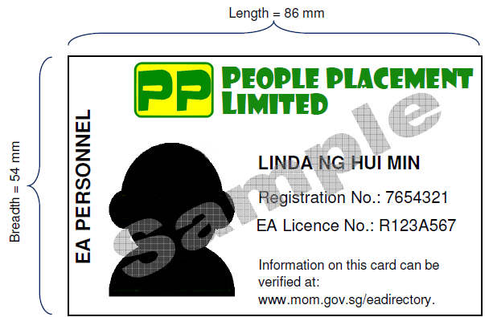

## Page 1

# A GUIDE FOR **_MIGRANT WORKERS_** 

**1**

## Page 2

## CONTENTS 

||PAGE NUMBER|
|---|---|
|**Welcome to Singapore**|**01**|
|**Living in Singapore**|**02**|
|**Getting Around in Singapore**|**06**|
|**Working in Singapore**|**08**|
|**Employment Rights**|**12**|
|**Employment Laws**|**20**|
|**Employer’s Obligations**|**24**|
|**Employment Scams**|**27**|
|**Safety**|**27**|
|**Seeking Medical Treatment**|**30**|
|**Singapore Laws**|**34**|
|**Money Matters**|**38**|
|**Useful Telephone Numbers**|**42**|
|**COVID-19 Information**|**44**|

Information contained in this handy guide is accurate at the time of print. Visit **www.mom.gov.sg** for more information

## Page 3

### WELCOME TO SINGAPORE 

Welcome to Singapore! This guide will provide you with information that will help you adapt and adjust to your new working and living environment. It is important that you know your employment rights and responsibilities, and abide by the laws of Singapore. 

If you experience any employment-related issues, you should seek immediate help from: 

<!-- Start of picture text -->
MINISTRY OF   MIGRANT WORKERS’ MANPOWER (MOM) CENTRE (MWC) TEL: 6438 5122 TEL: 6536 2692 Ministry of Manpower   579 Serangoon Road Services Centre Singapore 218193 1500 Bendemeer Road Singapore 339946 51 Soon Lee Road Singapore 628088 You can also approach FAST team officers in your dormitory for help. <!-- End of picture text -->

Use the link or QR code below to inform MOM of your Singapore mobile number. This will enable MOM to update you about employment-related matters during your stay in Singapore. 

Share with us your mobile number: **www.mom.gov.sg/update_contact_details** 

**1**

## Page 4

### LIVING IN SINGAPORE 

##### ABOUT SINGAPORE 

Singapore is a multi-racial and multi-cultural country, made up of different races, religions and languages. It is important to understand and respect each other’s differences and live and work together in harmony. 

##### **Religions in Singapore** 

There are several religions practised in Singapore, such as Buddhism, Christianity, Islam, Hinduism and Taoism. Everyone is free to practise their religion, as long as they respect others’ religious practices. You can pray at the designated places of worship such as temples, churches and mosques. 

##### LOCAL SOCIAL NORMS 

While in Singapore, you should familiarise yourself with the local social norms. What is acceptable in your home country may not be acceptable in Singapore. 

##### **Below are some tips to guide you:** 

##### **Good Behaviour in Public** 

- Do not fight. 

- Do not sleep in public areas such as bus stops, void decks, public benches, parks or overhead bridges. 

- Do not talk loudly or play music loudly at night. 

- Do not gather in big groups at void decks of housing blocks to drink. 

- Do not spit or litter. 

- Do not go around topless in public areas. 

##### **Personal Hygiene** 

It is important to keep yourself clean to minimise the risk of illness and infection, and improve your overall health. 

- Shower and wash your hair. 

- Brush your teeth. 

- Wash your clothes. 

- Wash your hands with soap regularly. 

**2**

## Page 5

##### **8 Steps of Hand Washing** 

<!-- Start of picture text -->
1 2 Wash your palms Scrub each finger and between fingers <!-- End of picture text -->

<!-- Start of picture text -->
3 4 <!-- End of picture text -->

Rub back of hands and between fingers 

Rub the base of the thumbs 

**5 6** Back of fingers Scrub your nails on palms 

<!-- Start of picture text -->
7 8 Wash your wrist Dry hands with clean <!-- End of picture text -->

Dry hands with clean towel or tissue 

##### **Monitoring Health Status** 

Download this free mobile app, **FWMOMCare** , to monitor your health status. It also lets those who are unwell get prompt medical consultation with its 24/7 telemedicine service. 

Use the ‘Safe@Home’ function to scan the displayed QR Code in your dormitory room and report your location before you leave for work and return back from work daily. Check ‘My Profile’ to ensure that your mobile number is kept up-to-date. 

**3**

## Page 6

**Save Water** 

Do not leave the tap running while brushing your teeth, use a mug. 

Do not wash dishes and clothes under a running tap; use a container filled with water. 

Do not waste water. 

Do not leave the tap running while showering; keep showering time to under 5 minutes. 

Turn off the tap when not in use and report any leaks. 

Do not damage or alter any water fitting. 

##### WHERE TO GO ON YOUR REST DAY 

You can visit recreation centres in your free time. There are amenities and activities catered for you. 

##### **Recreation Centres** 

There are eight recreation centres located around Singapore. They provide free sports facilities such as badminton/basketball courts, soccer and cricket fields. You can remit money, visit the barber, buy groceries at the supermarket, or have a meal at the centre. 

**4**

## Page 7

Details of the recreation centres are as follows: 

##### Recreation Centre (RC) Address 

**Cochrane RC 100 Sembawang Drive, Singapore 756998 Kaki Bukit RC 7 Kaki Bukit Avenue 3, Singapore 415814 Kranji RC 11 Kranji Road, Singapore 737673 Penjuru RC 27 Penjuru Walk, Singapore 608538 Soon Lee RC 51 Soon Lee Road, Singapore 628088 Terusan RC 1 Jln Papan, Singapore 619392 Tuas South RC 10 Tuas South Street 13, Singapore 636937 Woodlands RC 200 Woodlands Industrial Park E7, Singapore 757177** 

##### LIQUOR LAWS IN SINGAPORE 

If you drink alcohol, you must know the liquor laws which govern where and what time you can drink, and where you can buy alcohol. 

There are liquor control zones such as Geylang and Little India that have different restrictions. You can buy and drink alcohol only within licensed outlets such as coffee shops in Geylang and Little India. Drinking alcohol outside these venues is against the law. 

Action will be taken if you are found drinking in public during prohibited hours, and your work permit will be cancelled. 

For information of the liquor laws, please go to www.mha.gov.sg 

**5**

## Page 8

### GETTING AROUND SINGAPORE 

It is easy to get around Singapore. The different types of transport are as follows: 

- Bus 

- Mass Rapid Transit (MRT) 

- Light Rail Transit (LRT) 

- Taxi 

- Private Hire Vehicles 

##### **EZ-Link Cards** 

To travel by bus, MRT or LRT, you will need an ez-link card which can be purchased at MRT stations and bus interchanges. Your ez-link card will have stored value in it. You can top up your card at ticket machines located at MRT stations and bus interchanges. Topping up can be done with your bank ATM card. You may approach the staff at the information counter at MRT stations or bus terminals for assistance. 

_Details of bus and train routes and fares are displayed at bus stops, MRT and LRT stations._ 

**Good Behaviour on Public Transport** 

Be considerate to fellow passengers when travelling on buses and trains. 

- Queue up while waiting to board the bus or train. 

- Give up your seat to someone who needs it more such as an elderly passenger. 

- Move in when standing, do not block the entrance so that others can board or exit. 

- Give way by letting others alight before your board. 

- Put your bag down so that others have more room to move. 

**6**

## Page 9

##### SAFETY ON THE ROAD 

##### **Safe Cycling** 

If you ride a bicycle, cycle safely. 

- Always cycle on bicycle paths and look out for other cyclists or pedestrians. 

- Be mindful of pedestrians and slow down. Ring your bicycle bell from a distance to alert pedestrians, especially on shared pavements. 

- Follow the traffic rules and keep close to the side of the road. Do not cycle in the middle of the road or against oncoming traffic. 

- When cycling, park your bicycle in the allocated parking areas. Do not leave your bicycle in the middle of the road or pavement, as it will obstruct drivers and pedestrians. 

##### **Road Safety** 

It is important to stay safe when on the road. 

- Follow traffic rules. Do not jaywalk. Always cross the road at traffic lights. 

- Cross the road when the traffic light is green. 

- Use a pedestrian crossing, overhead bridge or underpass to get safely to the other side of the road. 

- If driving, give way to pedestrians and slow 

down when approaching road openings, junctions or pedestrian crossings. 

##### **Travelling On Lorries** 

Your employer may provide you with transport between your worksite and your dormitory. However, if you are placed in a dangerous situation such as in a crowded lorry, please inform your employer. Your safety is important. If your employer refuses to help you, report to the **Land Transport Authority (LTA)** at **1800-2255-582** . 

**7**

## Page 10

### WORKING IN SINGAPORE 

To work in Singapore, you must hold a valid work permit and comply with the work permit conditions. 

##### **In-Principle Approval (IPA) Letter** 

Before leaving your home country, you should receive an in-principle approval (IPA) letter (5-6 pages) in your native language, from your employer or home country agent. The IPA letter is issued by MOM and contains important information about your employment in Singapore. Your employer is required to meet the conditions stated in your IPA letter and he cannot change the conditions without your permission. Take note of the following in your IPA: 

**1** Your name and work permit number 

**8**

## Page 11

- **2** Your employer’s name **3** Your occupation **4** Your Singapore employment agency (EA) and the agency fee to be paid to your Singapore EA 

- **5** Period of work permit **6** Your basic monthly salary, fixed monthly salary, fixed monthly allowances, and monthly deductions 

- **7** Housing Provision 

- **8** You can only work for the occupation as mentioned in your IPA 

**9**

## Page 12

- **9** You must obey the work permit conditions while you are in Singapore 

<!-- Start of picture text -->
10 Your rest day entitlements <!-- End of picture text -->

You should receive the salary shown on your IPA letter. If your employer reduces your salary without getting your written consent, approach MOM for help. 

You should keep a copy of your IPA letter throughout your employment in Singapore. 

- **11** The steps that your employer must complete within 14 days 

**10**

## Page 13

##### **Work Permit** 

You are required to keep your work permit card with you at all times. If you have not received your work permit card, please keep a copy of your IPA letter with you. 

You will be required to show your work permit card during inspections by MOM or any public agencies. 

##### **Passport** 

Your passport is your personal property. It must not be kept by your employer as a condition of your employment. If your employer is keeping your passport on your behalf, it must be returned to you immediately upon your request. 

<!-- Start of picture text -->
PASSPORT PASSPORT <!-- End of picture text -->

##### **Seek Help** 

If your employer reduces your salary without your consent, does not return your passport or work permit when you request for it, report to **MOM** immediately by calling **6438 5122** , or approach MOM Services Centre at 1500 Bendemeer Road, Singapore 339946. 

**11**

## Page 14

### EMPLOYMENT RIGHTS 

##### **Working and Living in Singapore** 

Your employer must give you a set of Key Employment Terms (KETs) in writing. The KETs must contain information on your agreed employment terms and conditions, including: 

- Salary, date of salary payment, and entitlement to overtime pay. 

- Working arrangements, such as working hours and rest days. 

- Paid leave entitlements (including annual leave, sick leave and public holidays) and medical benefits. 

If you have any concerns in the following areas, please report to **MOM** or the **Tripartite Alliance for Dispute Management (TADM)** as early as possible. TADM is located at MOM Services Centre. 

##### **(a)   Payment of Salary/Overtime Pay** 

- **1** You should open a personal bank account in Singapore and request your employer to credit your salary to the bank account. This will reduce any payment dispute with your employer. Your employer must pay your salary via direct transfer into your bank account if you request them to do so. 

- **2** Your employer must pay you your salary at least once a month, and within 7 days after the end of the salary period. Any salary period agreed between you and your employer should not exceed one month. 

- **3** If you have worked overtime during the month, your employer must pay you for any overtime at least once a month and within 14 days after the end of the salary period. 

**12**

## Page 15

**4** 

   - Your employer is not allowed to reduce your basic salary, fixed allowances or increase your fixed deductions from the amount stated in your IPA letter without your written consent. 

- **5** Your salary can only be changed if you agree and your employer does the following: **<u>Seek your consent in writing.</u>** 

   - Notify MOM. 

Issue you an itemised pay slip with the adjusted salary. 

- **6** Your employer must issue you your pay slip at least once a month and within 3 working days after a salary payment is made. The pay slip must include a breakdown of the salary payment(s), such as the basic salary, allowances, deductions, overtime hours worked and overtime pay. 

You should keep records of itemised pay slips and time sheets. 

- **7** Do not sign any blank documents or documents that you do not understand or do not agree with. You should approach MOM if your employer asks you to sign any blank documents, such as payment vouchers or pay slips. In general, employees who do not come forward early may have difficulty proving their claims to be valid. 

**13**

## Page 16

##### **(b)   Salary Deductions** 

- Your employer cannot make deductions from your salary. They can only do so if: 

You were absent from work without your employer’s consent. 

Your employer has Your employer has paid for paid for meals that you housing/accommodation, requested for. amenities and services that you accepted. 

Goods or money You gave written consent entrusted to you was to the deduction lost or damaged (one-off (you can withdraw your deduction only). consent any time before the deduction is made). 

- If a salary deduction is made, your employer cannot deduct more than 50% of your total salary in any single salary period. This does not include deductions made for: 

- Your absence from work. 

- Recovering advances, loans or over-payment of your salary. 

- Paying any co-operative society for which you had given your written consent. 

**14**

## Page 17

##### **(c)   Hours of Work and Overtime** 

- Your contractual work hours should not exceed 8 hours a day or 44 hours a week unless you perform shift work. Working hours do not include breaks allowed for rest, tea and meals. All work in excess of your contractual working hours shall be considered as overtime work. You can claim overtime pay which is 1.5 times your hourly basic pay. 

- If you perform shift work, the agreed working hours must not exceed an average of 44 hours per week over 3 weeks. The maximum working hours per day is 12 hours, and maximum overtime per month is 72 hours. 

- Your employer must record the hours of overtime you have worked. You should verify your employer’s record and sign only if it is accurate. If you disagree with the record, you should clarify with your employer early and do not sign it. 

To calculate your overtime pay: 

STEP 1 Calculate your hourly basic rate of pay: **12 x Monthly Basic Pay = HOURLY BASIC RATE OF PAY 52 x 44** STEP 2 Calculate your hourly rate of overtime pay: **[Hourly basic rate of pay] x [1.5] = HOURLY RATE OF OVERTIME PAY** STEP 3 Calculate your overtime pay: **[Hourly rate of overtime pay] x [number of hours of overtime worked] = OVERTIME PAY** 

**15**

## Page 18

##### **(d)   Sick Leave** 

- You are entitled to be paid outpatient sick leave and hospitalisation leave if you have worked for your employer for at least 3 months. The number of days of paid sick leave that you are entitled to depends on the length of service completed, as follows: 

|**Months of Service**|**Paid Outpatient Sick**|**Paid Hospitalisation**|
|---|---|---|
|**Completed to date**|**Leave per year (days)**|**Leave per year (days)**|
|**3 months**|5|15|
|**4 months**|8|30|
|**5 months**|11|45|
|**6 months** **and thereafter**|14|60|

- You must inform your employer within 48 hours of your absence to be eligible for sick leave. 

- Your employer must pay you your salary for the period of sick leave taken on your normal working day if you: 

- were given a medical certificate for the period of the sick leave by any doctor registered under the Medical Registration Act, and 

- have not exceeded your sick leave entitlements for that year. 

##### **(e)   Rest Days and Public Holidays** 

- You are entitled to one rest day each week, without pay. 

- Your employer cannot force you to work on your rest day, unless there are exceptional circumstances, and they must seek your agreement to work on that day. 

**16**

## Page 19

##### **Payment for work on a rest day is calculated as follows:** 

|**If work is done**|**For up to half** **your normal daily** **working hours**|**For more** **than half your** **normal daily** **working hours**|**Beyond your** **normal daily** **working hours**|
|---|---|---|---|
|At the employer’s request|1 day’s salary|2 day’s salary|2 day’s salary + overtime pay|
|At the employee’s request|Half day’s salary|1 day’s salary|1 day’s salary + overtime pay|

- You are entitled to 11 paid public holidays per year. 

- Your employer must pay you your gross salary for the public holiday, 

- even if you did not work on the public holiday. 

- If you worked on the public holiday, your employer must pay you an extra day’s basic salary for the day’s work, or give you a day off in lieu or time-off (only for non-workmen earning above $2,600). 

##### **(f)   Annual Leave** 

- If you have worked for your employer for at least 3 months, you are entitled to paid annual leave. 

- Your annual leave entitlement depends on your years of service with the employer, as shown below. 

|**Years of continuous service**|**Days of leave per year**|
|---|---|
|1st|7|
|2nd|8|
|3rd|9|
|4th|10|
|5th|11|
|6th|12|
|7th|13|
|8th and thereafter|14|

- If you have not completed 12 months of continuous service, your annual leave entitlement will be pro-rated based on the number of completed months of service for that year. 

**17**

## Page 20

##### **Salary Claims and Employment Benefits** 

If you have any salary claims, and/or employment disputes against your employer, you should approach MOM or TADM as early as possible. By coming forward early, your chances of recovering your owed salary in full will be higher, and you will be given time to look for a new employer. If needed, you will get assistance with food and housing. 

##### **IMPORTANT NOTE** 

Your employer cannot forcibly send you back to your home country if he owes you any salary or any other payments due to you. 

If you have any outstanding salary or claim, and you have been sent to the airport with no means to leave, you should approach the airport authorities at Singapore Immigration counters. You will be referred to MOM for assistance. 

##### **Your Singapore Employment Agency** 

##### **Fee Cap on Employment Agency Fees** 

You should pay no more than 1 month of your fixed monthly salary for each year of your work permit validity or duration of employment contract, whichever is shorter, to the Singapore employment agency. The agency fee is also capped at 2 months’ salary. The employment agency must issue you with itemised receipts for any fees you pay, stating the services rendered and amount collected. 

**Fixed Monthly Salary** = Basic Monthly Salary + Fixed Monthly Allowances 

**18**

## Page 21

#### EXAMPLE 

#### 1 

#### EXAMPLE 

#### 2 

#### EXAMPLE 

#### 3 

If your work permit and employment contract are valid for 2 years, the maximum agency fees paid to the Singapore employment agency is **2 months** of your fixed monthly salary. 

If your work permit is valid for 2 years, but your employment contract is only valid for 1 year, the maximum agency fees paid to the Singapore employment agency is **1 month** of your fixed monthly salary. 

If your work permit and employment contract are valid for more than 2 years, the maximum agency fees paid to the Singapore employment agency is **2 months of your fixed monthly salary.** 

If your Singapore employment agency has collected agency fees that exceed the fee cap, or did not issue you with itemised receipts for the fees paid, or failed to refund you in the event of a premature termination of your employment, please report to **MOM** immediately by calling **6438 5122** or approach MOM Services Centre at 1500 Bendemeer Road, Singapore 339946. 

##### **Fee Refund** 

If your employer terminates your employment within 6 months, you must be refunded at least 50% of the agency fees you paid to the Singapore employment agency. However, you cannot get a refund if it was your decision to terminate the employment. 

The above applies only to employment agencies operating in Singapore. 

MOM will not be able to help you with any dispute with your employment agency in your home country, or to recover fees paid to employment agencies in your home country. 

**19**

## Page 22

### EMPLOYMENT LAWS 

As a work permit holder, you must comply with the conditions of your work permit. It is an offence to breach any work permit condition, with the following consequences: 

You will be fined or jailed. 

Your work permit will be cancelled. 

You will not be allowed to work in Singapore in the future. 

##### **(1)   Checking Validity of Work Permit** 

Should your employer cancel your work permit before it expires, you will not be allowed to continue working in Singapore. You can check the validity of your work permit by downloading the SGWorkPass app or by logging on to the MOM website. 

##### **a)   SGWorkPass** 

_A free mobile app to check if your work pass is valid._ 

Download the SGWorkPass app to scan the QR code on your work permit card to verify its validity instantly. If your work permit card does not have a QR code, you can use the unique Card Serial Number printed on the front of your card. 

**20**

## Page 23

##### **b)   MOM Website** 

You can log on to the MOM website at www.mom.gov.sg/check-wp and follow the steps below. 

- 1)   Select: _Enquire._ 

- 2)   Select: _Work Permit Validity / Application Status._ 

- 3)   Enter your work pass number and your name, then click _Next_ . 

##### **(2)   Employment** 

- You must work only in the occupation and for the employer specified on your work permit card. 

- You are not allowed to work in another occupation even if instructed by your employer. 

- You cannot take part in any other business or start your own business to earn extra money. 

- You must carry your original work permit card at all times and produce it for inspection by any public officer. 

**21**

## Page 24

If you are asked to work in a different job or for a different employer, you should report to **MOM** immediately by calling **6438 5122** , or approach MOM Services Centre at 1500 Bendemeer Road, Singapore 339946. 

##### **(3)   Conduct** 

- You need the approval of the Controller of Work Passes to marry a Singapore citizen or permanent resident (either in Singapore or outside of Singapore). This also applies after a work permit becomes invalid. 

- You must not become pregnant or give birth in Singapore unless you are married to a Singapore citizen or permanent resident and you have the approval of the Controller of Work Passes. This also applies after a work permit becomes invalid. 

##### **4) Do not be an Unlicensed Employment Agent** 

- It is illegal to conduct any form of employment agency activities without a license from MOM, such as: 

- (i) collecting money or benefits from family or friends for the purpose of helping them find jobs, 

- (ii) collecting any personal document or resume / CV from any job applicant for the purpose of helping them find jobs, 

- (iii) submitting work pass applications on behalf of any employer or job applicant, and/or 

- (iv) assisting to place any jobseeker with an employer. 

The penalty for committing any of these offences is a maximum fine of $80,000 and/or imprisonment for up to 2 years. Your work permit will be revoked, and you will be sent home and not be allowed to work in Singapore. 

**22**

## Page 25

##### **5) Do not Engage an Unlicensed Employment Agent or Agency** 

- It is illegal to engage the services of any unlicensed employment agent. 

- If you engage an unlicensed employment agent, you may not find employment and may lose the agency fees that you paid. You will be fined up to $5,000 for each time you engaged an unlicensed employment agent. 

**Always check if your employment agent or agency is licensed with MOM.** 

- Ask to see the registration card of the employment agency personnel (see sample below). Take note of the name and registration number stated on the card. 

- Check your agent’s name in MOM’s Employment Agency 

- directory at www.mom.gov.sg/eadirectory to confirm that you are dealing with a licensed agency. 

_Sample of registration card of licensed employment agent_ 

You should report anyone who is conducting unlicensed employment agency activities. Your identity will be kept confidential. 

##### **Penalty for Breaching Work Permit Conditions** 

If you breach any of the above work permit conditions, your work permit will be cancelled and you will not be allowed to work in Singapore in the future. 

**23**

## Page 26

### EMPLOYER’S OBLIGATIONS 

Your employer has responsibilities to fulfil during the term of your employment. Your employer is not allowed to demand or receive money from you as a condition for employing you. He cannot make you pay or deduct money from your salary for the following costs: 

<!-- Start of picture text -->
1 2 <!-- End of picture text -->

<!-- Start of picture text -->
3 4 <!-- End of picture text -->

Work pass renewal 

Security bond 

Medical insurance Repatriation costs 

**5 6 7** Compulsory Medical fees Levy payment training 

For example, if your work pass is due to expire, your employer must pay to renew it. He cannot ask you to pay or deduct money from your salary for the renewal fees. 

If your employer makes deductions from your salary, check with your employer what the deduction is for. If the deduction is for any of the costs listed above, report to **MOM** immediately by calling **6438 5122** , or approach MOM Services Centre at 1500 Bendemeer Road, Singapore 339946. 

**24**

## Page 27

**Accommodation** 

Your employer must ensure that your accommodation meets the necessary standards and is not overcrowded. If you find your accommodation to be in poor or unsafe conditions, report to **MOM** immediately by calling **6438 5122** , or approach MOM Services Centre at 1500 Bendemeer Road, Singapore 339946. 

Examples of poor or unsafe conditions include: 

Overcrowding. 

Lack of proper sanitation facilities or ventilation. 

Infestation with pests (e.g. rats, mosquitoes, cockroaches). 

Damaged or unrepaired facilities within your dormitory. 

You may stay in private residential premises such as condominiums, shophouses and terrace houses. A maximum of 6 workers is allowed to stay in private residential premises. If there are more than 6 workers living in the same accommodation as you, make arrangements with your employer to move out. 

**25**

## Page 28

##### **Updating of Address** 

You must stay at the address indicated by your employer to MOM.  If you look for your own accommodation or change your accommodation at any time, you must inform your employer of your latest residential address so that they can inform MOM. Your work pass will be revoked if you fail to do so. 

##### **Practise Communal Hygiene** 

Keep where you live clean and tidy, so that you can remain healthy and not fall sick. 

- Keep your bed clean to prevent bed bugs. 

- Keep your living environment clean to prevent pests such as cockroaches and rats. 

- Remove stagnant water to prevent mosquito-breeding. 

##### **Reporting of Housing Issues to Your Dormitory Operator** DormWatch app 

_A free mobile app for you to report housing issues_ 

If you live in a dormitory, the DormWatch app allows you to report on defects, broken facilities or equipment directly to the dormitory operator. MOM will also be kept informed on the progress of the issue and step in and inspect the premises if necessary. You can download the app by scanning the below QR code. 

**26**

## Page 29

### EMPLOYMENT SCAMS 

Beware of becoming a victim of employment scams: 

- **Shell company / released worker / illegal employment** – you find yourself with no work after arriving in Singapore, because your promised employer or job does not exist, or you are asked to find your own work illegally. 

- **False declaration** – your employer applies for your work permit with a forged educational certificate from a school you did not attend. 

- **Kickbacks** – you paid your employer money to work in Singapore, or to renew your work permit. 

- **False salary declarations** – your employer declares a higher salary in the 

- In-Principle Approval (IPA) to MOM than what they are actually paying you. 

If you are a victim of any of the scams, report to **MOM** immediately by calling **6438 5122** , or approach MOM Services Centre at 1500 Bendemeer Road, Singapore 339946. 

### SAFETY 

##### SAFETY AT WORK 

If you work in Construction, you must complete the Construction Safety Orientation Course. While at work, you must follow what you had learnt during the course and the safety instructions given by your employer or supervisor. 

- Always wear the correct Personal Protective Equipment (PPE) (e.g. helmet, safety goggles, hearing protectors, gloves and safety boots) for the work you are doing, and keep the PPE in good working condition. 

- Wear your safety harness and secure it to a stable anchor point. 

- Do not take risks or shortcuts or ignore safety rules. 

**27**

## Page 30

##### **Look out for these common hazards and keep yourself safe:** 

##### WORKING AT HEIGHTS 

- Use proper platforms when carrying out work at heights. 

- Always maintain three-point contact when using ladders. 

##### BEWARE OF FALLING OBJECTS 

- Stay clear of suspended loads. 

- Do not place or store equipment and materials near openings. 

- Wear your safety helmet and steel-capped boots. 

##### FALL PREVENTION 

- Keep the workplace dry, clean and free from spills and tripping objects such as wires. 

- Hold onto handrails when using the stairs. 

- Wear anti-slip safety boots. 

##### ELECTRICAL HAZARDS 

- Do not use faulty electrical equipment or faulty power sockets. 

- Keep the work area clean and dry. 

- Carry out electrical work only in dry conditions. 

- Wear rubber gloves and boots. 

**28**

## Page 31

- When using extension cords and electrical appliances, use only those with the ‘safety mark’ _(see logo below)._ 

##### CONFINED SPACES 

- Always conduct a gas check before entering a confined space. 

- Put on protective equipment (e.g. respirator, full body harness and retrieval line) before entering a confined space. 

##### FIRE HAZARDS 

- Look out for flammable materials such as solvents, pressurised tanks and sawdust before carrying out hot works. 

##### DRIVING AT WORK 

   - Watch out for vehicles and keep to walkways when walking around the workplace. 

   - Avoid driving if you are taking medicine that causes drowsiness. 

   - Take short breaks to stretch and rest if you are driving for long hours. 

   - Check blind spots before reversing. 

   - Place traffic cones around your work area to keep vehicles away. 

- Keep flammable materials in closed containers and store them in wellventilated areas. 

**29**

## Page 32

### SEEKING MEDICAL TREATMENT 

Inform your employer when you are sick and that you need to see a doctor. You can see a doctor at: 

MOM approved **Medical Centres** nearest to your place of work or stay 

**OR** 

MOM designated **General Practitioner (GP) Clinics** 

**Telemedicine doctor** (online consult only) via **FWMOMCare** app 

Your employer must allow you to see a doctor and he is responsible for paying your medical bills. Please remember to obtain a medical certificate and a receipt for payment from the medical clinic to give to your employer. You should take a photo of the medical certificate and receipt for your own records. 

If your employer refuses to provide or pay for your medical treatment, report to **MOM** immediately by calling **6438 5122** , or approach MOM Services Centre at 1500 Bendemeer Road, Singapore 339946. All information will be kept strictly confidential. 

**30**

## Page 33

##### INJURY FROM WORK 

Your employer is responsible for the safety, health and well-being of all his employees. 

##### **What to do if you are injured at work?** 

**1** Report your injury to your supervisor/employer and seek treatment quickly. If you receive any hospitalisation leave/medical leave or light duty from the doctor/dentist, inform your supervisor/ employer to submit an incident report to MOM. 

**2** If your employer does not submit an incident report when you are injured at work, please inform MOM. You can inform MOM by calling 64385122, or coming down to MOM Services Centre (1500 Bendemeer Road, Singapore 339946) to speak to an MOM officer. You only need to give MOM your contact details, the name of your employer and the date of the accident. MOM can assist you even if you are unable to speak English. 

<!-- Start of picture text -->
MC MOM <!-- End of picture text -->

<!-- Start of picture text -->
$$$ BILL <!-- End of picture text -->

<!-- Start of picture text -->
3 <!-- End of picture text -->

<!-- Start of picture text -->
4 <!-- End of picture text -->

<!-- Start of picture text -->
5 <!-- End of picture text -->

<!-- Start of picture text -->
6 <!-- End of picture text -->

- Keep records of your correspondence (e.g. your WhatsApp and SMS messages, etc.) with your supervisor/employer on the work accident details. 

- Ask a friend to take photos of the place that you were injured, and the tools or machinery that caused your injury. Show the photos to the doctor. 

- If you are scheduled for a medical appointment, please attend the appointment and do not instead go to other doctors. The treating doctor is in the best position to assess your injury and aid your recovery. Failure to attend scheduled medical appointments will result in the suspension of your work injury compensation claim. 

- Keep a copy of the documents relevant to your injuries (e.g. medical certificates, medical bills) and hand the originals to your employer. 

<!-- Start of picture text -->
7 $ $$ <!-- End of picture text -->

- The insurer or MOM will calculate the compensation amount and issue a notice to you and your employer. If there is no objection to the amount, your employer/insurer must pay you within 21 days of the notice service date. Your employer will handle your compensation claim and will notify MOM. 

**31**

## Page 34

##### **Filing a Claim** 

- You do not need to file a claim because your case will automatically start to process when your employer submits the incident report to MOM. 

- While the claim is being processed, you should remain with your employer, as he is required to continue to provide you with food and housing. If your employer forces you to return to your home country and does not report the accident, call MOM at 6438 5122 immediately. 

- If your employer sends you to the airport and forces you to leave Singapore, you can seek assistance from the officers at the airport immigration counters. 

DID YOU You do not need a lawyer to help you with your WICA claim. The compensation amount is based on a fixed formula. More than 75% of WICA claims are KNOW? settled within eight months from the accident date. 

##### **What can I claim, and how much is the amount?** 

Under WICA, you can claim the following types of compensation, **<u>only if</u>** you visit a Singapore-registered doctor or dentist. 

|**Type of Compensation**|**What is it?**|
|---|---|
|**Medical Expenses**|Your medical bills, and other charges due to work injury e.g. fees for work injury assessment reports.|
|**Medical Leave Wages**|• If you receive any hospitalisation leave/medical leave or light duty due to a work accident. • For days on which you would normally be at work (working days), but not for rest days or public holidays.|
|**Lump Sum** **Compensation**|• Permanent incapacity – when an injury or medical condition has a permanent effect on your ability to work. • Death - when an injury causes death.|

**32**

## Page 35

If you need assistance in your work injury compensation claim, you can call **6438 5122** , or approach **MOM** at 1500 Bendemeer Road, Singapore 339946. 

##### **Do not make false claims** 

Do not make a false claim or give false information that you were injured at work so as to obtain work injury compensation. Workers who do so will be fined and/or jailed, and will not be able to return to Singapore to work. 

##### **WICA vs Common Law** 

Most workers who are injured receive fair and timely compensation under WICA. You have the right to withdraw your WICA claim with MOM, and instead engage a lawyer to make a common law claim. However, please keep in mind that common law claims often take longer to resolve, and you will need to prove in court that the injury was caused by your employer’s negligence. We have received reports that some people mislead workers into withdrawing their WICA claims, to earn commission from lawyers. As such, please consider your options carefully. 

**33**

## Page 36

### SINGAPORE LAWS 

**While working here, you must obey Singapore laws. Otherwise, you will face the penalties. Your work permit will be revoked and you will not be allowed to enter Singapore in the future.** 

|**Offences**|**Penalties**|
|---|---|
|**Littering**|• Fine of up to $2,000, with increased fines for repeat offenders.|
|**Wastage of water**|• Imprisonment of up to 3 years or a fine of up to $50,000, or both. • $1,000 for every day or part thereof in case of continuing offence.|
|**Urinating in public** **places**|• Fine of up to $1,000, with increased fines for repeat offenders.|
|**Jaywalking**|• Imprisonment of up to 3 months or a fine of up to $1,000, or both, with increased fines for repeat offenders.|
|**Public drunkenness**|• Imprisonment of up to 1 month or a fine of up to $1,000. • For offenders detected within the Liquor Control Zone, an enhanced penalty of not more than 1.5 times will apply.|
|**Unlawful consumption** **of liquor in public places**|• Fine not exceeding $1,000. • For offenders detected within the Liquor Control Zone, an enhanced penalty of not more than 1.5 times will apply.|
|**Making a false** **police report**|• Imprisonment of up to 6 months or a fine of up to $5,000, or both.|
|**Theft (stealing** **or shoplifting)**|• Imprisonment of up to 3 years or a fine, or both for simple theft.|

**34**

## Page 37

|**Housebreaking**|• Imprisonment of up to 10 years or a fine, or both. • Imprisonment of up to 14 years or a fine, or both if housebreaking is committed at night.|
|---|---|
|**Buying or selling of** **contraband cigarettes**|• Fine of up to 40 times the amount of duty evaded, and / or jail for up to 6 years. • Minimum court fine for first-time and repeat offenders is $2,000, and $4,000, respectively.|
|**Overstaying**|• Imprisonment of up to 6 months, or a fine of up to $4,000, or both for overstaying 90 days or less. • Caning of not less than 3 strokes (or a fine of $6,000, if not eligble for caning) and / or imprisonment of up to 6 months for overstaying more than 90 days.|
|**Criminal intimidation**|• Imprisonment of up to 2 years or a fine, or both. • Imprisonment of up to 7 years or more, or a fine, or both, if the threat is to cause death or grievous hurt, or to cause destruction of property by fire.|
|**Causing hurt**|• Imprisonment of up to 2 years or a fine of up to $5,000, or both. •    Imprisonment of up to 10 years and a fine, or caning, if the hurt caused is grievous.|
|**Unlawful assembly or** **procession**|• Imprisonment of up to 2 years, or a fine, or both.|
|**Rioting**|• Caning and imprisonment of up to 7 years, for rioting. • Caning and imprisonment of up to 10 years if weapons are used.|
|**Outrage of modesty**|• Imprisonment of up to 2 years, fine, caning, or any combination. • Caning, fine and / or imprisonment of up to 5 years if offence is committed on a victim below 14 years of age.|

**35**

## Page 38

|**Robbery**|• Imprisonment between 2 and 10 years and caning of not less than 6 strokes. • Imprisonment of between 3 and 14 years and caning of not less than 12 strokes if robbery is committed at night.|
|---|---|
|**Drug trafficking** **and consumption**|• Imprisonment of up to 30 years and 15 strokes of the cane, or even the death sentence for drug trafficking. • Imprisonment of up to 10 years or $20,000 fine, or both for drug consumption or possession.|
|**Murder**|• Mandatory death penalty (for murder with the intention of causing death). • Death penalty or life imprisonment (for other types of murder).|

##### **Public Order in Singapore** 

It is an offence to conduct or participate in an illegal assembly or procession. This means you must not gather in large groups in a public place to show support or opposition to the views or actions of any person, group of persons or any government. If you are caught, your work permit will be cancelled. 

##### **Bribery** 

Singapore adopts a zero-tolerance approach towards bribery. Bribery in exchange for favours is a serious offence, and the Corrupt Practices Investigation Bureau (CPIB) will not hesitate to take action against any party involved in such acts. Bribes can come in many forms such as: 

Money 

Loans 

Gifts 

Promises 

Sex 

Attempting to give or receive a bribe is an offence. 

**36**

## Page 39

##### **Penalty for bribery** 

Imprisonment of up to 5 years or fine of up to $100,000 or both. Your work permit may be cancelled and you will not be allowed to enter Singapore in the future. 

##### **Reporting bribery** 

If you are approached to give or receive a bribe, you can report the matter to the CPIB via the following channels: 

- 1) Walk-in to the CPIB at 2 Lengkok Bahru, Singapore 159047 or the Corruption Reporting and Heritage Centre at 247 Whitley Road, Singapore 297830. 

- 2) Call the 24-hour hotline at 1800-376-0000. 

- 3) Email report@cpib.gov.sg. 

##### **SGSecure: Stay Alert. Stay United. Stay Strong.** 

The government will not condone any form of support for terrorism. We will take firm and decisive action against any person, regardless of nationality, who engages in any activity in support of terrorism. 

Inform the police at **1800-255-0000** if you see any person who shows support for, or participates in terrorism-related activities. 

Stay vigilant of suspicious behaviours, and unattended or abandoned items that seem out of place at your dormitories and workplaces. 

Scan the QR code to download the **SGSecure app** to receive important alerts during times of crises. It will also allow you to report incidents and download useful information from the authorities. 

**37**

## Page 40

### MONEY MATTERS 

##### **Good Financial Habits** 

Remember why you came to Singapore to work. It is to earn money to send home to your family. It is important to manage your money so that you have enough to spend and save. 

1. **Learn how to budget** 

- Budgeting means planning what to do with your money. Understand what your needs are, e.g. pay for your family’s healthcare or education expenses, and then plan how much to save.  You should put aside money for your necessities. 

2. **Grow your savings** 

- Set aside an amount of money monthly, and deposit it into your bank account. Plan for what you can do back home with this money, e.g. build a new home, set up a business. 

3. **Cut down on unnecessary spending** 

- Before purchasing an item, ask 

- yourself whether you really need it. 

##### **Remit Money Home Safely** 

- **Automated Remittance Kiosk** 

   - Use authorised remittance kiosks located in dormitories or at a recreation centre Unlicensed remittance agents such as hawala or hundi brokers may run away with your money. 

- **Online Remittance Websites and Mobile Apps** 

   - Use only licensed online remittance services and mobile apps. Never send money home through WhatsApp or any instant messaging platforms. Check if the remittance company is licensed by searching their name on Monetary Authority of Singapore’s website at https://eservices.mas.gov.sg/fid. 

**38**

## Page 41

- **Ask your Employer for Assistance** 

   - If you are unable to send money home on your own, ask your employer to assist you. Your employer must show you proof of the successful remittance transaction. 

It is not safe to carry large amounts of cash in crowded public places. 

Do not engage unlicensed remittance agents such as hawala or hundi brokers as they may run away with your money. 

It is illegal to operate an unlicensed remittance business, or to be involved with one. If caught doing so, you will be fined up to $100,000 or jailed for up to 2 years, or both. Your work permit will be revoked. 

##### **Seek Help** 

If you face financial difficulties, approach your employer to discuss what can be done. You can also contact the **Migrant Workers’ Centre (MWC)** at **6536 2692** for advice. 

##### **Unlicensed Moneylenders** 

Do not borrow from unlicensed moneylenders and do not act as runners or brokers for moneylenders. Do not help any moneylender to give loans to your friends in return for any benefit. If you do, your work permit will be revoked and you will not be allowed to work in Singapore again. 

_Learn to Identify Unlicensed Moneylenders_ 

- They have no shopfront. 

- They send you a message via SMS/Facebook or call you to take loans from them. 

##### _Ignore Unlicensed Moneylenders_ 

- Do not believe the offer of ‘free money’ or ‘interest-free loan’.  Ignore these messages and delete any texts immediately. 

**39**

## Page 42

- Do not respond to the messages. If you respond in any way (give your name, number, address, bank account etc), the unlicensed moneylenders may say that you have taken a loan. 

- If they contact you again, please call the Police at ‘999’ or 1800 255 0000 or tell your employer. 

- Do not lend your work permit to your friends to borrow money. 

##### **Penalties** 

For assisting in the business of unlicensed moneylenders: 

- Fine between $30,000 and $300,000. 

- Imprisonment of up to 4 years. 

- Caning of up to 6 strokes. 

If you are found to have borrowed from unlicensed moneylenders, MOM will inform your employer and your work permit will be revoked. You will be sent back home and not be allowed to work in Singapore again. 

##### **Licensed Moneylenders** 

If you decide to borrow from a licensed moneylender, beware of the following: 

- The repayment amount may grow much bigger 

- than the amount you borrowed because of the 

- high interest rate.  For example, if you borrow 

- $500, you will need to pay $1,000 back to the moneylender. 

- You may need to pay an upfront administrative fee and a late fee if you are later in your repayment. 

- Make sure the fees and interest payable are clearly explained to you. 

##### **Loan Caps** 

There are laws to protect borrowers in Singapore. The loan cap means that, based on how much you earn, you can only borrow that amount in total from all licensed moneylenders combined. 

**40**

## Page 43

|**If you earn**|**You can borrow**|
|---|---|
|Less than $10,000 a year|Up to $500|
|$10,000 and above but less than $20,000 a year|Up to $3,000|

##### **Self-exclusion Framework** 

You can apply for self-exclusion by submitting your application online, so that licensed moneylenders are not allowed to lend you money. This will prevent you from borrowing money and getting into debts. 

Self-exclusion is voluntary and is a commitment not to borrow for at least 2 years. 

You can request your employer or employment agency to apply on your behalf at www.mlcb.com.sg 

##### **Do Not Act as Guarantor** 

If your friend borrows from a licensed moneylender, you are not allowed to act as your friend’s guarantor. 

**41**

## Page 44

### USEFUL TELEPHONE NUMBERS 

##### **If you need help at any time, you can call the numbers below for assistance:** 

|**Important Numbers** **Police**|999|
|---|---|
|**Fire / Ambulance Service**|995|
|**Ministry of Manpower**||
|**Matters relating to employment, salary** **and well-being of migrant workers**|6438 5122|
|**Workplace Safety and Health Council**||
|**Matters relating to workplace saftey**|6317 1111|
|**Non-Government Organisations**||
|**MWC (Migrant Workers’ Centre)** - Matters relating to employment or when you require assistance|6536 2692 (24-hour helpline)|
|**SOS (Samaritans of Singapore)** - Help for personal issues, counselling for depression, etc.|1800 2214 444 (24-hour helpline)|
|**HealthServe** - Help on medical care, counselling, social assistance.|3138 4443 (24-hour helpline)|
|**Embassies / High Commissions**||
|**High Commission of the People’s Republic** **of Bangladesh**|6255 0075|
|**Embassy of the People’s Republic of China**|6412 1900|
|**High Commission of India**|6238 2537|
|**Embassy of the Republic of Indonesia**|6737 7422|
|**Malaysian High Commission**|6235 0111|
|**Embassy of the Union of Myanmar**|6735 1672|
|**High Commission of the Islamic** **Republic of Pakistan**|6737 6988|

**42**

## Page 45

|**Embassy of the Republic of Philippines**|6737 3977|
|---|---|
|**High Commission of the Democratic Socialist**|6254 6773|
|**Republic of Sri Lanka**||
|**Royal Thai Embassy**|6224 1797|

Do not hesitate to seek help when you are feeling stressed or pressured. If you are feeling down or having problems at home, speak to someone. If you do not know who to turn to, help is available when you call the telephone numbers above. Remember that there’s always someone available to resolve your problems. 

##### **Approach MOM or TADM for Help** 

If you face employment issues, you can contact **MOM** at **6438 5122** for assistance. 

If you have salary issues, you can approach **TADM** for assistance. TADM is located at MOM Services Centre Level 3, 1500 Bendemeer Road, Singapore 339946. 

If your employer attempts to send you home forcibly without settling any of your salary, claims, or cases, you should approach the officers at the airport immigration counters for assistance. MOM will help you. 

**43**

## Page 46

### COVID-19 INFORMATION 

##### **Safe Distancing Measures** 

Observe safe distancing measures in your dormitories and at your workplace to prevent yourself from getting infected with infectious diseases. 

- Wear a mask. 

- Keep a safe distance of 1 metre apart from one another. 

- Avoid crowds. 

##### **Rostered Routine Testing** 

Rostered Routine Testing (RRT) consists of a swab test to be conducted every 14 days. You are required to attend RRT if you are: 

- From the construction, marine and process sectors; 

- Or those from other sectors but working in construction, marine and process 

   - workplaces; 

- Or staying in a dormitory. 

If you are required to attend, you must work with your employer to schedule you for a RRT appointment. RRT is important for ensuring your safety and health, as well as those around you. If you do not attend RRT, your AccessCode will turn red, and you will not be allowed to go to work. 

##### **Exit Pass** 

If you are staying in dormitories, you need to apply for a Dormitory Exit Pass 7 days before your rest day via SGWorkPass app (see page 20) for leisure or personal purposes. You will need to have installed **TraceTogether app** too. 

With your approved Exit Pass, you can take your employer-arranged transport to your dormitory’s assigned recreation centre on your rest day within the allocated timeslot. 

When you reach the recreation centre, check in via SafeEntry. Remember to wear a mask at all times, keep 1 metre apart from others, and do not gather in crowds. For more information, please go to pass.gowhere.gov.sg. 

**44**

## Page 47

This is not applicable for workers staying in HDB flats or private residential properties. You should also wear your Contact Tracing Token (i.e. BluePass or TraceTogether Token/ Mobile app) at all times for contact tracing purposes. 

##### **AccessCode** 

Your AccessCode in SGWorkPass mobile app will show whether you are allowed to leave your residences for work. 

You can only leave your residences for work if your AccessCode is **green** . 

Do not leave your residences or go to work if your AccessCode is **red** . 

**IMPORTANT** Do not go to work if your AccessCode is **red** 

<!-- Start of picture text -->
Green AccessCode: Red AccessCode: Can leave residence for work Cannot leave residence for work <!-- End of picture text -->

Action will be taken against workers who are found to have exited their residences with a Red AccessCode. 

##### **FWMOMCare** 

You can also use the FWMOMCare app to check details such as your swab results and swab test appointment.  Visit https://mom.gov.sg/eservices/fwmomcare for a step-by-step user guide on how to use the app. 

**45**

## Page 48
