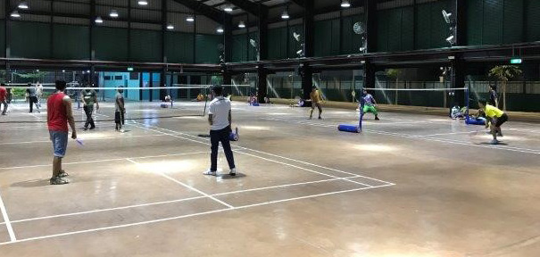
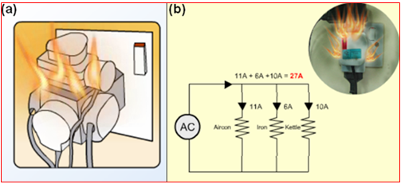

## Page 1

**��ெபயர்ந்த ஊ�யர்க�க்கான ஒ� வ�காட்�க ைகேய�்** 

**1**

## Page 2

# **வபோருளடக்கம்** 

||**பக்கம்**|
|---|---|
|**சிங்கப்பூருக்கு வருக**|**01**|
|**சிங்கப்பூரில் வசித்தல்**|**02**|
|**சிங்கப்பூரில் இருக்கும்போது வவளியில் வென்று வருதல்**|**06**|
|**சிங்கப்பூரில் ்வலல வெய்தல்்**|**08**|
|**வலல நியமன உரிலமகள்்**|**12**|
|**வலல நியமனெ் ெட்டங்கள்**|**20**|
|**முதலோளியின் கடலமகள்்**|**24**|
|**வலலவோய்ப்பு ்மோெடிகள்**|**27**|
|**போதுகோப்பு**|**27**|
|**மருத்துவ சிகிெ்லெ நோடுதல்**|**30**|
|**சிங்கப்பூரின் ெட்டங்கள்**|**34**|
|**பண விவகோரங்கள்**|**38**|
|**பயனுள்ள வதோலல்பசி எண்கள்**|**42**|
|**வகோவிட்-19 தகவல்**|**44**|

இந்த எளிமையான வழிகாட்டிக் மகயயட்டில் உள்ள தகவல்கள் அச்சிடுை் யநரத்தில் துல்லியைானமவக யைலுை் தகவலுக்கு, **www.mom.gov.sg** என்ற இமையத்தளத்மதப் பார்மவயிடவுை்.

## Page 3

## **சிங்கப்பூருக்கு வருக** 

சிங்கப்பூருக்கு உங்கமள வரயவற்கியறாை்!  இந்த வழிகாட்டி, உங்களது புதிய யவமலமயயுை் வாழ்க்மகச் சூழமலயுை் நீங்கள் பழக்கப்படுத்திக் ககாள்ள உதவுை் தகவல்கமள உங்களுக்கு வழங்குகிறது.  உங்களது  யவமல நியைன உரிமைகமளயுை் கபாறுப்புகமளயுை் நீங்கள் அறிந்துககாள்வதுை், சிங்கப்பூரின் சட்டங்கமளப் பின்பற்றி நடப்பதுை் மிகவுை் முக்கியை். முக்கியைானதாகுை். 

யவமல கதாடர்பான ஏயதனுை் பிரச்சமனகமள நீங்கள் சந்தித்தால், பின்வருை் இடங்களில் உடனடியாக உதவி நாடவுை்: 

<!-- Start of picture text -->
MINISTRY OF   MIGRANT WORKERS’ MANPOWER (MOM) CENTRE (MWC) TEL: 6438 5122 TEL: 6536 2692 Ministry of Manpower 579 Serangoon Road Services Centre Singapore 218193 1500 Bendemeer Road Singapore 339946 51 Soon Lee Road உதவிக்காக உங்கள்  Singapore 628088 தங்குை் விடுதியில் உள்ள ஃபாஸ்ட் குழு அதிகாரிகமளயுை் நீங்கள் அணுகலாை். <!-- End of picture text -->

உங்களது சிங்கப்பூர் மகத்கதாமலயபசி எை்மை ைனிதவள அமைச்சிடை் கதரிவிக்க கீயழ உள்ள இமையத்தள இமைப்மப அல்லது QR குறியீட்மடப் பயன்படுத்தவுை்.  இதன்வழி, நீங்கள் சிங்கப்பூரில் தங்கியிருக்குை் காலகட்டத்தில், யவமல கதாடர்பான விவகாரங்கமளப் பற்றி ைனிதவள அமைச்சு உங்களிடை் கதரிவிக்க இயலுை். 

உங்கள் மகத்கதாமலயபசி எை்மை எங்களுடன் பகிர்ந்து ககாள்ளுங்கள்: **www.mom.gov.sg/update_contact_details** . 

**1**

## Page 4

## **சிங்கப்பூரில் வசித்தல்** 

###### **சிங்கப்பூர் பற்றிய தகவல்கள்** 

சிங்கப்பூர் பல இன, பல கலாசார ைக்கள் ஒன்றாக வாழுை் ஒரு நாடு. இந்நாட்டு ைக்கள் பல்யவறு இனங்கமளயுை், ைதங்கமளயுை், கைாழிகமளயுை் யசர்ந்தவர்கள். ஒருவருக்ககாருவர் யவறுபாடுகமளப் புரிந்துககாை்டு, ஒருவமரகயாருவர் ைதித்து, ஒன்றிமைந்து நல்லிைக்கத்துடன் வாழ்வதுை் கசயல்படுவதுை் அவசியை். 

###### **சிங்கப்பூரில் உள்ள பல மதங்கள்** 

புத்த ைதை், கிறிஸ்தவ ைதை், இஸ்லாமிய ைதை், இந்து ைதை், கதௌவிசை் யபான்ற பல ைதங்கமளச் யசர்ந்த ைக்கள் சிங்கப்பூரில் உள்ளனர்.  ைற்றவர்களின் ைதை் சார்ந்த பழக்கவழக்கங்கமள ைதித்து நடக்குை் வமர, ஒவ்கவாருவருை் தங்கள் ைதத்மதச் சுதந்திரைாகப் பின்பற்றி நடக்கலாை். யகாயில்கள், யதவாலயங்கள், பள்ளிவாசல்கள் யபான்ற அங்கீகரிக்கப்பட்ட வழிபாட்டுத் தலங்களில் நீங்கள் வழிபாடு கசய்யலாை். 

###### **உள்ளூர் ெமூக வழக்கங்கள்** 

சிங்கப்பூரில் இருக்குை்கபாழுது, இங்கு பின்பற்றப்படுை் உள்ளூர் சமூக வழக்கங்கமள நீங்கள் அறிந்து ககாள்ளயவை்டுை். உங்கள் கசாந்த நாட்டில் ஏற்றுக்ககாள்ளப்படுை் வழக்கங்கள் சிங்கப்பூரில் ஏற்றுக்ககாள்ளப்படாைல் இருக்கலாை். 

###### **உங்களுக்கு வழிகோட்ட சில குறிப்புகள் கீ்ழ தரப்பட்டுள்ளன:** 

###### **வபோது இடங்களில் பின்பற்ற்வண்டிய நன்னடத்லதகள்** 

- சை்மட யபாடாதீர்கள் 

- யபருந்து நிறுத்தங்கள், கட்டடக் கீழ்த்தளங்கள், கபாது இடங்களில் உள்ள இருக்மககள், பூங்காக்கள் அல்லது யைை்பாலங்கள் யபான்ற கபாது இடங்களில் தூங்காதீர்கள். 

- இரவில் அடுத்தவர்கள் அமைதிக்கு இமடயூறாகச் சத்தைாகப் யபசயவா, சத்தைாக இமசமய இமசக்கயவா கூடாது. 

- குடியிருப்புக் கட்டடங்களின் கீழ்த்தளங்களில் கபரிய குை்பலாகச் யசர்ந்து ைதுபானங்கள் அருந்தாதீர்கள். 

- எச்சில் துப்பயவா அல்லது குப்மப யபாடயவா கூடாது. 

- கபாது இடங்களில் யைலாமடயின்றிச் கசல்லாதீர்கள். 

###### **தனிநபர் சுகோதோரம்** 

உங்களுக்கு யநாய் வருவமதயுை், கதாற்றுயநாய் பரவுவமதயுை் குமறக்க, உங்கமளச் சுத்தைாக மவத்திருப்பதுை் ஆயராக்கியத்மத யைை்படுத்திக் ககாள்வதுை் மிகவுை் அவசியை். 

- நன்றாகக் குளித்து, உங்கள் தமலமுடிமய நன்கு கழுவி சுத்தைாக மவத்துக்ககாள்ளவுை். 

- பற்கமள நன்கு துலக்கவுை் 

- உங்கள் துைிகமள நன்கு துமவத்து மவத்துக்ககாள்ளவுை் 

- மககமள சவர்க்காரை் பயன்படுத்தி அடிக்கடி கழுவயவை்டுை் 

**2**

## Page 5

**லக கழுவும்போது பின்பற்ற்வண்டிய 8 படிகள்** 

<!-- Start of picture text -->
1 2 3 4 உங்கள்  ஒவ்கவாரு  மககளின்  கட்மடவிரலின் உள்ளங்மககமளக்  விரமலயுை்  பின்புறை் ைற்றுை்  அடிப்பகுதிமயத் கழுவவுை் விரல்களுக்கு  விரல்களுக்கு  யதய்க்கவுை் இமடயிலுை் நன்கு  இமடயில் யதய்க்கவுை் யதய்க்கவுை் 5 6 7 8 விரல்களின்  உள்ளங்மககளில்  உங்கள்  சுத்தைான துை்டு பின்புறை் உங்கள் நகங்களால்  ைைிக்கட்மடக்  அல்லது திசுத் <!-- End of picture text -->

உங்கள் உள்ளங்மககமளக் கழுவவுை் 

சுத்தைான துை்டு அல்லது திசுத் தாள் ககாை்டு மககமள உலர்த்தவுை் 

உள்ளங்மககளில் உங்கள் நகங்களால் யதய்க்கவுை் 

உங்கள் ைைிக்கட்மடக் கழுவவுை் 

###### **சுகோதோர நிலலலயக் கண்கோணித்தல்** 

உங்கள் உடல்நிமலமயக் கை்காைிக்க, இலவசக் மகயபசிச் கசயலி **FWMOMCare-** ஐப்  பதிவிறக்கை் கசய்யவுை். உடல்நலை் இல்லாைல் இருப்பவர்கள் சரியான யநரத்தில் 24/7 கதாமல ைருத்துவ ஆயலாசமன கபறவுை் இது உதவுகிறது. 

உங்கள் தங்குை் விடுதியின் அமறயில் உள்ள விமரவுத் தகவல் குறியீட்மட வருடுவதற்கு, ‘Safe@Home’ வசதிமய உபயயாகித்து, தினமுை் யவமலக்குக் கிளை்புை்யபாதுை், திருை்பி வந்தவுடனுை் உங்களின் இருப்பிடத்மதத் கதரிவிக்கவுை். உங்களின் மகத்கதாமலயபசி எை் சரியாக உள்ளதா என்பமத ‘My Profile’ -ல் சரிபார்த்துக்ககாள்ளவுை். 

**3**

## Page 6

###### **தண்ணீலரெ் ்ெமியுங்கள்** 

பல் துலக்குை்யபாது குழாமயத் திறந்துமவத்து தை்ைீமர வீைாக்காைல், ஒரு குவமளமய உபயயாகப்படுத்துங்கள். 

துைி துமவக்குை்யபாதுை் பாத்திரங்கமளக் கழுவுை்யபாதுை் தை்ைீர்க் குழாமயத் திறந்து மவக்காதீர்கள்; ஒரு வாளியில் தை்ைீர் நிரப்பிப் பயன்படுத்துங்கள். 

தை்ைீமர வீைாக்காதீர்கள். 

குளிக்குை் யநரை் முழுவதுை் தை்ைீமரத் திறந்து மவத்துக்ககாை்டு வீைாக்காதீர்கள்; 5 நிமிடங்களுக்குள் குளித்து முடித்துவிடுங்கள். 

பயன்படுத்தாதகபாழுது, தை்ைீர்க் குழாய்கமள அமடத்து மவக்கவுை். தை்ைீர்க் கசிவுகள் எயதனுை் இருந்தால் புகாரளிக்கவுை். 

தை்ைீர்க் குழாயின் எந்தப் பாகங்கமளயுை் யசதப்படுத்தயவா ைாற்றயவா கூடாது. 

**உங்கள் ஓய்வு நோளில் எங்கு வென்று வரலோம்** உங்கள் ஓய்வு யநரத்தில் நீங்கள் கபாழுதுயபாக்கு மையங்களுக்குச் கசல்லலாை். அங்கு உங்களுக்காக பல்யவறு வசதிகள் ைற்றுை் நடவடிக்மககள் ஏற்பாடு கசய்யப்பட்டுள்ளன. 

###### **வபோழுது்போக்கு லமயங்கள்** 

சிங்கப்பூரில் எட்டு கபாழுதுயபாக்கு மையங்கள் உள்ளன. அமவ பூப்பந்து/கூமடப்பந்து திடல்கள், காற்பந்து ைற்றுை் கிரிக்ககட் விமளயாடுை் மைதானங்கள் யபான்ற இலவச விமளயாட்டு வசதிகமள வழங்குகின்றன.  நீங்கள் அங்கு கசல்லுை்யபாது, உங்கள் ஊரில் இருக்குை் உறவினர்களுக்குப் பைை் அனுப்பலாை், முடிதிருத்தை் கசய்யலாை், பல்கபாருள் அங்காடியில் ைளிமகப் கபாருட்கள் வாங்கலாை் அல்லது அங்யகயய சாப்பிடலாை். 

**4**

## Page 7

கபாழுதுயபாக்கு மையங்களின் விவரங்கள் பின்வருைாறு: 

**வபோழுது்போக்கு லமயம் முகவரி** 

**Cochrane RC 100 Sembawang Drive, Singapore 756998 Kaki Bukit RC 7 Kaki Bukit Avenue 3, Singapore 415814 Kranji RC 11 Kranji Road, Singapore 737673 Penjuru RC 27 Penjuru Walk, Singapore 608538 Soon Lee RC 51 Soon Lee Road, Singapore 628088 Terusan RC 1 Jln Papan, Singapore 619392 Tuas South RC 10 Tuas South Street 13, Singapore 636937 Woodlands RC 200 Woodlands Industrial Park E7, Singapore 757177** 

###### **சிங்கப்பூரின் மதுபோனெ் ெட்டங்கள்** 

நீங்கள் ைது அருந்துபவராக இருந்தால், நீங்கள் எங்கு, எந்த யநரத்தில் குடிக்கலாை், எங்கு ைது வாங்கலாை் என்பமத நிர்வகிக்குை் ைதுபானச் சட்டங்கமள அறிந்திருக்க யவை்டுை். 

யகலாங் ைற்றுை் லிட்டில் இந்தியா யபான்ற ைதுபானக் கட்டுப்பாட்டு வட்டாரங்கள் கவவ்யவறு கட்டுப்பாடுகமளக் ககாை்டுள்ளன. யகலாங் ைற்றுை் லிட்டில் இந்தியாவில் உள்ள காப்பிக் கமடகள் யபான்ற உரிைை் கபற்ற கமடகளின் உள்யள ைட்டுயை நீங்கள் ைதுபானை் வாங்கி அருந்தலாை்.  இந்தக் கமடகளுக்கு கவளியய ைதுபானை் அருந்துவது சட்டத்திற்கு எதிரானது. 

தமடகசய்யப்பட்ட யநரங்களில் நீங்கள் கபாது இடங்களில் ைதுபானை் அருந்தினால், உங்களுக்கு எதிராக நடவடிக்மக எடுக்கப்பட்டு, உங்கள் யவமல அனுைதிச்சீட்டு ரத்து கசய்யப்படுை். 

ைதுபானச் சட்டங்கள் பற்றிய தகவலுக்கு, தயவுகசய்து www.mha.gov.sg என்ற இமையத்தளத்மதப் பார்க்கவுை். 

**5**

## Page 8

## **சிங்கப்பூரில் வவளியில் வென்று வருதல்** 

சிங்கப்பூரில் கவளியிடங்களுக்குச் கசன்று வருவது எளிது. சிங்கப்பூரில் உள்ள பல்யவறு வமகயான யபாக்குவரத்து வசதிகள் பின்வருைாறு: 

- யபருந்து 

- கபருவிமரவு ரயில் (MRT) 

- இலகு ரயில் (LRT) 

- கடக்ஸி 

- தனியார் வாடமக வாகனங்கள் 

###### **ஈசி-லிங்க் (EZ- Link) அட்லடகள்** 

யபருந்து, கபருவிமரவு ரயில் அல்லது இலகு ரயில் மூலை் நீங்கள் பயைை் கசய்ய, உங்களுக்கு ஈசி-லிங்க் அட்மட யதமவப்படுை். இதமனப் கபருவிமரவு ரயில் நிமலயங்களிலுை் யபருந்து நிமலயங்களிலுை் வாங்கலாை். உங்கள் ஈசி-லிங்க் அட்மடயில் நிரப்பப்பட்ட கதாமக இருக்குை்.  கபருவிமரவு ரயில் நிமலயங்களிலுை் யபருந்து நிமலயங்களிலுை் அமைந்துள்ள கட்டை இயந்திரங்களின் மூலைாக உங்கள் அட்மடயில் கதாமக நிரப்பிக்ககாள்ளலாை். உங்கள் வங்கியின் தானியங்கி அட்மடமய உபயயாகித்து அட்மடயில் கதாமக நிரப்பிக்ககாள்ளலாை். உதவி யதமவப்பட்டால், கபருவிமரவு ரயில் நிமலயங்களிலுை் யபருந்து நிமலயங்களிலுை் உள்ள தகவல் முகப்புகளின் அலுவலர்கமள அணுகலாை். 

யபருந்து நிறுத்தங்கள், கபருவிமரவு ரயில் நிமலயங்கள், இலகு ரயில் நிமலயங்கள் ஆகிய இடங்களில் யபருந்து ைற்றுை் ரயில் கசல்வழிகளுை் கட்டை விவரங்களுை் காட்டப்பட்டிருக்குை். 

**வபோதுப் ்போக்குவரத்தில் பின்பற்ற்வண்டிய நன்னடத்லதகள்** யபருந்துகளிலுை் ரயில்களிலுை் பயைை் கசய்யுை்யபாது சக பயைிகளிடை் கனிவாக நடந்துககாள்ளுங்கள். 

- யபருந்தில் அல்லது ரயிலில் ஏறக் காத்திருக்குை்யபாது வரிமசயில் நிற்கவுை் 

- உங்கள் பயை இருக்மகமய, வயதான பயைி யபான்ற நிற்கச் சிரைப்படுை் ஒருவருக்கு விட்டுக்ககாடுக்கவுை். 

- நின்றுககாை்டு பயைிக்குை்யபாது, நுமழவாயிமல ைமறக்காைல் உட்புறைாக நகர்ந்து கசல்லவுை். இதன்வழி ைற்றவர்கள் ஏறுவதற்குை் இறங்குவதற்குை் இமடயூறாக இருக்காது. 

- உள்யள ஏறுவதற்கு முன்பு கவளியய இறங்குபவர்களுக்கு வழிவிடவுை். 

- உங்கள் மபமயக் கீயழ மவத்து விடுங்கள். இதன்வழி ைற்றவர்கள் சுலபைாக நகர அதிக இடை் கிமடக்குை். 

**6**

## Page 9

##### **ெோலலயில் பின்பற்ற்வண்டிய போதுகோப்பு விதிமுலறகள்** 

###### **போதுகோப்புடன் மிதிவண்டி ஓட்டுதல்** 

நீங்கள் மிதிவை்டி ஓட்டினால், பாதுகாப்பாக ஓட்டுங்கள். 

- மிதிவை்டிமய அதற்குரிய பாமதகளில் ைட்டுயை எப்யபாதுை் ஓட்டவுை்; பிற மிதிவை்டி ஓட்டுநர்கமள அல்லது பாதசாரிகமளக் கவனத்தில் ககாள்ளவுை். 

- பாதசாரிகமளக் கவனத்தில் ககாை்டு கைதுவாகச் கசல்லவுை். பாதசாரிகமள எச்சரிக்க, குறிப்பாக பகிரப்படுை் நமடபாமதகளில் ஓட்டுை்கபாழுது, உங்கள் மிதிவை்டியின் எச்சரிக்மக ைைிமய தூரத்தில் வருை்கபாழுயத ஒலிக்கவுை். 

- யபாக்குவரத்து விதிகமளப் பின்பற்றி சாமலயின் ஓரத்மத ஒட்டியய கசல்லவுை். சாமலயின் நடுவில் அல்லது யபாக்குவரத்திற்கு எதிராக மிதிவை்டிமய ஓட்டிச் கசல்லயவை்டாை். 

- மிதிவை்டி ஓட்டுை்கபாழுது, மிதிவை்டிகள் நிறுத்துவதற்கு  ஒதுக்கப்பட்ட நிறுத்துமிடங்களில் உங்கள் மிதிவை்டிமய நிறுத்திமவக்கவுை். உங்கள் மிதிவை்டிமய சாமலகளியலா அல்லது நமடபாமதக்கு நடுவியலா நிறுத்திவிட்டுச் கசல்லாதீர்கள். ஏகனனில், இது ைற்ற வாகன ஓட்டுநர்களுக்குை் பாதசாரிகளுக்குை் இமடயூறாக இருக்குை். 

###### **ெோலலப் போதுகோப்பு** 

- சாமலயில் கசல்லுை்யபாது பாதுகாப்பாகச் கசல்வது மிகவுை் முக்கியை். 

- யபாக்குவரத்து விதிமுமறகமளப் பின்பற்றவுை். எல்லா இடங்களிலுை் சாமலமயக் கடக்கயவை்டாை். எப்யபாதுை் யபாக்குவரத்து விளக்குகள் உள்ள இடங்களில் சாமலமயக் கடக்கவுை். 

- யபாக்குவரத்து விளக்கு பச்மச நிறைாக இருக்குை்யபாது சாமலமயக் கடக்கவுை். 

- சாமலயின் ைறுபுறை்த்திற்குப் பாதுகாப்பாகக் கடந்து 

- கசல்ல, பாதசாரிகளுக்கான சாமலக் கடப்பிடை், 

- யைை்பாலத்மத அல்லது சுரங்கப்பாமதகமளப் பயன்படுத்தவுை். 

- வாகனை் ஓட்டினால், பாதசாரிகளுக்கு வழிவிடவுை். சாமலத் கதாடக்கங்கள், சாமலச் சந்திப்புகள் அல்லது பாதசாரிகளுக்கான கடப்புகள் ஆகியவற்மற அணுகுை்யபாது கைதுவாகச் கசல்லவுை். 

###### **கனரக வோகனங்களில் பயணம் வெய்தல்** 

- நீங்கள் பைிபுரியுை் இடத்துக்குை் தங்குை் இடத்திற்குை் இமடயில் உங்கள் முதலாளி உங்களுக்குப் யபாக்குவரத்து வசதி வழங்கலாை். இருப்பினுை், கநரிசலான லாரி யபான்ற வாகனங்களில் நீங்கள் ஆபத்தான சூழ்நிமலயில் பயைிக்க யநர்ந்தால், தயவுகசய்து உங்கள் முதலாளியிடை் கதரிவிக்கவுை். உங்கள் பாதுகாப்பு முக்கியைானது. உங்கள் முதலாளி உங்களுக்கு உதவ ைறுத்தால், **1800-2255-582** என்ற எை்ைில் நிலப் யபாக்குவரத்து ஆமையத்திடை் **(LTA)** புகாரளிக்கவுை். 

**7**

## Page 10

## **சிங்கப்பூரில் ்வலல வெய்தல்** 

சிங்கப்பூரில் பைிபுரிய, கசல்லுபடியாகுை் யவமல அனுைதிப் பத்திரத்மத நீங்கள் மவத்திருக்க யவை்டுை். யைலுை், யவமல அனுைதிப் பத்திர நிபந்தமனகளுக்குை் உட்படயவை்டுை். 

###### **வகோள்லக ஒப்புதல் (IPA) கடிதம்** 

உங்கள் கசாந்த நாட்டிலிருந்து புறப்படுவதற்கு முன், உங்கள் முதலாளி அல்லது கசாந்த நாட்டு முகவரிடமிருந்து உங்கள் தாய்கைாழியில் நீங்கள் ஒரு ககாள்மக ஒப்புதல் (ஐபிஏ) கடிதத்மத ( 5-6 பக்கங்கள்) கபறயவை்டுை்.   ைனிதவள அமைச்சு வழங்குை் அந்தக் கடிதை், சிங்கப்பூரில் உங்கள் யவமல பற்றிய முழுத்தகவல்கமளயுை்  ககாை்டிருக்குை்.  உங்கள் கடிதத்தில் கூறப்பட்டுள்ள நிபந்தமனகமள உங்கள் முதலாளி நிமறயவற்றயவை்டுை். அவர், உங்கள் அனுைதியின்றி அதிலிருக்குை் நிபந்தமனகமள ைாற்ற முடியாது.  உங்கள் ககாள்மக ஒப்புதல் கடிதத்தில் உள்ள பின்வருவனவற்மற கவனியுங்கள்: 

- **1** உங்கள் கபயர் ைற்றுை் யவமல அனுைதி எை் 

**8**

## Page 11

- **2** உங்கள் முதலாளியின் கபயர் **3** உங்கள் யவமல 

- **4** உங்கள் சிங்கப்பூர் யவமலவாய்ப்பு நிறுவனை் பற்றிய தகவல் ைற்றுை் உங்கள் சிங்கப்பூர் யவமலவாய்ப்பு நிறுவனத்திற்குச் கசலுத்த யவை்டிய முகவர் கட்டைை் 

- **5** யவமல அனுைதி கசல்லுபடியாகுை் காலகட்டை் 

- **6** உங்கள் அடிப்பமட ைாதச் சை்பளை், நிமலயான ைாதச் சை்பளை், நிமலயான ைாதாந்திரப் படித்கதாமககள் ைற்றுை் ைாதாந்திரப் பிடித்தங்கள் 

- **7** நீங்கள் தங்குவதற்கான வீட்டுவசதி 

- **8** உங்கள் ககாள்மக ஒப்புதலில் குறிப்பிட்டுள்ள யவமலயில் ைட்டுை் தான் நீங்கள் பைியாற்ற முடியுை் 

**9**

## Page 12

**9** நீங்கள் சிங்கப்பூரில் இருக்குை்யபாது, யவமல அனுைதி நிபந்தமனகளுக்குக் கீழ்ப்படிய யவை்டுை் 

**11** உங்கள் முதலாளி 14 நாட்களுக்குள் முடிக்க யவை்டிய படிகள் 

**10** உங்கள் ஓய்வு நாள் உரிமைகள் 

உங்கள் ககாள்மக ஒப்புதல் கடிதத்தில் காட்டப்பட்டுள்ள சை்பளத்மத நீங்கள் 

கபறயவை்டுை்.  உங்களிடை் எழுத்துபூர்வ ஒப்புதல் கபறாைல் உங்கள் முதலாளி உங்கள் சை்பளத்மதக் குமறத்தால், ைனிதவள அமைச்சிடை் உதவி நாடவுை். 

சிங்கப்பூரில் நீங்கள் யவமலயில் இருக்குை் காலை் முழுவதுை் உங்கள் ககாள்மக ஒப்புதல் கடிதத்தின் நகமல மவத்திருக்க யவை்டுை். 

**10**

## Page 13

###### **வலல அனுமதி** 

உங்கள் யவமல அனுைதி அட்மடமய எல்லா யநரங்களிலுை் உங்களிடை் மவத்திருக்க யவை்டுை்.  உங்கள் யவமல அனுைதி அட்மட உங்களுக்குக் கிமடக்கவில்மல என்றால், தயவுகசய்து உங்கள் ககாள்மக ஒப்புதல் கடிதத்மத மவத்திருங்கள். 

ைனிதவள அமைச்சு அல்லது ஏயதனுை் கபாது அமைப்புகள் கை்காைிப்பு நடவடிக்மககள் யைற்ககாள்ளுை்யபாது, உங்கள் யவமல அனுைதி அட்மடமய நீங்கள் காட்ட யவை்டுை். 

###### **கடவுெ்சீட்டு** 

உங்கள் கடவுச்சீட்டு (Passport) உங்களது தனிப்பட்ட கசாத்து.  உங்கள் யவமலக்கான நிபந்தமனயாக, கடவுச்சீட்மட உங்கள் முதலாளி மவத்துக்ககாள்ளக்கூடாது. உங்கள் சார்பாக உங்கள் முதலாளி உங்கள் கடவுச்சீட்மட மவத்திருந்தால், உங்கள் யகாரிக்மகயின்யபரில் அது உடனடியாக உங்களிடை் திருப்பித் தரப்படயவை்டுை். 

<!-- Start of picture text -->
PASSPORT PASSPORT <!-- End of picture text -->

###### **உதவி நோடுங்கள்** 

உங்கள் சை்ைதமின்றி உங்கள் முதலாளி உங்கள் சை்பளத்மதக் குமறத்தால், உங்கள் கடவுச்சீட்மட அல்லது யவமல அனுைதி அட்மடமய நீங்கள் யகாருை்யபாது திருப்பித் தரவில்மல என்றால், நீங்கள் உடனடியாக **6438 5122** என்ற எை்மை அமழத்து ைனிதவள அமைச்சிடை் புகார் அளிக்கவுை், அல்லது 1500 கபை்டமியர் சாமல, சிங்கப்பூர் 339946 என்ற முகவரியில் உள்ள ைனிதவள அமைச்சின் யசமவ மையத்மத அணுகவுை். 

**11**

## Page 14

## **்வலல நியமன உரிலமகள்** 

**சிங்கப்பூரின் ்வலல மற்றும் வோழ்க்லக முலறகள்** 

உங்கள் முதலாளி உங்களுக்கு முக்கிய யவமல விதிமுமறகமள எழுத்துபூர்வைாகக் ககாடுக்கயவை்டுை்.  நீங்கள் ஒப்புக்ககாை்ட யவமல நியைன விதிமுமறகள் ைற்றுை் நிபந்தமனகள் குறித்த கீழ்க்கை்டமவ உள்ளிட்ட தகவல்கள் அதில் இருக்க யவை்டுை்: 

- ைாதச் சை்பளை், சை்பளை் தரப்படுை் யததி ைற்றுை் மிமகயநர ஊதியத்திற்கான விவரங்கள் 

- யவமல யநரை் ைற்றுை் ஓய்வு நாட்கள் யபான்ற யவமல விவரங்கள். 

- சை்பளத்துடன் கூடிய விடுப்பு (வருடாந்திர விடுப்பு, ைருத்துவ விடுப்பு ைற்றுை் கபாது விடுமுமறகள் உட்பட) ைற்றுை் ைருத்துவ அனுகூலங்கள் 

பின்வருபவற்றின் கதாடர்பில் உங்களுக்கு ஏயதனுை் குமறகள் இருந்தால், தயவுகசய்து ைனிதவள அமைச்சிடை் அல்லது சர்ச்மச நிர்வாகத்துக்கான முத்தரப்புக் கூட்டைியிடை் **(Tripartite Alliance for Dispute Management - TADM)** கூடிய விமரவில் புகார் அளிக்கவுை். **TADM** யசமவ MOM யசமவகள் மையத்தில் அமைந்துள்ளது. 

#### **(a) ெம்பளம் / மிலக்நர ஊதியம்** 

- **1** நீங்கள் சிங்கப்பூரில் உங்கள் கபயரில் ஒரு தனிப்பட்ட வங்கிக் கைக்மகத் திறந்து, உங்கள் சை்பளத்மத அந்த வங்கிக் கைக்கில் வரவு மவக்குைாறு உங்கள் முதலாளியிடை் யகாரயவை்டுை்.  இது உங்கள் முதலாளியுடனான சை்பளை் குறித்த எந்தகவாரு சச்சரமவயுை் குமறக்குை்.  அவ்வாறு கசய்ய நீங்கள் யகாரியிருந்தால், உங்கள் முதலாளி உங்கள் சை்பளத்மத உங்கள் வங்கிக் கைக்கில் யநரடியாகச் கசலுத்தயவை்டுை். 

- **2** உங்கள் முதலாளி உங்கள் சை்பளத்மத ஒரு ைாதத்திற்கு ஒரு முமற, அதுவுை் சை்பள காலை் முடிந்து 7 நாட்களுக்குள் ககாடுக்கயவை்டுை்,. உங்களுக்குை் உங்கள் முதலாளிக்குை் இமடயில் ஒப்புக் ககாள்ளப்பட்ட எந்தச் சை்பளக் காலமுை் ஒரு ைாதத்திற்கு மிகாைல் இருக்கயவை்டுை். 

- **3** நீங்கள் ைாதத்தில் மிமகயநர யவமல கசய்திருந்தால், உங்கள் முதலாளி குமறந்தபட்சை் ஒரு ைாதத்திற்கு ஒரு முமறயாவது, சை்பளக் காலை் முடிந்து 14 நாட்களுக்குள் மிமகயநரத்திற்கான சை்பளத்மதக் ககாடுக்கயவை்டுை். 

**12**

## Page 15

- **4** உங்களின் எழுத்துபூர்வ அனுைதியின்றி, உங்கள் ககாள்மக ஒப்புதல்  கடிதத்தில் குறிப்பிடப்பட்டுள்ள அடிப்பமடச் சை்பளை், நிமலயான படித்கதாமககள் ஆகியவற்மறக் குமறக்கயவா அல்லது நிமலயான பிடித்தங்கமளக் கூட்டயவா உங்கள் முதலாளிக்கு அனுைதி இல்மல. 

- **5** நீங்கள் ஒப்புக்ககாை்டால் ைட்டுயை உங்கள் சை்பளத்மத ைாற்ற முடியுை்; உங்கள் சை்பளத்மத ைாற்றுவதற்கு உங்கள் முதலாளி பின்வருவனவற்மறச் கசய்யயவை்டுை்: **உங்கள் ெம்மதத்லத எழுதத் ுபூர்வமோக வபற்வண்டும்** ைனிதவள அமைச்சிடை் கதரிவிக்கயவை்டுை் ைாற்றப்பட்ட சை்பளத்துடன் வமகப்படுத்தப்பட்ட சை்பள ரசீமத உங்களுக்கு வழங்கயவை்டுை் 

   - உங்கள் முதலாளி உங்கள் சை்பள ரசீமத குமறந்தபட்சை் ஒரு ைாதத்திற்கு ஒரு முமறயுை், சை்பளை் கசலுத்தி 3 யவமல நாட்களுக்குள்ளுை் உங்களுக்கு வழங்கயவை்டுை்.  சை்பள ரசீதில் அடிப்பமடச் சை்பளை், படித்கதாமககள், பிடித்தங்கள், யவமல கசய்த மிமகயநரை், மிமகயநர ஊதியை் யபான்ற அமனத்து சை்பள விவரங்களுை் இருக்க யவை்டுை். 

- **6** 

- **7** உங்களுக்குப் புரியாத அல்லது உங்களுக்கு உடன்பாடு இல்லாத அல்லது கவற்று ஆவைங்களில் மககயழுத்திட யவை்டாை்.  கட்டை ரசீதுகள் அல்லது சை்பள ரசீதுகள் யபான்ற கவற்று ஆவைங்களில் மககயழுத்திடுைாறு உங்கள் முதலாளி உங்களிடை் யகட்டால், நீங்கள் ைனிதவள அமைச்மச அணுகயவை்டுை். கபாதுவாக, ஆரை்பத்தியலயய புகார் ககாடுக்க முன்வராத ஊழியர்களுக்கு, அவர்களின் கூற்றுகமள  நிரூபிப்பதில் சிரைை் ஏற்படலாை். 

**13**

## Page 16

#### **(b) ெம்பளப் பிடித்தங்கள்** 

- உங்கள் சை்பளத்திலிருந்து உங்கள் முதலாளி எந்தப் பிடித்தங்கமளயுை் கசய்யமுடியாது. அவர்கள் பின்வருை் சூழ்நிமலகளில் ைட்டுயை அவ்வாறு கசய்ய முடியுை்: 

உங்கள் முதலாளியின் அனுைதியின்றி நீங்கள் யவமலக்குச் கசல்லாைல் இருந்தால் 

நீங்கள் யகாரிய நீங்கள் ஏற்றுக்ககாை்ட உைவுக்கு உங்கள் வீட்டுவசதி / தங்குமிடை், முதலாளி பைை் வசதிகள் ைற்றுை் கசலுத்தி இருந்தால் யசமவகளுக்கு உங்கள் முதலாளி பைை் கசலுத்தி இருந்தால் 

உங்களிடை் ஒப்பமடக்கப்பட்ட கபாருட்கள் அல்லது பைை் இழக்கப்பட்டிருந்தால் அல்லது யசதைமடந்திருந்தால் (ஒரு முமற ைட்டுயை பிடித்தை் கசய்வது) 

நீங்கள் பிடித்தத்துக்கு எழுத்துபூர்வ ஒப்புதல் அளித்துவிட்டீர்கள் என்றால் (பிடித்தை் கழிக்கப்படுவதற்கு முன்பு எந்த யநரத்திலுை் உங்கள் சை்ைதத்மதத் திருை்பப் கபறலாை்) 

- சை்பளத்தில் பிடித்தை் கசய்யப்பட்டால், எந்தகவாரு சை்பளக் காலத்திலுை் உங்கள் கைாத்த சை்பளத்தில் இருந்து 50% -க்குை் அதிகைாக உங்கள் முதலாளி பிடித்தை் கசய்ய முடியாது.  பின்வருை் சூழ்நிமலகளில் கசய்யப்படுை் பிடித்தங்கள் இதில் உள்ளடங்கா: 

- நீங்கள் யவமலக்கு வராைல் இருத்தல் 

- உங்களுக்குக் ககாடுக்கப்பட்ட முன்பைை், கடன்கள் அல்லது சை்பளத்திற்கு யைலாகக் கூடுதலாக வழங்கப்பட்ட கதாமக ஆகியவற்மற வசூலித்தல் - நீங்கள் எழுத்துபூர்வ ஒப்புதல் அளித்த ஏயதனுை் கூட்டுறவு சங்கத்திற்குப் 

- பைை் கசலுத்துதல் 

**14**

## Page 17

**(c) ்வலல ்நரம் மற்றும் மிலக்நர ்வலல** 

- நீங்கள் ைாறுயநர யவமலயில் இல்லாவிட்டால், உங்கள் ஒப்பந்தப்படியான யவமல யநரை் ஒரு நாமளக்கு 8 ைைியநரை் அல்லது வாரத்திற்கு 44 ைைியநரங்களுக்கு மிகாைல் இருக்கயவை்டுை்.  உங்கள் யவமல யநரத்தில் உங்களுக்குக் ககாடுக்கப்படுை் ஓய்வு யநரை், யதநீர் இமடயவமள ைற்றுை் உைவுக்கு அனுைதிக்கப்பட்ட இமடயவமளகள் யசராது. உங்கள் ஒப்பந்தப்படியான யவமல யநரத்திற்கு யைலான அமனத்து யவமலகளுை் மிமகயநர யவமலயாகக் கருதப்படுை்.  உங்களது ஒரு ைைியநர அடிப்பமட ஊதியத்தின் 1.5 ைடங்கு கதாமகமய மிமகயநர ஊதியைாக நீங்கள் யகாரலாை். 

- நீங்கள் ைாறுயநர யவமல கசய்தால், ஒப்புக்ககாள்ளப்பட்ட யவமல யநரை் 3 வாரங்களில், வாரத்திற்கு சராசரியாக 44 ைைியநரத்திற்கு மிகாைல் இருக்க யவை்டுை்.  ஒரு நாமளக்கான அதிகபட்ச யவமல யநரை் 12 ைைியநரை். ஒரு ைாதத்திற்கான அதிகபட்ச மிமகயநரை் 72 ைைியநரை். 

- நீங்கள் பைிபுரிந்த மிமகயநரங்கமள உங்கள் முதலாளி பதிவு கசய்யயவை்டுை்.  உங்கள் முதலாளியின் பதிமவ நீங்கள் சரிபார்த்து, அது துல்லியைாக இருந்தால் ைட்டுயை மககயாப்பமிட யவை்டுை்.  நீங்கள் உங்கள் முதலாளியின் பதிவுக்கு உடன்படவில்மல என்றால், அதில் மககயழுத்து இடுவதற்கு முன் உங்கள் முதலாளியிடை் ஆரை்பத்தியலயய கதளிவுபடுத்திக் ககாள்ளயவை்டுை். 

**உங்களுக்கோன மிலக்நர ஊதியத்லதக் கணக்கிடும் முலற:** 

**முதலில்** உங்களின் ைைியநர அடிப்பமட ஊதிய விகிதத்மதக் 1 கைக்கிடுங்கள்: **12 x மோதோந்திர அடிப்பலட ஊதியம் = மணி்நர அடிப்பலட 52 x 44 ஊதிய விகிதம்** 

#### **அடுத்து** 

2 உங்கள் ைைியநர மிமகயநர ஊதியத்மதக் கைக்கிடுங்கள்: **[ மணி்நர அடிப்பலட ஊதிய விகிதம் ] x [1.5] = மிலக்நர ஊதியத்தின் மணி்நர விகிதம்** 

#### **அடுத்து** 

~~3~~ உங்கள் மிமகயநர ஊதியத்மதக் கைக்கிடுங்கள்: **[ மிலக்நர ஊதியத்தின் மணி்நர விகிதம் ] x [ மிலக்நர ்வலல ்நரம் ] = மிலக்நர ஊதியம்** 

**15**

## Page 18

#### **(d) மருத்துவ விடுப்பு** 

- உங்கள் முதலாளிக்காக நீங்கள் குமறந்தது 3 ைாதங்களாவது பைியாற்றியிருந்தால், கவளியநாயாளி ைருத்துவ விடுப்புை் ைருத்துவைமனயில் தங்கி சிகிச்மச கசய்ய யநர்ந்தால் 

- யதமவப்படுை் விடுப்புை் சை்பளத்துடன் வழங்கப்படுை். நீங்கள் யவமல கசய்திருக்குை் காலத்மதப் கபாறுத்து, சை்பளத்துடனான ைருத்துவ விடுப்பு எத்தமன நாட்களுக்கு வழங்கப்படுை் என்பது பின்வருைாறு நிர்ையிக்கப்படுகிறது: 

|**்வலலயில் ்ெர்ந்து** **இன்றுவலர நிலறவு** **வெய்யப்பட்ட மோதங்கள்**|**ஓரோண்டில்** **ெம்பளத்துடனோன** **வவளி்நோயோளி மருத்துவ** **விடுப்பு (நோட்கள்)**|**ஓரோண்டில்** **மருத்துவமலனயில்** **தங்கி சிகிெ்லெ வபற** **விடுப்பு (நோட்கள்)**|
|---|---|---|
|**3மோதங்கள்**|**5**|**15**|
|**4மோதங்கள்**|**8**|**30**|
|**5மோதங்கள்**|**11**|**45**|
|**6மோதங்கள் மற்றும்** **அதன்பிறகு**|**14**|**60**|

- நீங்கள் ைருத்துவ விடுப்புக்குத் தகுதி கபற, யவமலக்குச் கசல்லத்தவறிய யநரத்திலிருந்து 48 ைைி யநரத்திற்குள் உங்கள் முதலாளியிடை் கதரியப்படுத்த யவை்டுை். 

- உங்களது வழக்கைான யவமல நாளில் ைருத்துவ விடுப்பு எடுத்த காலத்திற்கான உங்கள் சை்பளத்மத உங்கள் முதலாளி உங்களுக்குச் கசலுத்த யவை்டிய சூழ்நிமலகள் பின்வருைாறு: 

- ைருத்துவப் பதிவுச் சட்டத்தின்கீழ் பதிவுகசய்யப்பட்ட ைருத்துவர் ைருத்துவ விடுப்புக்கான ைருத்துவச் சான்றிதழ் வழங்கியிருந்தால் 

- அந்த ஆை்டில் உங்களுக்குக் ககாடுக்கப்பட்டுள்ள ைருத்துவ 

- விடுப்மப நீங்கள் எடுத்து முடிக்காைல் இருந்தால் 

#### **(e) ஓய்வு நோட்கள் மற்றும் வபோது விடுமுலறகள்** 

- ஒவ்கவாரு வாரமுை் சை்பளமின்றி, ஓர் ஓய்வு நாள் எடுத்துக்ககாள்ள உங்களுக்கு உரிமை உை்டு. 

- தவிர்க்க இயலாத  சூழ்நிமலகள் ஏற்பட்டாகலாழிய, உங்கள் ஓய்வு நாளில் யவமல கசய்யுை்படி உங்கள் முதலாளி உங்கமளக் கட்டாயப்படுத்த முடியாது, யைலுை், அந்த நாளில் யவமல கசய்ய உங்கள் உடன்பாட்மட அவர்கள் கபறயவை்டுை். 

**16**

## Page 19

###### **ஓய்வு நோளில் ்வலல வெய்வதற்கோன ஊதியம் பின்வருமோறு கணக்கிடப்படுகிறது:** 

|**்வலல ்** **மற்வகோள்** **ளப்பட்டது**|**உங்களது** **வழக்கமோன** **தினெரி ்வலல்** **நரங்களில்** **போதி ்நரம் வலர**|**ி ்்** **உங்களது** **வழக்கமோன** **தினெரி ்வலல்** **நரங்களில்** **போதிக்கும் ்மல்**|**உங்களது** **வழக்கமோன** **தினெரி ்வலல ்** **நரங்களுக்கு ்** **மல்**|
|---|---|---|---|
|முதலாளியின்|ஒரு நாள்|இரை்டு நாள்|2நாள் சை்பளை் +|
|யவை்டுயகாளின்படி|சை்பளை்|சை்பளை்|மிமகயநர ஊதியை்|
|ஊழியரின்|அமர நாள்|ஒரு நாள்|ஒரு நாள் சை்பளை் +|
|யவை்டுயகாளின்படி|சை்பளை்|சை்பளை்|மிமகயநர ஊதியை்|

- ஒரு வருடத்தில் 11 நாட்கள் சை்பளத்துடன் கூடிய கபாது விடுமுமறகமள எடுத்துக்ககாள்ள உங்களுக்கு உரிமை உை்டு. 

- நீங்கள் கபாது விடுமுமற அன்று யவமல கசய்யவில்மல என்றாலுை், உங்கள் முதலாளி கபாது விடுமுமறக்கான உங்கள் கைாத்த சை்பளத்மத உங்களுக்குத் தரயவை்டுை். 

- நீங்கள் கபாது விடுமுமற நாளில் யவமல கசய்திருந்தால், உங்கள் முதலாளி அன்மறய யவமலக்குக் கூடுதலாக ஒரு நாளின் அடிப்பமடச் சை்பளத்மத உங்களுக்குத் தரயவை்டுை், அல்லது உங்களுக்கு ஒரு நாள் விடுமுமற அளிக்கயவை்டுை், அல்லது அந்த யவமல யநரத்திற்குப் பதிலாக யவறு யநரை் ஒதுக்கித் தரயவை்டுை் (இந்த நிபந்தமனகள் அமனத்துை் $2,600 க்கு யைல் சை்பாதிக்குை் கதாழிலாளர்கள் அல்லாதவர்களுக்கு ைட்டுயை) 

#### **(f) வருடோந்திர விடுப்பு** 

- நீங்கள் குமறந்தபட்சை் 3 ைாதங்கள் உங்கள் முதலாளிக்காக யவமல கசய்திருந்தால், உங்களுக்குச் சை்பளத்துடன் கூடிய வருடாந்திர விடுப்பு வழங்கப்படயவை்டுை். 

- நீங்கள் ஒரு முதலாளியிடை் யவமல கசய்த ஆை்டுகளின் அடிப்பமடயில் வருடாந்திர விடுப்பு நாட்கள் பின்வருைாறு நிர்ையிக்கப்படுகிறது. 

|**வதோடர்ெ்சியோக ்வலல வெய்த ஆண்டுகள்**|**ஓர் ஆண்டுக்கோன விடுப்பு நோட்கள்**|
|---|---|
|முதல் ஆை்டு|7|
|இரை்டாவது ஆை்டு|8|
|மூன்றாவது ஆை்டு|9|
|நான்காவதுஆை்ட|10|
|ஐந்தாவது ஆை்டு|11|
|ஆறாவது ஆை்டு|12|
|ஏழாவதுஆை்ட|13|
|எட்டாவது ஆை்டுை் அதற்கு யைலுை்|14|

- நீங்கள் கதாடர்ச்சியாக 12 ைாதங்கள் ஒயர முதலாளியிடை் யவமல பார்க்கவில்மல எனில், அந்த ஆை்டில் யவமல பார்த்த ைாதங்களின் எை்ைிக்மகயின் அடிப்பமடயில் உங்கள் வருடாந்திர விடுப்பு உரிமை கைக்கிடப்படுை். 

**17**

## Page 20

###### **ெம்பள ்கோரிக்லககள் மற்றும் ்வலல அனுகூலங்கள்** 

உங்கள் முதலாளிக்கு எதிராக உங்களுக்கு ஏயதனுை் சை்பளை் அல்லது/ ைற்றுை் யவமலசார்ந்த தகராறுகள்  இருந்தால், நீங்கள் கூடிய விமரவில் ைனிதவள அமைச்மச அல்லது TADM -ஐ அணுக யவை்டுை். முன்கூட்டியய புகார் ககாடுக்க முன் வருவதன் மூலை், நீங்கள் கபறயவை்டிய சை்பளத்மத முழுமையாக மீட்கடடுப்பதற்கான வாய்ப்புகள் அதிகைாக இருக்குை்; யைலுை், புதிய முதலாளிமயத் யதடுவதற்குை் உங்களுக்கு யநரை் வழங்கப்படுை். யதமவப்பட்டால், உங்களுக்கு உைவு ைற்றுை் வீட்டுவசதிக்கு உதவி கிமடக்குை். 

###### **முக்கியமோன குறிப்பு** 

உங்களுக்கு ஏயதனுை் சை்பளை் தரயவை்டி இருந்தாயலா அல்லது யவறு ஏயதனுை் கட்டைப் பாக்கி ககாடுக்கயவை்டி இருந்தாயலா, உங்கள் முதலாளி உங்கமள வலுக்கட்டாயைாக உங்கள் கசாந்த நாட்டுக்குத் திருப்பி அனுப்ப முடியாது. 

உங்களது சை்பள பாக்கி அல்லது யகாரிக்மக நிலுமவயில்  இருக்குை்கபாழுது, நீங்கள் யவறு வழி இல்லாைல் விைான நிமலயத்திற்கு அனுப்பப்பட்டிருந்தால், நீங்கள் சிங்கப்பூர் குடிநுமழவு முகப்புகளில் இருக்குை் விைான நிமலய அதிகாரிகமள அணுக யவை்டுை்.  பின்னர் உதவிக்காக நீங்கள் ைனிதவள அமைச்சிற்கு அனுப்பப்படுவீர்கள். 

###### **உங்கள் சிங்கப்பூர் ்வலலவோய்ப்பு நிறுவனம்** 

###### **்வலலவோய்ப்பு முகவர் கட்டணத்திற்கோன வரம்பு** 

உங்கள் யவமல அனுைதிச் சீட்டின் கசல்லுபடியாகுை் காலை் அல்லது யவமல நியைன ஒப்பந்தத்தின் காலை், இதில் எது குமறவானயதா அமதப் கபாறுத்து, அந்தக் காலத்தின் ஒவ்யவார் ஆை்டுக்குை் சிங்கப்பூர் யவமலவாய்ப்பு முகமவ நிறுவனத்திற்கு உங்களின் நிமலயான ஒரு ைாதச் சை்பளத்தின் கதாமகக்கு யைல் கட்டைை் கசலுத்தக்கூடாது.  யவமலவாய்ப்பு முகமவ நிறுவனத்தின் அதிகபட்சக் கட்டைை் 2 ைாதச் சை்பளைாக வமரயறுக்கப்பட்டுள்ளது. நீங்கள் கசலுத்துை் எந்தகவாரு கட்டைத்திற்குை், உங்களுக்கு வழங்கப்பட்ட யசமவகமளயுை் வசூலிக்கப்பட்ட கதாமகமயயுை் குறிப்பிடுை் வமகப்படுத்தப்பட்ட ரசீதுகமள  நிறுவனை் உங்களுக்குத் தரயவை்டுை். 

**நிலலயோன மோதெ் ெம்பளம் =** அடிப்பமட ைாதச் சை்பளை் + நிமலயான ைாதாந்திர படித்கதாமககள் 

**18**

## Page 21

### **எடுத்துக்கோட்டு** 1 

உங்கள் யவமல அனுைதிச் சீட்டுை் யவமல நியைன ஒப்பந்தமுை் 2 ஆை்டுகளுக்கு கசல்லுபடியாகுை் என்றால், சிங்கப்பூர் யவமலவாய்ப்பு நிறுவனத்திற்குச் கசலுத்தப்பட யவை்டிய அதிகபட்ச முகவர் கட்டைை் உங்கள் நிமலயான ைாதச் சை்பளத்தின் **2 மோதத்** கதாமகயாகுை். 

### **எடுத்துக்கோட்டு** 2 

உங்கள் யவமல அனுைதிச் சீட்டு 2 ஆை்டுகளுக்குச் கசல்லுபடியாமகயில், யவமல நியைன ஒப்பந்தை் ஓர் ஆை்டுக்கு ைட்டுயை கசல்லுபடியாகுை் என்றால், சிங்கப்பூர் யவமலவாய்ப்பு நிறுவனத்திற்குச் கசலுத்தப்பட யவை்டிய அதிகபட்ச முகவர் கட்டைை் உங்கள் நிமலயான ைாத சை்பளத்தின் **1 மோதத்** கதாமகயாகுை். 

### **எடுத்துக்கோட்டு** 3 

உங்கள் யவமல அனுைதிச் சீட்டுை் யவமல நியைன ஒப்பந்தமுை் 2 வருடங்களுக்குை் யைலாகச் கசல்லுபடியாகுை் என்றால், சிங்கப்பூர் யவமலவாய்ப்பு நிறுவனத்திற்குச் கசலுத்தப்பட யவை்டிய அதிகபட்ச முகவர் கட்டைை் உங்கள் **நிலலயோன மோதெ் ெம்பளத்தின் 2 மோதத்** கதாமகயாகுை். 

உங்களது சிங்கப்பூர் யவமலவாய்ப்பு நிறுவனை் கட்டை வரை்புக்கு யைலாக முகவர் கட்டைங்கமள உங்களிடமிருந்து கபற்றிருந்தால், அல்லது கசலுத்தப்பட்ட கட்டைங்களுக்கான வமகப்படுத்தப்பட்ட ரசீதுகமள உங்களுக்கு வழங்கவில்மல என்றால், அல்லது உங்கள் யவமல நியைன ஒப்பந்தை் திடீகரன்று முன்கூட்டியய நிறுத்தப்பட்ட நிமலயில் உங்களுக்குப் பைத்மதத் திருப்பித் தரத் தவறியிருந்தால், தயவுகசய்து உடனடியாக ைனிதவள அமைச்சிடை் புகார் அளிக்க **6438 5122** என்ற எை்மை அமழக்கவுை், அல்லது, 1500 கபை்டமியர் சாமல, சிங்கப்பூர் 339946 எனுை் முகவரியில் உள்ள ைனிதவள அமைச்சின் யசமவ மையத்மத அணுகவுை். 

###### **கட்டணத்லதத் திரும்பப் வபறுதல்** 

உங்கள் முதலாளி 6 ைாதங்களுக்குள் உங்கமள யவமலமயவிட்டு நிறுத்தினால், நீங்கள் சிங்கப்பூர் யவமலவாய்ப்பு நிறுவனத்திற்குச் கசலுத்திய முகவர் கட்டைத்தில் குமறந்தது 50% உங்களுக்குத் திருப்பித் தரப்படயவை்டுை். இருப்பினுை், யவமலயில் இருந்து நிற்பது உங்கள் முடிவாக இருந்தால், நீங்கள் கசலுத்திய பைத்மதத் திருை்பப் கபற முடியாது. 

யைற்கூறிய விதிமுமறகள் சிங்கப்பூரில் இயங்குை் யவமலவாய்ப்பு நிறுவனங்களுக்கு ைட்டுயை கபாருந்துை். 

உங்கள் கசாந்த நாட்டில் உள்ள உங்கள் யவமலவாய்ப்பு நிறுவனத்துடனான எந்தகவாரு தகராறிலுை் ைனிதவள அமைச்சால் உங்களுக்கு உதவ முடியாது. உங்கள் கசாந்த நாட்டில் உள்ள யவமலவாய்ப்பு நிறுவனங்களுக்குச் கசலுத்தப்பட்ட கட்டைங்கமளயுை் மீட்டுத்தர இயலாது. 

**19**

## Page 22

## **வலல நியமனெ் ெட்டங்கள்** 

யவமல அனுைதிச் சீட்டு மவத்திருப்பவர் என்ற முமறயில், அதன் நிபந்தமனகளுக்கு நீங்கள் உட்படயவை்டுை். எந்தகவாரு யவமல அனுைதி நிபந்தமனகமளயுை் மீறுவது குற்றைாகுை் அத்துடன் பின்வருை் விமளவுகமள நீங்கள் எதிர்யநாக்குவீர்கள்: 

உங்களுக்கு அபராதை் அல்லது சிமறத் தை்டமன விதிக்கப்படுை். 

உங்கள் யவமல அனுைதிச் சீட்டு ரத்து கசய்யப்படுை். 

எதிர்காலத்தில் நீங்கள் சிங்கப்பூரில் யவமல கசய்வதற்கு அனுைதிக்கப்பட ைாட்டீர்கள். 

**(1) ்வலல அனுமதிெ் சீட்டின் வெல்லுபடியோகும் கோலத்லதெ் ெரிபோர்த்தல்** 

உங்கள் யவமல அனுைதிச் சீட்டு காலாவதியாகுை் முன் உங்கள் முதலாளி அமத ரத்து கசய்தால், சிங்கப்பூரில் கதாடர்ந்து பைியாற்ற நீங்கள் அனுைதிக்கப்பட ைாட்டீர்கள். நீங்கள் SGWorkPass என்ற கசயலிமயப் பதிவிறக்குவதன் மூலை் அல்லது ைனிதவள அமைச்சின் இமையத்தளத்தில் புகுபதிவு கசய்வதன் மூலை் உங்கள் யவமல அனுைதிச் சீட்டின் கசல்லுபடியாகுை் காலகட்டத்மதச் சரிபார்க்கலாை். 

#### **a) SGWorkPass** 

உங்கள் யவமல அனுைதிச் சீட்டு கசல்லுபடியானதா என்பமதச் சரிபார்ப்பதற்கான இலவச கசயலி 

உங்கள் யவமல அனுைதி அட்மடயில் இருக்குை் QR குறியீட்மட ஸ்யகன் கசய்வதற்கு SGWorkPass கசயலிமயப் பதிவிறக்கை் கசய்து, யவமல அனுைதிச் சீட்டு கசல்லுபடியாகுை் காலத்மத உடனடியாகச் சரிபார்க்க முடியுை். உங்கள் யவமல அனுைதி அட்மடயில் QR குறியீடு இல்மல என்றால், உங்கள் அட்மடயின் முன்புறத்தில் அச்சிடப்பட்ட தனிப்பட்ட அட்மட வரிமச எை்மைப் பயன்படுத்தலாை். 

**20**

## Page 23

- **b) மனிதவள அலமெ்சின் வலலத்தளம்** 

நீங்கள் www.mom.gov.sg/check-wp இமையத்தளத்தில் புகுபதிவு கசய்து, கீழ்க்காணுை் படிநிமலகமளப் பின்பற்றலாை். 

- 1) யதர்ந்கதடுக்கவுை்: _Enquire._ 

- 2) யதர்ந்கதடுக்கவுை்: _Work Permit Validity / Application Status._ 

- 3) உங்கள் யவமல அனுைதி அட்மட எை்மையுை் உங்கள் கபயமரயுை் உள்ளிட்டு, Next என்பமதத் தட்டுக. 

#### **(2) ்வலல** 

- உங்கள் யவமல அனுைதி அட்மடயில் குறிப்பிட்டுள்ள பைியில் ைற்றுை் அதில் குறிப்பிடப்பட்டுள்ள முதலாளிக்கு ைட்டுயை நீங்கள் யவமல கசய்யயவை்டுை். - உங்கள் முதலாளியால் அறிவுறுத்தப்பட்டாலுை், யவகறாரு பைியில் யவமல கசய்ய உங்களுக்கு அனுைதி இல்மல. 

- நீங்கள் கூடுதல் பைை் சை்பாதிக்க யவறு எந்த வைிகத்திலுை் ஈடுபடயவா அல்லது உங்கள் கசாந்தத் கதாழிமலத் கதாடங்கயவா கூடாது. 

- நீங்கள் உங்களது அசல் யவமல அனுைதி அட்மடமய எல்லா யநரங்களிலுை் உங்களுடன் எடுத்துச் கசல்லயவை்டுை்; எந்தகவாரு கபாது அதிகாரியிடமுை் திடீர் பரியசாதமனக்கு அதமனக் காட்ட யவை்டுை். 

**21**

## Page 24

யவகறாரு யவமலயியலா அல்லது யவறு முதலாளியிடயைா பைிபுரியுை்படி யகட்கப்பட்டால், நீங்கள் உடனடியாக **6438 5122** என்ற எை்மை அமழத்து ைனிதவள அமைச்சிடை் புகார் அளிக்கயவை்டுை், அல்லது 1500 கபை்டமியர் சாமல, சிங்கப்பூர் 339946 எனுை் முகவரியில் உள்ள ைனிதவள அமைச்சின் யசமவ மையத்மத அணுகயவை்டுை். 

#### **(3) நடத்லதகள்** 

- சிங்கப்பூரமர அல்லது சிங்கப்பூர் நிரந்தரவாசிமயத் (சிங்கப்பூரில் அல்லது சிங்கப்பூருக்கு கவளியய) திருைைை் கசய்துககாள்ள, யவமல அனுைதிப்பத்திர கட்டுப்பாட்டு அதிகாரியின் அனுைதி உங்களுக்குத் யதமவ.  உங்கள் யவமல அனுைதிச் சீட்டு கசல்லாத பிறகுை் இது கபாருந்துை். 

- நீங்கள் சிங்கப்பூரமர அல்லது சிங்கப்பூர் நிரந்தரவாசிமயத் திருைைை் கசய்து ககாை்டிருக்குை் பட்சத்தில், யவமல அனுைதிப்பத்திர கட்டுப்பாட்டு அதிகாரியின் அனுைதிமயப் கபற்றிருந்தாகலாழிய, நீங்கள் கர்ப்பைமடயயவா சிங்கப்பூரில் குழந்மதமயப் கபற்கறடுக்கயவா கூடாது. யவமல அனுைதிச் சீட்டு கசல்லாத பிறகுை் இது கபாருந்துை். 

#### **4) உரிமம் வபறோத ்வலலவோய்ப்பு முகவரோக இருக்க ்வண்டோம்** 

- ைனிதவள அமைச்சிடை் உரிைை் கபறாைல் பின்வருை் எந்தகவாரு யவமலவாய்ப்பு நிறுவன நடவடிக்மககமளயுை் நடத்துவது சட்டவியராதைானது: 

- (i) யவமல யதட உதவுவதாகக் கூறி குடுை்பத்தினரிடமிருந்யதா அல்லது நை்பர்களிடமிருந்யதா பைை் அல்லது சலுமககள் கபறுதல், (ii) யவமல யதடித் தர உதவுவதற்காக எந்தகவாரு யவமல 

- விை்ைப்பதாரரிடமிருந்துை் எந்தகவாரு தனிப்பட்ட ஆவைத்மதயயா அல்லது சுயவிவரத் கதாகுப்மபயயா கபறுதல், 

- (iii) எந்தகவாரு முதலாளி அல்லது யவமல விை்ைப்பதாரர் சார்பாகவுை் யவமல அனுைதிப் பத்திர விை்ைப்பங்கமளச் சைர்ப்பித்தல், ைற்றுை் / அல்லது 

- (iv) எந்தகவாரு யவமல யதடுபவமரயுை் ஒரு முதலாளியிடை் யவமலயில் யசர உதவுதல் 

இந்தக் குற்றங்களில் எமதச் கசய்தாலுை் அதிகபட்சைாக $80,000 அபராதை் ைற்றுை்/அல்லது இரை்டு ஆை்டுகள் வமரயிலான சிமறத்தை்டமன விதிக்கப்படுை்.  உங்கள் யவமல அனுைதிச் சீட்டு ரத்து கசய்யப்பட்டு, நீங்கள் கசாந்த நாட்டிற்கு அனுப்பப்படுவீர்கள். நீங்கள் சிங்கப்பூரில் யவமல கசய்ய அனுைதிக்கப்பட ைாட்டீர்கள். 

**22**

## Page 25

- **5) உரிமம் வபறோத ்வலலவோய்ப்பு முகவலர அல்லது நிறுவனத்லத நோட்வண்டோம்** 

- உரிைை் கபறாத எந்த யவமலவாய்ப்பு முகவரின் யசமவமயயுை் பயன்படுத்துவது சட்டவியராதைானது. 

- உரிைை் கபறாத யவமலவாய்ப்பு முகவமர அணுகி யவமல யதட முயன்றால், யவமல கிமடக்காைல் யபாகலாை், அல்லது நீங்கள் கசலுத்திய முகவர் கட்டைங்கமள இழக்க யநரிடலாை். உரிைை் கபறாத யவமலவாய்ப்பு முகவமர நீங்கள் பயன்படுத்துை் ஒவ்கவாரு முமறயுை் $5,000 வமர அபராதை் விதிக்கப்படுை். 

- **உங்கள் ்வலலவோய்ப்பு முகவர் அல்லது நிறுவனம் மனிதவள அலமெ்சிடம் (MOM) உரிமம் வபற்றிருக்கிறதோ என்பலத எப்போதும் ெரிபோர்க்கவும்.** 

- யவமலவாய்ப்பு நிறுவனத்தின் பைியாளர்களின் பதிவு அட்மடமயக் காட்டச் கசால்லுங்கள் (கீயழ உள்ள ைாதிரிமயப் பார்க்கவுை்).  அட்மடயில் குறிப்பிடப்பட்டுள்ள கபயமரயுை் பதிவு எை்மையுை் கவனத்தில் ககாள்ளுங்கள். 

- நீங்கள் உரிைை் கபற்ற முகமவ நிறுவனத்மதப் பயன்படுத்துகிறீர்களா என்பமத உறுதிப்படுத்த, www.mom.gov.sg/eadirectory இமையத்தளத்தில் உள்ள ைனிதவள அமைச்சின்  யவமலவாய்ப்பு நிறுவனப் பட்டியலில் உங்கள் முகவரின்   கபயமரச் சரிபார்க்கவுை். 

உரிைை் கபற்ற யவமலவாய்ப்பு முகவரின் பதிவு அட்மடயின் ைாதிரிவடிவை் 

உரிைை் கபறாைல் யவமலவாய்ப்பு நிறுவன நடவடிக்மககளில் ஈடுபடுை் எந்த ஒருவமரப் பற்றியுை், உடனடியாகப் புகார் அளிக்கயவை்டுை்.  உங்கள் அமடயாளை் ரகசியைாக மவத்துக் ககாள்ளப்படுை். 

###### **வலல அனுமதி நிபந்தலனகலள மீறுவதற்கோன தண்டலன** 

யைற்காணுை் யவமல அனுைதி நிபந்தமனகளில் ஏயதனுை் ஒன்மற நீங்கள் மீறினால், உங்கள் யவமல அனுைதிச் சீட்டு ரத்து கசய்யப்படுை். அயதாடு, நீங்கள் எதிர்காலத்தில் சிங்கப்பூரில் யவமல கசய்ய அனுைதிக்கப்பட ைாட்டீர்கள். 

**23**

## Page 26

## **முதலோளியின் கடலமகள்** 

நீங்கள் யவமலயில் இருக்குை்யபாது உங்கள் முதலாளி நிமறயவற்ற யவை்டிய சில கபாறுப்புகள் உள்ளன. உங்கமள யவமலயில் அைர்த்துவதற்கு நிபந்தமனயாக, உங்களிடமிருந்து பைை் யகாரயவா கபறயவா உங்கள் முதலாளிக்கு அனுைதி இல்மல. பின்வருை் கசலவினங்களுக்காக அவர் உங்களிடமிருந்து பைை் கபறயவா, உங்கள் சை்பளத்திலிருந்து பைை் கழிக்கயவா முடியாது: 

**1** 

யவமல அனுைதிச் சீட்மடப் புதுப்பித்தல் 

<!-- Start of picture text -->
2 <!-- End of picture text -->

பாதுகாப்புத் கதாமக 

<!-- Start of picture text -->
3 <!-- End of picture text -->

ைருத்துவக் காப்புறுதி 

<!-- Start of picture text -->
4 <!-- End of picture text -->

திருப்பி அனுப்புை் கசலவுகள் 

<!-- Start of picture text -->
5 <!-- End of picture text -->

கட்டாயப் பயிற்சி 

<!-- Start of picture text -->
6 <!-- End of picture text -->

ைருத்துவக் கட்டைங்கள் 

<!-- Start of picture text -->
7 <!-- End of picture text -->

தீர்மவ கசலுத்துதல் 

எடுத்துக்காட்டாக, உங்கள் யவமல அனுைதிச் சீட்டு காலாவதியாகவிருந்தால், அதமனப் புதுப்பிக்க உங்கள் முதலாளி பைை் கசலுத்தயவை்டுை். புதுப்பிப்புக் கட்டைத்திற்காகப் பைை் கசலுத்துைாறு உங்களிடை் யகட்கயவா அல்லது உங்கள் சை்பளத்திலிருந்து கழிக்கயவா முடியாது. 

உங்கள் முதலாளி உங்கள் சை்பளத்திலிருந்து ஏயதனுை் கதாமகமயக் கழித்தால், அந்தக் கழிப்பு எதற்கானது என்பமத உங்கள் முதலாளியிடை் யகட்டறியவுை். யையல பட்டியலிடப்பட்டுள்ள எந்தகவாரு கசலவிற்குை் கதாமக கழிக்கப்பட்டு இருந்தால், **6438 5122** என்ற எை்மை அமழத்து உடனடியாக ைனிதவள அமைச்சிடை் புகார் அளிக்கவுை் அல்லது 1500 கபை்டமியர் சாமல, சிங்கப்பூர் 339946 முகவரியில் உள்ள ைனிதவள அமைச்சின் யசமவ மையத்மத அணுகவுை். 

**24**

## Page 27

###### **தங்குமிடம்** 

உங்கள் தங்குமிடை் யதமவப்படுை் தரங்கமளக் ககாை்டிருப்பமதயுை், அதிக கூட்டமில்லாைல் இருப்பமதயுை் உங்கள் முதலாளி உறுதி கசய்யயவை்டுை். உங்கள் தங்குமிடை் யைாசைான அல்லது பாதுகாப்பற்ற நிமலயில் இருந்தால், **6438 5122** என்ற எை்மை அமழத்து உடனடியாக ைனிதவள அமைச்சிடை் புகார் அளிக்கவுை் அல்லது 1500 கபை்டமியர் சாமல, சிங்கப்பூர் 339946 முகவரியில் உள்ள ைனிதவள அமைச்சின் யசமவ மையத்மத அணுகவுை் . 

யைாசைான அல்லது பாதுகாப்பற்ற தங்குமிட நிமலமைகளின் எடுத்துக்காட்டுகள் பின்வருைாறு: 

இட கநருக்கடி 

முமறயான சுகாதார வசதிகள் அல்லது காற்யறாட்டை் இல்மல 

உங்கள் தங்குமிடத்திற்குள் யசதைமடந்த அல்லது சரிகசய்யப்படாத வசதிகள் 

பூச்சிகளின் கதால்மல (எ.கா. எலிகள், ககாசுக்கள், கரப்பான் பூச்சிகள்) 

கூட்டுரிமை வீடுகள், கமடவீடுகள், தமர வீடுகள் யபான்ற தனியார் குடியிருப்பு வளாகங்களில் நீங்கள் தங்கலாை். தனியார் குடியிருப்பு வளாகங்களில் அதிகபட்சை் 6 ஊழியர்கள் தங்க அனுைதிக்கப்படுகிறது.  நீங்கள் தங்குை் இடத்தில் 6 -க்குை் யைற்பட்ட ஊழியர்கள் தங்கியிருந்தால், உங்கள் முதலாளியுடன் யபசி நீங்கள் கவளியயறுவதற்கு ஏற்பாடு கசய்யுங்கள். 

**25**

## Page 28

###### **உங்கள் முகவரிலயத் வதரிவித்தல்** 

ைனிதவள அமைச்சிடை் உங்கள் முதலாளி பதிவு கசய்துள்ள முகவரியில்தான் நீங்கள் தங்கியிருக்க யவை்டுை். நீங்கள் கசாந்தைாகத் தங்குமிடை் யதடிக்ககாை்டால் அல்லது உங்கள் தங்குமிடத்மத ைாற்றினால், உங்கள் சமீபத்திய குடியிருப்பு முகவரிமய உங்கள் முதலாளியிடை் கதரிவிக்க யவை்டுை். இதன்வழி, முதலாளி ைனிதவள அமைச்சிடை் உங்கள் புதிய முகவரிமயத் கதரிவிக்க முடியுை். நீங்கள் அவ்வாறு கசய்யத் தவறினால் உங்கள் யவமல அனுைதிச் சீட்டு ரத்து கசய்யப்படுை். 

###### **தங்குமிடத்தில் ெமூக சுகோதோரத்லதக் கலடப்பிடிக்கவும்** 

நீங்கள் வாழுை் இடத்மதச் சுத்தைாகவுை் துப்புரவாகவுை் மவத்திருங்கள். இதனால் நீங்கள் யநாய்வாய்ப்படாைல் ஆயராக்கியைாக இருக்க முடியுை். 

- உங்கள் படுக்மகயில் மூட்மடப்பூச்சிகள் வராைல் தடுக்க, உங்கள் படுக்மகமயச் சுத்தைாக மவத்திருங்கள். 

- கரப்பான் பூச்சிகள், எலிகள் யபான்றமவ வராைல் தடுக்க, நீங்கள் வாழுை் சுற்றுச்சூழமலச் சுத்தைாக மவத்துக்ககாள்ளுங்கள். 

- ககாசுக்கள்  இனப்கபருக்கை் கசய்வமதத் தடுக்க, யதங்கிய நீமர அகற்றிவிடுங்கள். 

**உங்கள் தங்குவிடுதியின் வபோறுப்போளரிடம் குடியிருப்புப் பிரெ்ெலனகலளப் பற்றி புகோர் வெய்யவும்** 

DormWatch app 

குடியிருப்புப் பிரச்சமனகமளப் பற்றி புகார் கசய்ய உங்களுக்கான இலவச கசயலி 

நீங்கள் ஒரு தங்குவிடுதியில் வசித்தால், குடியிருப்பில் உள்ள குமறபாடுகள், யசதைமடந்த வசதிகள் அல்லது உபகரைங்கள் குறித்து தங்குவிடுதியின் கபாறுப்பாளரிடை் யநரடியாகப் புகார் கசய்ய DormWatch என்ற கசயலி உங்களுக்கு உதவுகிறது. பிரச்சமனயின் நடப்பு நிமலமை பற்றி ைனிதவள அமைச்சிடமுை் கதரியப்படுத்தப்படுை். அவசியைாயின், ைனிதவள அமைச்சு தங்குவிடுதிமயப் பரியசாதிக்குை். நீங்கள், கீழ்கை்ட QR குறியீட்மட ஸ்யகன் கசய்வதன் மூலை் கசயலிமயப் பதிவிறக்கை் கசய்யலாை். 

**26**

## Page 29

## **்வலலவோய்ப்பு ்மோெடிகள்** 

யவமலவாய்ப்பு யைாசடிகளுக்கு இலக்காகாைல் எச்சரிக்மகயாக இருங்கள்: 

- **வெயல்படோ நிறுவனம் / விடுவிக்கப்படும் ஊழியர் / ெட்டவி்ரோத ்வலல நியமனம்** - சிங்கப்பூருக்கு வந்தபின் உங்களுக்கு எந்த யவமலயுை் தரப்படவில்மல. ஏகனனில், உங்களுக்கு உறுதியளித்த அந்த முதலாளியயா அந்த யவமலயயா உை்மையில் இல்மல, அல்லது சட்டவியராதைாக நீங்கயள கசாந்தைாக யவமல யதடிக் ககாள்ளுை்படி யகட்டுக் ககாள்ளப்படுகிறீர்கள். 

- **போலி ஆவணம்** – நீங்கள் கசன்று படிக்காத பள்ளியிலிருந்து வாங்கப்பட்ட 

- யபாலி கல்விச் சான்றிதழுடன் உங்கள் யவமல அனுைதிச் சீட்டுக்கு உங்கள் முதலாளி விை்ைப்பிக்கிறார். 

- **லஞ்ெம் வகோடுப்பது** - சிங்கப்பூரில் பைிபுரிய அல்லது உங்கள் யவமல அனுைதிப் பத்திரத்மதப் புதுப்பிக்க உங்கள் முதலாளிக்கு லஞ்சைாகப் பைை் ககாடுத்தீர்கள். 

- **போலி ெம்பள அறிவிப்புகள்** - உங்கள் முதலாளி உங்களுக்கு உை்மையியலயய 

- தருவமதவிட அதிகைான சை்பளத்மதக் ககாள்மக ஒப்புதல் கடிதத்தில் (IPA) குறிப்பிட்டு ைனிதவள அமைச்சிடை் சைர்ப்பித்திருக்கிறார். 

நீங்கள் ஏயதனுை் யைாசடிக்கு இலக்கானால், உடனடியாக **6438 5122** என்ற கதாமலயபசி எை்மை அமழத்து ைனிதவள அமைச்சிடை்  புகார் அளிக்கவுை், அல்லது 1500 கபை்டமியர் சாமல, சிங்கப்பூர் 339946 எனுை் முகவரியில் உள்ள ைனிதவள அமைச்சின் யசமவ மையத்மத அணுகவுை். 

## **போதுகோப்பு** 

###### **வலலயிட போதுகோப்பு** 

நீங்கள் கட்டுைானத்தில் பைிபுரிந்தால், கட்டுைானப் பாதுகாப்பு புத்தறிவுப் பாடத்திட்டத்மதப் படித்து முடிக்கயவை்டுை். பைியில் இருக்குை்யபாது, பாடத்திட்டத்தில் நீங்கள் கற்றுக்ககாை்டவற்மறயுை் உங்கள் முதலாளி அல்லது யைற்பார்மவயாளர் வழங்கிய பாதுகாப்பு வழிமுமறகமளயுை் பின்பற்றயவை்டுை். 

- நீங்கள் கசய்யுை் பைிக்குப் கபாருத்தைான தனிநபர் பாதுகாப்புச் சாதனத்மத (PPE) (எ.கா. தமலக்கவசை், பாதுகாப்புக் கை்ைாடி, கசவிப்புலன் பாதுகாப்புச் சாதனங்கள், மகயுமறகள் ைற்றுை் பாதுகாப்புக் காலைிகள்) எப்யபாதுை் அைியயவை்டுை். அமனத்துப் பாதுகாப்புச் சாதனங்கமளயுை் பழுதற்ற நிமலயில் மவத்துக் ககாள்ளயவை்டுை். 

- உங்கள் பாதுகாப்பு வார்ப்பூட்மட அைிந்து, அதமன உறுதியான கபாறுத்துமிடத்தில் ைாட்டவுை். 

- அபாயங்கள் விமளவிக்குை் வழிமுமறகமள அல்லது குறுக்குவழிகமள யைற்ககாள்ளயவா, அல்லது பாதுகாப்பு விதிமுமறகமளப் புறக்கைிக்கயவா கூடாது. 

**27**

## Page 30

###### **இந்த வபோதுவோன அபோயங்கலளக் கவனத்தில் வகோண்டு, உங்கலளப் போதுகோப்போக லவத்துக்வகோள்ளுங்கள்:** 

###### **உயரமோன இடங்களில் ்வலல போர்த்தல்** 

- உயரத்தில் யவமல கசய்யுை்யபாது சரியாக நிற்கக்கூடிய தளங்கமளப் பயன்படுத்தயவை்டுை். 

**மலிருந்து விழக்கூடிய வபோருட்கள்** 

###### **குறித்து  எெ்ெரிக்லகயோக இருங்கள்** 

- கதாங்கவிடப்பட்டிருக்குை் பாரங்களில் இருந்து விலகி இருங்கள். 

- உபகரைங்கமளயுை் கபாருட்கமளயுை் திறப்புகளுக்கு அருகில் மவக்கயவா அடுக்கயவா கூடாது. 

- உங்கள் பாதுகாப்புத் தமலக்கவசத்மதயுை் எஃகு 

- காலைிகமளயுை் அைிய யவை்டுை். 

###### **மின்ெோர அபோயங்கள்** 

- பழுதமடந்த மின் உபகரைங்கமளயயா அல்லது பழுதமடந்த மின்னிமைப்பு கபாறிகமளயயா பயன்படுத்த யவை்டாை். 

- யவமல இடத்மத உலர்வாகவுை் சுத்தைாகவுை் மவத்துக் ககாள்ளுங்கள். 

- ஏைிகமளப் பயன்படுத்துை்யபாது எப்யபாதுை் மூன்று இடங்களில் பிடிைானத்மத நிமலநாட்டயவை்டுை். 

**கீ்ழ விழுவலதத் தடுத்தல்** 

- பைியிடத்மத ஈரமில்லாைல் 

- உலர்வாகவுை், சுத்தைாகவுை், சிதறல்கள் இல்லாைலுை், கை்பிகள் யபான்ற 

- கபாருட்களில் தடுக்கி விழுந்துவிடாைலுை் மவத்துக் ககாள்ளுங்கள். 

- படிக்கட்டுகளில் ஏறுை்கபாழுது மகப்பிடிகமளப் பிடித்துக் ககாள்ளுங்கள். 

- வழுக்கி விழுவமதத் தடுக்குை் பாதுகாப்புக் காலைிகமள அைிந்து ககாள்ளுங்கள். 

- அமனத்து இடங்களுை் நன்றாக உலர்ந்திருக்குை் நிமலயில் ைட்டுயை மின் யவமலகமள யைற்ககாள்ளுங்கள். 

- ரப்பர் மகயுமறகமளயுை் பாதுகாப்புக் காலைிகமளயுை் அைிந்து ககாள்ளுங்கள். 

**28**

## Page 31

- நீட்டிப்பு கை்பிவடங்கமளயுை் மின் சாதனங்கமளயுை் பயன்படுத்துை் யபாது, ‘பாதுகாப்பு அமடயாளக் குறியீடு’ உள்ளவற்மற ைட்டுயை பயன்படுத்தவுை் (கீயழ உள்ள சின்னத்மதப் பார்க்கவுை்). 

**குறுகலோன இடங்கள்** 

- குறுகலான இடத்திற்குள் நுமழவதற்கு முன், எப்யபாதுை் எரிவாயுச் யசாதமன கசய்யுங்கள். 

- குறுகலான இடத்திற்குள் நுமழவதற்கு முன், பாதுகாப்புச் சாதனங்கமள (எ.கா. சுவாசக் கருவி, முழு உடல் கவசை் ைற்றுை் மீட்கடடுப்புக் கயிறு) அைிந்து ககாள்ளுங்கள். 

###### **தீ அபோயங்கள்** 

- கநருப்பு பற்றக்கூடிய அபாயை் உள்ள சூடான யவமலகமளச் கசய்வதற்கு முன் கமரப்பான்கள்,  காற்று அழுத்தப்பட்ட கதாட்டிகள், ைரத்தூள் யபான்ற எரியக்கூடிய கபாருட்கள் அருகில் இருந்தால் அகற்றி விடுங்கள். 

- எரியக்கூடிய அபாயை் உள்ள கபாருட்கமள மூடியுள்ள ககாள்கலன்களில் மவத்து, நன்கு காற்யறாட்டைான இடங்களில் 

**வலலயிடத்தில் வோகனம் ஓட்டுதல்** 

   - வாகனங்கள் வருவமதக் கவனிக்கவுை். பைியிடத்தில் நடக்குை்யபாது நமடபாமதகளில் கசல்லவுை். 

   - நீங்கள் ையக்கத்மத ஏற்படுத்துை் ைருந்மத உட்ககாை்டால் வாகனை் ஓட்டுவமதத் தவிர்க்கவுை். 

   - நீங்கள் நீை்ட யநரை் வாகனை் ஓட்டினால், மககால்கமள நீட்டி ஓய்கவடுப்பதற்கு சிறு சிறு இமடயவமளகள் எடுத்துக்ககாள்ளவுை். 

   - வாகனத்மதப் பின்யனாக்கிச் கசலுத்துவதற்கு முன், ைமறவான இடங்கமள வாகனக் கை்ைாடியில் சரிபார்க்கவுை். 

   - பைியிடத்திற்கு அருயக  வாகனங்கள் வராைல் தடுக்க, உங்கள் பைியிடத்மதச் சுற்றி யபாக்குவரத்துக் கூை்புகமள மவக்கவுை். 

- பத்திரப்படுத்தி மவக்கவுை். 

**29**

## Page 32

## **மருத்துவ சிகிெ்லெ நோடுதல்** 

நீங்கள் யநாய்வாய்ப்பட்டிருந்து, ைருத்துவரிடை் கசல்ல யவை்டியிருந்தால், உங்கள் முதலாளியிடை் கதரியப்படுத்துங்கள். நீங்கள் ைருத்துவமர இந்த இடங்களில் காைலாை்: 

உங்கள் பைியிடத்திற்கு அல்லது தங்குை் இடத்துக்கு அருகிலுள்ள ைனிதவள அமைச்சு அங்கீகரித்த **மருத்துவ லமயங்களில்** 

**OR** 

ைனிதவள அமைச்சால் நியமிக்கப்பட்ட **வபோது மருத்துவ (ஜி.பி.) மருந்தகங்களில்** 

**FWMOMCare** கசயலியின் வழியாக **வதோலல மருத்துவ மருத்துவரிடம்** (இமையை் வழியிலான ஆயலாசமன ைட்டுயை) 

நீங்கள் ைருத்துவமரப் பார்ப்பதற்கு உங்கள் முதலாளி உங்கமள அனுைதிக்க யவை்டுை். உங்கள் ைருத்துவக் கட்டைங்கமளயுை் அவர் கசலுத்தயவை்டுை். உங்களுக்கு சிகிச்மச அளிப்பதற்கு முன் உங்கள் முதலாளியிடமிருந்து கடிதை் யதமவ என்று ைருந்தகை் யகட்டால், அவர் அமத வழங்க யவை்டுை். 

உங்கள் முதலாளியிடை் தருவதற்காக, ைருத்துவச் சான்றிதழ் ைற்றுை் ைருந்தகத்தில் பைை் கசலுத்தியதற்கான ரசீது ஆகியவற்மறத் தயவுகசய்து ைறக்காைல் கபற்றுக்ககாள்ளுங்கள். உங்கள் கசாந்தப் பதிவுகளுக்காக, ைருத்துவச் சான்றிதழ் ைற்றுை் ரசீது ஆகியவற்மறப் புமகப்படை் எடுத்து நீங்கள் மவத்துக் ககாள்ளயவை்டுை். 

உங்கள் ைருத்துவச் சிகிச்மசக்கான கட்டைத்மத வழங்கயவா அல்லது கசலுத்தயவா உங்கள் முதலாளி ைறுத்துவிட்டால், **6438 5122** என்ற கதாமலயபசி எை்மை அமழத்து உடனடியாக ைனிதவள அமைச்சிடை்  புகார் அளிக்கவுை், அல்லது 1500 கபை்டமியர் சாமல, சிங்கப்பூர் 339946 எனுை் முகவரியில் உள்ள ைனிதவள அமைச்சின் யசமவ மையத்மத அணுகவுை். அமனத்துத் தகவல்களுை் கை்டிப்பாக ரகசியைாக மவத்திருக்கப்படுை். 

**30**

## Page 33

#### **வலலயிட கோயம்** 

உங்கள் முதலாளியய தன்னிடை் யவமல கசய்யுை் அமனத்து ஊழியர்களின் பாதுகாப்பு, சுகாதாரை் ைற்றுை் நல்வாழ்வுக்குப் கபாறுப்பாவார். 

**நீங்கள் ்வலல வெய்யும்போது கோயமலடந்தோல் என்ன வெய்வது?** 

- **1** உங்கள் காயத்மத உங்கள் யைற்பார்மவயாளரிடை் அல்லது முதலாளியிடை் கதரிவித்து, விமரவாக சிகிச்மச கபறவுை். நீங்கள், ைருத்துவர் / பல் ைருத்துவரிடமிருந்து ஏயதனுை் ைருத்துவைமன விடுப்பு / ைருத்துவ விடுப்பு அல்லது இலகுவான பைி 

<!-- Start of picture text -->
MC MOM <!-- End of picture text -->

கசய்யுை்படி அறிவுறுத்தல் ஆகியவற்மறப் கபற்றால், ஒரு சை்பவ அறிக்மகமய ைனிதவள அமைச்சிடை் சைர்ப்பிக்குை்படி உங்கள் யைற்பார்மவயாளரிடை் அல்லது முதலாளியிடை் கதரிவிக்கவுை். 

- **2** நீங்கள் பைியில் காயைமடந்தயபாது உங்கள் முதலாளி ஒரு சை்பவ அறிக்மகமயச் சைர்ப்பிக்கவில்மல என்றால், தயவுகசய்து ைனிதவள அமைச்சுக்குத் கதரிவிக்கவுை். நீங்கள், 6438 5122 என்ற எை்ைில் ைனிதவள அமைச்சுக்குத் தகவல் கதரிவிக்கலாை் அல்லது ைனிதவள அமைச்சின் யசமவ மையத்திற்கு ( 1500 கபை்டமியர் சாமல, சிங்கப்பூர் 339946 )  யநரில் கசன்று, ஒரு ைனிதவள அமைச்சு அதிகாரியுடன் யபசலாை். உங்கள் கதாடர்பு விவரங்கள், உங்கள் முதலாளியின் கபயர் ைற்றுை் விபத்து நடந்த யததி ஆகியவற்மற ைட்டுயை நீங்கள் ைனிதவள அமைச்சிடை் ககாடுக்க யவை்டுை். உங்களால் ஆங்கிலத்தில் யபச முடியாவிட்டாலுை் ைனித வள அமைச்சால் உங்களுக்கு உதவ முடியுை். 

   - **3** யவமலயிட விபத்து குறித்து உங்களுக்குை் உங்கள் யைற்பார்மவயாளருக்குை் / முதலாளிக்குை் இமடயிலான தகவல் பரிைாற்றப் பதிவுகமளப் (எ.கா. உங்கள் வாட்ஸ்ஆப் ைற்றுை் குறுஞ்கசய்திகள் யபான்றமவ) பத்திரைாக மவத்துக்ககாள்ளுங்கள். 

**4** நீங்கள் காயைமடந்த இடத்தின் புமகப்படங்கமளயுை், உங்கள் காயத்திற்குக் காரைைான கருவிகள் அல்லது இயந்திரங்கமளயுை் புமகப்படை் எடுக்குை்படி உங்கள் நை்பரிடை் கசால்லுங்கள். எடுத்த புமகப்படங்கமள ைருத்துவரிடை் காட்டுங்கள். 

**5** உங்களுக்கு ஒரு ைருத்துவச் சந்திப்புக்கு யநரை் தரப்பட்டிருந்தால், தயவுகசய்து சந்திப்பில் கலந்து ககாள்ளுங்கள்; அதற்குப் பதிலாக ைற்ற ைருத்துவர்களிடை் கசல்ல யவை்டாை். ககாடுக்கப்பட்ட ைருத்துவச் சந்திப்புகளில் கலந்து ககாள்ளத் தவறினால், உங்கள் பைிக்காலக் காய இழப்பீட்டுக் யகாரிக்மக நிறுத்திமவக்கப்படுை். 

உங்களுக்கு ஏற்பட்ட காயங்களுடன் கதாடர்புமடய ஆவைங்களின் நகமல (எ.கா. ைருத்துவச் சான்றிதழ்கள், ைருத்துவ ரசீதுகள்) நீங்கள் பத்திரைாக மவத்துக்ககாை்டு, அவற்றின் அசல்கமள உங்கள் முதலாளியிடை் ஒப்பமடக்கவுை். 

<!-- Start of picture text -->
6 7 BILL $$$ $ $$ <!-- End of picture text -->

காப்பீட்டாளர் அல்லது ைனிதவள அமைச்சு இழப்பீட்டுத் கதாமகமயக் கைக்கிட்டு உங்களுக்குை் உங்கள் முதலாளிக்குை் ஒரு அறிவிப்மப கவளியிடுை். அந்தத் கதாமகக்கு எந்த ஆட்யசபமனயுை் இல்மல என்றால், அறிவிப்பு கபறப்பட்ட  யததியிலிருந்து 21 நாட்களுக்குள் உங்கள் முதலாளி / காப்பீட்டாளர் உங்களுக்குப் பைத்மதச் கசலுத்தயவை்டுை்.  உங்கள் இழப்பீட்டு யகாரிக்மகமய உங்கள் முதலாளி மகயாளுவார்; பின்பு ைனிதவள அமைச்சிடை்  அவர் கதரிவிப்பார். 

**31**

## Page 34

#### **்கோரிக்லக தோக்கல் வெய்தல்** 

- நீங்கள் ஒரு யகாரிக்மகமய தாக்கல் கசய்ய யதமவயில்மல. ஏகனனில் உங்கள் முதலாளி சை்பவ அறிக்மகமய ைனிதவள அமைச்சுக்கு சைர்ப்பிக்குை்யபாது உங்கள் வழக்கின் கசயலாக்கை் தாைாகயவ கதாடங்குை். 

- யகாரிக்மக கசயலாக்கப்படுத்தப்படுை்யபாது நீங்கள் உங்கள் முதலாளியயாடு கதாடர்ந்து இருக்கயவை்டுை். ஏகனனில், அவர் உங்களுக்கு உைவு, தங்குமிடை் ஆகியவற்மறத் கதாடர்ந்து வழங்கயவை்டுை்.  உங்கள் முதலாளி உங்கமளச் கசாந்த நாட்டுக்குத் திருை்புை்படி கட்டாயப்படுத்தி, விபத்மதத் கதரிவிக்காதிருந்தால், உடனடியாக 6438 5122 என்ற எை்ைில் ைனிதவள அமைச்மச அமழக்கவுை். 

- உங்கள் முதலாளி உங்கமள விைான நிமலயத்திற்கு அனுப்பி, சிங்கப்பூமர விட்டு கவளியயறுை்படி கட்டாயப்படுத்தினால், விைான நிமலயத்தின் குடிநுமழவு முகப்பில் உள்ள அதிகாரிகளிடை் உதவி கபறலாை். 

WICA சட்டத்தின்கீழ் உங்கள் யகாரிக்மகக்கு உதவி புரிய உங்களுக்கு வழக்கறிஞர் யதமவயில்மல. இழப்பீட்டுத் **உங்களுக்குத்** கதாமக ஒரு நிமலயான கைக்கீட்டு முமறயின் அடிப்பமடயிலானது. WICA சட்டத்தின்கீழ் உள்ள **வதரியுமோ?** யகாரிக்மககளில் 75% க்குை் அதிகைானமவ விபத்து நடந்த நாளிலிருந்து எட்டு ைாதங்களுக்குள் தீர்க்கப்படுகின்றன. **நோன் என்ன ்கோர முடியும், வதோலக எவ்வளவு?** WICA சட்டத்தின்கீழ், நீங்கள் சிங்கப்பூரில் பதிவுகசய்த ைருத்துவமர அல்லது பல் ைருத்துவமரச் சந்தித்தால் ைட்டுயை பின்வருை் வமகயிலான இழப்பீடுகமளக் யகார முடியுை். 

- **இழப்பீட்டு வலக அது என்ன?** உங்கள் ைருத்துவக் கட்டைங்கள் ைற்றுை் பைிக்காலக் 

- ைருத்துவச் காயத்திற்காகச் கசலுத்திய பிற கட்டைங்கள் கசலவுகள் எ.கா. பைிக்காலக் காய ைதிப்பீட்டு அறிக்மககளுக்கான கட்டைை். 

- யவமல விபத்து காரைைாக ஏயதனுை் ைருத்துவைமன விடுப்பு / ைருத்துவ விடுப்பு அல்லது இயலசான யவமல 

- ைருத்துவ ஆகியமவ வழங்கப்பட்டால். 

- விடுப்புக்கான • நீங்கள் வழக்கைாக யவமல கசய்யுை் நாட்களுக்கு 

- ஊதியங்கள் (யவமல நாட்கள்). ஆனால், ஓய்வு நாட்களுக்குை் கபாது விடுமுமற நாட்களுக்குை் அல்ல. 

- கைாத்தத் • நிரந்தர இயலாமை - ஒரு காயை் அல்லது ைருத்துவ கதாமக நிமல நீங்கள் யவமல கசய்யுை் திறனில் நிரந்தர இழப்பீடு இயலாமைமய ஏற்படுத்தி இருந்தால் • ைரைை் - ஒரு விபத்து ைரைத்மத ஏற்படுத்துை் யபாது. 

**32**

## Page 35

உங்கள் பைிக்காலக் காய இழப்பீட்டுக் யகாரிக்மக கதாடர்பில் உங்களுக்கு உதவி யதமவப்பட்டால், நீங்கள் **6438 5122** என்ற எை்மை அமழக்கலாை் அல்லது 1500 கபை்டமியர் சாமல, சிங்கப்பூர் 339946 எனுை் முகவரியில் அமைந்துள்ள ைனிதவள அமைச்மச அணுகலாை். 

###### **வபோய்யோன ்கோரிக்லககலளெ் ெமர்ப்பிக்க ்வண்டோம்** 

பைிக்காலக் காய இழப்பீடு கபறுவதற்காகப் கபாய்யான யகாரிக்மகமயச் சைர்ப்பிக்கயவா யவமலயில் கசய்யுை்யபாது நீங்கள் காயைமடந்ததாகப் கபாய்யான தகவல்கமள அளிக்கயவா கூடாது. அவ்வாறு கசய்யுை் ஊழியர்களுக்கு அபராதை் ைற்றுை்/அல்லது சிமறத்தை்டமன விதிக்கப்படுை். அயதாடு, அவர்கள் சிங்கப்பூரில் யவமல கசய்ய திருை்பி வர முடியாது. 

**WICA ெட்டம் vs வபோதுெ் ெட்டம்** 

காயைமடந்த கபருை்பாலான ஊழியர்கள் WICA சட்டத்தின்கீழ் நியாயைான ைற்றுை் உரிய யநரத்தில் இழப்பீடு கபறுகிறார்கள். ைனித வள அமைச்சிடமிருந்து உங்கள் WICA யகாரிக்மகமயத் திருை்பப் கபற்று, அதற்குப் பதிலாக, கபாது சட்டத்தின் கீழ் ஒரு யகாரிக்மகமயத் தாக்கல் கசய்ய ஒரு வழக்கறிஞமர ஈடுபடுத்த உங்களுக்கு உரிமை உை்டு. இருப்பினுை், கபாதுச் சட்டத்தின் கீழ் யகாரிக்மககமள நிமறயவற்ற, கபருை்பாலுை் அதிக யநரை் எடுக்குை் என்பமத நிமனவில் ககாள்ளுங்கள். யைலுை், உங்கள் முதலாளியின் அலட்சியத்தால்தான் காயை் ஏற்பட்டது என்பமத நீங்கள் நீதிைன்றத்தில் நிரூபிக்க யவை்டுை். வழக்கறிஞர்களிடமிருந்து தரகுப்பைை் கபறுவதற்காக, WICA யகாரிக்மககமளத் திருை்பப் கபறுைாறு ஊழியர்கமளச் சிலர் தவறாக வழிநடத்துவதாக எங்களுக்குத் தகவல்கள் கிமடத்துள்ளன. எனயவ, உங்கள் கதரிவுகமளக் கவனைாகப் பரிசீலியுங்கள். 

**33**

## Page 36

## **சிங்கப்பூரின் ெட்டங்கள்** 

**இங்கு பணிபுரியும்போது, நீங்கள் சிங்கப்பூரின் ெட்டங்களுக்குக் கீழ்ப்படிய ் வண்டும். இல்லலவயனில், நீங்கள் தண்டலனகலள எதிர்நோக்குவீர்கள்.  உங்கள் ் வலல அனுமதிெ் சீட்டு ரத்து வெய்யப்படும். அ்தோடு, எதிர்கோலத்தில் நீங்கள் சிங்கப்பூருக்குள் நுலழய அனுமதிக்கப்பட மோட்டீர்கள்.** 

|**குற்றங்கள்**|**தண்டலனகள்**|
|---|---|
|**குப்லப ்போடுதல்**|•குற்றை் புரிபவர்களுக்கு$2,000வமர அபராதமுை், மீை்டுை் குற்றை் புரிபவர்களுக்குக் கூடுதலான அபராதமுை் விதிக்கப்படுை்.|
|**தண்ணீர் விரயம்**|•3ஆை்டுகள் வமர சிமறத்தை்டமன அல்லது $50,000வமர அபராதை் அல்லது இரை்டுை். •கதாடர்ந்து குற்றை் புரிந்தால், நாளுக்கு$1,000 அபராதை் அல்லது அதன் ஒரு பகுதி விதிக்கப்படுை்.|
|**வபோது இடங்களில் சிறுநீர்** **கழித்தல்**|•$1,000வமர அபராதை் விதிக்கப்படுை், மீை்டுை் குற்றை் புரிபவர்களுக்கு அபராதத்கதாமக கூட்டப்படுை்.|
|**ெோலலலயப்** **போதுகோப்பற்ற முலறயில்** **கடப்பது**|•3ைாதங்கள் வமர சிமறத்தை்டமன அல்லது$1,000 வமர அபராதை் அல்லது இரை்டுை். மீை்டுை் குற்றை் புரிபவர்களுக்கு அபராதத்கதாமக கூட்டப்படுை்.|
|**வபோது இடங்களில்** **குடி்போலத**|•1ைாதை் வமர சிமறத்தை்டமன அல்லது$1,000 வமர அபராதை். •ைதுபானக் கட்டுப்பாட்டு ைை்டலத்திற்குள் கை்டறியப்படுை் குற்றவாளிகளுக்கு,1.5 ைடங்குக்கு யைற்யபாகாத தை்டமன விதிக்கப்படுை்.|
|**வபோது இடங்களில்** **ெட்டவி்ரோதமோக மது** **அருந்துதல்** **்ுி்**|•$1,000க்கு மிகாத அபராதை். •ைதுபானக் கட்டுப்பாட்டு ைை்டலத்திற்குள் கை்டறியப்படுை் குற்றவாளிகளுக்கு,1.5 ைடங்குக்கு யைற்யபாகாத தை்டமன விதிக்கப்படுை்.|
|**கோவல்துலறயிடம்** **வபோய்யோன புகோர்** **அளித்தல்**|•6ைாதங்கள் வமர சிமறத்தை்டமன அல்லது$5,000 வமர அபராதை் அல்லது இரை்டுை்.|
|**திருட்டு (திருடுவது** **அல்லது கலடத் திருட்டு)**|•சிறிய திருட்டுக்கு3ஆை்டுகள் வமர சிமறத்தை்டமன அல்லது அபராதை், அல்லது இரை்டுை்.|

**34**

## Page 37

|**வீடுபுகுந்து திருடுதல்**|•10ஆை்டுகள் வமர சிமறத்தை்டமன அல்லது அபராதை் அல்லது இரை்டுை். •இரவில் வீடுபுகுந்து திருடினால்14ஆை்டுகள் வமர சிமறத்தை்டமன அல்லது அபராதை் அல்லது இரை்டுை்.|
|---|---|
|**கள்ளெ் சிகவரட்டுகலள** **வோங்குவது அல்லது** **விற்பது**|•கசலுத்தாத வரியின்40ைடங்கு வமர அபராதை், ைற்றுை்/அல்லது 6 ஆை்டுகள் வமர சிமற. •முதல்முமற குற்றவாளிகளுக்குை் மீை்டுை் குற்றை் புரியுை் குற்றவாளிகளுக்குை் குமறந்தபட்ச நீதிைன்ற அபராதை் முமறயய$2,000ைற்றுை்$4,000 ஆகுை்.|
|**அனுமதிக்கப்பட்ட** **நோட்கலளத்தோண்டியும்** **தங்குதல்**|•90நாட்கள் அல்லது அதற்குை் குமறவான காலத்திற்கு அனுைதியின்றி தங்குயவாருக்கு6 ைாதங்கள் வமர சிமறத்தை்டமன, அல்லது$4,000 வமர அபராதை் அல்லது இரை்டுை். •90நாட்களுக்குயைல் அனுைதியின்றி தங்குயவாருக்குக் குமறந்தபட்சை்3பிரை்படிகள் (அல்லது  பிரை்படிக்குக் தகுதியற்றவராக இருந்தால், $6,000அபராதை்) ைற்றுை்/அல்லது 6 ைாதங்கள் வமர சிமறத்தை்டமன.|
|**குற்றவியல் மிரட்டல்**|•2ஆை்டுகள் வமர சிமறத்தை்டமன அல்லது அபராதை் அல்லது இரை்டுை். •ைரைை் அல்லது படுகாயை் ஏற்படுத்துவதற்காக, அல்லது கநருப்பால் கசாத்துகமள அழிப்பதற்காக மிரட்டல் விடுத்திருந்தால்7ஆை்டுகள் அல்லது அதற்கு யைற்பட்ட சிமறத்தை்டமன, அல்லது அபராதை் அல்லது இரை்டுை்.|
|**கோயம் ஏற்படுத்துதல்** **்ி்்**|•2ஆை்டுகள் வமர சிமறத்தை்டமன அல்லது $5,000வமர அபராதை் அல்லது இரை்டுை். •படுகாயை் ஏற்படுத்தியிருந்தால்,10ஆை்டுகள் வமர சிமறத்தை்டமனயுடன், அபராதை் அல்லது பிரை்படி விதிக்கப்படுை்.|
|**ெட்டவி்ரோதமோகக்** **கூடுதல் அல்லது** **ஊர்வலம் வெல்தல்**|•2ஆை்டுகள் வமர சிமறத்தை்டமன, அல்லது அபராதை் அல்லது இரை்டுை்.|
|**கலவரம்**|•கலவரத்துக்கு7ஆை்டுகள் வமர சிமறத்தை்டமன ைற்றுை் பிரை்படிகள் •ஆயுதங்கள் பயன்படுத்தப்பட்டால்10ஆை்டுகள் வமர சிமறத்தை்டமன ைற்றுை் பிரை்படிகள்|
|**மோனபங்கம் வெய்தல்**|•2ஆை்டுகள் வமர சிமறத்தை்டமன, அபராதை், பிரை்படிகள் அல்லது அவற்றின் ஏயதனுை் யசர்க்மக •பாதிக்கப்பட்டவர்14வயதுக்குக் குமறவானவர் என்றால், பிரை்படி, அபராதை் ைற்றுை்/அல்லது5 ஆை்டுகள் வமர சிமறத்தை்டமன.|

**35**

## Page 38

|**வகோள்லளயடித்தல்்**|•2முதல்10ஆை்டுகள் வமர சிமறத்தை்டமன ைற்றுை் குமறந்தபட்சை் 6 பிரை்படிகள். •ககாள்மளச் சை்பவை் இரவில் நடந்திருந்தால்3 முதல்14ஆை்டுகள் வமர சிமறத்தை்டமன ைற்றுை் குமறந்தபட்சை்12பிரை்படிகள்.|
|---|---|
|**போலதப்வபோருள்** **கடத்தல் மற்றும்** **உட்வகோள்ளல்**|•யபாமதப்கபாருள் கடத்தலுக்கு30ஆை்டுகள் வமர சிமறத்தை்டமன ைற்றுை்15பிரை்படிகள், அல்லது ைரை தை்டமன கூட விதிக்கப்படலாை். •யபாமதப்கபாருள் உட்ககாை்டால் அல்லது மவத்திருந்தால்10ஆை்டுகள் வமர சிமறத்தை்டமன அல்லது$20,000அபராதை், அல்லது இரை்டுை்.|
|**வகோலல**|•கட்டாய ைரை தை்டமன (ைரைத்மத ஏற்படுத்துை் யநாக்கத்துடன் கசய்த ககாமலக்கு). •ைரை தை்டமன அல்லது ஆயுள் தை்டமன (பிற வமக ககாமலகளுக்கு).|

###### **சிங்கப்பூரில் வபோது ஒழுங்குமுலற** 

சட்டவியராதக் கூட்டை் அல்லது ஊர்வலை் நடத்துவது அல்லது அவற்றில் பங்யகற்பது குற்றைாகுை். எந்தகவாரு நபரின் அல்லது நபர்களின் குழுக்களுக்யகா அல்லது எந்தகவாரு அரசாங்கத்தின் கருத்துகளுக்குை் கசயல்களுக்குை் ஆதரமவயயா எதிர்ப்மபயயா காட்ட நீங்கள் ஒரு கபாது இடத்தில் கபரிய குழுக்களாக ஒன்றுகூடக்கூடாது.  நீங்கள் பிடிபட்டால், உங்கள் யவமல அனுைதிச் சீட்டு ரத்து கசய்யப்படுை். 

###### **லஞ்ெம்** 

சிங்கப்பூர் லஞ்சத்மத முற்றிலுை் சகித்துக்ககாள்ளாத அணுகுமுமறமயப் பின்பற்றுகிறது. சலுமககளுக்கு ஈடாக லஞ்சை் ககாடுப்பது கடுமையான குற்றைாகுை். இதுயபான்ற கசயல்களில் ஈடுபடுை் எந்தகவாரு தரப்பினருக்குை் எதிராக நடவடிக்மக எடுக்க லஞ்ச ஊழல் புலனாய்வுப் பிரிவு (CPIB) தயங்காது. லஞ்சை் பல வடிவங்களில் இருக்கலாை்: 

பைை் 

கடன்கள் 

அன்பளிப்புகள் 

வாக்குறுதிகள் 

பாலுறவு 

லஞ்சை் ககாடுக்க அல்லது கபற முயற்சிப்பது ஒரு குற்றைாகுை். 

**36**

## Page 39

###### **லஞ்ெத்திற்கு எதிரோன தண்டலன** 

5 ஆை்டுகள் வமர சிமறத்தை்டமன அல்லது $100,000 வமர அபராதை் அல்லது இரை்டுை்.  உங்கள் யவமல அனுைதிச் சீட்டு ரத்து கசய்யப்படலாை். எதிர்காலத்தில் நீங்கள் சிங்கப்பூருக்குள் நுமழய அனுைதிக்கப்பட ைாட்டீர்கள். 

###### **லஞ்ெத்திற்கு எதிரோகப் புகோரளித்தல்** 

உங்களுக்கு லஞ்சை் ககாடுக்க அல்லது உங்களிடமிருந்து லஞ்சை் யகட்டு யாயரனுை் உங்கமள அணுகினால், பின்வருை் வழிகளில் இந்த விஷயத்மத நீங்கள் CPIB -யிடை் கதரிவிக்கலாை்: 

- 1) எை் 2 கலங்ககாக் பாரு, சிங்கப்பூர் 159047 என்ற முகவரியில் அமைந்திருக்குை் CPIB அலுவலகத்திற்கு அல்லது 247 விட்லி யராடு, சிங்கப்பூர் 297830 என்ற 

- முகவரியில்  அமைந்திருக்குை் ஊழல் புகாரளிப்பு ைற்றுை் ைரபுமடமை நிமலயத்திற்கு யநரடியாகச் கசல்லலாை் 

- 2) 24 ைைி யநர யநரடி கதாமலயபசி யசமவமய 1800-376-0000 என்ற எை்ைில் அமழக்கலாை் 

- 3) report@cpib.gov.sg முகவரிக்கு மின்னஞ்சல் அனுப்பலாை் 

**SGSecure: விழிப்போக இருங்கள்.  ஒற்றுலமயோக இருங்கள்.  லதரியமோக இருங்கள்.** பயங்கரவாதத்திற்குத் துமையபாகுை் எந்தவிதைான ஆதரமவயுை் அரசாங்கை் ஏற்றுக்ககாள்ளாது.  பயங்கரவாதத்திற்கு ஆதரவான எந்தகவாரு கசயலிலுை் ஈடுபடுயவார், எந்த யதசத்மதச் யசர்ந்தவர் என்பமதப் கபாருட்படுத்தாைல், அவர்களுக்கு எதிராக நாங்கள் உறுதியான, தீர்க்கைான நடவடிக்மக எடுப்யபாை். 

பயங்கரவாதை் கதாடர்பான நடவடிக்மககளுக்கு ஆதரவளிக்குை் அல்லது அவற்றில் பங்யகற்குை் எந்தகவாரு நபமரயுை் நீங்கள் கை்டால், **1800-255-0000** என்ற எை்ைில் காவல்துமறக்குத் தகவல் அளிக்கவுை். 

உங்கள் தங்குை் விடுதிகள் ைற்றுை் பைியிடங்களுக்கு அருகில் சந்யதகத்திற்கு இடைான  நடத்மதகள் ைற்றுை் கவனிக்கப்படாத அல்லது மகவிடப்பட்ட கபாருட்கள் குறித்து விழிப்புடன் இருங்கள். 

கநருக்கடிகளின்யபாது முக்கியைான எச்சரிக்மககமளப் கபற **SGSecure** என்ற கசயலிமயப் பதிவிறக்க QR குறியீட்மட ஸ்யகன் கசய்யுங்கள். ஏயதனுை் தவறான சை்பவங்கள் நடந்தால் புகாரளிக்கவுை், அதிகாரிகளிடமிருந்து பயனுள்ள தகவல்கமளப் பதிவிறக்கை் கசய்யவுை் இந்தச் கசயலிமய நீங்கள் பயன்படுத்தலாை். 

**37**

## Page 40

## **பண விவகோரங்கள்** 

###### **நல்ல நிதி பழக்க வழக்கங்கள்** 

நீங்கள் ஏன் சிங்கப்பூருக்கு யவமலக்கு வந்தீர்கள் என்பமத நிமனவில் ககாள்க.  உங்கள் குடுை்பத்திற்காக வீட்டிற்குை் அனுப்பிமவக்க பைை் சை்பாதிப்பதற்குத்தான்.  அதனால், உங்கள் பைத்மத நிர்வகிப்பது மிகவுை் முக்கியை். அப்கபாழுதுதான் நீங்கள் கசலவழிக்கவுை் யசமிக்கவுை் யபாதுைான கதாமக உங்களிடை் இருக்குை். 

1. **வரவு வெலவுத் திட்டம் ்போடுவது எப்படி என்பலத அறிக** 

- வரவு கசலவுத் திட்டை் என்றால் உங்கள் பைத்மத மவத்து என்ன 

- கசய்வது என்று திட்டமிடுவது.  உங்கள் யதமவகள் என்ன என்பமதப் 

- புரிந்து ககாள்ளுங்கள், எ.கா.  உங்கள் குடுை்பத்தின் சுகாதார அல்லது கல்விச் கசலவுகளுக்குப் பைை் ஒதுக்குங்கள். பின்னர் எவ்வளவு யசமிக்க யவை்டுை் என்று திட்டமிடுங்கள்.  உங்கள் தினசரித் யதமவகளுக்குை் பைத்மத ஒதுக்கி மவக்க யவை்டுை். 

2. **உங்கள் ்ெமிப்லபப் வபருக்குங்கள்** 

- ைாதந்யதாறுை் ஒரு கதாமகமய ஒதுக்கி, அமத உங்கள் வங்கிக் கைக்கில் யசமித்து மவயுங்கள். இந்தப் பைத்மதக்ககாை்டு நீங்கள் உங்கள் கசாந்த ஊரில் என்ன கசய்ய முடியுை் என்று திட்டமிடுங்கள், எ.கா. ஒரு புதிய வீட்மடக் கட்டலாை், ஒரு வியாபாரத்மதத் கதாடங்கலாை். 

3. **்தலவயற்ற வெலவுகலளக் குலறத்திடுங்கள்** 

- ஒரு கபாருமள வாங்குவதற்கு முன், அது உங்களுக்கு 

- உை்மையில் யதமவதானா என்பமத நீங்கயள உங்களிடை் யகட்டுக்ககாள்ளுங்கள். 

**பணத்லதப் போதுகோப்போன முலறயில் அனுப்புங்கள்** 

- **தோனியங்கி பணம் அனுப்பும் இயத்திரம்** உங்கள் தங்குவிடுதிகளில் அல்லது கபாழுதுயபாக்கு மையத்தில் அமைந்துள்ள அங்கீகரிக்கப்பட்ட பைை் அனுப்புை் இயந்திரங்கமளப் பயன்படுத்தவுை். ஹவாலா அல்லது உை்டியல் தரகர்கள் யபான்ற உரிைை் கபறாத பைை் அனுப்புை் முகவர்கள் உங்கள் பைத்துடன் ஓடிவிடக்கூடுை். 

- **இலணயம் வழி பணம் அனுப்பும் வலலத்தளங்கள் மற்றும் லக்பசிெ் வெயலிகள்** உரிைை் கபற்ற இமையை் வழி பைை் அனுப்புை் வமலத்தளங்கள் ைற்றுை் மகயபசிச் கசயலிகமள ைட்டுயை பயன்படுத்தவுை். வாட்ஸ்அப் அல்லது உடனடிச் கசய்தி தளங்கள் மூலை் ஒருயபாதுை் பைத்மத வீட்டிற்கு அனுப்ப யவை்டாை். சிங்கப்பூர் நாைய வாரியத்தின் இமையதளத்தில் 

- **https://eservices.mas.gov.sg/fid** அவர்களின் கபயர் இடை்கபற்றுள்ளதா என்று யதடுவதன் மூலை் பைை் அனுப்புை் நிறுவனை் உரிைை் கபற்றிருக்கிறதா என்று யசாதிக்கவுை். 

**38**

## Page 41

- **உங்கள் முதலோளியிடம் உதவி ்கட்கவும்** 

- நீங்கள் கசாந்தைாக வீட்டிற்குப் பைை் அனுப்ப முடியாவிட்டால், உங்கள் முதலாளியிடை் உதவி யகளுங்கள். கவற்றிகரைாகப் பைை் அனுப்பிய பரிவர்த்தமனக்கான ஆதாரத்மத உங்கள் முதலாளி உங்களுக்குக் காட்ட யவை்டுை். 

கநரிசலான கபாது இடங்களில் அதிகைான கராக்கப் பைத்மத எடுத்துச் கசல்வது பாதுகாப்பானது அல்ல. 

ஹவாலா அல்லது உை்டியல் தரகர்கள் யபான்ற உரிைை் கபறாத பைை் அனுப்புை் முகவர்கமள  நாடாதீர்கள். ஏகனனில் அவர்கள் உங்கள் பைத்துடன் ஓடிவிடக்கூடுை். 

உரிைை் கபறாத பைை் அனுப்புை் வைிகத்மத நடத்துவது அல்லது அப்படி நடத்துை் ஒருவருடன் ஈடுபடுவது சட்டவியராதைானது.  அவ்வாறு ஈடுபட்டதற்கு நீங்கள் பிடிபட்டால், உங்களுக்கு $100,000 அபராதை் அல்லது 2 ஆை்டுகள் வமர சிமறத்தை்டமன அல்லது இரை்டுை் விதிக்கப்படுை். உங்கள் யவமல அனுைதிச் சீட்டு ரத்து கசய்யப்படுை். 

###### **உதவி நோடுங்கள்** 

நீங்கள் பைப் பிரச்சமனகமள எதிர்யநாக்கினால், உங்கள் முதலாளிமய அணுகி என்ன கசய்ய முடியுை் என்பது பற்றி கலந்து யபசுங்கள்.  நீங்கள் குடியயறி ஊழியர்கள் நிமலயத்மத, **(MWC) 6536 2692** என்ற எை்ைில் கதாடர்பு ககாை்டு ஆயலாசமன கபறலாை். 

###### **உரிமம் வபறோத வட்டிக்கலடக்கோரர்கள்** 

உரிைை் கபறாத வட்டிக்கமடக்காரர்களிடை் கடன் வாங்கயவா, வட்டிக்கமடக்காரர்களுக்காக வசூலிப்பவர்களாக அல்லது தரகர்களாகச் கசயல்படயவா யவை்டாை்.  எந்தகவாரு சலுமகக்காகவுை் உங்கள் 

நை்பர்களுக்குக் கடன்கமள வழங்க எந்தகவாரு வட்டிக்கமடக்காரருக்குை் உதவ யவை்டாை். நீங்கள் அப்படி ஏயதனுை் கசய்தால், உங்கள் யவமல அனுைதிச் சீட்டு ரத்து கசய்யப்படுை். அயதாடு, நீங்கள் மீை்டுை் சிங்கப்பூரில் யவமல கசய்ய அனுைதிக்கப்படைாட்டீர்கள். 

உரிைை் கபறாத வட்டிக்கமடக்காரர்கமள அமடயாளை் காைக் கற்றுக்ககாள்ளுங்கள் 

- அவர்களுக்ககன ஒரு கமட இருக்காது. 

- அவர்கள் உங்களுக்கு குறுஞ்கசய்தி / முகநூல் வழியா க கசய்தி அனுப்புவார்கள் அல்லது அவர்களிடை் கடன் 

- வாங்கச் கசால்லி உங்கள் கதாமலயபசி எை்மை அமழப்பார்கள். 

உரிைை் கபறாத வட்டிக்கமடக்காரர்கமளப் புறக்கைித்திடுங்கள் 

- ‘இலவசப் பைை்’ அல்லது ‘வட்டி இல்லாத கடன்’ சலுமக அளிக்கப்படுை் என்பமத நை்ப யவை்டாை்.  இத்தமகய குறுஞ்கசய்திகமளப் புறக்கைித்து உடனடியாக அழித்துவிடவுை். 

**39**

## Page 42

- அந்தச் கசய்திகளுக்குப் பதிலளிக்க யவை்டாை்.  நீங்கள் எந்த வமகயிலுை் பதிலளித்தால் (உங்கள் கபயர், எை், முகவரி, வங்கிக் கைக்கு யபான்றவற்மறக் ககாடுத்தால்), உரிைை் கபறாத வட்டிக்கமடக்காரர்கள் நீங்கள் கடன் வாங்கியதாகக் கூறலாை். 

- அவர்கள் உங்கமள மீை்டுை் கதாடர்பு ககாை்டால், தயவுகசய்து காவல்துமறமய ‘999’ அல்லது 1800 255 0000 என்ற எை்ைில் அமழக்கவுை் அல்லது உங்கள் முதலாளியிடை் கசால்லவுை். 

- கடன் வாங்குவதற்காக உங்கள் நை்பர்களுக்கு உங்கள் யவமல அனுைதி சீட்மட இரவலாகக் ககாடுக்க யவை்டாை். 

###### **தண்டலனகள்** 

உரிைை் கபறாத வட்டிக்கமடக்காரர்களின் வைிகத்தில் உதவினால்: 

- $30,000 முதல் $300,000 வமர அபராதை் 

- 4 ஆை்டுகள் வமர சிமறத்தை்டமன 

- 6 பிரை்படிகள் வமர 

நீங்கள் உரிைை் கபறாத வட்டிக்கமடக்காரர்களிடை் கடன் வாங்கியதாகக் கை்டறியப்பட்டால், ைனிதவள அமைச்சு உங்கள் முதலாளியிடை் கதரிவிக்குை். அயதாடு, உங்கள் யவமல அனுைதிச் சீட்டு ரத்து கசய்யப்படுை்.  நீங்கள் கசாந்த நாட்டிற்குத் திருப்பி அனுப்பப்படுவீர்கள். மீை்டுை் சிங்கப்பூரில் யவமல கசய்ய அனுைதிக்கப்பட ைாட்டீர்கள். 

###### **உரிமம் வபறற் வட்டிக்கலடக்கோரர்கள்** 

நீங்கள் உரிைை் கபற்ற  வட்டிக்கமடக்காரர்களிடை் கடன் வாங்க முடிவு கசய்தால், பின்வருவனவற்மறப் பற்றி எச்சரிக்மகயாக இருங்கள்: 

- அதிக வட்டி விகிதத்தின் காரைைாக நீங்கள் கடன் வாங்கிய கதாமகமய விட திருப்பிச் கசலுத்துை் கதாமக மிகக் கூடுதலாக வளரக்கூடுை். 

- எடுத்துக்காட்டாக, நீங்கள் $500 கடன் வாங்கினால், 

- நீங்கள் $1,000 வட்டிக்கமடக்காரருக்குத் திருப்பி 

- கசலுத்த யவை்டுை். 

- நீங்கள் முன்கூட்டியய நிர்வாகக் கட்டைத்மதயுை் தாைதைாகக் கடமனத் திருப்பிச் கசலுத்தினால் தாைதக் கட்டைத்மதயுை் கசலுத்த யவை்டியிருக்குை். 

- கசலுத்த யவை்டிய கட்டைங்கள் ைற்றுை் வட்டி உங்களுக்கு கதளிவாக விளக்கப்பட்டுள்ளதா என்பமத உறுதிப்படுத்திக் ககாள்ளுங்கள். 

###### **கடன் வரம்புகள்** 

சிங்கப்பூரில் கடன் வாங்குபவர்கமளப் பாதுகாக்க சட்டங்கள் உள்ளன.  கடன் வரை்பு என்பது, நீங்கள் எவ்வளவு சை்பாதிக்கிறீர்கள் என்பதன் அடிப்பமடயில், உரிைை் கபற்ற அமனத்து வட்டிக்கமடக்காரர்களிடை் கைாத்தைாக  நீங்கள் கடன் வாங்கக்கூடிய கதாமகயாகுை். 

**40**

## Page 43

|**நீங்கள் ெம்போதிப்பது**|**நீங்கள் வோங்கக்கூடிய கடன்**|
|---|---|
|ஆை்டுக்கு$10,000க்குை் குமறவாக|$500வமர|
|$10,000ைற்றுை் அதற்கு யைற்பட்ட கதாமக, ஆனால் ஆை்டுக்கு $20,000க்குை் குமறவாக|$3,000வமர|

###### **சுய விலக்கல் திட்டம்** 

உங்கள் விை்ைப்பத்மத இமையத்தின் வாயிலாகச் சைர்ப்பிப்பதன் மூலை், நீங்கள் சுய விலக்கலுக்கு விை்ைப்பிக்கலாை். இதன்வழி, உரிைை் கபற்ற வட்டிக்கமடக்காரர்கள் உங்களுக்குக் கடன் ககாடுக்க அனுைதிக்கப்படுவதில்மல. நீங்கள் கடன் வாங்குவதிலிருந்துை் கடனாளி ஆவதிலிருந்துை் இது உங்கமளத் தடுக்குை். 

சுய விலக்கல் என்பது உங்கள் விருப்பத்தின்யபரில் கசய்வதாகுை். அது குமறந்தது 2 வருடங்களுக்கு நீங்கள் கடன் வாங்கக்கூடாது என்ற உறுதிப்பாடாகுை். 

உங்கள் சார்பாக www.mlcb.com.sg என்ற இமையத்தளத்தில் விை்ைப்பிக்க உங்கள் முதலாளியிடை் அல்லது யவமலவாய்ப்பு நிறுவனத்திடை் நீங்கள் யகாரலாை். 

###### **உத்தரவோதமளிப்பவரோகெ் வெயல்படக்கூடோது** 

உங்கள் நை்பர் உரிைை் கபற்ற வட்டிக்கமடக்காரரிடை் கடன் வாங்கினால், உங்கள் நை்பருக்கு உத்தரவாதைளிப்பவராகச் கசயல்பட உங்களுக்கு அனுைதி இல்மல. 

**41**

## Page 44

## **பயனுள்ள வதோலல்பசி எண்கள்** 

**உங்களுக்கு எந்த ்நரத்தில் உதவி ்தலவப்பட்டோலும், உதவிக்குக் கீ்ழ உள்ள எண்கலள அலழக்கலோம்:** 

|**முக்கியமோன வதோலல்பசி எண்கள்**||
|---|---|
|**கோவல்துலற**|999|
|**தீ / அவெர மருத்துவ வோகனெ் ்ெலவ**|995|
|**மனிதவள அலமெ்சு** **குடி்யறி ஊழியர்களின் ்வலல, ெம்பளம் மற்றும்** **நல்வோழ்வு வதோடர்போன விஷயங்கள்**|6438 5122|
|**பணியிடப் போதுகோப்பு மற்றும் சுகோதோர மன்றம்**||
|**பணியிடப் போதுகோப்புத் வதோடர்போன விஷயங்கள்** **்் ்் ்ு்**|6317 1111|
|**அரெோங்கெ் ெோர்பற்ற அலமப்புகள்** **MWC (குடி்யறி ஊழியர்கள் நிலலயம்)** - யவமலவாய்ப்பு கதாடர்பான விஷயங்கமள அறிந்து ககாள்ள அல்லது உங்களுக்கு உதவி யதமவப்படுை்யபாது|6536 2692 (24-ைைியநர உதவி எை்)|
|**SOS (சிங்கப்பூர் அபய ஆ்லோெலன ெங்கம்)** - தனிப்பட்ட பிரச்சமனகள், ைனச்யசார்வுக்கான ஆயலாசமன யபான்றவற்றுக்கான உதவி யதமவப்படுை்கபாழுது|1800 2214 444 (24-ைைியநர உதவி எை்)|
|**வெல்த்வெர்வ்** - ைருத்துவப் பராைரிப்பு, ஆயலாசமன, சமூக உதவி நாடுவது ஆகியவற்றிற்கு|3138 4443 (24-ைைியநர உதவி எை்)|
|**தூதரகங்கள் / உயர் ஆலணயங்கள்**||
|**பங்களோ்தஷ் மக்கள் குடியரசின் தூதரகம்**|6255 0075|
|**சீன மக்கள் குடியரசின் தூதரகம்**|6412 1900|
|**இந்தியத் தூதகரம்**|6238 2537|
|**இந்தோனீசியக் குடியரசின் தூதரகம்**|6737 7422|
|**ம்லசியத் தூதரகம்**|6235 0111|
|**மியன்மோர் தூதரகம்**|6735 1672|
|**போகிஸ்தோன் இஸ்லோமிய குடியரசின் தூதரகம்**|6737 6988|

**42**

## Page 45

> **பிலிப்பீன்ஸ் குடியரசின் தூதரகம்** 6737 3977 **இலங்லக ஜனநோயக ்ெோசியலிெ குடியரசின் தூதரகம்** 6254 6773 

> **ரோயல் தோய்லோந்து தூதரகம்** 6224 1797 

நீங்கள் ைன உமளச்சலுக்கு ஆளாகுை்யபாது அல்லது ைன அழுத்தத்மத உைருை்யபாது உதவிமய நாடத் தயங்க யவை்டாை். நீங்கள் ைனதளவில் யசார்வாக உைர்கிறீர்கள் அல்லது வீட்டில் பிரச்சிமனகள் இருந்தால், யாராவது ஒருவரிடை் யபசுங்கள். யாமர நாடுவது என்று உங்களுக்குத் கதரியாவிட்டால், யையல உள்ள கதாமலயபசி எை்கமள நீங்கள் அமழக்குை்யபாது உதவி கிமடக்குை். உங்கள் பிரச்சிமனகமளத் தீர்க்க எப்யபாதுை் யாயரா ஒருவர் இருப்பமத நிமனவில் ககாள்ளுங்கள். 

**உதவிக்கு மனிதவள அலமெ்சு அல்லது TADM எனப்படும் ெர்ெ்லெ நிர்வோகத்திற்கோன முத்தரப்பு கூட்டணிலய நோடுங்கள்** 

நீங்கள் யவமலசார்ந்த பிரச்சமனகமள எதிர்ககாை்டால், 6438 5122 என்ற எை்மை அமழத்து ைனிதவள அமைச்சிடை் உதவி நாடலாை். 

உங்களுக்கு சை்பளப் பிரச்சமனகள் இருந்தால், நீங்கள் TADM-ஐ அணுகலாை். ைனிதவள அமைச்சின் யசமவ மையை், ைாடி 3, 1500 கபை்டமியர் சாமல, சிங்கப்பூர் 339946 எனுை் முகவரியில் TADM அமைந்துள்ளது. 

உங்கள் சை்பளை், யகாரிக்மககள் அல்லது வழக்குகள் எமதயுை் தீர்த்துக் ககாள்ளாைல் உங்கள் முதலாளி உங்கமள வலுக்கட்டாயைாக வீட்டிற்கு அனுப்ப முயற்சித்தால், நீங்கள் விைான நிமலயக் குடிநுமழவு முகப்புகளில் உள்ள அதிகாரிகமள உதவிக்கு அணுக யவை்டுை். ைனித வள  அமைச்சு உங்களுக்கு உதவுை். 

**43**

## Page 46

## **வகோவிட்-19 விவரம்** 

**போதுகோப்பு இலடவவளி நடவடிக்லககள்** 

கதாற்று யநாய்களால் பாதிக்கப்படுவமதத் தவிர்க்க உங்கள் தங்குமிடங்களிலுை் உங்கள் பைியிடத்திலுை் பாதுகாப்பு இமடகவளி நடவடிக்மககமளக் கமடப்பிடிக்கவுை். 

- முகக் கவசை் அைியுங்கள் 

- ஒருவருக்ககாருவர் 1 மீட்டர் பாதுகாப்பு இமடகவளிமயக் கமடப்பிடியுங்கள். 

- கூட்டத்மதத் தவிர்க்கவுை். 

###### **பட்டியலிடப்பட்ட வழக்கமோன ்ெோதலன** 

பட்டியலிடப்பட்ட வழக்கைான பரியசாதமனயில் (ஆர்ஆர்டி) ஒவ்கவாரு 14 நாட்களுக்கு ஒருமுமற ஸவாப் பரியசாதமன நடத்தப்படுகிறது. பின்வருை் காரைிகளுக்காக நீங்கள் பட்டியலிடப்பட்ட வழக்கைான பரியசாதமனயில் கலந்துக்ககாள்ள யவை்டுை்: 

- கட்டுைானை், கடல்சார்ந்த ைற்றுை் கசயல்முமற துமறகளில் பைிபுரிபவர்கள்; 

- அல்லது பிற துமறகமளச் யசர்ந்தவர்கள் என்றாலுை், கட்டுைானை், கடல்சார்ந்த ைற்றுை் கசயல்முமற பைியிடங்களில் பைிபுரிபவர்கள்; 

- அல்லது தங்குை் விடுதியில் தங்கி இருந்தால். 

நீங்கள் பட்டியலிடப்பட்ட வழக்கைான பரியசாதமனக்குச் கசல்ல எடுக்க யவை்டிருந்தால், உங்கள் முதலாளியுடன் யசர்ந்து கசயல்பட்டு பரியசாதமனக்கான யநரத்மதக் குறிக்கலாை். உங்களின் பாதுகாப்பு ைற்றுை்  உங்கமளச் சுற்றியுள்ளவர்களின் பாதுகாப்பு ைற்றுை் ஆயராக்கியத்மத உறுதிப்படுத்த, பட்டியலிடப்பட்ட வழக்கைான பரியசாதமன முக்கியைானது. நீங்கள் இந்தப் பரியசாதமனமய யைற்ககாள்ளாவிட்டால், உங்கள் அக்சஸ்யகாட் சிவப்பு நிறைாக ைாறுை். யைலுை், நீங்கள் யவமலக்குச் கசல்ல அனுைதிக்கப்பட ைாட்டீர்கள். 

###### **வவளி்யறும் அனுமதி அட்லட (எக்ஸிட் போஸ்)** 

நீங்கள் தங்குை் விடுதியில் தங்கி இருந்தால், ஓய்வு அல்லது தனிப்பட்ட யநாக்கங்களுக்காக தங்குை் விடுதியிலிருந்து கவளியயறுை் அனுைதி அட்மடக்காக SGWorkPass கசயலியில் (பக்கை் 20 -ஐப் பார்க்கவுை்) உங்கள் ஓய்வு நாளுக்கு 7 நாட்களுக்கு முன்யப விை்ைப்பிக்க யவை்டுை். ட்யரஸ்டுககதர் கசயலிமயயுை் நீங்கள் நிறுவி இருக்க யவை்டுை். 

உங்கள்ளது அங்கீகரிக்கப்பட்ட கவளியயறுை் அனுைதி அட்மட மூலை், ஒதுக்கப்பட்ட யநரத்திற்குள் உங்கள் ஓய்வு நாளில் உங்கள் தங்குை் விடுதிக்காக ஒதுக்கப்பட்ட கபாழுதுயபாக்கு மையத்திற்கு உங்கள் முதலாளி ஏற்பாடு கசய்த யபாக்குவரத்து மூலை் கசல்லலாை். 

நீங்கள் கபாழுதுயபாக்கு மையத்மத அமடயுை்யபாது, யசஃப்என்ட்ரி வருமக  முமறமயப் பயன்படுத்தி நுமழய யவை்டுை். எல்லா யநரங்களிலுை் முகக் கவசை் அைியவுை் ைறவாதீர்கள். ைற்றவர்களிடமிரநு <u>த்</u> ு 1 மீட்டர் இமடகவளிமயக் கமடப்பிடிக்கவுை்.  யைலுை் கூட்டைாகக் கூடாதீர்கள். 

யைலுை் தகவலுக்கு, pass.gowhere.gov.sg என்ற இமையத்தளத்துக்குச் கசல்லவுை். 

**44**

## Page 47

வீடமைப்புக் கழகக் வீடுகள் அல்லது தனியார் குடியிருப்புகளில் தங்கியிருக்குை் ஊழியர்களுக்கு இது கபாருந்தாது. 

கதாடர்புத் தடைறியுை் யநாக்கங்களுக்காக உங்கள் கதாடர்புத் தடைறியுை் யடாக்கமன (அதாவது புளூபாஸ் அல்லது ட்யரஸ்டுககதர் யடாக்கன் / மகயபசிச் கசயலி) எல்லா யநரங்களிலுை் அைிய யவை்டுை். 

**அக்ெஸ்கோட் முக்கியம்** SGWorkPass மகயபசிச் கசயலியில் உள்ள உங்கள் அக்சஸ்யகாட் உங்கள் குடியிருப்புகமள விட்டு யவமலக்குச் கசல்ல நீங்கள் அனுைதிக்கப்பட்டுள்ளீர்களா என்பமதக் காை்பிக்குை். உங்கள் அக்சஸ்யகாட் பச்மச நிறைாக இருந்தால் ைட்டுயை நீங்கள் பச்மச நிறைாக இருந்தால் ைட்டுயை நீங்கள்  நிறைாக இருந்தால் ைட்டுயை நீங்கள் உங்கள் உங்கள் குடியிருப்புகமள விட்டு யவமலக்குச் கசல்லலாை். அக்சஸ்யகாட் சிவப்பு நிறத்தில் இருந்தால் உங்கள் அக்சஸ்யகாட் சிவப்பு நிறைாக இருந்தால், உங்கள் சிவப்பு நிறைாக இருந்தால், உங்கள்  நிறைாக இருந்தால், உங்கள் யவமலக்குச் கசல்ல குடியிருப்புகமள விட்டு கவளியயறயவா யவமலக்குச் கசல்லயவா யவை்டாை் 

உங்கள் அக்சஸ்யகாட் பச்மச நிறைாக இருந்தால் ைட்டுயை நீங்கள் பச்மச நிறைாக இருந்தால் ைட்டுயை நீங்கள்  நிறைாக இருந்தால் ைட்டுயை நீங்கள் உங்கள் குடியிருப்புகமள விட்டு யவமலக்குச் கசல்லலாை். உங்கள் அக்சஸ்யகாட் சிவப்பு நிறைாக இருந்தால், உங்கள் சிவப்பு நிறைாக இருந்தால், உங்கள்  நிறைாக இருந்தால், உங்கள் குடியிருப்புகமள விட்டு கவளியயறயவா யவமலக்குச் கசல்லயவா யவை்டாை். 

<!-- Start of picture text -->
பெ்லெ அக்ெஸ்கோட்: சிவப்பு அக்ெஸ்கோட்: குடியிருப்புகலள விட்டு ் குடியிருப்புகலள விட்டு ்வலலக்குெ் வலலக்குெ் வெல்லலோம் வெல்ல முடியோது <!-- End of picture text -->

<!-- Start of picture text -->
அக்சஸ்யகாட் சிவப்பாக இருக்குை்யபாது தங்கள் குடியிருப்புகளில் இருந்து கவளியயறியதாகக் கை்டறியப்பட்ட ஊழியர்கள்மீது நடவடிக்மக எடுக்கப்படுை். <!-- End of picture text -->

###### **FWMOMCare** 

உங்கள் ஸ்வாப் பரியசாதமன முடிவுகள் ைற்றுை் ஸ்வாப் பரியசாதமனக்கான யநரை் யபான்ற விவரங்கமளச் சரிபார்க்க FWMOMCare கசயலிமயப் பயன்படுத்தலாை். கசயலிமய எவ்வாறு பயன்படுத்துவது என்பது குறித்த படிப்படியான பயனர் வழிகாட்டலுக்கு https://mom.gov.sg/eservices/fwmomcare என்ற இமையப் பக்கத்மத அணுகவுை். 

**45**

## Page 48
