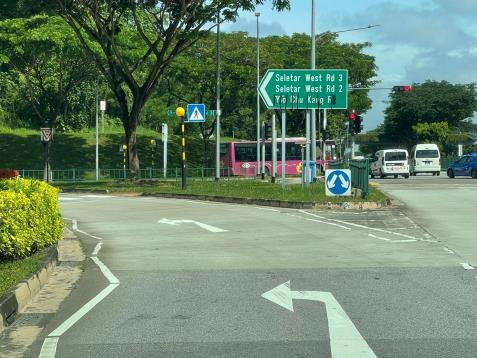
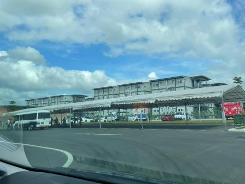

<!-- HCAG:COMPILED id=www.mom.gov.sg.passes-and-permits.work-permit-for-foreign-worker.sector-specific-rules.onboard-centre -->
---
children: []
content_token_estimate: 19491
descendants: 0
id: www.mom.gov.sg.passes-and-permits.work-permit-for-foreign-worker.sector-specific-rules.onboard-centre
image_urls: {}
kind: leaf
long_description: 'Defines who must attend the Onboard centre: male non-Malaysian
  Work Permit holders in Construction, Marine shipyard and Process (CMP) sectors holding
  an IPA. Details the full Onboard programme — eligibility criteria, programme duration
  rules (3-day for first-timers or workers returning after >2 years; 2-day for workers
  returning within 2 years, excluding SIP), day-by-day schedule (check-in, enhanced
  medical examination, vaccination check, SIP), booking via the Onboard Booking System
  (OBS) with upfront payment, check-in document requirements, transport arrangements
  from airport, and checkout procedures. Specifies fees ($321.60 for 3-day, $153.82
  for 2-day after GST). Covers post-checkout steps including receiving ME results
  (within 1 week), arranging follow-up medical examinations for abnormal findings
  (within 3 months), the undertaking letter process, and the 14-day deadline to get
  the Work Permit issued. Includes driving directions to Onboard@Sengkang West and
  FAQs on checkout logistics, private-hire pickup rules, late checkout policy, billing/payment
  auto-deduction, SIP completion errors, and operator/medical provider contact details.'
source_files:
- index.md
- directions-onboard-skw.md
- faqs-for-checkout.md
- directions-onboard-skw-2.md
- faqs-for-checkout-2.md
source_urls:
- ''
- ''
- ''
- ''
- ''
subtree_depth: 0
title: Onboard centre programme for CMP Work Permit holders
token_size_estimate: 19491
---

# Onboard centre programme for CMP Work Permit holders

<!-- HCAG:CONTENT BEGIN -->
## Content

<!-- source: index.md -->
# Onboard centre

Male non-Malaysian Work Permit holders in the Construction, Marine shipyard and Process (CMP) sectors holding an in-principle approval (IPA) must attend the Onboard programme at the Onboard centre.

## At a glance

| Who must attend | A Work Permit holder must attend the Onboard programme at the Onboard centre if all the following criteria are met:  | 
|---|---|
| When to attend | Immediately upon your worker's arrival in Singapore and on the date of confirmed Onboard slot. | 
| Programme duration |  | 
| Where is it | [Onboard@Sengkang West](https://www.onemap.gov.sg/?lat=1.3942177&lng=103.860442)20A Seletar West Road 1, Singapore 798991 See [detailed directions](https://www.mom.gov.sg/-/media/mom/documents/covid-19/directions-onboard-skw.pdf) | 
| Fees and payment | Fees include the cost of services, food and accommodation at the Onboard centre. Fees and services are subject to changes based on prevailing requirements. You can instantly secure Onboard bookings with upfront payment through the [Onboard Booking System (OBS)](https://www.mom.gov.sg/eservices/services/onboard-booking-system) . Learn more about [fees and payment](#fees-and-payment-for-onboard-programme) . | 

## Onboard programme

The Onboard programme at the Onboard centre orientates a worker in the CMP sectors to Singapore's social norms and laws, and to dormitory and communal living, through the SIP.

Enhanced medical examinations (ME) are also done at the Onboard centre to screen workers for infectious diseases and ensure your worker's fitness for both work and dormitory living. This also helps to manage public health risk in the dormitories and the community.

Your worker must complete the Onboard programme to avoid disruptions to your work pass transactions.

## Book an Onboard slot

To make an Onboard booking:

- Ensure your worker's [pre-entry housing check](https://www.mom.gov.sg/passes-and-permits/work-permit-for-foreign-worker/housing/pre-entry-housing-check-for-cmp-work-permit-holders) has been approved by MOM. Otherwise, your bookings may be cancelled, and your company can be debarred from hiring migrant workers.
- Log in via the [OBS](https://www.mom.gov.sg/eservices/services/onboard-booking-system) .

**after**you have received the pre-entry housing approval and secured an Onboard booking to avoid unnecessary travel costs that may incur.

## Prepare for your worker's check-in

You need to make the following preparations for your worker who is scheduled to check in to the Onboard centre.

| Ensure he has the required documents and items | Ensure that your worker carries with him the following before he checks in to the Onboard centre:  | 
|---|---|
| Arrange transport from the airport | You must arrange for your own transport to send your worker directly from the airport to the Onboard centre to check in immediately for his confirmed Onboard slot. | 

## At the Onboard centre

A first-time worker in Singapore, or a worker returning to work in Singapore **more than** two years after the cancellation date of his last work pass will attend a 3-day Onboard programme. 

A worker returning to work in Singapore **within** two years of the cancellation date of his last work pass will attend a 2-day Onboard programme, which excludes the SIP. 

Find out the planned Onboard programme for:

## Day 1: Check-inShow

You should transport your worker to the Onboard centre from the airport immediately after his arrival in Singapore.

Upon check-in, we will verify that your worker has the necessary documents and has a valid Onboard slot for the day.

Your worker will be asked to declare his health status. If he is unwell, he will be directed to the medical centre for further assessment.

## Day 2: ME and vaccination checkShow

Your worker will undergo an enhanced ME and have his overseas COVID-19 vaccination records examined.

If your worker is not vaccinated, he is encouraged to be vaccinated with at least two doses against COVID-19. He may receive the COVID-19 vaccination at the Onboard centre, at no additional cost.

## Day 3: SIP (For eligible workers only)Show

Your worker will attend a full day [Settling-in Programme](https://www.mom.gov.sg/passes-and-permits/work-permit-for-foreign-worker/sector-specific-rules/settling-in-programme).

## Checkout upon completion of 2-day or 3-day Onboard programmeShow

You will receive an email on Day 2 from the OBS about your worker's checkout. Pick up your worker at the date and time stated in the email. Late checkouts will incur additional charges billed to your company.

The [driver picking up your worker](https://www.mom.gov.sg/faq/work-permit-for-foreign-worker/what-modes-of-transport-can-i-use-to-send-my-workers-to-the-onboard-centre) will need to show a copy of the email for verification.

For more information, read the [FAQs regarding checkout](https://www.mom.gov.sg/-/media/mom/documents/foreign-manpower/obs/faqs-for-checkout.pdf). 

## After leaving the Onboard centre

After your worker has checked out from the Onboard centre, you must follow up with the requirements below:

**4 May 2026**, you will

[no longer need to upload hardcopy ME report](https://www.mom.gov.sg/passes-and-permits/work-permit-for-foreign-worker/enhancements-to-work-permit-eservice-on-mymom-portal/from-may-2026-issue-work-permit-function-on-mymom-portal)to get your worker's Work Permit issued on WP Online. Our appointed medical service provider will submit the medical results directly to MOM on your behalf.

## Receive your worker's ME resultsShow

You should receive an email notification on the submission of your worker's ME results by our appointed medical service provider **within 1 week** after checkout.

Some medical results may take longer if there are results that require further review.

[request to extend the IPA](https://form.gov.sg/680eea3952fb0df11d567608).

If you require a copy of your worker's ME report, contact the medical service provider directly at:

| Medical service provider | Operating hours | 
|---|---|
| **Healthway Medical Group**[9750 9541](tel:97509541) (WhatsApp message only)[mwocsk@healthwaymedical.com](mailto:mwocsk@healthwaymedical.com) | Monday to Sunday 9.00am to 4.00pm | 

## (If required) Arrange for a follow-up medical examinationShow

You need to arrange for a follow-up medical examination for your worker if there are abnormal findings (except colour vision).

A referral memo will be attached to the medical examination report.

You need to:

1. Download and print the undertaking letter provided in the email.
2. Acknowledge the medical condition.
3. Send your worker for his follow-up examination at the [medical centre or designated clinics](https://www.mom.gov.sg/primary-care-plan/buying-a-pcp) you have bought a[Primary Care Plan](https://www.mom.gov.sg/primary-care-plan) with.
 
You are strongly encouraged to book his appointment within the recommended date on the referral memo, or latest within 3 months of the initial medical examination.
4. Sign the undertaking letter.
5. [Submit the undertaking letter](https://www.mom.gov.sg/eservices/services/wp-online-for-businesses-and-employment-agencies) .

## Get your worker's Work Permit issued within 14 daysShow

Find out how to [get their Work Permit issued](https://www.mom.gov.sg/passes-and-permits/work-permit-for-foreign-worker/apply-for-work-permit).

Your worker must also complete the rest of the post-arrival procedures in the IPA letter within 14 days from his arrival in Singapore.

## Fees and payment for Onboard programme

The fee per worker varies according to the programme duration and services used:

| Programme duration | Price after GST | 
|---|---|
| 3-day Onboard programme | $321.60 | 
| 2-day Onboard programme | $153.82 | 

Employers and employment agencies must book Onboard slots and make upfront payments using the credit or debit card that you have registered in OBS.

All outstanding fees must be paid before you are allowed to make new bookings.

<!-- source: directions-onboard-skw.md -->
## Page 1

# **Directions to Onboard@Sengkang West** 

Onboard@Sengkang West is located at 20A Seletar West Road 1. You may use the Google Maps link to Yio Chu Kang Heavy Vehicle Carpark as a reference point. 

## **<u>Step 1</u>** 

Enter Sengkang West Road via Yio Chu Kang Road. Head north on Sengkang West Road, and take the slip-road on the left to enter Seletar West Road 3. 

## **<u>Step 2</u>** 

Continue on Seletar West Road 3. After the bend, turn left into Seletar West Road 1. 

## **<u>Step 3</u>** 

Continue on Seletar West Road 1 **,** and make a U-Turn at the end of Seletar West Road 1. Onboard@Sengkang West will be on your right. 

## **<u>Step 4</u>** 

Turn left into Onboard@Sengkang West, and enter the compound. 

## **<u>Step 5</u>** 

Drop-off your migrant workers at the tentages in the carpark. You may exit the compound using the same slip-road you have entered by.

<!-- source: faqs-for-checkout.md -->
## Page 1

_Updated on 20 Nov 2025_ 

# **<u>Frequently Asked Questions (FAQs) for checkout from Onboard centre</u>** 

**1. How do I get to the Onboard centre? Google Maps:** <u>Google Maps Link</u> **Directions:** <u>Online MOM Guide</u> 

## **2. May I call a private-hire driver to pick up my worker(s)?** 

Yes. The private-hire driver must show a copy or screenshot of the checkout notice email on arrival. You must inform the driver to park outside the Onboard premises (along the driveway after entering from the main road) and still walk to ground staff to display a copy of this email. During wet weather, the transport vehicles can be permitted to enter the Onboard centre premises for pick-up. 

Your worker(s) is not allowed to arrange for his own private-hire driver. 

Alternatively, if you are arranging private-hire transport to pick up your worker, you must: 

- Send a WhatsApp message to **8052 4191** ( **Onboard centre's operator** ) 

- Include in your message: 

   - Screenshot of your booking 

   - Car plate number 

   - Worker's name and FIN 

Please note: Messages may not be processed in time, which could result in pick-up delays or booking cancellations. 

**3. I am unable to pick up my worker(s) on the scheduled check out date. Can he stay for one more night?** 

No. Your worker(s) must leave at the scheduled checkout time due to high occupancy levels at the Onboard centre. Late checkouts will incur additional charges. 

If your dormitory cannot accommodate your worker(s), you must arrange alternative accommodation.

## Page 2

_Updated on 20 Nov 2025_ 

**4. I am unable to issue my worker's Work Permit even though he has checked out. Work Permit Online (WPOL) shows me the error message, "Worker has not completed SIP".** Please ensure that you have updated his local residential address via the **<u>Online Foreign Worker Address Service (OFWAS)</u>** . Thereafter, please wait up to 1 working day to issue his work permit. 

If the issue persists, please contact MOM. 

**5. I have other queries about my worker checking out from the Onboard centre. How do I contact the site operator?** 

Please contact the site operator per the table below. 

|**Operator contact**|**Operating hours**|
|---|---|
|**Phone:**||
|8052 4191(WhatsAppmessage only) **Email**:|Monday to Sunday|
|infoskw@guthrie-fmc.com.sg||

**6. I have not received my worker’s medical report. It has already been 3 days.** Please contact the medical service provider per the table below. 

|**Medical service provider:** **Healthway Medical Group**|**Operating hours**|
|---|---|
|**Hotline**||
|9750 9541(WhatsAppmessage only)|Monda to Sunda|
|**Medical Examination or Vaccination** **Queries email**: mwocsk@healthwaymedical.com|y  y 9.00am to 4.00pm|

Please <u>contact MOM</u> **if you are unable to get a response by the next day** . 

**7. How do I get formal records that shows my worker has completed the Onboard programme?** 

You can access this information in the <u>Onboard Booking System (OBS).</u> 

If you did not make the booking, you can check this with your authorised representative who made the booking for your worker.

## Page 3

_Updated on 20 Nov 2025_ 

**8. I have questions about the fees, billing, and booking slots at the Onboard centre.** You can access information about the fees and bookings via the Onboard Booking System <u>(OBS).</u> Any additional fees charged will be billed and appear in OBS **approximately** two weeks after your worker’s checkout. 

Payment will be **automatically deducted from the primary credit / debit card** provided by the company in the OBS, on the invoice date. For detailed payment terms, please see paragraph 10 of the declaration page under “Payment and Fees”. 

Upon successful deduction(s), the system will update the invoice status to "Paid". This serves as your official receipt. 

If you have additional queries, you may contact MOM.

<!-- source: directions-onboard-skw-2.md -->
## Page 1

# **Directions to Onboard@Sengkang West** 

Onboard@Sengkang West is located at 20A Seletar West Road 1. You may use the Google Maps link to Yio Chu Kang Heavy Vehicle Carpark as a reference point. 

## **<u>Step 1</u>** 

Enter Sengkang West Road via Yio Chu Kang Road. Head north on Sengkang West Road, and take the slip-road on the left to enter Seletar West Road 3. 

## **<u>Step 2</u>** 

Continue on Seletar West Road 3. After the bend, turn left into Seletar West Road 1. 

## **<u>Step 3</u>** 

Continue on Seletar West Road 1 **,** and make a U-Turn at the end of Seletar West Road 1. Onboard@Sengkang West will be on your right. 

## **<u>Step 4</u>** 

Turn left into Onboard@Sengkang West, and enter the compound. 

## **<u>Step 5</u>** 

Drop-off your migrant workers at the tentages in the carpark. You may exit the compound using the same slip-road you have entered by.

<!-- source: faqs-for-checkout-2.md -->
## Page 1

_Updated on 20 Nov 2025_ 

# **<u>Frequently Asked Questions (FAQs) for checkout from Onboard centre</u>** 

**1. How do I get to the Onboard centre? Google Maps:** <u>Google Maps Link</u> **Directions:** <u>Online MOM Guide</u> 

## **2. May I call a private-hire driver to pick up my worker(s)?** 

Yes. The private-hire driver must show a copy or screenshot of the checkout notice email on arrival. You must inform the driver to park outside the Onboard premises (along the driveway after entering from the main road) and still walk to ground staff to display a copy of this email. During wet weather, the transport vehicles can be permitted to enter the Onboard centre premises for pick-up. 

Your worker(s) is not allowed to arrange for his own private-hire driver. 

Alternatively, if you are arranging private-hire transport to pick up your worker, you must: 

- Send a WhatsApp message to **8052 4191** ( **Onboard centre's operator** ) 

- Include in your message: 

   - Screenshot of your booking 

   - Car plate number 

   - Worker's name and FIN 

Please note: Messages may not be processed in time, which could result in pick-up delays or booking cancellations. 

**3. I am unable to pick up my worker(s) on the scheduled check out date. Can he stay for one more night?** 

No. Your worker(s) must leave at the scheduled checkout time due to high occupancy levels at the Onboard centre. Late checkouts will incur additional charges. 

If your dormitory cannot accommodate your worker(s), you must arrange alternative accommodation.

## Page 2

_Updated on 20 Nov 2025_ 

**4. I am unable to issue my worker's Work Permit even though he has checked out. Work Permit Online (WPOL) shows me the error message, "Worker has not completed SIP".** Please ensure that you have updated his local residential address via the **<u>Online Foreign Worker Address Service (OFWAS)</u>** . Thereafter, please wait up to 1 working day to issue his work permit. 

If the issue persists, please contact MOM. 

**5. I have other queries about my worker checking out from the Onboard centre. How do I contact the site operator?** 

Please contact the site operator per the table below. 

|**Operator contact**|**Operating hours**|
|---|---|
|**Phone:**||
|8052 4191(WhatsAppmessage only) **Email**:|Monday to Sunday|
|infoskw@guthrie-fmc.com.sg||

**6. I have not received my worker’s medical report. It has already been 3 days.** Please contact the medical service provider per the table below. 

|**Medical service provider:** **Healthway Medical Group**|**Operating hours**|
|---|---|
|**Hotline**||
|9750 9541(WhatsAppmessage only)|Monda to Sunda|
|**Medical Examination or Vaccination** **Queries email**: mwocsk@healthwaymedical.com|y  y 9.00am to 4.00pm|

Please <u>contact MOM</u> **if you are unable to get a response by the next day** . 

**7. How do I get formal records that shows my worker has completed the Onboard programme?** 

You can access this information in the <u>Onboard Booking System (OBS).</u> 

If you did not make the booking, you can check this with your authorised representative who made the booking for your worker.

## Page 3

_Updated on 20 Nov 2025_ 

**8. I have questions about the fees, billing, and booking slots at the Onboard centre.** You can access information about the fees and bookings via the Onboard Booking System <u>(OBS).</u> Any additional fees charged will be billed and appear in OBS **approximately** two weeks after your worker’s checkout. 

Payment will be **automatically deducted from the primary credit / debit card** provided by the company in the OBS, on the invoice date. For detailed payment terms, please see paragraph 10 of the declaration page under “Payment and Fees”. 

Upon successful deduction(s), the system will update the invoice status to "Paid". This serves as your official receipt. 

If you have additional queries, you may contact MOM.

<!-- HCAG:CONTENT END -->
