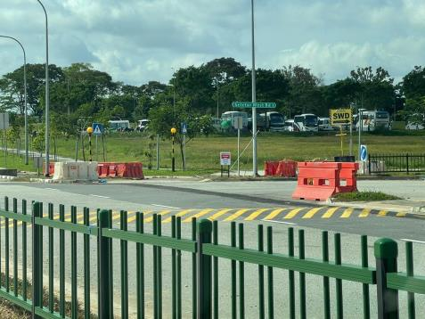
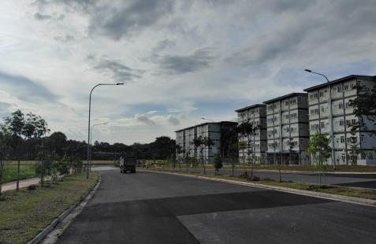
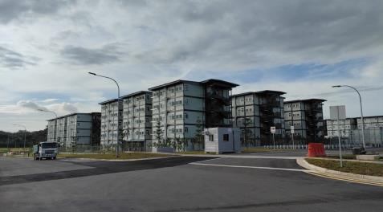

## Page 1

# **Directions to Onboard@Sengkang West** 

Onboard@Sengkang West is located at 20A Seletar West Road 1. You may use the Google Maps link to Yio Chu Kang Heavy Vehicle Carpark as a reference point. 

## **<u>Step 1</u>** 

Enter Sengkang West Road via Yio Chu Kang Road. Head north on Sengkang West Road, and take the slip-road on the left to enter Seletar West Road 3. 

## **<u>Step 2</u>** 

Continue on Seletar West Road 3. After the bend, turn left into Seletar West Road 1. 

## **<u>Step 3</u>** 

Continue on Seletar West Road 1 **,** and make a U-Turn at the end of Seletar West Road 1. Onboard@Sengkang West will be on your right. 

## **<u>Step 4</u>** 

Turn left into Onboard@Sengkang West, and enter the compound. 

## **<u>Step 5</u>** 

Drop-off your migrant workers at the tentages in the carpark. You may exit the compound using the same slip-road you have entered by.

