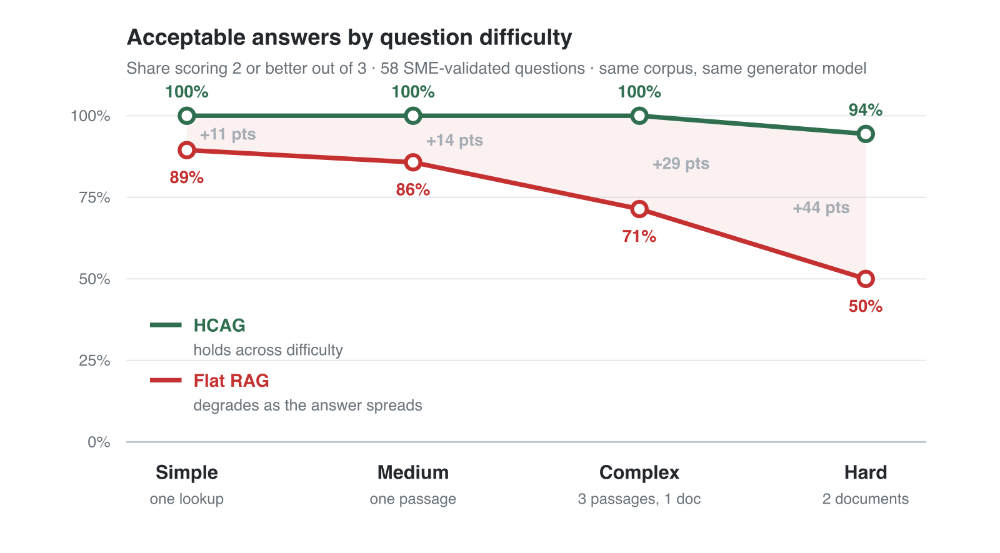
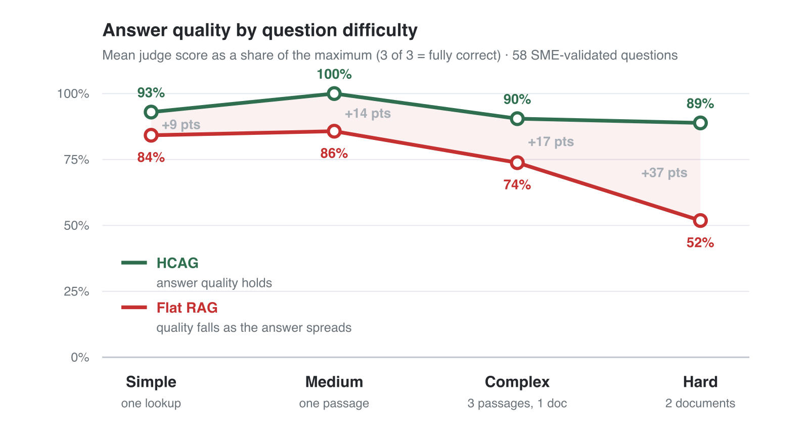

# The Harness, Not the Model, Decides Whether Your AI Agent Works

In the first week of September, ARC Prize published two results for the same model on the same benchmark, and the distance between them should unsettle anyone who has spent the last two years choosing models. GPT-6 Astra, run against ARC-AGI-3 under a standard harness, scored 62.7%. Run again inside a harness that preserved its reasoning state between requests and compacted long conversations so that it could build on its own prior work rather than starting cold at every turn, the same model scored 99.9%. It also did so more cheaply, at roughly nineteen thousand dollars against twenty-six thousand, and it reached that score at a lower reasoning effort setting than the weaker run had used.

Nothing about the model changed between those two numbers. No fine-tune, no new checkpoint, no additional training data, no prompt engineering breakthrough. What changed was the scaffolding around the model, and thirty-seven points of apparent capability turned out to have been sitting in that scaffolding all along, waiting for somebody to build it properly.

I want to argue that this is not an exotic result about frontier evaluations, and that the same dynamic is quietly setting the ceiling on the agent your team shipped last quarter. I also want to do more than assert it, because the industry has no shortage of confident architectural opinions and a considerable shortage of measurements. So the second half of this piece is a benchmark I ran on one component of the harness, with the model held constant on both sides, the question set validated by a subject-matter expert, and every answer, score and justification published for anyone who wants to take it apart.

## The part of the system that nobody budgets for

We talk about models as though they were the product, when they are closer to being the engine. The harness is everything bolted around that engine, and it has at least five identifiable components. There is the agent's memory, which determines what it carries forward and what it forgets between turns and between sessions. There is its knowledge base, which determines what it can find out about the domain it operates in. There is its planning loop, which determines how it decomposes work and how it recovers when a step fails. There are the skills and tools it can call, which determine what it can actually do rather than merely say. And underneath all of them sits the ontology, the shared vocabulary that lets memory, knowledge, plans and tools refer to the same entities by the same names, so that a pass type or a customer or a part number means one thing consistently across the whole system.

Very few teams treat these as a budget line. The quarter gets spent on model selection, on prompt iteration, and eventually on the question of whether a fine-tune would help. The agent plateaus somewhere in the seventies on internal evaluations, the team concludes it has hit the limit of what the model can do, and the conversation turns to waiting for the next release. I have watched this sequence from close enough to say that the ceiling is usually not where people think it is, and the Astra result is the cleanest public demonstration I have seen of how much room can be hiding one layer down.

The reason the harness gets under-invested is not stupidity. It is that harness work does not look like artificial intelligence work. It looks like data modelling, information architecture, careful plumbing and unglamorous cleanup. It does not produce a demo that impresses anyone in a fifteen-minute review, and it is hard to put on a slide next to a model comparison chart. The work is also distributed awkwardly across roles, because the person who understands the domain well enough to organise it is rarely the person who understands the retrieval stack, and neither of them owns the outcome on their own.

## Why the knowledge component is the one you can move this quarter

Astra's improvement came from the memory component, and I want to be honest about how little that helps most teams directly. Building a harness that preserves opaque reasoning state across requests and compacts long conversations intelligently is deep systems work, coupled tightly to a specific provider's capabilities, and almost nobody is going to ship it in the next three months. Reading that result and concluding that you should go and build one is the wrong lesson.

The right lesson is that a harness component, changed alone, moved a fixed model by a distance everyone would have attributed to the model. If that is true of memory, the reasonable next question is which component you can actually move on a normal roadmap with a normal team. For most organisations building agents over their own documents, the answer is the knowledge base, and the reason is that the work required is organisational rather than algorithmic.

Here is the lever in plain terms. Most knowledge agents today chop the corpus into chunks of a few hundred tokens, embed those chunks into a vector index, and at query time retrieve whichever chunks score highest against the question. The alternative is to organise the corpus the way the domain is already organised, into a taxonomy of topics and subtopics that mirrors how a practitioner would divide the subject, and then to let the agent reason over that structure to decide which whole documents to open. The first approach asks which fragments of text most resemble this question. The second asks which parts of the subject this question actually touches, and then reads those parts in full. I have written about the pattern before under the name HCAG, Hierarchical Context Augmented Generation, and the earlier piece covers how the agent navigates a taxonomy and loads whole documents rather than fragments.

The distinction matters more than it sounds, because similarity and relevance are not the same relation. A chunk can resemble a question closely while answering a different question, and the passage that actually governs a case often shares very little vocabulary with the way a person describes that case. Every practitioner who has debugged a retrieval pipeline knows this in their bones. What I did not know, and what the rest of this piece is about, is how much it costs in practice and where exactly the cost concentrates.

## Why I stopped arguing and built a benchmark

I had made this argument in public before with no measurement behind it, which in retrospect was a reasonable thing to do once and an unreasonable thing to keep doing. The claim that flat retrieval plateaus in the seventies was an impression formed from projects, not a number, and impressions formed from projects are exactly the kind of evidence that survives because nobody checks it.

So I built the benchmark that would have embarrassed me if I were wrong, and I want to describe how it was constructed in enough detail that you can decide for yourself whether the result means anything. A comparison between two architectures is worth precisely as much as its controls, and most published architecture comparisons have almost none.

The corpus is Singapore's government work-pass rules, crawled from the public site of the Ministry of Manpower and normalised into a tree of documents with their images preserved alongside the text. I chose it deliberately because it is awkward in the specific ways real enterprise knowledge is awkward. It is thick with conditional salary tables where the qualifying figure depends on the applicant's age and the employer's sector and the date of application. It is full of exceptions that live three pages away from the rule they modify. Its most important facts are frequently expressed as table rows rather than as sentences, and a meaningful number of them appear only inside screenshots. Nobody would call it a clean corpus, which is what makes it representative.

Both systems index that same tree, so neither has access to material the other lacks. The flat retrieval baseline is not a strawman built to lose. It chunks the corpus with a five-hundred-token target and sixty tokens of overlap, splitting only on heading and paragraph boundaries so that chunks do not begin mid-sentence, and it indexes the result as five and a half thousand rows in a vector database. At query time it retrieves the top eight chunks using hybrid search, combining dense vector similarity with keyword matching through reciprocal rank fusion, merges adjacent chunks so that neighbouring passages arrive intact, expands domain abbreviations so that a question about an EP is understood to concern an Employment Pass, and fills a six-thousand-token context budget. That is a conventional, competently tuned pipeline of the kind a good team ships, and on the questions in this benchmark it was never once starved of context by its own budget.

Most importantly, the same model generates the answer on both sides. This is the control that makes the comparison mean anything, and it is the one most commonly missing from architecture bake-offs. When the generator differs, the result is uninterpretable, because a reader cannot tell whether they are looking at the effect of the retrieval design or the effect of model strength. Here the only thing that differs between the two systems is how each of them decides what the model gets to read.

## How the questions were written, and why that matters more than the questions

An evaluation is only as good as its answer key, and this is where most internal benchmarks quietly fall apart. If a language model writes both the questions and the reference answers, and another language model grades against those reference answers, the exercise can produce a confident number that measures nothing but internal consistency.

The question set here was generated from the corpus itself, in the voice of two personas drawn from the real user population. One is a human resources officer filing applications on behalf of a company, who says "our candidate" and asks what to submit and in what order. The other is a prospective pass holder managing their own situation, who describes their circumstances in plain language and often does not know which pass type applies to them. The persona framing exists to stop the generator producing examination questions that no real person would ask, which is the characteristic failure of machine-generated evaluations and one that makes them look rigorous while measuring a population that does not exist.

The generated questions span four levels of difficulty, and the levels are defined by where the answer lives rather than by how hard the wording sounds. The simplest require a single lookup, though the answer may still be conditional and the reference answer states every condition attached to it. The next level requires reasoning within a single passage. The third requires assembling three separate passages from a single document. The hardest requires two different documents, where neither one alone is sufficient to answer correctly.

Every question and every reference answer was then reviewed and corrected by a subject-matter expert before any system was run against it, and the validated set is what was scored and what ships with the report. That review is the part of this work I would defend most strongly, because it converts the exercise from a machine talking to itself into a measurement against a human-checked standard.

Scoring was done by a separate model from the one generating answers, against a four-point scale where three means substantively equivalent to the reference, two means the key points are present with some noise or imprecision, one means no outright errors but a key point missing, and zero means wrong in a way that would mislead the reader. For every single question, the judge recorded a one-sentence justification for the score it gave, and those justifications are published alongside the answers. That last detail is what makes any individual number in this piece contestable rather than merely assertable, and I would encourage anyone sceptical of a particular result to go and read the judge's reasoning on that row.

One category was excluded from everything reported here. A further ten questions required a fact that appears only inside an image, and while the results on those questions were interesting, the question set is not yet good enough to support conclusions. That work continues, and the benchmark below concerns textual knowledge only.

## What the measurement found

Across fifty-eight validated questions, the conventional retrieval pipeline answered 72% of them acceptably, meaning the key points were present even if the answer carried some noise. The taxonomy-driven system answered 98% acceptably. If you raise the bar from acceptable to fully correct, meaning an answer a reasonable user would consider complete, the gap widens from 47% to 78%. Two of the conventional pipeline's answers were wrong in a way that would actively mislead the person reading them, while the taxonomy-driven system produced none of those.

One check worth running on any result like this is whether it survives being cut a different way. The question set carries two personas with genuinely different registers, since an officer filing on behalf of a company writes in the vocabulary of the transaction while a candidate describes their own circumstances in ordinary language and often does not know the name of the thing they are asking about. The advantage holds across both. On the officer's questions the two systems answered 97% and 69% acceptably, and on the candidate's questions 100% and 76%. Had the gap appeared under only one register, the honest conclusion would have been that one system happens to suit one phrasing style, which is a far weaker claim than the one I am making.

Those headline figures are worth something, but they are also the least interesting part of the result, and if you take only one thing from this piece I would rather it were the next paragraph than the last one.

The gap between the two architectures is not constant. It grows steadily and sharply as the answer becomes more distributed across the corpus. On simple lookups the difference is eleven points, which is already the difference between a support agent you can deploy and one you cannot. It widens to fourteen points on questions requiring reasoning within a single passage, to twenty-nine points when the answer is spread across three passages of a single document, and to forty-four points when the answer spans two documents.

Read as a slope rather than as four separate measurements, that progression says something specific. The taxonomy-driven system finishes roughly where it started, because the difficulty of locating a distributed answer barely affects a design that reasons about which documents are relevant and then reads them whole. The conventional pipeline slides, and it slides fastest precisely where the questions stop being trivia and start being work. Questions that span two documents are not exotic edge cases invented to make a baseline look bad. They are what somebody asks when they have an actual situation in front of them and it touches two rules at once, which is the normal condition of anybody who needs a support agent in the first place.

The same shape appears on a second, independent measure. If you convert the average judge score into a percentage of a perfect answer, the taxonomy-driven system holds between eighty-nine and one hundred percent across all four difficulty levels, while the conventional pipeline falls from eighty-four percent to fifty-two. Two different ways of reading the same fifty-eight questions produce the same curve, which is the closest thing to reassurance a benchmark of this size can offer.

## What the slide looks like from the user's side

Numbers describe the shape of a failure without conveying what it is like to be on the receiving end of one, so let me tell you about a single question from the set.

A human resources officer asked the agents two things in one breath, the way people actually ask questions when they have a case open on their desk. She wanted to know whether she could update a pass holder's expiring passport details by sending a written request to the ministry, and whether the same pass holder could bring his twenty-two-year-old son to Singapore on a Dependant's Pass.

The conventional pipeline answered the second question correctly and completely. The son is over twenty-one and therefore not eligible for a Dependant's Pass, and the reply went on to explain what the alternative would be for a young adult in that position. It was accurate, well-organised, and appropriately specific. Then it moved on to a closing paragraph and never mentioned the passport again.

Nothing in that reply signals the omission. There is no hedge, no note that part of the question could not be answered, no visible seam where the missing half should have been. A reader would have to already know the answer to notice that anything was absent, which is precisely the reader who did not need to ask. Worse, the half that vanished was the half with the trap in it, because written requests for that particular change are no longer accepted at all and the update has to be made through an online service. The officer sends her written request, hears nothing, and discovers weeks later that the channel she used was discontinued.

That failure shape accounts for thirteen of the sixteen questions the conventional pipeline failed. It answered one part of the question well and did not address another part at all. I want to dwell on this because of what it implies for how teams monitor these systems. The industry has built its guardrails around hallucination, which is the failure where a model asserts something untrue, and hallucination is comparatively easy to catch because there is a false statement sitting there to be checked. Coverage failure produces no false statement. Every sentence in that reply was true. The failure was in what was absent, and absence does not trip a factuality checker, does not lower a confidence score, and does not look wrong to a reviewer skimming for errors.

The mechanism behind it is not mysterious once you look at it from the retrieval layer. When a question contains two subjects, the eight chunks that score highest against it will tend to cluster around whichever subject is more lexically prominent, because that is what similarity ranking does. The second subject is not judged irrelevant. It simply loses a ranking competition it was never explicitly entered into, and the model generating the answer has no way of knowing that a subject it was asked about is missing from the material in front of it. A model cannot recover a passage that retrieval never returned, which is why a stronger model does not fix this. Reasoning over a taxonomy asks a different question before retrieving anything, namely which parts of this domain does the situation touch, and a question that names two subjects produces two branches and two documents opened in full.

## The evidence that it is the architecture and not the model

That last claim is exactly the sort of thing an author asserts to make their preferred design look inevitable, so I tested it directly by changing the generator underneath the conventional pipeline.

An earlier version of this benchmark ran the retrieval baseline on a smaller, cheaper model than the one driving the taxonomy system, which was a fair criticism and the first one I received. Rebuilding the baseline on the same model as the other side moved it from 70.6% to 73.5% of answers acceptable, and on the hardest category from a mean score of 1.44 to 1.56. The stronger generator was worth roughly three points of pass rate.

Three points from the model, against twenty-five points still separating the two architectures after the upgrade. I find that ratio more persuasive than the headline gap, because it puts a price on both levers in the same currency and in the same experiment. A better model writes a better answer from the passages it is handed. It does not go and find the passage that retrieval did not return, and no amount of additional capability changes that, because the information is simply not present in the context window when generation begins.

## The obvious objection, which is about cost

Anyone who has run a retrieval system in production will have been forming the same objection for several paragraphs now, and it is a fair one. Reading whole documents rather than eight fragments puts far more text in front of the model on every turn, and text in front of the model is money and latency. A design that wins on accuracy by spending tokens has not necessarily won anything a finance director would recognise.

I did not measure cost or latency in this benchmark, and I am not going to pretend otherwise, so let me set out what is known and what a reader would have to establish for themselves. The taxonomy-driven design does load more text per turn, bounded by an explicit token budget with least-recently-used eviction when the budget is reached, which puts a ceiling on the exposure rather than leaving it open-ended. It also loads once and then reuses what it loaded across the subsequent reasoning steps of the same task, so the cost is amortised over a task rather than paid on every step the way per-step retrieval is. In this run it answered every one of the fifty-eight questions in a single turn, while the conventional pipeline needed a second turn on two of them because its first answer prompted a follow-up.

There is also a subtler economic point hiding in the Astra result that applies here. The better harness was the cheaper one, at roughly nineteen thousand dollars against twenty-six, and it got there at a lower reasoning effort setting. That is not a coincidence so much as a pattern worth expecting. A system that finds the right material on the first attempt stops paying for the retries, the clarifying exchanges and the escalations that a system which found half the material generates downstream. The cost that shows up on the inference bill is visible and easy to optimise. The cost of an answer that was quietly missing half of what the user asked shows up somewhere else entirely, in a support queue or a compliance review, and it is usually larger.

## Where the taxonomy-driven system failed, and what tables have to do with it

A benchmark that reports no failures of its author's preferred system is not reporting, so here is the one that got away. The taxonomy-driven agent failed a single question out of fifty-eight. An officer asked about appealing a rejected application for a semiconductor process engineer, and the agent answered with the general eligibility framework rather than the specialised criteria for shortage occupations that the question actually turned on. It opened the broad document when it should have opened the narrow one, which is a retrieval judgement error rather than a retrieval mechanism error, and it is the characteristic way this architecture fails. Notably, the conventional pipeline failed the same question for a different reason, declining the appeal half of it outright.

The failures on the other side clustered somewhere more interesting, and the cluster points at a structural problem with chunking that deserves more attention than it gets. Four of the conventional pipeline's failures follow an identical pattern in which it explains the scoring framework correctly and then omits the actual salary figures the question asked about. The prose describing the table retrieves beautifully. The table itself does not.

The reason sits in how chunking interacts with tabular content. A pipe-delimited table arrives from the crawler as a single unsplittable block, so a large banded salary table becomes one enormous chunk, and the largest chunk in this index runs to nearly four thousand tokens against a five-hundred-token target. A single embedding vector then has to represent that entire table, which makes it weakly similar to everything and strongly similar to nothing, so it ranks poorly for a query about one specific band inside it. The worst manifestation of this is not an omission but an error. On one salary question the conventional pipeline returned figures from the wrong row of the right table, quoting a threshold of $8,614 rising to $9,250 when the correct band for that applicant's age and sector was $9,000 rising to $9,650. Those are plausible numbers in the correct format, indistinguishable from a right answer to the person acting on them, and in a regulated domain that is the failure mode with real liability attached.

## What it costs to fix, and who actually does the work

None of the difference described above came from a bigger model, a fine-tune, a reranker, an embedding upgrade or any new infrastructure. It came from the corpus being organised the way the domain is already organised, and from letting the agent reason over that organisation.

That work takes days rather than quarters, and its most important characteristic is who performs it. The person best equipped to say that renewals and cancellations are different branches of the subject, that the rules for dependants belong beside the rules for the pass they depend on, and that a particular page is a navigational hub rather than a source of truth, is somebody who knows the domain. It is not the person who knows the retrieval stack. The highest-leverage engineering work in this entire benchmark was not machine learning. It was librarianship, and it was carried out by describing a subject accurately rather than by tuning anything.

The second characteristic worth internalising is that the investment compounds in a way that model spending does not. A taxonomy is not a property of one agent. It is a property of the corpus, so every subsequent agent pointed at that corpus inherits it, along with every planning loop and every autonomous workflow built on top. Meanwhile the model underneath will be replaced two or three times in the same period, and each replacement will arrive with its own migration cost and leave the structural problem exactly where it was.

## What this does not prove

I have tried to state the result precisely rather than expansively, and precision requires saying plainly what is missing.

This is one corpus in one domain, and a tidily hierarchical domain at that. Government regulations divide neatly into topics because somebody already divided them that way, and a corpus of incident reports, chat transcripts or research notes may not yield a taxonomy so willingly. Whether the advantage survives in a messier domain is an open question that this benchmark does not answer, and anyone who tells you the pattern generalises everywhere is selling something.

Fifty-eight questions is a sample that supports a pattern rather than a precise figure. I would defend the shape of the curve and the ordering of the four difficulty levels. I would not defend the claim that the gap on complex questions is exactly twenty-nine points, and the honest reason is that a language model judging answers at a fixed temperature is not perfectly reproducible. When I ran the same questions through the same system twice, eighteen of fifty-eight rows moved by at least a point while the overall mean shifted by less than a tenth. Aggregates are stable, individual rows are noisy, and every row's score is published next to the reasoning that produced it so that you can check the ones you doubt.

The references were generated from the same corpus that both systems index, which means this measures retrieval and synthesis against that corpus rather than real-world legal correctness. Both systems index the same material, so neither is advantaged, but a reader should not mistake the result for a claim about whether either agent gives good immigration advice.

And finally, I built one of the two systems being compared. That is the structural weakness of the entire exercise, and no amount of methodological care removes it. The mitigation is that everything is published, so the conclusion does not rest on trusting me. The questions, both systems' complete answers, every score and every justification are in the repository, and if the result breaks under inspection I would rather hear that from you than keep believing it for another quarter.

## What to do with this on Monday

If you own an agent that has plateaued, the practical value of this piece is a diagnostic rather than a recommendation, and the diagnostic takes an afternoon.

Take the last fifty questions your agent got wrong and sort them into two piles. In the first pile put the answers that said something untrue. In the second put the answers where everything said was true but something the user asked about was never addressed. If the second pile is larger, your problem is coverage rather than accuracy, and no model upgrade in the next two years is going to fix it, because coverage is decided before the model sees anything. That is a harness problem, and specifically a knowledge harness problem.

The second exercise is to ask how many of your genuinely important questions require material from more than one document. In my experience the answer is most of the ones that matter, because a simple question tends to have a simple answer that somebody already put in a help page. If your evaluation set is dominated by single-lookup questions, it is measuring the easy end of the distribution and will keep telling you your agent is fine while your users experience something else.

The broader point is the one the Astra result made far more dramatically than I can. Capability is not a property of the model alone. It is a property of the model together with everything you built around it, and the components of that harness, its memory, its knowledge base, its planning loop, its tools and its ontology, are engineering artefacts that you control completely. The frontier labs will keep improving the engine on a schedule you do not influence. The scaffolding is yours, it is where a surprising amount of your ceiling currently lives, and unlike the model it is not going to improve on its own while you wait.

So the question worth taking into your next planning session is not which model you should be using. It is which part of your harness is weakest, and what it would actually take to fix it.

---

**Sources and materials**

The ARC Prize write-up of the GPT-6 Astra result is at https://arcprize.org/blog/astra. The earlier article introducing the taxonomy pattern and how an agent navigates it is at https://www.linkedin.com/pulse/your-ai-agent-needs-knowledge-taxonomy-small-pays-rich-choudhary-qix9c/. The benchmark itself, including the validated question set, both systems' answers, every score with the judge's reasoning, the charts above and the code that produced all of it, is at https://github.com/shishircc/hcag.

---

## Publishing notes (not part of the article)

**Format.** A LinkedIn article, not a feed post. Feed posts cap at 3,000 characters including links
and hashtags, and compressing this argument to fit that cap is what produced the earlier fragmented
drafts. Roughly 5,000 words, eleven subheads, continuous prose with no lists in the body.

**Title candidates.** The one used is "The Harness, Not the Model, Decides Whether Your AI Agent
Works". Alternatives worth considering are "Thirty-Seven Points of Plumbing" and "Your Model Is the
Engine. Your Harness Is the Car."

**Companion feed post.** Write a short announcement post separately, under 3,000 characters, built
from this article's first three paragraphs plus the slope finding and a link to the article.

**Images.** Both charts are exported in this folder at 1600px wide and referenced inline. Captions
and alt text: image one reads "Acceptable answers by question difficulty. HCAG holds between 94% and
100% from simple to hard questions. Flat RAG falls from 89% to 50%." Image two reads "Answer quality
as a share of a perfect answer. HCAG holds between 89% and 100%. Flat RAG falls from 84% to 52%."

**The scene is a real row.** It is `q-0054` in the benchmark set, an HR-persona question about a
passport update and a Dependant's Pass for a 22-year-old son. Flat RAG scored 1, HCAG scored 3, and
the judge's remark records the exact omission described in the article.

**Defaults taken, change if you disagree.** The subject-matter expert is described generically, so
name the reviewer or their expertise if that can be said. The corpus is named as Singapore's work-pass
rules. The generator model is described as "the same model on both sides" without naming Claude
Sonnet 4.5, which would invite a side argument about model choice the article does not need.

**Facts to re-check before publishing.** Astra scored 62.7% under the standard harness and 99.9%
under the Provider Adapter harness on ARC-AGI-3 Semi-Private, published 3 September 2026, at roughly
$19k against $26k. The benchmark covers 58 questions with 98.3% against 72.4% acceptable, 78% against
47% fully correct, zero against two scoring zero, gaps of 11, 14, 29 and 44 points, 13 of 16 flat-RAG
failures being partial coverage, and 1 of 58 HCAG failures. The model-swap figures are 70.6% to 73.5%
and a hard-category mean of 1.44 to 1.56. All of it is in `sample-benchmark-report/benchmark.md`.
